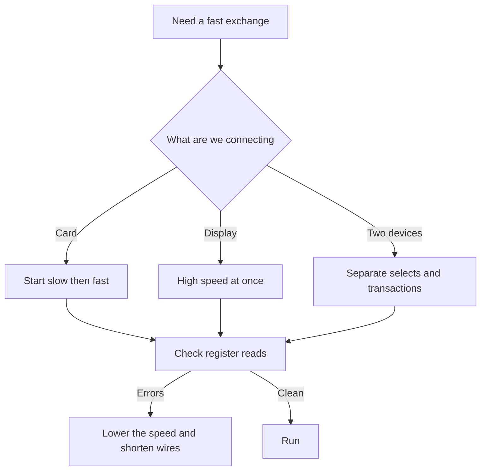

# SPI on Arduino - fast and simple

![[assets/img/arduino-spi-scheme.png|600]]
*Fig. Four bus lines, separate subordinate selects, memory card and display.*

> [!tip] Purpose of this note
> Gives the fast bus without fear: which line does what, how to pick the speed, how to wire subordinate selects, and how to connect a memory card and a display.

## 1. Purpose

The fast exchange bus connects the board to a memory card, a display, a converter, and a radio module.

The main side sets the clock, the subordinate answers in its own window, and device selection runs on a separate line.

Speed here is orders higher than on slow buses, so pictures and files fly without delays.

There are few lines, but each has its own role, and mixing them up gives silence on the bus.

This note shows the signal map, library startup, speed choice, select wiring, and two live examples.

See board and header basics in [[01-Hardware/01-AVR-Uno.en | classic AVR]].

Small and large board comparison is in [[01-Hardware/02-Nano-Mega.en | compact and pins]].

Pin modes and currents are covered in [[03-GPIO/01-Digital-Pins.en | digital pins]].

## 2. Four bus signals

| Signal | Direction from the main side | Meaning |
| --- | --- | --- |
| SCK | Clock output | Exchange rhythm, each bit on an edge |
| MOSI | Data output | Stream from main to subordinate |
| MISO | Data input | Stream from subordinate to main |
| SS | Select output | Low level opens the device |

The main side always drives the clock; a subordinate never starts talking on its own.

Data lines cross correctly: the output of one goes to the input of the other.

The select line is separate for each subordinate, the remaining lines are shared by all.

At rest the select is held high; before an exchange it drops, after the exchange it rises.

Unused inputs are never left hanging, so they catch no noise.

```text
Зєднання одного підлеглого:

  Головний              Підлеглий
  --------              ---------
  SCK  ----------------> SCK
  MOSI ----------------> MOSI
  MISO <---------------- MISO
  SS   ----------------> CS
  GND  ---------------- GND

  Правило:
  три лінії спільні,
  вибір окремий на кожен пристрій.
```

## 3. Pins on small and large boards

Line numbers depend on the board, so always check against the map of the exact model.

| Board | MOSI | MISO | SCK | Default SS |
| --- | --- | --- | --- | --- |
| Small classic | Eleven | Twelve | Thirteen | Ten |
| Small compact | Eleven | Twelve | Thirteen | Ten |
| Large | Fifty one | Fifty | Fifty two | Fifty three |
| ICSP header | Fourth contact | First contact | Third contact | Separate pin |

On small boards the fast lines sit on digital header ten to thirteen.

On the large board the same signals go to the separate group fifty to fifty three.

The programming header duplicates three lines, which suits shields.

The default select pin must stay an output, otherwise the hardware block falls into subordinate mode.

Extra selects for the second and third device come from free digital pins.

## 4. Library startup and exchange

| Call | What it does | When it is needed |
| --- | --- | --- |
| SPI begin | Enables the block and sets pins | Once at startup |
| SPI beginTransaction | Sets speed and mode | Before every exchange with a device |
| SPI transfer | Exchanges one byte | For registers and commands |
| SPI transfer16 | Exchanges two bytes | For fast streams |
| SPI endTransaction | Releases the bus | After raising the select |
| SPI end | Disables the block | Rarely, for sleep |

The mode sets clock polarity and the sampling edge; take it from the subordinate chip datasheet.

Bit order is usually most-significant first; least-significant first is set only when the datasheet asks.

Set the speed no higher than the subordinate limit, otherwise the answer comes back broken.

```text
Послідовність обміну з одним пристроєм:

  1. Опустити вибір пристрою у низький рівень.
  2. Почати транзакцію з потрібною швидкістю.
  3. Обміняти байти командами transfer.
  4. Завершити транзакцію.
  5. Підняти вибір у високий рівень.
  6. Дати пристрою час на обробку.
```

Whether the transaction starts before or after dropping the select depends on the device library; check its example.

Two different devices get two transactions at different speeds.

## 5. Speed and dividers

The bus speed divides down from the processor clock, so values come out in round steps.

| Divider | Speed at 16 MHz | What for |
| --- | --- | --- |
| Two | Eight megabits per second | Short display tracks |
| Four | Four megabits per second | Typical fast mode |
| Sixteen | One megabit per second | Memory card at startup |
| Sixty four | Two hundred fifty kilobits per second | Long wires on a breadboard |
| One hundred twenty eight | One hundred twenty five kilobits per second | First run of an unknown module |

Start at one megabit, then raise while the exchange stays clean.

A memory card always starts slow, and the pace rises after negotiation.

A display loves high speed, because a frame is large and every extra megabit shows.

Long wires on a breadboard force the pace down, and that is normal.

The check is simple: read a known device register and watch answer stability.

## 6. Each select gets its own pin

Shared lines fan out to all devices, while each select runs on its own track.

| Device | Select line | Rest level |
| --- | --- | --- |
| Memory card | Pin four | High |
| Display | Pin seven | High |
| Radio module | Pin eight | High |
| Converter | Pin nine | High |

Before talking to a device, drop only its select; the rest stay high.

A forgotten high level on a neighbor gives two outputs fighting on one shared input.

At startup all selects go high and become outputs.

Device libraries take the select number in the constructor or the begin call.

```text
Розведення вибору на три пристрої:

  SCK  ----+------+------+------+
            |      |      |      |
  MOSI ----+------+------+------+
            |      |      |      |
  MISO ----+------+------+------+
            |      |      |      |
  CS карта -+      |      |      4
  CS екран  -------+      |      7
  CS радіо  --------------+      8

  Спільні лінії йдуть шлейфом,
  вибір окремим дротом до кожного.
```

## 7. Memory card example

A memory card on the fast bus gives logs, settings, and files for the display.

```cpp
#include <SPI.h>
#include <SD.h>

const int CHIP_SELECT = 4;

void setup() {
  Serial.begin(9600);
  pinMode(10, OUTPUT);
  digitalWrite(CHIP_SELECT, HIGH);
  Serial.println("Старт карти");
  if (!SD.begin(CHIP_SELECT)) {
    Serial.println("Карту не знайдено");
    return;
  }
  Serial.println("Карта готова");
}

void loop() {
  File f = SD.open("log.txt", FILE_WRITE);
  if (f) {
    f.println("Запис журналу");
    f.close();
    Serial.println("Записано рядок");
  }
  delay(2000);
}
```

Pin ten stays an output, so the block never enters subordinate mode.

Format the card with a plain file system and keep file names short.

Power the card from a stable source, because a sag mid-write breaks the file system.

For the check, first read the file list, then write a new line.

## 8. Display example

A graphic display takes commands and a pixel stream over the same bus.

```cpp
#include <SPI.h>

const int CS_DISP = 7;
const int DC_PIN = 6;
const int RST_PIN = 5;

void dispCmd(uint8_t c) {
  digitalWrite(DC_PIN, LOW);
  digitalWrite(CS_DISP, LOW);
  SPI.transfer(c);
  digitalWrite(CS_DISP, HIGH);
}

void dispData(uint8_t d) {
  digitalWrite(DC_PIN, HIGH);
  digitalWrite(CS_DISP, LOW);
  SPI.transfer(d);
  digitalWrite(CS_DISP, HIGH);
}

void setup() {
  pinMode(CS_DISP, OUTPUT);
  pinMode(DC_PIN, OUTPUT);
  pinMode(RST_PIN, OUTPUT);
  digitalWrite(CS_DISP, HIGH);
  SPI.begin();
  SPI.beginTransaction(SPISettings(8000000, MSBFIRST, SPI_MODE0));
  digitalWrite(RST_PIN, LOW);
  delay(10);
  digitalWrite(RST_PIN, HIGH);
  delay(120);
  dispCmd(0x11);
  delay(120);
}

void loop() {
  dispCmd(0x2C);
  for (int i = 0; i < 100; i++) {
    dispData((uint8_t)i);
  }
  delay(500);
}
```

The data-and-command signal switches the byte meaning: a command controls, data draws.

Reset is held as a short pulse, then the display gets time to leave sleep.

Eight megabits give smooth updates; on a breadboard it drops.

If the picture speckles, halve the speed as the first step.

## 9. Long wires slow things down

The fast bus loves short tracks and a common ground next to the signals.

| Length | What happens | What to do |
| --- | --- | --- |
| Up to ten centimeters | Full speed | Flat cable with no loops |
| Up to thirty centimeters | Single faults at maximum | Drop to four megabits |
| Up to a meter | Frequent errors | Drop to one megabit, take a twisted pair |
| Over a meter | Bus does not work | Move the device closer or take another bus |

Clock and data wires never run in loops next to power cables.

Ground runs on its own thick wire, not a thin jumper across the whole breadboard.

On a breadboard with long jumpers the speed always sits below the datasheet value.

Remote nodes suit the slow two-wire bus or a differential pair better.

## 10. Mermaid: bus setup



The diagram reads top to bottom: the device choice sets the starting speed, the check sets the working speed.

The card starts slow because of memory controller requirements.

The display starts fast, because a frame is large.

## Common issues

| # | Issue | Why it is bad | How to do it right |
| --- | --- | --- | --- |
| 1 | Shared select on two devices | Both answer together | Each device gets its own select pin |
| 2 | Pin ten as input on the main side | Block falls into subordinate mode | Hold the tenth pin as output |
| 3 | Maximum speed on long jumpers | Broken reads and hangs | Start at one megabit and raise step by step |
| 4 | No transactions for different modes | Devices knock each other settings out | Wrap every exchange in its own transaction |
| 5 | Card powered from a weak output | Writes tear the file system | Separate stable power, common ground |
| 6 | Long cable next to a motor | Noise hits the clock | Short cable, ground nearby, power cables apart |

## Official sources

- [SPI on docs.arduino.cc](https://docs.arduino.cc/language-reference/en/functions/communication/spi/) - bus startup, transactions, modes and exchange examples.
- [SD library on arduino.cc](https://www.arduino.cc/en/Reference/SD) - memory card work, files, log example.

## See also

- [[Home.en]]
- [[01-Hardware/01-AVR-Uno.en | classic AVR]]
- [[01-Hardware/02-Nano-Mega.en | compact and pins]]
- [[03-GPIO/01-Digital-Pins.en | digital pins]]
- [[04-Interfaces/01-UART.en | serial port]]
- [[04-Interfaces/03-I2C-Wire.en | two-wire bus]]
