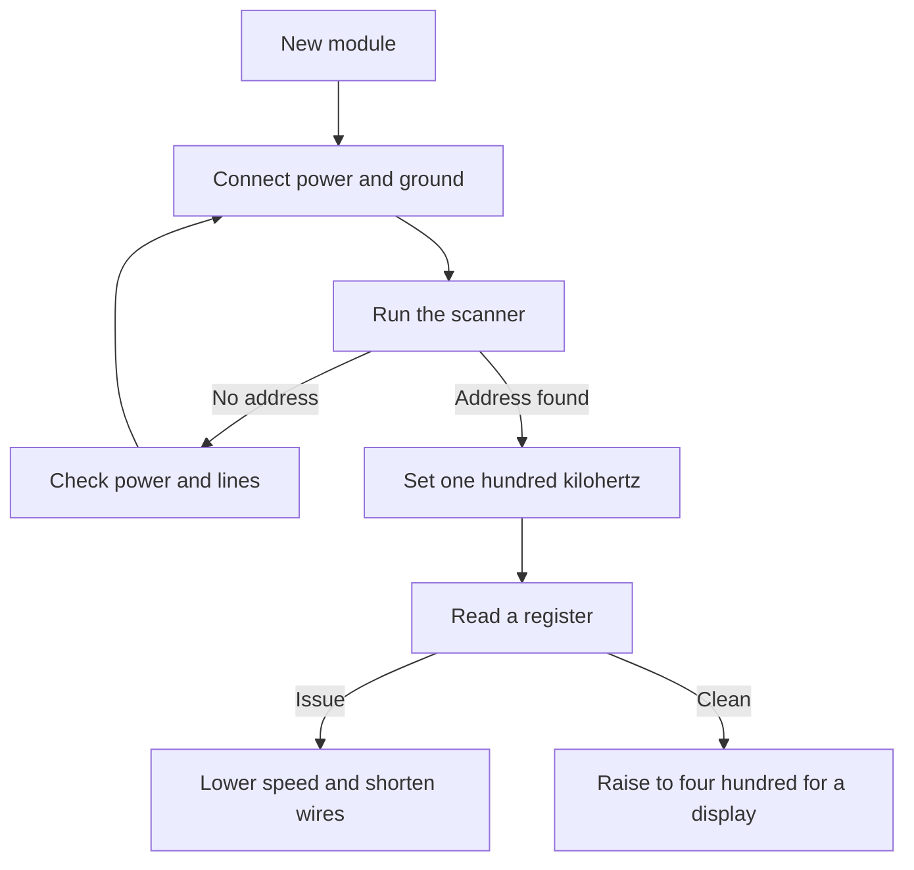

# I2C on Arduino - the Wire library

![[assets/img/arduino-i2c-wire-scheme.png|600]]
*Fig. Two bus lines, pull-ups to power, subordinate addresses and the scanner.*

> [!tip] Purpose of this note
> Teaches the two-wire bus without magic: how to open the library, find an address with the scanner, pick pull-ups and speed, and pull the bus out of a hang.

## 1. Purpose

The two-wire bus connects the board to sensors, displays, a clock, and output expanders.

Only two lines are needed: data and clock, while device selection travels as an address in every packet.

Many subordinates can sit on one pair, each answering only its own address.

The Wire library hides the complex timing diagram behind a few simple calls.

This note gives the pin map, basic calls, address scanner, pull-ups, speeds, hang cures, and length limits.

See the small-board physical pins in [[01-Hardware/01-AVR-Uno.en | classic AVR]].

The package comparison is in [[01-Hardware/02-Nano-Mega.en | compact and pins]].

Input and output modes are covered in [[03-GPIO/01-Digital-Pins.en | digital pins]].

## 2. Basic Wire library calls

| Call | What it does | Typical example |
| --- | --- | --- |
| Wire begin | Enables the bus as main | No address at startup |
| Wire begin address | Enables the bus as subordinate | To link two boards |
| Wire beginTransmission | Starts a packet to an address | Seven-bit address |
| Wire write | Puts a byte into the packet buffer | Register number, data |
| Wire endTransmission | Sends the packet into the line | Returns a result code |
| Wire requestFrom | Asks a subordinate for bytes | Address and count |
| Wire available | Count of received bytes | Before reading |
| Wire read | Takes one received byte | In the read loop |
| Wire setClock | Sets the clock rate | After bus startup |

Transfers always run in pairs: start a packet, put bytes in, finish the send.

Receiving runs on request: ask for a byte count, wait, take one by one.

The transfer completion code tells whether the subordinate answered; always check it.

The library buffer caps at thirty two bytes, so long packets are cut into parts.

```text
Обмін з регістром датчика:

  Запис у регістр:
  початок до адреси -> номер регістра -> дані -> кінець

  Читання з регістра:
  початок до адреси -> номер регістра -> кінець
  запит байтів -> читання відповіді по одному

  Правило:
  кожен початок має кінець,
  кожен запит має перевірку кількості.
```

## 3. Data and clock pins

Bus lines have fixed numbers and tie to the hardware block.

| Board | SDA data | SCL clock | Note |
| --- | --- | --- | --- |
| Small classic | A four | A five | Analog header |
| Small compact | A four | A five | Same numbers |
| Large | Twenty | Twenty one | Separate digital group |
| Modern with dedicated pins | SDA mark | SCL mark | Doubled sockets near the header |

On small boards the bus sits on analog inputs four and five, a frequent surprise for newcomers.

The same pins can work as analog inputs while the bus is not running.

On the large board the bus goes to digital sockets twenty and twenty one.

Some boards double them on dedicated sockets, joined to the same lines.

Mixed-up pins give full silence: the scanner sees no address.

## 4. Seven-bit addresses

Each subordinate has a seven-bit address, sent first after the start.

| Topic | Meaning | Practice |
| --- | --- | --- |
| Range | Zero to one hundred twenty seven | Skip service addresses |
| Write and read | Eighth bit direct | Library sets it alone |
| Address jumpers | Change of low bits | Allows several identical modules |
| Address conflict | Two modules, one address | Change jumpers or take another module |
| Unknown address | Datasheet lost | Run the scanner and watch the answer |

Write the address in seven-bit form; no left shift is needed, the library does it.

A common mistake: taking the address from the datasheet in eight-bit form and wondering at the silence.

If two identical modules with no jumpers share the bus, they answer together and spoil the exchange.

A display and a sensor often ship with different addresses, so they live side by side with no fights.

The address scanner settles every question in seconds.

## 5. Bus scanner

The scanner walks all addresses and shows the ones that answered.

```cpp
#include <Wire.h>

void setup() {
  Serial.begin(9600);
  Wire.begin();
  Serial.println("Сканер стартував");
  for (int addr = 1; addr < 127; addr++) {
    Wire.beginTransmission(addr);
    int res = Wire.endTransmission();
    if (res == 0) {
      Serial.print("Знайдено: 0x");
      Serial.println(addr, HEX);
    }
    delay(5);
  }
  Serial.println("Готово");
}

void loop() {
  delay(2000);
}
```

The code returns zero only when a subordinate acknowledged the address.

Hexadecimal output is easy to check against the module datasheet.

The pause between addresses gives the bus time to settle.

If the scanner stays silent, check module power, ground, and the lines themselves.

If the scanner sees the wrong address, look at the jumpers on the module.

```text
Підключення для сканування:

  Плата                 Модуль
  -----                 ------
  SDA (А чотири) ------> SDA
  SCL (А пять) --------> SCL
  5V ------------------> VCC (якщо модуль пять вольт)
  GND -----------------> GND

  Умови:
  підтяжки вже на модулі або зовнішні,
  загальна довжина коротка,
  живлення стабільне.
```

## 6. Four point seven kiloohm pull-ups

Bus lines are open-drain, so resistors to power build the high level.

| Situation | Value | When to take |
| --- | --- | --- |
| One module nearby | Four point seven kiloohm | Typical start |
| Two to three modules | Four point seven kiloohm | Keep factory ones on modules |
| Many modules | Ten kiloohm each gives a small total | Count the parallel resistance |
| Long line | Two point two kiloohm | Steeper edges |
| Five volts and three volts together | Level converter | No direct join |

Many modules already carry pull-ups on board, so no external ones go in.

Several sets in parallel give a small total resistance and a large current.

Too small a resistance heats the outputs; too large gives lazy edges and errors.

Mixed levels take a level converter, not direct wires.

The check is simple: an oscilloscope or logic analyzer shows how square the clock is.

## 7. One hundred and four hundred kilohertz speeds

| Mode | Rate | What for |
| --- | --- | --- |
| Standard | One hundred kilohertz | Sensors, clock, solid start |
| Fast | Four hundred kilohertz | Displays, memory, large flow |
| Slow | Fifty kilohertz | Long lines and breadboards |
| Very fast | One megahertz | Short tracks and support on both sides only |

By default the library starts at one hundred kilohertz, enough for most sensors.

A display moves to four hundred kilohertz, so drawing never jerks.

A long line always slows down, because capacitance smooths the edges.

Not every subordinate knows the fast mode; check the chip datasheet for the limit.

Set the rate with the setClock call after bus startup.

```cpp
#include <Wire.h>

const int SENSOR_ADDR = 0x48;

void setup() {
  Serial.begin(9600);
  Wire.begin();
  Wire.setClock(100000);
  Serial.println("Шина на ста кілогерцах");
}

int readTemp() {
  Wire.beginTransmission(SENSOR_ADDR);
  Wire.write(0x00);
  if (Wire.endTransmission(false) != 0) {
    return -1000;
  }
  Wire.requestFrom(SENSOR_ADDR, 2);
  if (Wire.available() < 2) {
    return -1000;
  }
  int hi = Wire.read();
  int lo = Wire.read();
  return (hi << 8) | lo;
}

void loop() {
  int v = readTemp();
  Serial.println(v);
  delay(1000);
}
```

The repeated start with the false flag holds the bus and saves time.

The received-byte count check filters torn packets.

Minus one thousand here means a link issue, not frost.

## 8. Bus hangs and reset

The bus can hang when a subordinate holds the data line low.

| Symptom | Cause | Fix |
| --- | --- | --- |
| Scanner silent on all addresses | No module power | Check power and ground |
| Bus stuck after an issue | Subordinate waits for a packet end | Software bus reset |
| One module hangs all | Faulty module or long cable | Unplug the suspect, shorten lines |
| Errors after warm-up | Weak pull-ups | Lower resistance, shorten wires |
| Clock pulls data down | State machine stuck | Nine manual clock pulses |

Software reset: switch lines to manual mode, give nine pulses on the clock, form a stop.

Hardware reset: drop module power for a second, restart the board.

A watchdog timer in the main loop never lets it hang forever.

Long looping cables go first, because they are the main source of faults.

```text
Ручне звільнення шини:

  1. Вимкнути бібліотеку Wire.
  2. Перевести SCL у вихід, SDA у вхід.
  3. Дати девять імпульсів на SCL.
  4. Перевірити, що SDA стала високою.
  5. Сформувати стоп: SDA вниз при високих тактах,
     потім SDA вгору при високих тактах.
  6. Знову запустити Wire.begin.
```

## 9. Line length

The two-wire bus was designed for links inside one case, not between buildings.

| Length | Mode | Advice |
| --- | --- | --- |
| Up to thirty centimeters | Any | Factory pull-ups |
| Up to a meter | One hundred kilohertz | Twisted pair, ground nearby |
| Up to two meters | Fifty kilohertz | Smaller pull-ups, shield |
| Over five meters | Never stable | Take a differential pair or another bus |

Long cable capacitance eats the edges, so the analyzer shows triangles instead of rectangles.

Distant modules get power from a local source, not a thin wire across the desk.

Power cables run apart from the signal pair.

Streets and shop floors take a move to a differential pair, while the bus stays local.

## 10. Mermaid: device startup



The diagram reads top to bottom: power first, then the address search, then speed.

With no scanner address, going further makes no sense.

Raise the speed only after a clean read in the slow mode.

## Common issues

| # | Issue | Why it is bad | How to do it right |
| --- | --- | --- | --- |
| 1 | Lines swapped | Scanner silent, no exchange | Data to data, clock to clock |
| 2 | No pull-ups to power | Lines never rise high | Fit four point seven kiloohm or keep factory ones |
| 3 | Address in eight-bit form | Library shifts twice | Take the seven-bit address from the scanner |
| 4 | Two modules share one address | Answer together, packets break | Split with jumpers or swap a module |
| 5 | Long cable at four hundred kilohertz | Edges smoothed, errors | Drop to one hundred or fifty kilohertz |
| 6 | Transfer result code ignored | Issue hides until a big fault | Check every packet result |

## Official sources

- [Wire on docs.arduino.cc](https://docs.arduino.cc/language-reference/en/functions/communication/wire/) - bus startup, transfer, request, scanner examples.
- [Language reference on arduino.cc](https://www.arduino.cc/reference/en/) - function reference, speeds, sketch examples for sensors.

## See also

- [[Home.en]]
- [[01-Hardware/01-AVR-Uno.en | classic AVR]]
- [[01-Hardware/02-Nano-Mega.en | compact and pins]]
- [[03-GPIO/01-Digital-Pins.en | digital pins]]
- [[04-Interfaces/01-UART.en | serial port]]
- [[04-Interfaces/02-SPI.en | fast bus]]
