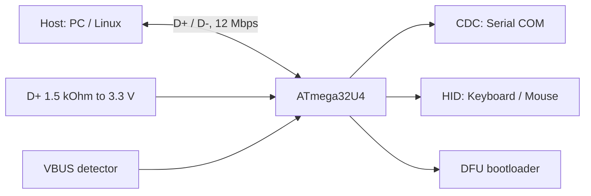

# USB on AVR - CDC and HID on ATmega32U4

![[assets/img/ard-usb-scheme.png|600]]
*Fig. USB on AVR: ATmega32U4 with a built-in controller D+/D-, 3.3 V, no external UART chip.*

> [!tip] What this note is
> Deep section: [[04-Interfaces/01-UART.en | UART]] is the external bus, while here USB runs at 1.5 Mbps straight in the crystal (ATmega32U4: Leonardo, Pro Micro). The 328P has no USB - outer CP2102/CH340 chips there (see [[01-Hardware/02-Nano-Mega.en | Nano/Mega]]).

USB in the crystal:



*Fig. One crystal - three USB classes, no external UART chip.*

## 1. Why ATmega32U4 and not 328P

| | ATmega328P (Uno) | ATmega32U4 (Leonardo) |
| --- | --- | --- |
| USB | none (CP2102/CH340 chips on board) | built-in, full-speed 12 Mbps |
| Clock | 16 MHz | 16 MHz (USB PLL from crystal) |
| UART | 1 (HW) + 0 on USB | 1 (HW) + CDC (USB) - Serial means CDC! |
| Update | ISP (AVRDUDE) | DFU over USB + ISP |
| Pins | 14 pins | 20 pins, D+/D- on PCB |

Key fact: on Leonardo `Serial` is CDC over USB, while the HW UART stays free (as `Serial1` in the core).

## 2. USB in the chip: what happens

- D+/D-: built-in Schmitt inputs, D+ pulled with 1.5 kOhm to 3.3 V (full-speed claim);
- VBUS: detector on a separate pin - boards carry a resistor on D+/VBUS;
- current: up to SET_CONFIGURATION - 100 mA, after - 500 mA (per the configuration descriptor);
- clock: PLL from the 16 MHz crystal (no outer USB crystal needed).

## 3. Classes: what the crystal can do

| Class | What it is | Example on AVR |
| --- | --- | --- |
| CDC (ACM) | virtual COM port | Serial (Leonardo) |
| HID | keyboard/mouse/joystick with no drivers | Keyboard/Mouse library |
| DFU | firmware update over USB | Leonardo bootloader |
| Composite | CDC + HID together | Pro Micro (bootloader) |

## 4. Working code: CDC

```cpp
// Leonardo: Serial — це USB CDC (не UART!)
void setup() {
  pinMode(LED_BUILTIN, OUTPUT);
}

void loop() {
  if (Serial) {                    // хост відкрив COM-порт
    digitalWrite(LED_BUILTIN, HIGH);
    while (Serial.available()) {
      int c = Serial.read();
      if (c == 'h') Serial.println("hello, хост!");
    }
    delay(500);
    digitalWrite(LED_BUILTIN, LOW);
  }
}
```

- `if (Serial)` - fires when the host opens the port; without it the COM port "stays silent".

## 5. Working code: HID keyboard

```cpp
#include <Keyboard.h>

void setup() {
  Keyboard.begin();
}

void loop() {
  Keyboard.print("hello");
  Keyboard.println();
  Keyboard.releaseAll();   // скидати reports між фразами!
  delay(2000);
}
```

- report: 6-key rollover (6K), modifiers apart;
- mouse: `Mouse.h` - move/click/wheel;
- joystick: AdvancedHID (own HID descriptor, 8-16 axes).

## 6. Flashing over USB

- Leonardo bootloader: DFU over USB (4 KB boot section);
- in the IDE: "Arduino Leonardo" board, hold RST for 5 s, the board switches into DFU;
- Pro Micro (32U4 clone): same DFU, but 3.3 V logic and 3.3 V IO - never connect 5 V sensors!

## 6.1 USB descriptors: what the host sees

| Field | Leonardo (typical) | Note |
| --- | --- | --- |
| bcdUSB | 2.0 | USB 2.0 |
| idVendor | 0x2341 | Arduino |
| idProduct | 0x0043 | Leonardo (CDC) |
| bDeviceClass | 0x02 (Communications) | CDC-first |
| bMaxPacketSize0 | 64 | EP0 |
| bcdDevice | 2.0 | descriptor version |
| max current | 500 (100 mA before config) | in mA |

Read the descriptor: `lsusb -v -d 2341:0043` (Linux) or `ioreg -p IOUSB -l` (macOS).

Extra:

- boards with no bootloader: loading over SPI (DUDE) or DFU tools;
- COM number on Linux: /dev/ttyACM0 (CDC), not /dev/ttyUSB0 (as with CH340).

## 7. Common issues

| Symptom | Cause | Fix |
| --- | --- | --- |
| Linux sees no COM | rights / udev | udev rule for 0x2341, dialout group |
| "Keyboard doubles" presses | report not reset after send | Keyboard.releaseAll() between phrases |
| Board shows, but COM stays silent | host never opened the port / CDC not started | check `if (Serial)`, open the port before the code |
| USB "drops" under load | 100 mA limit before configuration | 500 mA descriptor, external power |
| Cable "charges but does not talk" | charge cable with no D+/D- | full cable, check the plug |
| Pro Micro dies from a 5 V sensor | 3.3 V logic, not 5V-tolerant | level matching, 3.3 V module power |

## 8. Related notes

- [[09-Firmware/01-IDE-CLI | IDE/CLI]] - pick the Leonardo/Pro Micro board.
- [[09-Firmware/02-Bootloader-AVRDUDE | Bootloader]] - AVRDUDE versus DFU.
- [[04-Interfaces/01-UART.en | UART]] - CP2102/CH340 on Uno.
- [[01-Hardware/02-Nano-Mega.en | Nano/Mega]] - boards with an external USB-UART.

## Official sources

- [ATmega32U4 (Wikipedia, chip overview)](https://en.wikipedia.org/wiki/ATmega32U4) - USB controller, pinout.
- [Arduino Leonardo Guide](https://www.arduino.cc/en/Guide/Leonardo) - CDC, DFU, pinout.
- [Pro Micro (Playground Arduino)](https://playground.arduino.cc/Hardware/ProMicro) - 3.3 V, pinout.
- [Language Reference (Arduino docs)](https://docs.arduino.cc/language-reference/) - Serial, HID libraries.
