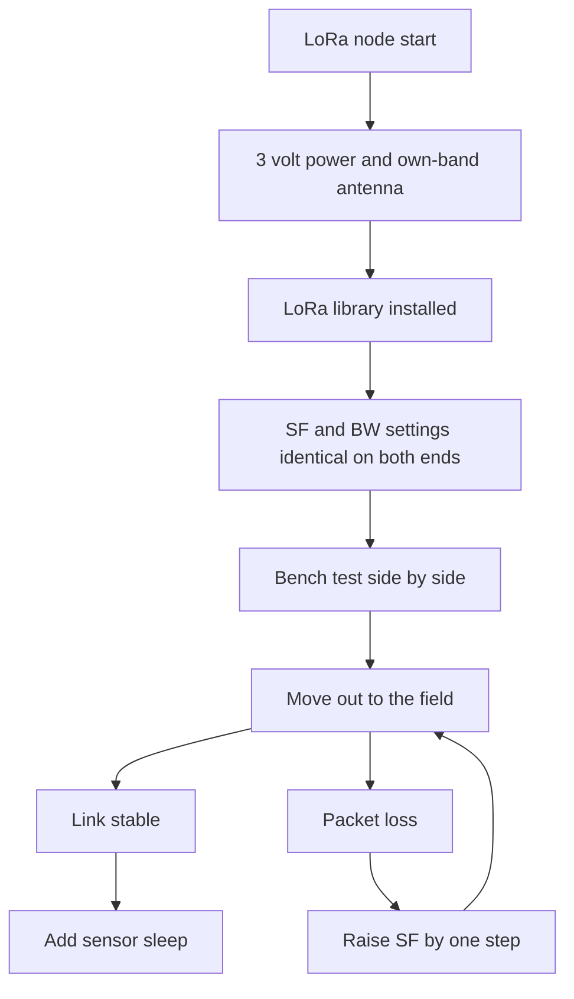

# LoRa Modules on Arduino - Kilometers of Range

![[assets/img/arduino-lora-scheme.png|600]]
*Fig. LoRa node on an Arduino board with antenna, three-volt power and SPI bus link.*

> [!tip] Purpose of the note
> Give a working long-range radio for several kilometers with no cell network and no traffic fees.

## 1. Purpose

LoRa modules are needed where Wi-Fi cannot reach and cell coverage is costly or absent. A field, a village, an apiary, an out-of-town weather station, a dacha community, a garage block. One node measures, the other receives. Range over open terrain reaches several kilometers even at low power.

The basis of the range is spread spectrum with chirp modulation. The signal hides below the noise floor, but the receiver pulls it out with the spreading factor. That is why LoRa gets through where plain radio stays silent. The price is low speed and long time on air.

For a link with an Arduino board, take ready modules on SX1278 or RFM95 chips. A module is a small board with a chip, a crystal, matching parts and an antenna output. Control goes over the SPI bus, and sending is a packet write into the buffer plus a transmit command.

A typical pair is a sensor plus a base. The sensor sleeps, wakes once a minute, measures temperature and humidity, sends a short packet, sleeps again. The base listens to the air all the time and prints what it gets to the serial port or a display.

## 2. Which modules to take

| Module | Chip | Band | Power | When to take |
| --- | --- | --- | --- | --- |
| SX1278 module | SX1278 | 433 MHz | up to 100 mW | Village and field, cheap antennas |
| RFM95 module | SX1276 | 868 MHz | up to 100 mW | Town, shorter antenna |
| Board with display | SX1276 | 868 MHz | up to 100 mW | Debugging with a display |
| Mini module | SX1278 | 433 MHz | up to 100 mW | Compact sensor |

The main rule is an antenna strictly for its own band. A 433 MHz antenna is longer, an 868 MHz one is shorter. A foreign antenna cuts range several times and heats the output stage. Never switch the transmitter on with no antenna at all.

Before buying, check the allowed band in your country. In Europe short packets usually use 868 MHz, in other regions 433 MHz or 915 MHz. The module and the antenna must match.

## 3. Three-volt power

| Circuit | Voltage | Current | Comment |
| --- | --- | --- | --- |
| Module supply | 3.3 V | up to 120 mA in transmit | From the board regulator or a separate one |
| SPI logic | 3.3 V | small | Do not feed five volts |
| Module sleep | 3.3 V | single microamps | Sensor lives from a battery long |
| Antenna | passive | no supply | Mount vertically up |

LoRa modules run from three volts. The Uno board has a 3.3 V pin, but its current is limited. If transmission breaks or the module restarts, add a separate 3.3 V regulator and a 47 uF capacitor near the module.

The logic inputs of the module are also rated for three volts. A divider or a level shifter on the lines to the module is welcome. In practice many builds work straight from Arduino pins through resistors, but matching is more reliable.

```text
Живлення вузла LoRa:
  Плата Уно --5В--> окремий стабілізатор --3.3В--> VCC модуля
  GND спільна для плати і модуля товстим проводом
  Конденсатор 47 мкФ між VCC і GND біля самого модуля
  Антена вертикально, подалі від металу і проводів
  Довжина антени строго під діапазон модуля
```

## 4. Air settings must match

| Setting | Meaning | Practice |
| --- | --- | --- |
| Frequency | Carrier in MHz | Identical on both ends down to kilohertz |
| Spreading factor SF | From 7 to 12 | Higher number hits further and hangs on air longer |
| Bandwidth BW | 125 or 250 kHz | Identical on both ends |
| Coding rate CR | 4/5 or 4/8 | Identical on both ends |
| Sync word | Network marker | Same in its own pair, foreign in neighbours |

Beginners fit the SF7 plus 125 kHz band link. It is fast, the air stays free, the battery lasts long. If it does not reach, raise SF to 9 or 10. Each step up adds range but stretches the packet on air.

Set power to the minimum sufficient. The maximum is needed only at the range edge. High power drains the battery and bothers neighbours on air. The minimum is enough for the bench.

## 5. SPI connection

| Module signal | Where on Uno | Purpose |
| --- | --- | --- |
| VCC | 3.3 V | Power supply |
| GND | GND | Common ground |
| SCK | D13 | Bus clock |
| MISO | D12 | Data from module |
| MOSI | D11 | Data to module |
| NSS | D10 | Module select |
| DIO0 | D2 | Receive and transmit interrupt |
| RESET | D9 | Module reset |

The SPI bus is shared by several devices, but each has its own NSS line. If a memory card or a display also hangs on the bus, split select across separate pins. Run ground short and thick.

```text
ASCII схема пари:
  ДАТЧИК                          БАЗА
  Уно + SX1278 + антена  ~~~~~~  Уно + SX1278 + антена
    |                                       |
  сенсор DHT22                        компютер по USB
  живлення батарея                 живлення від USB

  Пакет: [адреса][температура][вологість][батарея][контрольна сума]
  Довжина пакета до 32 байт для надійності
```

## 6. Libraries

For a start the LoRa library by Sandeep Mistry is enough. It is simple and ships sender and receiver examples. For complex networks take RadioHead with the RF95 driver. There you get addressing, acknowledgements and repeats.

Install through the library manager in the Arduino environment. Search by the word LoRa, install a stable version, open the sender example. In the example change the frequency to your module and the NSS pin number.

Before the first transmission check the antenna soldering. A cold joint in the socket gives the same picture as a foreign frequency. The module seems to work, but range is meters.

## 7. Transmitter sketch

```cpp
#include <SPI.h>
#include <LoRa.h>

const int PIN_NSS = 10;
const int PIN_RST = 9;
const int PIN_DIO = 2;
unsigned long counter = 0;

void setup() {
  Serial.begin(9600);
  LoRa.setPins(PIN_NSS, PIN_RST, PIN_DIO);
  if (!LoRa.begin(433E6)) {
    Serial.println("LoRa no start");
    while (1) {}
  }
  LoRa.setSpreadingFactor(9);
  LoRa.setSignalBandwidth(125E3);
  LoRa.setCodingRate4(5);
  LoRa.setTxPower(14);
  Serial.println("TX ready");
}

void loop() {
  int temp = 23;
  int hum = 55;
  LoRa.beginPacket();
  LoRa.print("N1 T:");
  LoRa.print(temp);
  LoRa.print(" H:");
  LoRa.print(hum);
  LoRa.print(" C:");
  LoRa.print(counter);
  LoRa.endPacket();
  counter++;
  delay(5000);
}
```

The code sets 433 MHz, SF9, 125 kHz band. Power of 14 dBm is enough for field tests. The counter in the packet shows gaps on the receiver. A five-second delay keeps the air free.

## 8. Receiver sketch

```cpp
#include <SPI.h>
#include <LoRa.h>

const int PIN_NSS = 10;
const int PIN_RST = 9;
const int PIN_DIO = 2;

void setup() {
  Serial.begin(9600);
  LoRa.setPins(PIN_NSS, PIN_RST, PIN_DIO);
  if (!LoRa.begin(433E6)) {
    Serial.println("LoRa no start");
    while (1) {}
  }
  LoRa.setSpreadingFactor(9);
  LoRa.setSignalBandwidth(125E3);
  LoRa.setCodingRate4(5);
  Serial.println("RX ready");
}

void loop() {
  int size = LoRa.parsePacket();
  if (size) {
    Serial.print("Got: ");
    while (LoRa.available()) {
      Serial.print((char)LoRa.read());
    }
    Serial.print(" RSSI ");
    Serial.println(LoRa.packetRssi());
  }
}
```

The receiver prints the packet text and the RSSI signal level. The level shows the margin. If the number is worse than minus one hundred ten, raise the antenna higher or increase SF. Drop packets without your own node address in software.

## 9. Antennas and range

A quarter-wave whip antenna from the kit gives a kilometer in the field and hundreds of meters in town. Moving the antenna to a mast doubles the result with no electronics change. A metal roof under the antenna works as a screen and adds range.

The cable between module and antenna must be short. A long thin cable eats the whole gain. Better to raise the whole node in a sealed box than to pull meters of cable.

Range is checked with a counter pair. One stands in place, the other walks away and watches gaps. The point where every second packet is lost is the edge. Set the working point with double margin.

## Mermaid: setting choice



The diagram reads top down. First power and antenna, then identical settings, then a side-by-side test, then the field. Gaps are fixed by raising SF, not by power straight away.

## Common issues

| # | Issue | Why it is bad | Correct way |
| --- | --- | --- | --- |
| 1 | Transmit with no antenna | Output heats and the chip degrades | Antenna first, then power |
| 2 | Foreign-band antenna | Range drops several times | Antenna marking equals module frequency |
| 3 | Different SF or BW on ends | Receiver sees no packets at all | One setting set in both sketches |
| 4 | Module fed from weak board 3.3 V | Sags and restarts in transmit | Separate regulator and 47 uF capacitor |
| 5 | Five volts on module inputs | Inputs degrade with time | Resistive dividers or a level shifter |
| 6 | Long packets on SF12 | Air jammed, battery drains fast | Short packets to 32 bytes, minimum sufficient SF |

## Official sources

- [LoRa library for Arduino (Sandeep Mistry)](https://github.com/sandeepmistry/arduino-LoRa) - sender and receiver examples, SF and BW setup.
- [RadioHead RF95 driver docs](https://www.airspayce.com/mikem/arduino/RadioHead/) - RF95 driver, packet addressing and acknowledgement.
- [SX1276 transceiver (Semtech)](https://www.semtech.com/products/wireless-rf/lora-connect/sx1276) - RFM95/RFM96 chip, settings and sensitivity.

## See also

- [[Home.en]]
- [[12-Comm-Modules/01-NRF24|radio module]]
- [[05-Radio/02-GSM-SIM800|cell link]]
- [[EN/02-Power-Supply/02-Battery-Power.en|autonomous power]]
- [[EN/04-Interfaces/01-UART.en|serial port]]
- [[EN/01-Hardware/01-AVR-Uno.en|classic AVR]]
