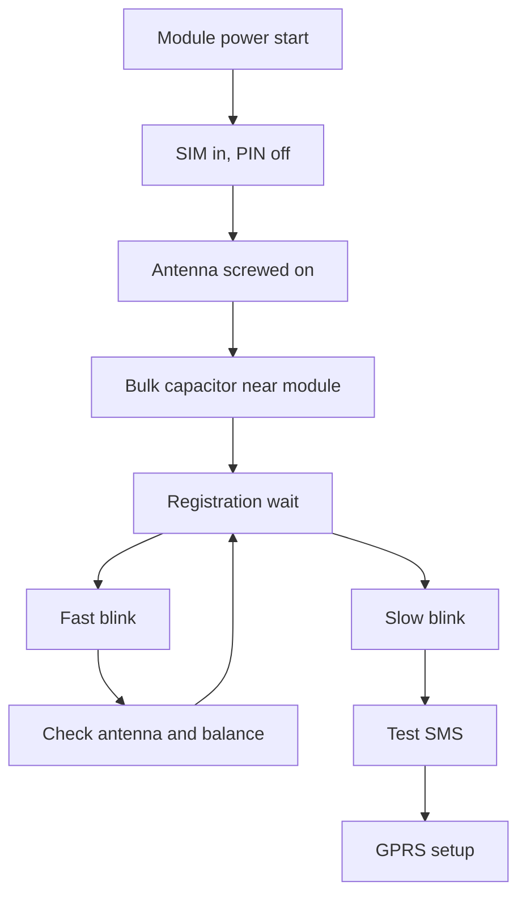

# SIM800 - SMS and Internet with Arduino

![[assets/img/arduino-gsm-scheme.png|600]]
*Fig. SIM800 module with antenna and strong power supply driven by an Arduino board with AT commands.*

> [!warning] 2G sunset: carriers shut 2G networks down - SIM800 fits legacy nodes; design new products for LTE-M/NB-IoT.
> [!tip] Purpose of the note
> Teach SIM800 hookup with no restarts, alarm SMS sending and a simple GPRS channel.

## 1. Purpose

The SIM800 module adds a cell link to an Arduino board. Where LoRa cannot reach a base and Wi-Fi is absent, the mobile network saves the day. A dacha sensor sends an SMS about a leak, an alarm calls the owner, a greenhouse posts data to a server over GPRS once an hour.

SIM800 is a full phone with no display. A SIM card goes in, an antenna screws on, power is applied. The Arduino board talks to it in text AT commands over the serial port. A call command, an SMS send command, an internet session open command.

The hard part of the module is power. At network registration and in transmit the module takes peaks to two amps. A weak supply sags, the module restarts, Arduino initializes it again, and the loop repeats forever. So power gets its own section below.

## 2. What a start needs

| Item | Demand | Comment |
| --- | --- | --- |
| SIM800L or SIM800C module | Board with supply and UART pins | Take the version with a SIM holder |
| SIM card | PIN code off, balance present | Remove the PIN in a phone in advance |
| GSM antenna | Kit wire antenna | No registration with no antenna |
| Supply unit | 5 V with 2 A headroom | A phone charger fits |
| Bulk capacitor | 470 or 1000 uF | Placed near the module |

Take a card from the carrier whose tower is closer. The module works in second-generation networks, so check coverage for voice calls, not just fast internet. Take a tariff with cheap SMS and a small data pack.

## 3. Power with two-amp peaks

| Circuit | Voltage | Current | Comment |
| --- | --- | --- | --- |
| SIM800L | 3.7 or 4.2 V | peaks to 2 A | Ideal from a lithium cell |
| SIM800C | 5 V through its own regulator | peaks to 2 A | Simpler for beginners |
| Arduino Uno | 5 V separate | to 500 mA | Do not feed the module from the board 5V pin |
| Bulk capacitor | near the module | levels peaks | 470 uF minimum, 1000 uF better |

The rule is simple. The module is fed by a separate thick wire from the unit, not through the Arduino board. Grounds meet in one point near the unit. The bulk capacitor solders straight to the module supply pins. The status LED hints the state. A blink once per three seconds means registration passed, fast blinking means network search.

```text
Живлення SIM800 без перезапусків:
  Блок 5В 2А --товстий плюс--> VCC модуля SIM800C
  Блок GND --товста земля--> GND модуля
  Конденсатор 1000 мкФ між VCC і GND біля модуля
  Ардуіно живиться окремо, GND спільна з модулем
  SIM800L живити від 4.2В або акумулятора 18650 через діод
```

Long thin breadboard wires give the same effect as a weak unit. Wire resistance drops voltage at the peak. So supply wires stay short and thick, while signal wires may be long.

## 4. Connection to Arduino

| SIM800 signal | Where on Uno | Comment |
| --- | --- | --- |
| VCC | Separate unit | Not from the board |
| GND | Board and unit GND | Common ground mandatory |
| Module TX | D10 through a divider | Receive on the software port |
| Module RX | D11 | Transmit from the board |
| RST | D9 or unconnected | Reset on demand |
| Antenna | Socket on module | Screw on before power-up |

The Uno hardware port is busy with the PC link, so the module takes a software port on the SoftwareSerial library. Set the rate to 9600. The module can do more, but on long wires 9600 is the most stable.

Module levels are three volts, so the line from Arduino to the module wants a divider of two resistors. The line from the module to Arduino reads directly. Many builds work straight both ways, but a divider extends the input life.

```text
ASCII схема звязків:
  Уно D11 TX ----> RX SIM800
  Уно D10 RX <---- TX SIM800 через подільник 10к і 20к
  GND Уно --------- GND SIM800 і GND блока живлення
  Антена GSM накручена, SIM вставлена до подачі живлення
  Світлодіод NET блимає повільно після реєстрації
```

## 5. AT commands by hand

Before automation, commands are checked by hand through the port monitor. The Arduino board works as a transparent bridge between the PC and the module. You type a command, the module answers.

| Command | Action | Expected answer |
| --- | --- | --- |
| AT | Link check | OK |
| AT+CSQ | Signal level | A number from 10 to 31 is good |
| AT+CREG? | Network registration | 0,1 or 0,5 means success |
| ATD+380971234567; | Call | OK, ringing in the handset |
| ATH | Hang up | OK |
| AT+CMGF=1 | SMS text mode | OK |
| AT+CMGS="+380971234567" | SMS start | Text prompt after the greater sign |

SMS text ends with the control-Z combo. In the port monitor it goes with a separate button or code 26. The balance is checked with a carrier command, because the module does not count money itself.

## 6. SMS alarm sketch

```cpp
#include <SoftwareSerial.h>

SoftwareSerial gsm(10, 11);
const int PIN_SENSOR = 4;
const String PHONE = "+380971234567";
bool alarmSent = false;

void setup() {
  Serial.begin(9600);
  gsm.begin(9600);
  pinMode(PIN_SENSOR, INPUT_PULLUP);
  delay(3000);
  gsm.println("AT");
  delay(500);
  gsm.println("AT+CMGF=1");
  delay(500);
  Serial.println("GSM ready");
}

void sendSMS(String text) {
  gsm.print("AT+CMGS=\"");
  gsm.print(PHONE);
  gsm.println("\"");
  delay(1000);
  gsm.print(text);
  delay(500);
  gsm.write(26);
  delay(4000);
}

void loop() {
  int s = digitalRead(PIN_SENSOR);
  if (s == LOW && !alarmSent) {
    sendSMS("Alarm! Datchik spratsyuvav. Perevir primischennya.");
    alarmSent = true;
    delay(1000);
  }
  if (s == HIGH) {
    alarmSent = false;
  }
  delay(200);
}
```

The sensor is a button or a door reed switch pulled to supply by the internal resistor. One trip sends one message. A repeat comes only after the sensor returns to rest. The text is Latin, because Cyrillic needs UCS2 coding and longer code.

## 7. GPRS and server posting

| Command | Purpose |
| --- | --- |
| AT+SAPBR=3,1,"APN","internet" | Carrier access point |
| AT+SAPBR=1,1 | Open the bearer |
| AT+HTTPINIT | Start the HTTP service |
| AT+HTTPPARA="URL","<http://site/log?x=1>" | Request address |
| AT+HTTPACTION=0 | Run a GET request |
| AT+HTTPTERM | Close the service |

The sequence runs once an hour or once per fifteen minutes. More often makes sense only for guard duty. Before sending, check the signal with the CSQ command. If the signal is weak, move the attempt by five minutes.

The carrier hints the APN access point. On many cards the word internet works at once. Login and password are usually empty. Read the server answer for control, at least code two hundred.

## 8. Balance and saving

The module knows no tariff and sends while money lasts. So the code holds a message counter per day. More than five alarms in a row means either an accident or sensor bounce. After the limit the module stays silent till morning and logs events through the serial port.

For saving, switch off the extra. Stick over or unsolder the board LEDs in a battery node. Poll the sensor once a second, not all the time. Close the GPRS session right after sending.

## Mermaid: SIM800 startup



The diagram reads top down. With no antenna and no bulk capacitor, go no further. Fast blinking is network search, slow blinking is success. After registration test SMS, only then internet.

## Common issues

| # | Issue | Why it is bad | Correct way |
| --- | --- | --- | --- |
| 1 | Module fed from the Arduino board | Two-amp peaks drop the rail and the module reboots | Separate 2 A unit and thick wires |
| 2 | Start with no antenna | No registration, transmitter works into a break | Screw the antenna on before power-up |
| 3 | PIN code left on | Module stays silent unregistered | Put the card in a phone and switch the PIN prompt off |
| 4 | 115200 port rate on long wires | Garbage instead of answers | Start from 9600 and short wires |
| 5 | Cyrillic in SMS text | A set of question marks arrives | Latin or UCS2 coding with separate code |
| 6 | No balance control | Node stays silent on a zero account | Message limit and periodic account check |

## Official sources

- [SIM800 Series AT Command Manual (SimCom)](https://simcom.ee/documents/SIM800/SIM800%20Series_AT%20Command%20Manual_V1.12.pdf) - full AT command list and settings.
- [SoftwareSerial Arduino reference](https://docs.arduino.cc/learn/built-in-libraries/software-serial/) - software port, limits and examples.

## See also

- [[Home.en]]
- [[05-Radio/01-LoRa-moduli|long-range radio]]
- [[EN/04-Interfaces/01-UART.en|serial port]]
- [[EN/02-Power-Supply/02-Battery-Power.en|autonomous power]]
- [[EN/02-Power-Supply/01-VIN-Power-Supply.en|VIN power supply]]
- [[EN/01-Hardware/01-AVR-Uno.en|classic AVR]]
