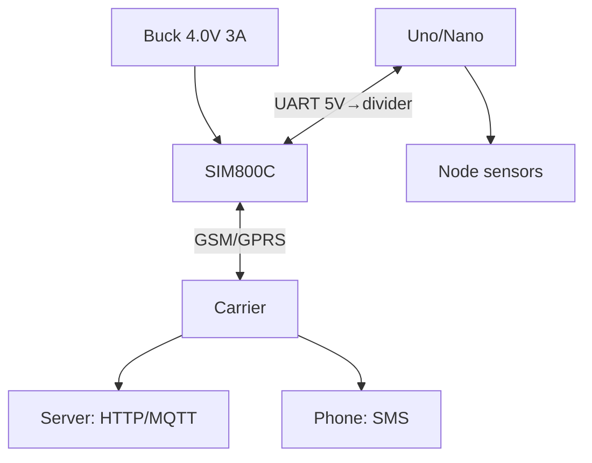

# Arduino GSM Deep Dive - SIM800C: GPRS, HTTP and SMS

![[assets/img/ard-gsm-deep-http-scheme.png|600]]
*Fig. SIM800C on a separate 4V supply: UART commands, GPRS session to the internet, SMS as a backup channel.*

> [!tip] What this note is
> Depth over the GSM overview note: here 2A-peak supply, HTTP stack with AT commands and SMS control. Module overview: [[05-Radio/02-GSM-SIM800|GSM module overview]], bus: [[EN/04-Interfaces/01-UART.en|UART bus]].

## 1. Goal

Give Arduino internet where there is no WiFi:

- SIM800C supply: 3.4-4.4V, 2A peak - a separate buck;
- GPRS session: APN, PDP context, HTTP GET/POST;
- SMS: command receive and alert sending;
- saving: module sleep between sessions.

| Setting | SIM800C | Note |
| --- | --- | --- |
| Network | Quad-band GSM/GPRS | 2G (check coverage!) |
| Supply | 3.4-4.4V, 2A peak | NOT 5V straight! |
| Logic | 2.8V UART | Arduino TX divider |
| Rate | UART 115200 | auto baud ok |
| SIM | micro-SIM | IoT tariff with no voice |

## 2. Architecture



2G closes in many countries - check network presence BEFORE the project. Alternative - LTE modems (SIM7600).

## 3. Module pinout

| Uno pin | SIM800C pin | Note |
| --- | --- | --- |
| D7 (RX) | TXD | straight: 2.8V reads as HIGH |
| D8 (TX) | RXD | 10k/20k divider (5V to 3.3V)! |
| GND | GND | common, thick |
| D9 | PWRKEY | 1 s pulse to switch on |
| D10 | STATUS | HIGH = module on |
| Buck 4.0V | VCC | 1000 uF near the module! |

With no capacitor and thin wires the module reboots at network registration (2A peak).

## 4. HTTP over AT

```text
AT+SAPBR=3,1,"APN","internet"   → OK (точка доступу)
AT+SAPBR=1,1                     → OK (відкрити носій)
AT+HTTPINIT                      → OK
AT+HTTPPARA="URL","http://srv/api?temp=23.5" → OK
AT+HTTPACTION=0                  → +HTTPACTION: 0,200,24
AT+HTTPREAD                      → тіло відповіді
AT+HTTPTERM                      → закрити
```

POST - through `AT+HTTPDATA` with a length, then the body. JSON is built by hand, Content-Type goes as a parameter.

## 5. Working code (C, Arduino)

```cpp
#include <SoftwareSerial.h>
SoftwareSerial gsm(7, 8);

void gsm_cmd(const char *cmd, unsigned long wait = 2000) {
  gsm.println(cmd);
  unsigned long t0 = millis();
  while (millis() - t0 < wait) {
    if (gsm.available()) Serial.write(gsm.read());
  }
}

void gsm_pwrkey() {
  pinMode(9, OUTPUT);
  digitalWrite(9, LOW);
  delay(1200);
  digitalWrite(9, HIGH);
}

bool http_get(const char *url, char *out, int n) {
  char cmd[96];
  gsm_cmd("AT+SAPBR=3,1,\"APN\",\"internet\"");
  gsm_cmd("AT+SAPBR=1,1", 5000);
  gsm_cmd("AT+HTTPINIT");
  snprintf(cmd, sizeof(cmd), "AT+HTTPPARA=\"URL\",\"%s\"", url);
  gsm_cmd(cmd);
  gsm.println("AT+HTTPACTION=0");
  delay(8000);
  gsm.println("AT+HTTPREAD");
  int i = 0;
  unsigned long t0 = millis();
  while (millis() - t0 < 5000 && i < n - 1) {
    if (gsm.available()) out[i++] = gsm.read();
  }
  out[i] = 0;
  gsm_cmd("AT+HTTPTERM");
  return strstr(out, "200") != 0;
}

void sms_send(const char *num, const char *text) {
  gsm.println("AT+CMGF=1");
  delay(500);
  gsm.print("AT+CMGS=\"");
  gsm.print(num);
  gsm.println("\"");
  delay(500);
  gsm.print(text);
  gsm.write(26);
}

void setup() {
  Serial.begin(115200);
  gsm.begin(9600);
  gsm_pwrkey();
  delay(5000);
}

void loop() {
  char resp[128];
  if (http_get("http://srv/api?node=1", resp, sizeof(resp))) {
    if (strstr(resp, "RELAY1")) digitalWrite(5, HIGH);
  }
  delay(60000);
}
```

SoftwareSerial at 9600 - stable; 115200 in software tears. The hardware Serial stays for the USB log.

## 6. Working code (MicroPython)

```python
# MicroPython: GSM-міст (ESP32/Arduino-совместимі плати з UART)
import time
from machine import UART, Pin

gsm = UART(1, baudrate=9600, tx=17, rx=16)
pwr = Pin(9, Pin.OUT, value=1)
status = Pin(10, Pin.IN)

def at(cmd, wait=2):
    gsm.write(cmd + '\r\n')
    time.sleep(wait)
    return gsm.read() or b''

def pwrkey():
    pwr.value(0)
    time.sleep(1.2)
    pwr.value(1)
    time.sleep(5)

def http_get(url):
    at('AT+SAPBR=3,1,"APN","internet"')
    at('AT+SAPBR=1,1', 5)
    at('AT+HTTPINIT')
    at('AT+HTTPPARA="URL","%s"' % url)
    at('AT+HTTPACTION=0', 8)
    at('AT+HTTPREAD', 3)
    data = gsm.read() or b''
    at('AT+HTTPTERM')
    return data

pwrkey()
while True:
    print(http_get('http://srv/api?node=1')[:80])
    time.sleep(60)
```

The same AT dialog, a different host: the code ports between Arduino and MicroPython boards almost unchanged.

## 7. SMS control

- text mode `AT+CMGF=1`, reading `AT+CMGR=n`;
- command format: `RELAY1`, `STATUS?` - parse a substring;
- password in the first SMS word (`SECRET RELAY1`) - cuts strangers off;
- alerts: temperature/motion to 2 numbers;
- USSD balance: `AT+CUSD=1,"*100#"` - tariff control.

## 8. Common issues

| Symptom | Cause | Fix |
| --- | --- | --- |
| Reboots on call/registration | weak supply (2A peak) | 4V 3A buck + 1000 uF |
| `ERROR` on SAPBR | wrong APN | carrier IoT-tariff APN |
| SMS never comes | SIM memory full | `AT+CMGD=1,4` cleanup |
| Works by day, silent by night | module sleep | switch sleep off or wake with DTR |
| 5V on module RXD | straight Arduino TX | 10k/20k divider mandatory |
| No network at all | 2G off in the country | check coverage, then LTE |

## 9. Fast GSM cheat sheet

- 4V 3A supply + capacitor;
- Arduino TX through a divider;
- IoT-tariff APN in the config;
- HTTP: INIT to PARA to ACTION to READ to TERM;
- SMS with password as first word.

## 10. Neighbour notes

- [[05-Radio/02-GSM-SIM800|GSM module overview]] - starter note.
- [[EN/04-Interfaces/01-UART.en|UART bus]] - software port.
- [[15-Protocols/03-HTTP-Web|HTTP client]] - web side.
- [[EN/02-Power-Supply/01-VIN-Power-Supply.en|VIN power supply]] - buck for the module.
- [[Home.en|main map]] - full navigation.

## Official sources

- [SIM800C (SIMCom)](https://www.simcom.com/product/SIM800C.html) - supply, AT commands, peaks.
- [Ethernet Shield Rev2 (Arduino docs)](https://docs.arduino.cc/hardware/ethernet-shield-rev2/) - alternative transport.
- [Language Reference (Arduino docs)](https://docs.arduino.cc/language-reference/) - SoftwareSerial, strings.
