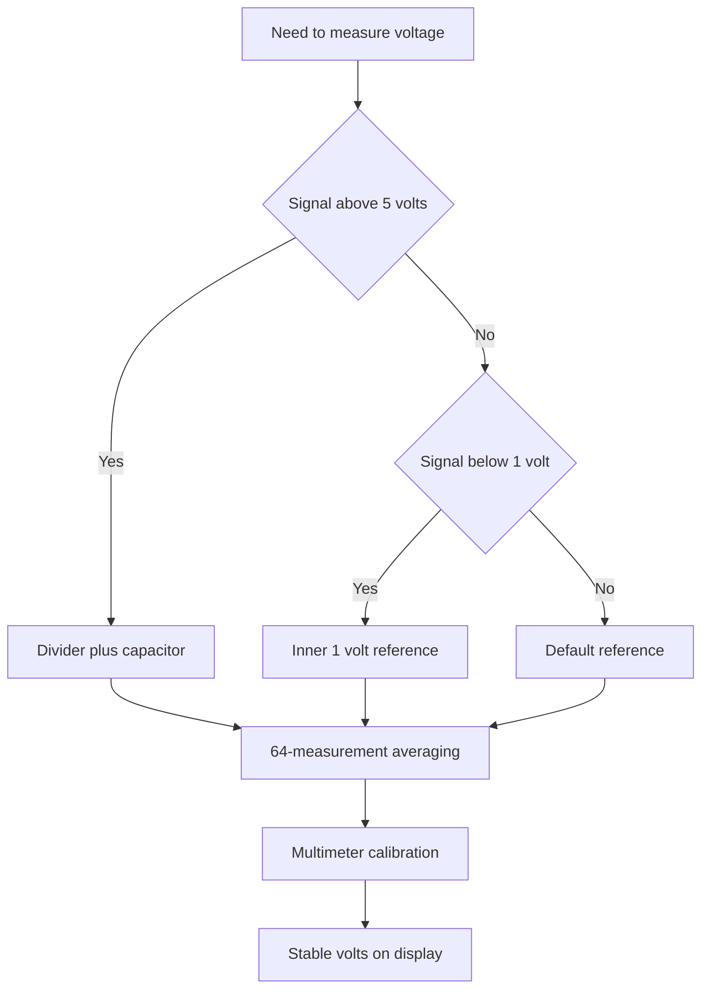

# Arduino ADC - 10 Bits of Measurement

![[assets/img/arduino-adc-scheme.png|600]]
*Fig. ADC: input, reference, scale and measurement filter.*

> [!tip] Purpose of the note
> Teach exact voltage measurement: pick the reference, convert codes to volts, remove noise by averaging and feed high voltage safely through a divider.

## 1. Purpose

An analog input turns voltage into a number from zero to one thousand twenty-three.

Such conversion serves temperature, light, current and position sensors.

A classic controller has six such inputs marked with the letter A plus a number.

Measurement runs against a reference voltage, not an absolute standard in a vacuum.

So measurement exactness equals reference stability and supply cleanliness.

This note closes the full loop: scale, reference, formula, averaging, divider, speed and noise.

Grasping these topics removes ninety percent of reading-jump questions.

A five-volt-logic board by default measures a zero-to-five-volt range.

One code step is about five millivolts.

This step fits home sensors, dividers and simple regulators.

For exact tasks switch on the internal reference or an external standard source.

See the board overview in [[EN/01-Hardware/01-AVR-Uno.en|classic AVR]].

## 2. How a measurement call works

| Element | Value | Practical sense |
| --- | --- | --- |
| Function | analogRead | Starts conversion and returns a code |
| Code scale | from 0 to 1023 | Ten bits give 1024 levels |
| Scale zero | 0 volts on input | Ground gives a zero code |
| Scale top | reference on input | Reference voltage gives 1023 |
| Step at 5 volt reference | about 4.9 millivolts | Small signal shifts visible |
| One measurement time | about 100 microseconds | To ten thousand measurements per second |
| Inputs | from A0 to A5 | Six channels with a multiplexer |
| Source inner resistance | best to 10 kiloohm | Weak dividers give an error |

Measurement starts with a call to the wanted channel by number.

The multiplexer ties the picked input to a single converter.

The successive-approximation converter compares the input with reference fractions.

The result returns as an integer in the scale range.

After a channel change the first measurement is sometimes thrown away, because the sample capacitor still holds the old level.

For a stable reading keep a pause of several microseconds between channels.

Never feed the input with voltage above the reference or below ground.

Inner crystal protection diodes save only from short spikes.

## 3. Reference voltage: three modes

| Mode | Call | Top voltage | When to take |
| --- | --- | --- | --- |
| DEFAULT | analogReference(DEFAULT) | Board supply 5 volts | Sensors fed from the same rail |
| INTERNAL | analogReference(INTERNAL) | Inner 1.1 volts | Small signals to one volt |
| EXTERNAL | analogReference(EXTERNAL) | Voltage on the AREF pin | Exact external standard |

The default mode fits resistive sensors fed from the same bus.

Then supply wobble hits sensor and reference alike, and the error partly cancels.

The inner 1.1 volt reference gives a fine step near one millivolt.

Such a mode fits thermocouples through an amplifier, current shunts and weak bridges.

The external reference lets precise 2.5 or 4.096 volts onto the AREF pin.

Before switching the external reference on, call it ahead of the first measurement.

Never apply to AREF a voltage above the board supply.

After a reference change skip the first readings to settle the node.

Write the reference choice as a comment at the sketch top, so no guessing later.

```text
Опора і шкала наочно:

  DEFAULT:  0 вольт ............ 0
            2,5 вольт .......... 511
            5 вольт ............ 1023

  INTERNAL: 0 вольт ............ 0
            0,55 вольт ......... 511
            1,1 вольт .......... 1023

  EXTERNAL: верх задає напруга на AREF
            код = вхід / AREF * 1023
```

The diagram shows the linear code-to-input-voltage link.

A reference change shifts only the scale, while the code count stays put.

So a small signal pays to measure with a small reference.

A large signal is first split by a divider, then measured.

## 4. Voltage formula and first sketch

| Value | Formula | Explanation |
| --- | --- | --- |
| Code | raw from 0 to 1023 | Raw input reading |
| Reference | Vref in volts | 5 or 1.1 or external |
| Voltage | raw / 1023 * Vref | Linear conversion |
| Step | Vref / 1024 | Scale resolution |
| Divider current | V / (R1 + R2) | Must be in milliamps |

The formula works only with the true reference, not the board print.

USB supply walks from 4.7 to 5.2 volts, so the scale top walks too.

For home indication such an error stays unseen.

For a voltmeter calibrate the factor against a multimeter.

Calibration shrinks to one multiplier in code.

```cpp
const int SENSOR_PIN = A0;

void setup() {
  Serial.begin(9600);
  analogReference(DEFAULT);
}

void loop() {
  int raw = analogRead(SENSOR_PIN);
  float voltage = raw * 5.0 / 1024.0;  // 1024 кроки, не 1023!
  Serial.print(raw);
  Serial.print(" -> ");
  Serial.print(voltage, 3);
  Serial.println(" V");
  delay(500);
}
```

The sketch reads input A0 twice a second and prints code with voltage.

The 5.0 multiplier matches the board supply in default mode.

If the board runs from sagged USB, readings overstate reality.

Then trim the multiplier against a multimeter, for example 4.85 instead of 5.0.

Printing with three decimals shows the true resolution.

A half-second delay keeps the monitor readable.

For the inner reference swap the multiplier to 1.1.

## 5. Averaging: 64 measurements against noise

| Approach | Measurement count | What it gives |
| --- | --- | --- |
| Single measurement | 1 | Fast, but jumps by several codes |
| Small pack | 8 | Smooths random spikes |
| Standard pack | 64 | Stable readings for an indicator |
| Long pack | 256 | Slow, but a very clean line |

A single measurement catches supply noise, pickup and quantization.

Averaging a pack splits random noise about as the root of the count.

Sixty-four measurements cut noise eight times.

The method costs about six milliseconds of time.

For a thermometer and a voltmeter such a lag stays unseen.

For fast signals take a smaller pack or a moving average.

```cpp
float readAverage(int pin) {
  long sum = 0;
  for (int i = 0; i < 64; i++) {
    sum += analogRead(pin);
  }
  float raw = sum / 64.0;
  return raw * 5.0 / 1023.0;
}

void setup() {
  Serial.begin(9600);
}

void loop() {
  float v = readAverage(A0);
  Serial.println(v, 3);
  delay(200);
}
```

The function gathers sixty-four codes and returns ready voltage.

The sum variable has long type, because sixty-four times a thousand will not fit a small type.

Division with a point keeps the fraction.

Calling in the loop gives clean readings with no last-digit tremble.

A two-hundred-millisecond pause unloads the port monitor.

On demand shrink the pack to eight for a faster reaction.

A three-reading median filter further cuts single outliers.

## 6. Divider for high voltage

| Task | Divider | Measurement top |
| --- | --- | --- |
| 12 volt battery | 30 kiloohm and 10 kiloohm | 12 volts give 3 volts on input |
| 8.4 volt pack | 20 kiloohm and 10 kiloohm | Full charge gives 2.8 volts |
| 24 volt supply | 100 kiloohm and 10 kiloohm | Working point gives 2.18 volts |
| Mains sensor | Only through a module | Galvanic isolation mandatory |

The input cannot stand voltage above the board supply.

So split the battery with two resistors to a safe level.

Count the divider factor as R2 over the R1 plus R2 sum.

Recover battery voltage by multiplying the measured value by the inverse factor.

Pick divider resistance as a trade between current and exactness.

Too large values give an error through the input leak current.

Too small values drain the battery with their own current.

```text
Подільник для батареї 12 вольт:

  батарея 12V ---- [R1 30k] ----+---- [R2 10k] ---- земля
                                |
                               вхід А0 (0-3 вольти)

  Коефіцієнт: 10 / (30 + 10) = 0,25
  Батарея = вимір * 4
  Струм подільника: 12 / 40000 = 0,3 міліампер
```

The diagram shows the classic divide-by-four.

Resistor power is tiny, quarter-watt cases fit.

A 100 nanofarad capacitor goes in parallel with the lower resistor.

The capacitor cuts high-frequency noise and feeds the sample capacitor charge.

Exact one-percent resistors shrink the scale error.

After assembly calibrate the scale against a multimeter with one multiplier.

## 7. Speed, noise and filter

| Noise source | Symptom | Cure |
| --- | --- | --- |
| USB supply noise | Codes walk by 5-10 units | Averaging and an input capacitor |
| Wire pickup | Saw with mains period | Twisted pair, short wires, screen |
| High source resistance | Low and floating codes | Follower or smaller values |
| Fast channel hopping | Previous channel tail | Throw away the first reading after a change |
| Digital spikes | Outliers during bus traffic | Measure between packets, separate ground wire |

Conversion takes about a hundred microseconds with sampling.

The theory ceiling is about ten thousand measurements per second.

True speed is lower through printing, delays and channel hops.

Such a converter does not fit sound frequencies.

For temperature, light, humidity and battery the speed fits with margin.

Run analog ground with a separate wire to the board.

Twist long signal lines as a pair with ground.

A 10-100 nanofarad capacitor near the input removes spikes.

## Mermaid: exact-measurement path



The diagram reads top down: first scale, then reference, then filter.

The divider guards the input from high voltage.

A small reference grows weak-signal resolution.

Averaging removes random noise.

Calibration removes systematic error.

## Common issues

| # | Issue | Why it is bad | Correct way |
| --- | --- | --- | --- |
| 1 | Voltage above 5 volts straight to input | Protection diode breakdown and channel death | Divider with a factor for the task |
| 2 | Default reference for millivolts | 5 millivolt step hides the signal | Inner 1.1 volt reference or an amplifier |
| 3 | Single reading with no averaging | Readings jump by several codes | 64-reading pack or a moving average |
| 4 | External reference with no EXTERNAL call | Scale tied to supply, standard ignored | Call analogReference before the first reading |
| 5 | Megaohm divider with no capacitor | Sample capacitor never charges in time | Values to 10 kiloohm or a 100 nanofarad capacitor |
| 6 | USB supply as exact 5 volts | Rail walks, formula lies by tenths of a volt | Calibrate the multiplier against a multimeter |

## Official sources

- [analogRead on docs.arduino.cc](https://docs.arduino.cc/language-reference/en/functions/analog-io/analogread/) - scale, measurement time and conversion example.
- [analogReference on arduino.cc](https://www.arduino.cc/reference/en/language/functions/analog-io/analogreference/) - reference modes and AREF warnings.
- [Analog pins on docs.arduino.cc](https://docs.arduino.cc/learn/microcontrollers/analog-input/) - inputs, resolution and noise tips.

## See also

- [[Home.en]]
- [[EN/01-Hardware/01-AVR-Uno.en|classic AVR]]
- [[06-Analog/02-DAC-nema|DAC replacement]]
- [[07-Timers/01-Timeri-millis|timers and time]]
