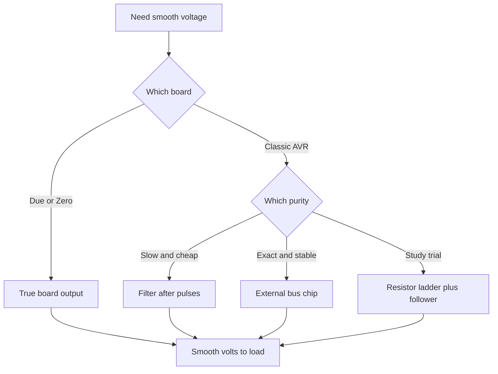

# DAC on Arduino - Missing and Workarounds

![[assets/img/arduino-dac-nema-scheme.png|600]]
*Fig. Workarounds with no DAC: filter, external chip and true outputs.*

> [!tip] Purpose of the note
> Explain the beginner shock: the classic has no back converter, but four working workarounds run from a simple filter to an exact chip.

## 1. Purpose

A digital-to-analog converter outputs smooth voltage for a program code.

Such an output serves sound, supply control, sensor offset and smooth regulators.

A classic eight-bit controller has no such node at all.

A function named analogWrite truly outputs pulses, not clean voltage.

So smooth voltage is built with workaround paths.

This note closes all workarounds: filter after pulses, external chip, true outputs of senior boards and a home-made ladder.

Path choice rests on wanted purity, speed and budget.

For LEDs pulses with no filter are enough.

For driving a circuit a smooth level is already needed.

See the pulse-mode overview in [[EN/03-GPIO/02-PWM-analogWrite.en|pulse-width modulation]].

## 2. Why the classic is empty

| Board | DAC on board | What to do |
| --- | --- | --- |
| Uno on AVR | None at all | Filter or an external chip |
| Nano on AVR | None at all | Same workarounds as its senior |
| Mega on AVR | None at all | More pins, but no converter |
| Due on ARM | Two true outputs | Write code straight to the converter |
| Zero on ARM | One ten-bit output | Enough for sound and regulators |
| Uno R4 | One output on board | Simplifies simple analog tasks |

The eight-bit core was drawn as digital logic with an analog input.

Silicon area went to memory, timers and serial blocks.

An analog output then counted as a luxury for a separate chip.

So the function got the analogWrite name, though a timer with pulses works inside.

The marketing name has confused beginners for ten years.

Pulses heat a lamp filament well and spin a motor, because inertia smooths.

But an op-amp and a measurement chain see every spike.

For such loads add a smoothing filter or a true converter.

See input voltage measurement in [[EN/06-Analog/01-ADC.en|voltage measurement]].

## 3. Pulses plus filter: smooth voltage for cents

| Element | Value | Explanation |
| --- | --- | --- |
| Carrier rate | about 490 hertz | Classic standard outputs |
| Raised rate | about 980 hertz | A pin pair runs faster |
| Filter resistor | 4.7 kiloohm | Limits capacitor charge current |
| Filter capacitor | 10 microfarad | Holds the average value |
| Cutoff rate | about 3.4 hertz | Counted by the formula below |
| Ripple | single millivolts | Falls as the capacitor grows |
| Settle time | about 100 milliseconds | The price of signal purity |

The idea is simple: pulses with the wanted duty give the wanted average.

The capacitor never discharges between pulses and holds the level.

The resistor limits current kicks and sets inertia with the capacitor.

The cutoff formula reads one over two pi R C.

Substitution gives one over six point two eight times 4700 times 0.00001.

The result is about three hertz, a hundred times below the carrier.

So ripple sinks, while a slow command passes almost lossless.

```text
Фільтр нижніх частот після виходу D9:

  вихід D9 ---- [R 4,7k] ----+---- гладенько 0-5 вольт
                             |
                            [C] 10 мкФ
                             |
                            земля

  Зріз: f = 1 / (2 * Пі * R * C) = близько 3,4 герц
  Код 0 дає 0 вольт, код 128 дає 2,5 вольт, код 255 дає 5 вольт.
  Більший конденсатор чистіше, але повільніше реагує.
```

The circuit is two parts and solders in a minute.

Feed a load only through an op-amp follower.

With no follower the load input resistance shifts the scale.

Place an electrolytic capacitor with true polarity.

A film capacitor holds exactness better but costs more.

```cpp
const int DAC_PIN = 9;

void setup() {
  pinMode(DAC_PIN, OUTPUT);
}

void loop() {
  for (int code = 0; code < 256; code++) {
    analogWrite(DAC_PIN, code);
    delay(20);
  }
  for (int code = 255; code >= 0; code--) {
    analogWrite(DAC_PIN, code);
    delay(20);
  }
}
```

The sketch slowly raises and lowers pulse duty.

After the filter the voltage walks smoothly from zero to five volts.

The saw period is about ten seconds, no ripple seen by eye.

A twenty-millisecond delay gives the filter time to settle.

Such a signal fits offset, brightness through an amplifier and slow regulators.

For sound the 490 hertz carrier is too low, a whistle is heard.

## 4. External bus chip: exact volts

| Chip | Bits | Supply | Feature |
| --- | --- | --- | --- |
| MCP4725 | 12 bit | 2.7-5.5 volts | One channel, address pin |
| MCP4728 | 12 bit | 2.7-5.5 volts | Four channels in one case |
| PCF8591 | 8 bit | 2.5-6 volts | Input and output together |
| PT8211 | 16 bit | 5 volts | Stereo for sound tasks |

An external converter talks to the board over a two-wire bus.

Twelve bits give 4096 levels instead of 256 in a filter.

The step at five-volt supply is about 1.2 millivolts.

The chip holds the output on its own, the CPU stays free for other tasks.

The bus address lets a display, a clock and memory hang nearby.

A module with a ready regulator ties to the board supply.

Bus signal lines pull to supply with resistors.

```cpp
#include <Wire.h>

const byte DAC_ADDR = 0x60;

void dacWrite(int code) {
  Wire.beginTransmission(DAC_ADDR);
  Wire.write(0x40);
  Wire.write(code >> 4);
  Wire.write((code & 0x0F) << 4);
  Wire.endTransmission();
}

void setup() {
  Wire.begin();
}

void loop() {
  for (int code = 0; code < 4096; code += 16) {
    dacWrite(code);
    delay(5);
  }
}
```

The write function packs twelve bits into three protocol bytes.

The first command byte switches fast write mode on.

The next two bytes carry the senior and junior code pieces.

The loop grows the code in sixteen-steps for a fast saw.

A five-millisecond delay makes the rise visible on a multimeter.

The bus library hides timing diagrams from the user.

Before launch check the module address with a bus scanner.

Bypass the module supply with ceramic near the pins.

## 5. Senior boards with a true output

| Board | Outputs | Bits | Range |
| --- | --- | --- | --- |
| Due | DAC0 and DAC1 | 12 bit | from 0.55 to 2.75 volts |
| Zero | one output | 10 bit | from zero to supply |
| Uno R4 | one output | 12 bit | per board manual |

The Due board carries two true converters with buffers.

The range is bound by the inner circuit, not the full supply scale.

A 4096-level resolution gives smooth sine waves with no steps.

Code writes with one write call after bit setup.

```cpp
void setup() {
  analogWriteResolution(12);
}

void loop() {
  for (int code = 0; code < 4096; code += 8) {
    analogWrite(DAC0, code);
    delayMicroseconds(50);
  }
}
```

The bit setup sets the full 4096-level scale.

The loop builds a saw in eight-steps for a fast scope view.

A fifty-microsecond pause gives a saw rate near tens of hertz.

Never load the Due output with a low-ohm speaker directly.

Output current is bound to single milliamps.

For strong sound add an amplifier or a follower.

True-output pins are signed on the board silkscreen.

## 6. Resistor ladder: overview for grasp

| Node | Parts | Sense |
| --- | --- | --- |
| Step | Two values R and 2R | Each bit weighs half less |
| Switches | Digital outputs | Tie steps to supply or ground |
| Output | Current sum | Code turns to voltage |
| Exactness | Resistor tolerance | One percent gives eight clean bits |

A ladder of two-value resistors sums bit currents into a common point.

The senior bit weighs half the scale, the next a quarter, then an eighth.

Eight outputs give 256 levels with no chip at all.

Exactness rests on resistor tolerance and switch resistance.

Plain five-percent resistors give only six honest bits.

Exact one-percent parts reach eight bits for bench trials.

```text
Ідея драбинки на вісім розрядів:

  D7 ---[2R]--+
  D6 ---[2R]--+-- ... --+--> вихід на повторювач
  ...         |         |
  D0 ---[2R]--+--[R]----+

  Код 10000000 дає половину живлення.
  Код 11111111 дає майже повне живлення.
  Повторювач ізолює драбинку від навантаження.
```

The diagram shows the principle with no exact values.

Take 10 kiloohm and 20 kiloohm from one batch for resistors.

Switch outputs together with a straight port write for purity.

Take the load from the follower output, not the sum node.

The method fits as a lesson; for a product take a ready chip.

Temperature drift spreads values and spoils junior bits.

## Mermaid: workaround choice



The diagram reads from the top: first the board, then demands.

A true output is simplest if the board has one.

A filter costs cents and works for slow tasks.

A chip gives exactness and frees the CPU.

A ladder teaches the principle but loses exactness.

## Common issues

| # | Issue | Why it is bad | Correct way |
| --- | --- | --- | --- |
| 1 | Expect clean voltage straight from analogWrite | Pulses on output, circuit rings | Add a filter or an external chip |
| 2 | Filter with a high cutoff for sound | 490 hertz carrier passes to the speaker | Raise the carrier with a timer or take a chip |
| 3 | Load straight on the filter | Input resistance splits voltage and breaks scale | Op-amp follower between filter and load |
| 4 | Chip module with no bus scan | Wrong address gives silence with no diagnostics | Bus scanner first, then working code |
| 5 | Speaker straight on the Due output | Output current is tiny, channel heats | Sound amplifier after the output |
| 6 | Ladder of mixed resistors | Value spread bends the scale | One-percent resistors from one batch plus a follower |

## Official sources

- [analogWrite on docs.arduino.cc](https://docs.arduino.cc/language-reference/en/functions/analog-io/analogwrite/) - pulse nature, rate and bit depth.
- [DAC output on the Due board on arduino.cc](https://www.arduino.cc/en/Guide/ArduinoDue) - true channels, range and write example.
- [MCP4725 module on docs.arduino.cc](https://docs.arduino.cc/hardware/mcp4725/) - bus hookup and code example.

## See also

- [[Home.en]]
- [[EN/06-Analog/01-ADC.en|voltage measurement]]
- [[EN/03-GPIO/02-PWM-analogWrite.en|pulse-width modulation]]
- [[07-Timers/01-Timeri-millis|timers and time]]
