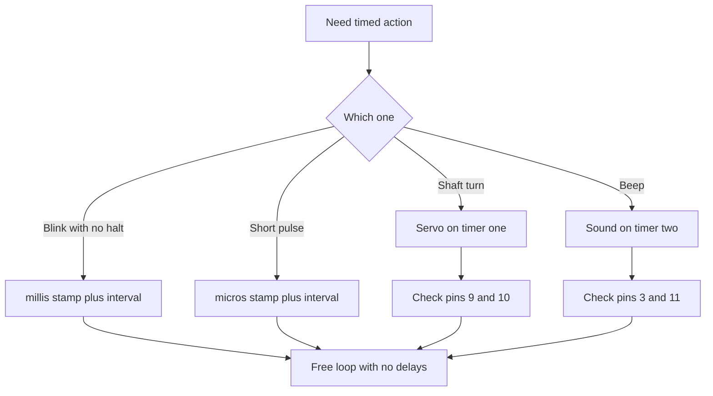

# Arduino Timers - millis Without delay

![[assets/img/arduino-timeri-scheme.png|600]]
*Fig. Timers: counters, time, servo and sound with no blocking.*

> [!tip] Purpose of the note
> Teach life with no loop halt: read the board clock, blink and beep in parallel, grasp which timers stay busy and survive overflow.

## 1. Purpose

A timer counts crystal ticks apart from the program.

The program only asks how much elapsed and plans the next event.

A delay function halts everything, a timer lets several jobs run at once.

LED blinking, button polling and speaker beeping go in parallel.

This note closes the timer map, the millisecond clock, the no-halt pattern, overflow, servo and sound.

After it sketches stop hanging on every pause.

A classic controller has three timers with distinct roles.

The zero one runs system time and a pair of pulse outputs.

The first sixteen-bit one is the most exact, servo loves it.

The second eight-bit one is given to sound and small pulses.

See the board map in [[EN/01-Hardware/01-AVR-Uno.en|classic AVR]].

## 2. Who is who: three counters

| Timer | Bits | Runs | Conflicts with |
| --- | --- | --- | --- |
| Timer0 | 8 bit | millis, micros, delay, outputs 5 and 6 | Divider change breaks the clock |
| Timer1 | 16 bit | Servo library, outputs 9 and 10 | Servo kills pulses on these pins |
| Timer2 | 8 bit | tone function, outputs 3 and 11 | Sound kills pulses on these pins |

Bit depth sets the top interval with no overflow.

An eight-bit timer counts to 255 and spins fast.

A sixteen-bit timer counts to 65535 and holds long servo pulses.

A divider slows counting at the price of exactness.

System time lives on timer zero by default.

So touching its registers with no need is forbidden.

Pulse outputs tie to timers hard at crystal level.

Moving an output to another timer is impossible.

Servo and sound libraries take a whole timer each.

Joint sound and servo on the edge are possible, but with limits.

```text
Карта зайнятості таймерів:

  Timer0 (8 біт): millis плюс micros плюс delay плюс піни D5 D6
  Timer1 (16 біт): серво плюс піни D9 D10
  Timer2 (8 біт): звук tone плюс піни D3 D11

  Зайняв серво — попрощався з імпульсами на D9 D10.
  Зайняв звук — попрощався з імпульсами на D3 D11.
```

The diagram recalls the price of each library.

Before adding servo check that pins nine and ten stay free.

Before adding sound check that pins three and eleven stay free.

Pulse modulation in detail is in [[EN/03-GPIO/02-PWM-analogWrite.en|pulse-width modulation]].

Board interrupts are described in [[EN/03-GPIO/03-Interrupts.en|board interrupts]].

## 3. millis and micros clocks

| Function | Unit | Range | Exactness |
| --- | --- | --- | --- |
| millis | millisecond | to 49 days | plus minus one unit |
| micros | microsecond | to 71 minutes | four-microsecond step |
| delay | millisecond | any pause | blocks the whole loop |
| delayMicroseconds | microsecond | to 16383 | blocks, but exact |

The millisecond function returns time since board start.

The counter spins in hardware, a call only reads the value.

Two-stamp difference gives an interval with no program halt.

Such an approach is called a non-blocking pattern.

The microsecond function gives a finer scale for short pulses.

The four-microsecond step comes from the timer divider.

Both counters overflow and restart from zero.

True unsigned-number math survives overflow on its own.

```cpp
const int LED_PIN = 13;
unsigned long previous = 0;
const unsigned long INTERVAL = 1000;
bool state = false;

void setup() {
  pinMode(LED_PIN, OUTPUT);
}

void loop() {
  unsigned long now = millis();
  if (now - previous >= INTERVAL) {
    previous = now;
    state = !state;
    digitalWrite(LED_PIN, state ? HIGH : LOW);
  }
}
```

The sketch blinks once a second with no delay at all.

The previous variable holds the last-switch stamp.

The now-minus-stamp difference gives elapsed time.

Comparison with the interval decides whether the moment came.

Updating the stamp with now keeps an even period.

The state logic flips every second.

The loop stays free for buttons, sensors and sound.

## 4. Two jobs in parallel

| Job | Period | How to plan |
| --- | --- | --- |
| Blinking | 1000 milliseconds | Separate stamp and interval |
| Button polling | 20 milliseconds | Frequent reading with bounce filter |
| Port printing | 500 milliseconds | Third stamp harms not the first |
| Sound | on event | Short beep blocks not the loop |

Each job gets its own stamp and period variables.

The loop runs top down and asks each job whether its time came.

No job waits inside itself.

Long pauses split into states with time stamps.

```cpp
unsigned long ledMark = 0;
unsigned long btnMark = 0;
bool ledState = false;

void setup() {
  pinMode(13, OUTPUT);
  pinMode(2, INPUT_PULLUP);
  Serial.begin(9600);
}

void loop() {
  unsigned long now = millis();
  if (now - ledMark >= 1000) {
    ledMark = now;
    ledState = !ledState;
    digitalWrite(13, ledState ? HIGH : LOW);
  }
  if (now - btnMark >= 20) {
    btnMark = now;
    if (digitalRead(2) == LOW) {
      Serial.println("press");
    }
  }
}
```

The LED blinks in its own rhythm, the button reads in its own.

Polling every twenty milliseconds kills contact bounce.

Printing runs only while the button stays held.

Adding a third job shrinks to copying the block with a new stamp.

Stamp memory costs tiny, four bytes per job.

Main rule: never call a long blocking delay in a fast poll loop (a short delay in the study example below - an exception, in combat code - through millis).

## 5. Overflow after 50 days

| Counter | Overflow | How to survive |
| --- | --- | --- |
| millis | about 49 days | Subtraction on unsigned numbers |
| micros | about 71 minutes | Same difference, smaller scale |
| Wrong | now greater than previous plus interval | Breaks at the overflow moment |
| Right | now minus previous greater than interval | Always works, even through zero |

Unsigned math spins in a circle with the counter.

The now-minus-old difference gives the true interval even past zero.

The plus condition breaks, because the sum overflows too.

So the single true template uses subtraction.

```text
Чому віднімання безсмертне:

  previous = 4294967290 (за 6 мс до нуля)
  now = 10 (після переповнення)
  now - previous = 16 (правильні 16 мс по колу)

  Неправильний шаблон з додаванням
  мовчить зайві 49 діб після переповнення.
```

The example shows crossing the top value.

The unsigned type drops the carry itself and leaves a true difference.

Stamp types stay always unsigned long, a signed type breaks the trick.

Interval constants stay unsigned too.

Tests with faked stamps near the top catch the error in a minute.

Long-life nodes truly live to see overflow.

Sleep with supervision is described in [[07-Timers/02-Son-WDT|sleep and watchdog]].

## 6. Servo on timer one

| Setting | Value | Explanation |
| --- | --- | --- |
| Signal period | 20 milliseconds | Hobby servo standard |
| Minimum pulse | 1000 microseconds | Zero-degree angle |
| Middle pulse | 1500 microseconds | Ninety-degree angle |
| Maximum pulse | 2000 microseconds | One-hundred-eighty-degree angle |
| Supply | separate 5-6 volt unit | Stall current to an amp |

The servo library programs the sixteen-bit timer for pulses.

The user sets only the angle, the library counts pulse width.

Servo supply runs on a separate unit with common ground.

The signal wire ties to pin nine or ten.

```cpp
#include <Servo.h>

Servo drive;

void setup() {
  drive.attach(9);
}

void loop() {
  drive.write(0);
  delay(1000);
  drive.write(90);
  delay(1000);
  drive.write(180);
  delay(1000);
}
```

The sketch swings the shaft stop to stop through the middle.

Attaching to the pin starts the timer and periodic pulses.

An angle-write command converts to pulse width.

Pauses between commands give mechanics time to reach position.

USB feeding gives sags and shaft tremble.

A separate unit with a capacitor near the servo removes jerks.

After servo attach, pulses on pins nine and ten vanish.

## 7. tone sound on timer two

| Call | Action | Note |
| --- | --- | --- |
| tone with rate | Beep of set pitch | Runs in background with no delays |
| tone with length | Beep and auto stop | Handy for signals |
| noTone | Silence | Stops generation |
| Two speakers | Only one voice | Second call beats the first |

The sound function takes timer two and makes a square wave.

Pitch sets in hertz, length in milliseconds.

With no length the beep lasts till the silence command.

A speaker ties through a hundred-ohm resistor for current limit.

A piezo emitter may hang straight, its current is tiny.

```cpp
const int BUZZER_PIN = 8;

void setup() {
  pinMode(BUZZER_PIN, OUTPUT);
}

void loop() {
  tone(BUZZER_PIN, 440);
  delay(300);
  noTone(BUZZER_PIN);
  delay(700);
  tone(BUZZER_PIN, 880, 200);
  delay(500);
}
```

The sketch gives two signals of distinct pitch in a loop.

The first beep starts with no length and mutes with the silence command.

The second beep holds a built-in two-hundred-millisecond length.

Pauses between signals keep the melody readable.

Beside the beep the loop may blink and read buttons.

The conflict with pulses on pins three and eleven stays.

So sound goes to a free pin, for example eight.

Volume trims with a resistor or duty through an amplifier.

## Mermaid: what lives on what



The diagram reads from the top: first the task, then the tool.

Blinking and polling live on the system clock.

Servo and sound take their timers whole.

A pin check saves from vanished pulses.

A free loop lets all tasks combine.

## Common issues

| # | Issue | Why it is bad | Correct way |
| --- | --- | --- | --- |
| 1 | Second-long delay inside the loop | All stands, buttons and sound mute | millis stamp with interval and no blocking |
| 2 | Compare through stamp addition | Breaks at the overflow moment | now-minus-previous-greater-than-interval template |
| 3 | Signed type for time stamps | Negative values bend the difference | unsigned long type for all stamps |
| 4 | Servo and pulses on the same pins | Library kills outputs 9 and 10 | Split servo and load across distinct pins |
| 5 | Sound and pulses on the same pins | Sound function kills outputs 3 and 11 | Beeper to a free pin, for example 8 |
| 6 | Timer zero divider change | millis clock starts lying | Never touch timer zero registers with no extreme need |

## Official sources

- [millis on docs.arduino.cc](https://docs.arduino.cc/language-reference/en/functions/time/millis/) - clock, overflow and no-delay example.
- [tone on arduino.cc](https://www.arduino.cc/reference/en/language/functions/advanced-io/tone/) - sound generation, limits and timer conflicts.
- [Servo library on docs.arduino.cc](https://docs.arduino.cc/libraries/servo/) - hookup, angles and timer-one use.

## See also

- [[Home.en]]
- [[EN/01-Hardware/01-AVR-Uno.en|classic AVR]]
- [[EN/03-GPIO/03-Interrupts.en|board interrupts]]
- [[07-Timers/02-Son-WDT|sleep and watchdog]]
