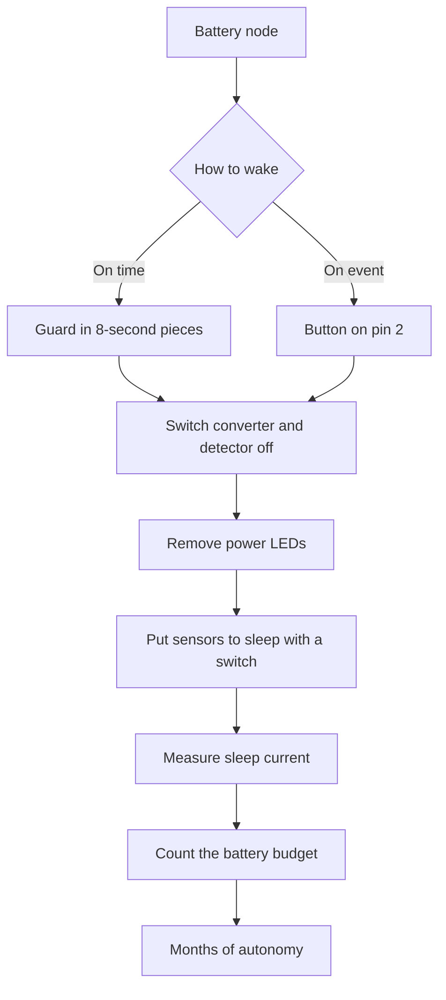

# Sleep and WDT - Battery for Months

![[assets/img/arduino-son-wdt-scheme.png|600]]
*Fig. Sleep: watchdog timer, switched-off blocks and battery budget.*

> [!tip] Purpose of the note
> Teach eight-second sleep with wake on business: cut current a thousand times, wake the board with a timer and a button, count battery months.

## 1. Purpose

An autonomous node lives from a battery, not a socket.

An active controller eats tens of milliamps even idle.

Sleep shuts the core and periphery down, leaving only the guard.

The watchdog timer wakes the board every few seconds.

The board measures, sends a packet and sleeps again.

This note closes the full loop: guard, sleep modes, saving library, wake-up, block shutdown and battery budget.

After it a node lives months instead of hours.

A classic board has a linear regulator and LEDs that eat even in sleep.

So the true board minimum sits above the bare-chip minimum.

A bare chip sleeps on fractions of a microamp, a board on hundreds of microamps.

For record terms remove LEDs and swap the regulator.

See the board overview in [[EN/01-Hardware/01-AVR-Uno.en|classic AVR]].

## 2. Watchdog timer: 8 seconds maximum

| Setting | Value | Explanation |
| --- | --- | --- |
| Purpose | Restart on hang | Separate 128 kilohertz source |
| Periods | from 15 milliseconds to 8 seconds | Picked with a divider |
| One-sleep maximum | 8 seconds | Longer pauses stack from loops |
| Exactness | plus minus ten percent | Rests on temperature |
| Guard current | about 6 microamps | Adds to sleep current |
| Wake-up | interrupt or reset | Library hides details |

The guard spins from its own source and never rests on the crystal.

So it wakes even when the main source stays stopped.

The 8 second period serves the longest sleep in one step.

A longer pause for minutes stacks from several sleeps in a loop.

Source slop is not critical for a thermometer and humidity.

For exact time add a real-time clock with an alarm.

A guard interrupt wakes the board with no program restart.

A guard reset restarts the board from the top.

The saving library sets the wanted mode with one command.

```text
Періоди сторожа і кількість кроків:

  15 мс, 30 мс, 60 мс, 120 мс, 250 мс
  500 мс, 1 с, 2 с, 4 с, 8 с (максимум)

  Хвилина сну = сім разів по 8 с плюс один раз 4 с.
  Година сну = 450 циклів по 8 с.
  Лічильник циклів тримають у змінній.
```

The diagram shows the discrete period row.

Small periods fit debugging with no long wait.

Working mode uses 8 seconds for a minimum of wake-ups.

Each wake-up eats energy, so waking often pays not.

A loop counter lets sleep run hours in eight-second pieces.

Never zero the counter variable till the big pause ends.

## 3. Sleep modes: from doze to suspended life

| Mode | What halts | Chip current | Wake-up |
| --- | --- | --- | --- |
| IDLE | core only | about 15 milliamps | any interrupt |
| ADC_NOISE_REDUCTION | core and noise | about 10 milliamps | converter and interrupts |
| POWER_SAVE | core and most clocks | hundreds of microamps | timer and outer events |
| STANDBY | almost all, fast start | tens of microamps | outer events |
| PWR_DOWN | almost all | fractions of a microamp | guard or outer event |

The deepest mode halts sources and leaves only async feeds.

Wake from deep sleep takes several milliseconds.

The program resumes where it slept, variables persist.

Periphery registers keep settings.

First after sleep check the wake cause.

For a battery node take exactly the deepest mode.

Middle modes fit mains-fed builds with fast reaction.

Current spread between edge modes reaches a hundred thousand times.

```cpp
#include <avr/sleep.h>
#include <avr/wdt.h>

void goSleep() {
  set_sleep_mode(SLEEP_MODE_PWR_DOWN);
  sleep_enable();
  sleep_mode();
  sleep_disable();
}

void setup() {
  Serial.begin(9600);
}

void loop() {
  Serial.println("work");
  delay(100);
  goSleep();
}
```

The sleep function picks the deepest mode and halts the core.

The sleep-mode call blocks till an interrupt comes.

After wake-up switch sleep off for normal work.

The guard-free example wakes only with a button.

See the full guard example in the next section.

Straight register calls show mechanics, the library simplifies routine.

## 4. Saving library: sleep with one call

| Call | Action | Period |
| --- | --- | --- |
| powerDown 8 s | Deep sleep | 8 seconds |
| powerDown 4 s | Deep sleep | 4 seconds |
| powerDown 1 s | Deep sleep | 1 second |
| idle | Light doze | till interrupt |

The LowPower library hides guard and sleep registers.

One call shuts the extra off, sleeps and turns it back on.

Before sleep the library kills the converter and the brown-out detector.

After wake-up periphery returns on its own.

```cpp
#include <LowPower.h>

const int LED_PIN = 13;

void setup() {
  pinMode(LED_PIN, OUTPUT);
}

void loop() {
  digitalWrite(LED_PIN, HIGH);
  delay(50);
  digitalWrite(LED_PIN, LOW);
  for (int i = 0; i < 7; i++) {
    LowPower.powerDown(SLEEP_8S, ADC_OFF, BOD_OFF);
  }
  LowPower.powerDown(SLEEP_4S, ADC_OFF, BOD_OFF);
}
```

The sketch blinks once a minute and sleeps the rest.

Seven eight-second loops give fifty-six seconds.

The last four-second loop tops the minute up.

Settings kill the converter and the detector for sleep time.

A fifty-millisecond flash shows to the eye and eats little.

Such a loop average current falls hundreds of times.

See battery voltage measurement in [[06-Analog/01-ADC|voltage measurement]].

The millisecond clock is described in [[07-Timers/01-Timeri-millis|timers and time]].

## 5. Wake-up: button or guard

| Source | Pin | How it works |
| --- | --- | --- |
| Guard | inside | Periodic every 8 seconds |
| Outer INT0 | pin D2 | Edge or level wakes the board |
| Outer INT1 | pin D3 | Second standalone input |
| Pin change | many pins | Any edge in the group |
| Serial port | pins D0 D1 | Start bit wakes in light modes |

A button hangs between the interrupt pin and ground.

The inner pull-up holds the level in sleep.

A falling-edge interrupt reacts to a press.

Contact bounce dies with a pause after wake-up.

```cpp
#include <LowPower.h>
#include <avr/sleep.h>

volatile bool woke = false;

void wakeUp() {
  woke = true;
}

void setup() {
  pinMode(2, INPUT_PULLUP);
  attachInterrupt(0, wakeUp, FALLING);
  Serial.begin(9600);
}

void loop() {
  if (woke) {
    woke = false;
    Serial.println("button");
    delay(50);
  }
  LowPower.powerDown(SLEEP_FOREVER, ADC_OFF, BOD_OFF);
}
```

The program sleeps forever till the button press.

The interrupt sets a flag and wakes the core.

The main loop sees the flag and handles the event.

A fifty-millisecond pause kills bounce.

The flag has volatile type, because an interrupt changes it.

Forever-sleep mode kills the guard for zero drain.

Interrupt details are described in [[EN/03-GPIO/03-Interrupts.en|board interrupts]].

## 6. What to switch off before sleep

| Block | How to kill | Saving |
| --- | --- | --- |
| ADC | ADC_OFF in the call | hundreds of microamps |
| Brown-out detector | BOD_OFF in the call | tens of microamps |
| Power LED | unsolder or cut | about a milliamp |
| Board regulator | outer pulse module | idle milliamps |
| Idle pull-ups | unplug sensors | tens of microamps each |
| Bus sensors | supply switch | sensor sleep milliamps |

The converter idle eats even with no measurements.

The brown-out detector watches supply and eats too.

Both die with sleep-call settings.

The power LED shines always while the battery lasts.

On a battery node remove it first.

The stock linear regulator eats for itself more than a sleeping chip.

An outer pulse module with small idle cuts losses.

Sensors with own sleep go to sleep by command.

Sensors with no sleep feed through a pin switch.

```text
Чекліст перед сном:

  [ ] перетворювач вимкнено параметром
  [ ] детектор просідання вимкнено параметром
  [ ] світлодіоди живлення прибрано
  [ ] датчики приспано або знеструмлено ключем
  [ ] вільні входи підтягнуто, не висять
  [ ] виміряно струм сну мультиметром
```

Walk the list before each field test.

A free input in the air catches pickup and adds microamps.

A pull-up or an output level pins each free pin down.

A current reading proves all items worked.

Seek a hope mismatch top down the list.

## 7. Current measurement and battery budget

| State | Board current | Bare-chip current |
| --- | --- | --- |
| Work | 40-50 milliamps | 10-15 milliamps |
| Board sleep | 300-800 microamps | 1-6 microamps |
| Sleep with no LEDs | 100-200 microamps | same 1-6 microamps |
| Transmit peak | to 150 milliamps | rests on the module |

Current is measured by breaking battery plus with a multimeter.

Microamp mode switches on only after sleep settles.

Keep probes short, twist supply wires as a pair.

Catch the transmit peak with a scope on a shunt.

Count average current with a time-weighted formula.

```text
Бюджет вузла: вимір раз на хвилину

  Сон:     0,2 мА протягом 59,8 с
  Робота:  40 мА протягом 0,2 с

  Середній: (0,2 * 59,8 + 40 * 0,2) / 60
          = (11,96 + 8) / 60
          = близько 0,33 мА

  Батарея 2000 мАг / 0,33 мА = 6060 годин
  Це близько 252 діб, тобто вісім місяців.
```

The math shows eight months from two amp-hours.

Battery self-discharge eats part of the stock.

Outdoor cold cuts capacity in half.

So the project holds a double margin.

A five-minute period stretches life to a year.

Shorter work through fast code helps too.

A radio module with own sleep goes to sleep between packets.

## Mermaid: path to months of work



The diagram reads from the top: first the wake cause, then shutting the extra off.

The guard gives periodic readings with no human part.

The button gives event reaction with zero idle.

Switched-off blocks cut current hundreds of times.

A current reading proves the math.

The budget shows true months of life.

## Common issues

| # | Issue | Why it is bad | Correct way |
| --- | --- | --- | --- |
| 1 | 8-second sleep with no counter | Board wakes every eight seconds and eats extra | Loop with a counter for minutes and hours |
| 2 | Converter left on | Hundreds of microamps in sleep eat the battery | ADC_OFF setting in each sleep call |
| 3 | Brown-out detector left on | Tens of microamps all the time | BOD_OFF setting in each sleep call |
| 4 | Power LED on battery | A milliamp all the time, months melt | Unsolder or cut the LED track |
| 5 | Sensors fed in sleep | Each sensor eats more than a sleeping chip | Supply switch or sensor sleep command |
| 6 | Delay instead of sleep | Tens of milliamps idle | Deep sleep with guard or button wake-up |

## Official sources

- [LowPower library on docs.arduino.cc](https://docs.arduino.cc/libraries/low-power/) - sleep modes, shutdown settings and wake examples.
- [Watchdog timer on arduino.cc](https://www.arduino.cc/en/Tutorial/Foundations/WatchdogTimer) - periods, exactness and hang restart.
- [Uno power use on docs.arduino.cc](https://docs.arduino.cc/hardware/uno-rev3/) - board currents, regulator and supply bounds.

## See also

- [[Home.en]]
- [[EN/01-Hardware/01-AVR-Uno.en|classic AVR]]
- [[07-Timers/01-Timeri-millis|timers and time]]
- [[06-Analog/01-ADC|voltage measurement]]
