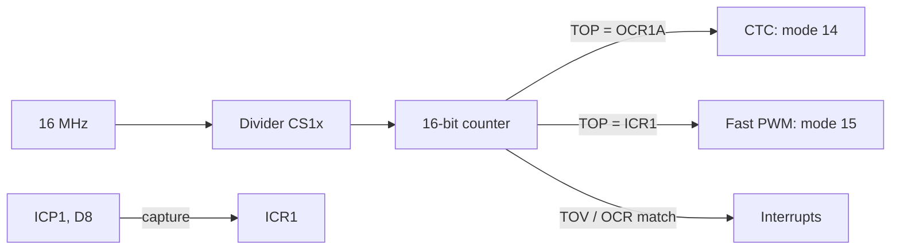

# ATmega Timers: 16-Bit Deep Dive

![[assets/img/ard-timers16-scheme.png|600]]
*Fig. Timer1: TCCR1A/B, OCR1A/B, ICR1, divider and interrupts.*

> [!tip] What this note is
> Deep dive after the overview [[07-Timers/01-Timeri-millis|Timers]]: registers, mode tables, and why `analogWrite` can break `millis()`. Platform - ATmega328P (Uno/Nano). Basic PWM: [[EN/03-GPIO/02-PWM-analogWrite.en|PWM]].

Timer 1 working chain:



*Fig. Two useful modes: CTC (clean edge) and Fast with input capture.*

## 1. Architecture: three timers, two of them 16-bit

| Timer | Bits | Channels (Uno pins) | Core purpose |
| --- | --- | --- | --- |
| Timer0 | 8 bit | OC0A (D6), OC0B (D5), T0 (D4), T1 (D5) | millis()/micros() + PWM D5/D6 |
| Timer1 | 16 bit | OC1A (D9), OC1B (D10), ICP1 (D8) | Servo() (D9/D10) + 16-bit PWM D9/D10 |
| Timer2 | 8 bit | OC2A (D11), OC2B (D3) | PWM D3/D11, tone() |

Note: the six Uno PWM pins (D3, D5, D6, D9, D10, D11) are exactly the six output compares of the three timers: D5/D6 - Timer0 (OC0B/OC0A), D9/D10 - Timer1 (OC1A/OC1B), D3/D11 - Timer2 (OC2B/OC2A). Input capture ICP1 is D8, not D5.

## 2. WGM mode (Timer1): the table to find

| WGM | Name | Top | Interrupts | PWM |
| --- | --- | --- | --- | --- |
| 0 | Normal | overflow | TOV1F | - |
| 12 | Fast PWM | 0xFFFF | OCR1A/OCR1B match, TOV1F | 8-bit |
| 14 | CTC | OCR1A | OCR1A match | 16-bit (OC1B), clean edge |
| 15 | Fast PWM | ICR1 | OCR1A/B, ICR1 match | 16-bit + input capture |

Starter pick: mode 14 (CTC, 16-bit PWM, clean edge) or mode 15 if ICP1 is needed at once.

## 3. PWM rates: table at 16 MHz

Mode 14, TOP = OCR1A:

| Divider | 16 MHz to rate (TOP = 4095, 12 bit) |
| --- | --- |
| /1 | 3874 Hz |
| /8 | 484 Hz |
| /64 | 61 Hz |
| /256 | 15 Hz |

Example: 100 Hz, TOP = 2499, divider /64 to tick 250 kHz, top 2500 to 100 Hz (12-bit resolution).

## 4. Working code: register 16-bit PWM

```cpp
// Timer1 mode 14 (CTC): 16-біт PWM на D9 (OC1A), D10 (OC1B)
void setup() {
  TCCR1A = (1 << WGM12);             // CTC, TOP = OCR1A
  TCCR1B = (1 << WGM13) | (1 << CS11); // + ділиміт /8
  OCR1A = 65535;                     // TOP
  DDRB |= (1 << PB1) | (1 << PB2);   // D9 (PB1), D10 (PB2) вивід
}

void loop() {
  static uint16_t duty = 0;
  OCR1B = duty;                      // D10: 16-бітний ШІМ (OC1B)
  duty += 100;
  delay(5);
}
```

The core already gives 16-bit `analogWrite` on D9/D10 (Timer1); D5/D6 are 8-bit (Timer0), D3/D11 - Timer2. But with registers: why, and what breaks, next.

## 5. Input capture: measure outer PWM

Mode 15 + ICPD=0, divider /64 - for outer PWM to about 100 kHz:

```cpp
// вимірювання частоти/заповнення PWM на D8 (ICP1), mode 15
volatile uint16_t per = 0, high = 0, lastHigh = 0;
ISR(TCP1_vect) {
  uint16_t t = ICR1;
  if (TINS & (1 << ICP1)) {            // у момент перехоплення піна HIGH
    if (lastHigh != 0) per = t - lastHigh;
    lastHigh = t;
  } else {                             // піна LOW
    if (lastHigh != 0) high = t - lastHigh;
  }
  TIFR = (1 << OCF1F);                 // чистимо прапорець перехоплення
}
// частота = 16e6/64 / per; заповнення = high / per * 100
```

Edge logic: count two event types (rising / falling edge), the pin state reads through `TINS`, not through `PINC` - capture fixes the moment, not the present level.

## 6. Why millis() falls: mechanism

- millis() = counter on Timer0 overflow interrupt;
- `analogWrite(9, x)` / `analogWrite(10, x)` - Timer1 (16-bit), never touches Timer0 - safe;
- but if the code itself set Timer0 for PWM / a very high rate (WGM0x, CS0x registers) - overflow runs more / less often;
- classic: "I made Timer0 PWM with /1 - and millis ran 8 times faster";
- way out: never touch Timer0 or return CS0x = /64 (as in the core).

## 7. Hands-on recipes

| Task | What to do |
| --- | --- |
| Servo with 3000 spots | Timer1 mode 14, TOP = 3999, /8 to 50 Hz, 12-bit spots |
| Encoder counter x4 | ICP1 quadrature (COMF10/COMF11) to ICNT1 automatic |
| PWM rate change on the fly | never change the divider under PWM (phase kick); change TOP in steps |
| Two standalone PWM | Timer1 (D5/D6) + Timer2 (D9/D11) - leave Timer0 to the core |

## 8. Common issues

| Symptom | Cause | Fix |
| --- | --- | --- |
| millis() runs fast | Timer0 PWM with a fine divider | Leave Timer0 to the core or return /64 |
| Servo (D9/D10) and my 16-bit PWM clash | both on Timer1 | one loop, or servo on Timer2 pins |
| OCR1A never holds TOP | WGM13/WGM12 set wrong | check TCCR1A/B against the WGM table |
| Input capture never catches | ICPD=1 (split off) / too fast divider | ICPD=0, /64, outer signal 3.3 V |
| PWM torn after sleep | timer stopped in idle mode | never enter sleep under PWM or restart after |
| PWM on D3/D11 gone after tone() | tone() grabs Timer2 (D3/D11) | set one timer to one task |

## 9. Neighbour notes

- [[07-Timers/01-Timeri-millis|Timers]] - millis, timed walks.
- [[EN/03-GPIO/02-PWM-analogWrite.en|PWM]] - analog output, pin map.
- [[EN/03-GPIO/03-Interrupts.en|Interrupts]] - attachInterrupt, EXTI.
- [[10-Sensors/08-Encoder|Encoder]] - quadrature on ICNT1.

## 9.1 Checklist before touching timers

- check who in the core uses the timer (analogWrite, Servo, tone);
- never touch Timer0 - it is millis()/micros();
- before a mode change: TCCR1A = 0; TCCR1B = 0;
- never touch D9/D10 with Servo() on them;
- input capture: ICPD=0, mode 15, divider /64;
- after sleep: set CS1x again.

## Official sources

- [ATmega328P Datasheet (Microchip, AVR-08851)](https://ww1.microchip.com/aem/cs/AVR-08851) - timers, WGM modes, registers.
- [Language Reference (Arduino docs)](https://docs.arduino.cc/language-reference/) - millis, tone, attachInterrupt.
- [Arduino Uno Rev3 pinout (Arduino docs)](https://docs.arduino.cc/hardware/arduino-uno-rev3) - D5/D6/D9/D11, timer mapping.
