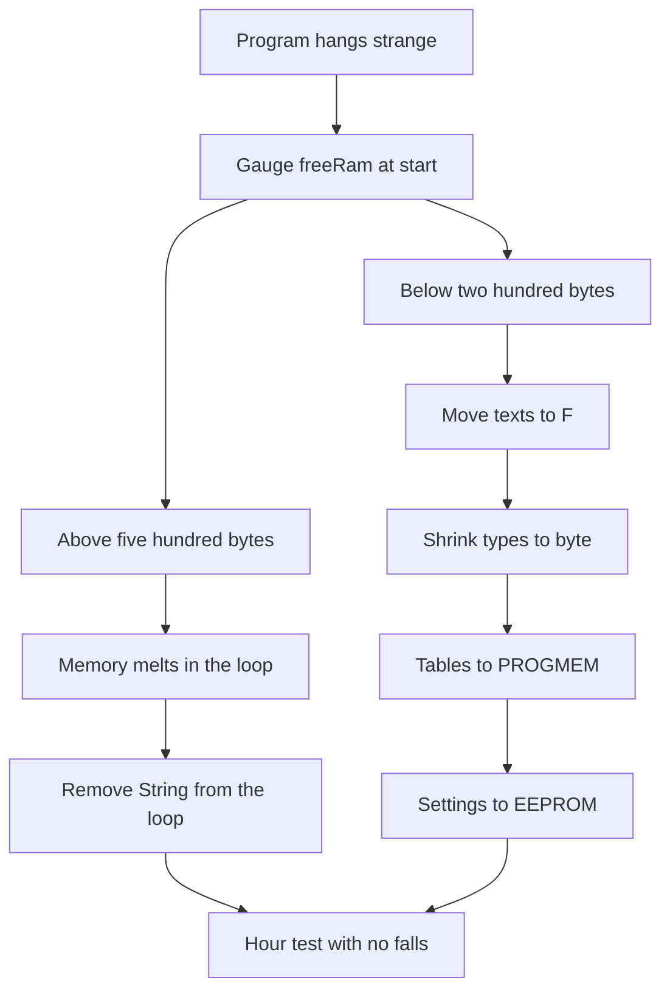

# Arduino Memory - Flash, SRAM and EEPROM

![[assets/img/arduino-memory-scheme.png|600]]
*Fig. Three board memory kinds for code, live variables and long settings.*

> [!tip] Purpose of the note
> Explain where two kilobytes of RAM vanish, how to keep settings with no battery and how to tame text strings.

## 1. Purpose

A classic Uno board holds little memory by modern measure. The program lies in 32-kilobyte flash, variables live in 2-kilobyte static memory, settings are kept by 1-kilobyte non-volatile memory. Each kind has its price and its bounds.

Flash keeps code and constants. It never erases on power-off. Writing there is possible only at flashing or with special tricks, so the plain loop never writes there. Display and network libraries eat 32 kilobytes fast.

SRAM is the desk. Variables, call stack and library buffers live there. Only 2 kilobytes, cleared at restart. Once RAM ends, the program starts acting strange. Most mystery hangs hide right here.

EEPROM holds bytes with no power for years. A node number, a sensor calibration and a trip counter go there. Size is 1 kilobyte, but it survives power-off. Rewrite count is bound, so the loop with no pause never writes there.

## 2. Uno memory map

| Kind | Uno size | What lies | Survives power-off |
| --- | --- | --- | --- |
| Flash | 32 KB | Code and constants | Yes |
| SRAM | 2 KB | Variables stack buffers | No |
| EEPROM | 1 KB | Settings counters | Yes |

For contrast the Mega board has 256 KB flash, 8 KB RAM and 4 KB non-volatile. So a big project with a display and a network often moves there. But saving tricks match for both boards.

```text
Розподіл памяті в голові:
  Flash 32К  [код ######........][тексти ####....][вільно ....]
  SRAM 2К    [глобальні ##][буфер Serial ##][стек ##][купа #][вільно .]
  EEPROM 1К  [адреса вузла][калібрування][лічильник][вільне місце]

  Правило: тексти у флеш, змінні мінімальні, EEPROM лише для налаштувань
```

## 3. Who eats RAM

| Consumer | How much it takes | How to spot |
| --- | --- | --- |
| Serial.print strings in quotes | Each symbol one SRAM byte | Many texts and sudden reboots |
| Serial buffer | 64 bytes receive and 64 transmit | Built into the core |
| Display library | Hundreds of bytes per frame | Display plus network already a risk |
| int arrays | Two bytes per item | A hundred items already a tenth of memory |
| Recursion and deep calls | Stack grows down | Hangs in random spots |
| String objects | Heap splitting | Works an hour then falls |

The main enemy is text strings. Each quoted print the compiler by default copies from flash to RAM at start. Ten hint screens eat a quarter of memory before the first reading. The F macro and the PROGMEM table cure it.

The second enemy is int type where a byte fits. A pin number, a button state and a node address live calm in byte or uint8_t. A hundred-int array weighs two hundred bytes, a hundred-byte array only a hundred.

## 4. PROGMEM and the F macro for texts

| Trick | Code | Effect |
| --- | --- | --- |
| Print from flash | Serial.print(F("Hello")) | String never copies to SRAM |
| String table | const char text[] PROGMEM | Big texts live in flash |
| Number tables | const uint16_t table[] PROGMEM | Calibration with no SRAM cost |
| Byte reading | pgm_read_byte_near | Fetch a symbol from flash |
| Word reading | pgm_read_word_near | Fetch a number from the table |

The F macro wraps only the string at the print spot. Write Serial.println(F("Done")) instead of Serial.println("Done"). Outside no difference, inside tens of bytes saved per print. For a twenty-item menu that is already hundreds of bytes.

Big tables declare with the PROGMEM keyword. Then the array lies in flash, read with pgm_read functions. Slightly longer code, but RAM breathes free.

## 5. EEPROM and the EEPROM library

| Function | Action | When to take |
| --- | --- | --- |
| EEPROM.read | Read a byte | Settings load at start |
| EEPROM.write | Write a byte always | Rare writes |
| EEPROM.update | Write only if changed | Menu settings, saves resource |
| EEPROM.put | Write a struct | Calibration in one pass |
| EEPROM.get | Read a struct | Program start |

Non-volatile memory holds a bound near a hundred thousand writes per cell. So the loop writes only on change and with a pause. The update function itself checks the old value and never grinds the cell in vain.

A settings struct stays with a check mark. First byte a magic number, then fields. At start read the struct, check the mark. A mismatched mark means empty memory, so factory values step in.

```text
ASCII карта EEPROM вузла:
  Адреса 0   : магічне число 0xA5
  Адреса 1   : номер вузла від 1 до 250
  Адреса 2-3 : калібрування температури int16
  Адреса 4-5 : лічильник спрацювань uint16
  Адреса 6+  : вільне місце під журнал

  Запис лише при зміні через update або put
```

## 6. Free-RAM measurement

```cpp
int freeRam() {
  extern int __heap_start;
  extern int *__brkval;
  int v;
  int heap = (int)__brkval;
  if (heap == 0) {
    heap = (int)&__heap_start;
  }
  int stack = (int)&v;
  return stack - heap;
}

void setup() {
  Serial.begin(9600);
  Serial.print(F("Free RAM: "));
  Serial.println(freeRam());
}

void loop() {
  Serial.print(F("Loop free: "));
  Serial.println(freeRam());
  delay(2000);
}
```

The function gauges the gap between heap and stack. Call it at start and in suspect spots. If the number sinks each round, memory leaks somewhere. Most often guilty are F-less strings or String objects in the loop.

A small-node norm is several hundred free bytes. Below two hundred is the red zone. In the red zone remove texts, shrink buffers, move arrays to bytes.

## 7. Settings sketch with EEPROM

```cpp
#include <EEPROM.h>

struct NodeCfg {
  byte magic;
  byte nodeId;
  int16_t tempCorr;
  uint16_t counter;
};

NodeCfg cfg;

void loadCfg() {
  EEPROM.get(0, cfg);
  if (cfg.magic != 0xA5) {
    cfg.magic = 0xA5;
    cfg.nodeId = 7;
    cfg.tempCorr = 0;
    cfg.counter = 0;
    EEPROM.put(0, cfg);
  }
}

void setup() {
  Serial.begin(9600);
  loadCfg();
  cfg.counter++;
  EEPROM.put(0, cfg);
  Serial.print(F("Node "));
  Serial.println(cfg.nodeId);
  Serial.print(F("Boot "));
  Serial.println(cfg.counter);
}

void loop() {
}
```

At first start the struct fills with factory values. Each next start the boot counter grows. The node number and the temperature fix change with a separate port command and store through put.

## 8. Step-by-step tuning

First move all print strings to the F macro. Five minutes of work and hundreds of saved bytes. Then look at variable types. Counters to 255 move to byte, flags to bool.

Next remove String from the loop. Concatenation each round crumbs the heap. A fixed-size char array and snprintf take its place. Works longer with no restarts.

Shrink library buffers only after reading the manual. Blind cuts break packet receive. Better to drop one extra library than to cut a working buffer.

## Mermaid: memory diagnostics



The diagram reads top down. First gauge, then fast wins through F and types, then heavy guns with PROGMEM. Leaks go down a separate branch through repeat gauges.

## Common issues

| # | Issue | Why it is bad | Correct way |
| --- | --- | --- | --- |
| 1 | Strings with no F macro | Each print eats SRAM to reboot | Serial.print with F for all fixed texts |
| 2 | String objects in the loop | Heap splitting and an hourly fall | char array and fixed-size snprintf |
| 3 | int arrays for small numbers | Twice the memory cost | byte and uint8_t types where they fit |
| 4 | EEPROM write each round | Cells wear in days | update function and write only on change |
| 5 | Deep recursion | Stack meets heap | Loops instead of recursion, flat calls |
| 6 | Two heavy libraries together | Memory already short at start | One function one module or a Mega board |

## Official sources

- [Arduino EEPROM library reference](https://docs.arduino.cc/learn/built-in-libraries/eeprom/) - read write update put get functions and examples.
- [Arduino PROGMEM guide](https://docs.arduino.cc/learn/programming/memory-guide/) - flash memory, SRAM, F macro and tables.

## See also

- [[Home.en]]
- [[05-Radio/01-LoRa-moduli|long-range radio]]
- [[13-Power-Modules/02-Level-Shift-TP4056|levels and charge]]
- [[EN/01-Hardware/01-AVR-Uno.en|classic AVR]]
- [[EN/04-Interfaces/01-UART.en|serial port]]
- [[13-Power-Modules/01-Buck-peretvoryuvach|pulse power supply]]
