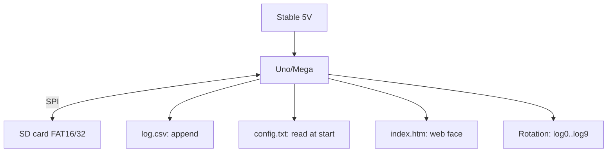

# Arduino SD Cards Deep Dive - FATFS, Logs and Web Pages

![[assets/img/ard-sd-fatfs-deep-scheme.png|600]]
*Fig. Card as a disk: logs append, pages read, power never breaks mid-write.*

> [!tip] What this note is
> SD-topic depth: not "write a string", but logs for years, web face from the card, rotation and survival. Base: [[08-Memory/01-Pamyat-EEPROM|EEPROM memory]], [[12-Comm-Modules/06-Ethernet-W5500-Deep|Ethernet shield]].

## 1. Goal

Make the card a trusted disk:

- SD library: files, folders, 8.3 quirks;
- ring logs with rotation with no PC part;
- web pages and configs from the card;
- wear: why cards die and how to delay it;
- power: a write never survives sags.

| Action | Speed | Note |
| --- | --- | --- |
| 50 B string write | about 5 ms | buffer it! |
| 2 KB page read | about 10 ms | ok for web |
| Open/close | about 20 ms | never yank in the loop |
| Folder listing | slow | cache it |

## 2. Data architecture



Open the log file once at start, write with `flush()` once a minute, close before power-off.

## 3. SD module pinout

| SD signal | Uno pin | Note |
| --- | --- | --- |
| MOSI/MISO/SCK | D11/D12/D13 | hardware SPI |
| CS | D4 (shield) / D10 (module) | pick one! |
| VCC | 5V (module with LDO) | bare slots - 3.3V |
| GND | common | - |
| CD (detect) | D8 (optional) | card pulled out |

Bare microSD slots with no level shifter - only 3.3V supply and logic! Modules with LDO/level shifter - 5V ok.

## 4. 8.3 names and coding

- short names: `LOG00001.CSV`, not long native names;
- native script in names - a library lottery, avoid;
- one `/logs` folder, not a hundred files in root;
- date in the name: `240106.csv` (YYMMDD);
- config - plain `key=value`, a 20-line parser.

## 5. Working code (C, Arduino)

```cpp
#include <SPI.h>
#include <SD.h>

File logf;
char fname[] = "/logs/000000.csv";
int fidx = 0;

void next_log() {
  if (logf) logf.close();
  fidx = (fidx + 1) % 10;
  snprintf(fname + 6, 7, "%06d", fidx);
  SD.remove(fname);
  logf = SD.open(fname, FILE_WRITE);
}

void setup() {
  Serial.begin(115200);
  SD.begin(10);
  SD.mkdir("/logs");
  next_log();
  logf.println("ts,temp,hum");
}

void loop() {
  static unsigned long t0 = 0, w0 = 0;
  if (millis() - t0 > 5000) {
    t0 = millis();
    logf.print(millis() / 1000);
    logf.print(',');
    logf.print(analogRead(A0) * 0.488);
    logf.print(',');
    logf.println(analogRead(A1) * 0.488);
  }
  if (millis() - w0 > 60000) {
    w0 = millis();
    logf.flush();
  }
  if (Serial.available() && Serial.read() == 'R') {
    next_log();
  }
}
```

10-file rotation: an `R` command from the monitor starts a new one. Old files wipe in a circle - the card never overfills.

## 6. Working code (MicroPython)

```python
# MicroPython: кільцевий логер на SD по SPI
import time
import machine
import sdcard
import uos

spi = machine.SPI(1, baudrate=4000000,
                  sck=machine.Pin(10),
                  mosi=machine.Pin(11),
                  miso=machine.Pin(12))
sd = sdcard.SDCard(spi, machine.Pin(13))
uos.mount(sd, '/sd')

idx = 0

def next_log():
    global idx
    idx = (idx + 1) % 10
    return open(f'/sd/log{idx:02d}.csv', 'w')

logf = next_log()
logf.write('ts,adc0,adc1\n')

while True:
    a0 = machine.ADC(26).read_u16() >> 6
    a1 = machine.ADC(27).read_u16() >> 6
    logf.write(f'{time.time()},{a0},{a1}\n')
    logf.flush()
    time.sleep(5)
```

The `sdcard` module - in firmwares with SD support or as a separate file. Short files, Latin, no native script in names.

## 7. Card endurance

- Endurance cards (video watch) live several times longer;
- writes in packs, not byte by byte (512 B buffer);
- file rotation spreads wear;
- never pull out mid-write (LED mark!);
- a spare card with an image nearby.

## 8. Common issues

| Symptom | Cause | Fix |
| --- | --- | --- |
| `init failed` | wrong CS / speed | CS per module, start from 4 MHz |
| Native script in names | FAT coding | only Latin and digits |
| Zero file after reboot | no flush/close | flush each minute, close before sleep |
| Card dies in a month | each-second write with no rotation | packs + rotation + Endurance |
| 5V on a bare slot | module with no level shifter | only 3.3V or a module with LDO |
| Brakes on listing | hundreds of files in root | folders + rotation |

## 9. Fast SD cheat sheet

- one CS on the bus, never mix up;
- 8.3 names in Latin;
- flush each minute, close before sleep;
- 10-file rotation in a circle;
- Endurance cards for loggers.

## 10. Neighbour notes

- [[08-Memory/01-Pamyat-EEPROM|EEPROM memory]] - small data with no card.
- [[12-Comm-Modules/06-Ethernet-W5500-Deep|Ethernet shield]] - web from the card.
- [[16-Projects/04-Loger-SD|SD logger]] - ready project.
- [[EN/04-Interfaces/02-SPI.en|SPI bus]] - card transport.
- [[Home.en|main map]] - full navigation.

## Official sources

- [SD library (arduino-libraries, GitHub)](https://github.com/arduino-libraries/SD) - file API, examples.
- [Ethernet Shield Rev2 (Arduino docs)](https://docs.arduino.cc/hardware/ethernet-shield-rev2/) - shield SD slot.
- [Language Reference (Arduino docs)](https://docs.arduino.cc/language-reference/) - SD, SPI, strings.
