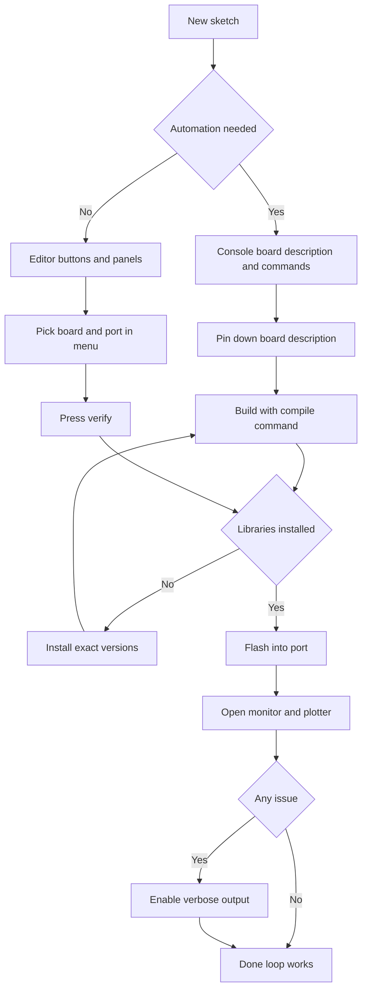

# IDE and CLI - Building Sketches

![[assets/img/arduino-ide-cli-scheme.png|600]]
*Fig. Sketch build flow: environment, console, board, port, monitor.*

> [!tip] Purpose of this note
> Explains the full sketch build cycle from board and port choice to firmware upload, port monitor reading, and automatic checks through the console.

## 1. Purpose

This note explains how to build and flash a sketch in two ways: with the graphical editor and with the console utility. After reading, the reader confidently picks a board and a port, understands what a board description is, builds an example with commands, and reads verbose output when a build fails.

The graphical editor suits daily work, edits, and viewing data from the board. The console utility repeats the same actions with commands, so it is used for scripts, example checks, and build servers. Both paths use the same board cores, libraries, and port settings.

Related topics: editor choice complements the overview in [[EN/00-Start/05-Environment-Choice.en|environment choice]], and flashing through the bootloader is covered in [[EN/09-Firmware/02-Bootloader-AVRDUDE.en|bootloader and avrdude]]. For practice you need [[EN/01-Hardware/01-AVR-Uno.en|classic AVR]] or a board from [[EN/01-Hardware/02-Nano-Mega.en|compact and legs]].

## 2. First- and Second-Branch Editor

The first-branch editor is light, fast, and predictable, and it works well on weak computers. The second branch has a modern code editor, tabbed panels, autocompletion, go-to-definition, a built-in plotter, and a debugger for supported boards. Sketches are fully compatible between branches; you can open the same folder in turn.

| Parameter | IDE 1.x | IDE 2.x |
| --- | --- | --- |
| Window | Simple single window | Panels, tabs, navigator |
| Autocompletion | Simple hints | Smart signature hints |
| Tabs | Sketch tabs | Sketch tabs plus panels |
| Port monitor | Separate window | Tab next to code |
| Plotter | Separate window | Tab with graphs |
| Board manager | Separate window | Side panel with search |
| Library manager | Separate window | Side panel with versions |
| Debugger | External tools | Built-in for some boards |
| For whom | Weak computers | Daily work and learning |

```text
Що обрати новачку:
   Слабкий компʼютер .............. перша гілка
   Щоденна робота .................. друга гілка
   Довгий проект з бібліотеками .... друга гілка
   Перевірка чужого прикладу ....... будь-яка гілка
   Скетчі відкриваються в обох гілках без змін.
```

Useful details of the second branch: autocompletion by name start, fast file search, issue highlighting before the build, and a list of recent boards and ports in the top panel. Tabs keep code, monitor, and plotter side by side with one-press switching.

## 3. Board and Port Choice

Before the first build, pick the exact board model and the port it is connected to. The board sets the core, compiler, memory size, and flash script, while the port sets where the finished file goes. If the board is picked wrong, the sketch may build but never start, or flashing fails at once with an access issue.

| Step | Action | Explanation |
| --- | --- | --- |
| Connection | Connect the board with a data cable | Wait for a new port to appear |
| Board | Pick the model in the board menu | For starters take the classic board |
| Port | Pick the new port in the port menu | The port appears after connection |
| Check | Press verify | Compile without flashing the board |
| Flash | Press the arrow | Build and write into the board |
| Monitor | Open the monitor | Check the startup lines |

```text
Якщо порту нема в списку:
   1. Спробувати інший кабель з лініями даних.
   2. Перевірити драйвер перетворювача порту.
   3. Подивитися список портів до і після підключення.
   4. На платах з двома портами дочекатися другого порту.
   5. Перезапустити редактор і оновити список портів.
```

Tip for stable work: label cables that surely carry data, because some cheap cables carry power only. Remember the port by device name rather than by number, because the number may change after reconnection.

## 4. Board Description and Console Build

The console utility performs the same actions as the editor buttons: core installation, compilation, flashing, library work, and monitoring. The key item is the board description: a three-part string of vendor, architecture, and board separated by colons, plus settings separated by commas. Without an exact description, the build either targets the wrong board or refuses to start at all.

| Command | Purpose | When to call |
| --- | --- | --- |
| core update-index | Refresh the core catalog | Before installing a new core |
| core install | Install a family core | Once per family |
| core list | List installed cores | Check core versions |
| board list | List connected boards | When the board port is not visible |
| board details | Board description details | When the exact description and options are needed |
| lib install | Install a library | Before the first project build |
| lib list | List libraries | Check dependency versions |
| compile | Compile the sketch | Check code without flashing |
| upload | Flash the board | After a successful compile |
| monitor | View the port | Debug data exchange |

```text
Формат опису плати словами:
   виробник : архітектура : плата : опції
   Приклад для класики:
     arduino : avr : uno
   Приклад з опціями процесора:
     arduino : avr : nano : cpu = atmega328old
   Опції дізнаватися через board details.
```

```bash
  # Оновлення каталогу і встановлення ядра класики
arduino-cli core update-index
arduino-cli core install arduino:avr

  # Перевірка що плату видно
arduino-cli board list

  # Деталі опису плати і доступних опцій
arduino-cli board details --fqbn arduino:avr:uno

  # Компіляція без прошивки
arduino-cli compile --fqbn arduino:avr:uno Blink

  # Прошивка у вказаний порт
arduino-cli upload -p /dev/ttyUSB0 --fqbn arduino:avr:uno Blink
```

Store the board description in the project file or in the build script so that all members build identically. For a board with processor variants, old and new bootloader, the description differs by option, so a network example without the option may not build.

## 5. Libraries Through the Console

A library is ready-made code for a sensor, display, or communication module, with examples. The graphical manager and the console install libraries from the same catalog, so versions match. For a repeatable build, pin the version explicitly so an update on another computer does not break the project.

| Command | Purpose | Use example |
| --- | --- | --- |
| lib search | Search by name | Find a sensor driver |
| lib install | Install with version | Install the exact project version |
| lib list | Installed libraries | Check what is installed now |
| lib upgrade | Upgrade | Update after checking the build |
| lib uninstall | Remove | Drop extras before release |

```bash
  # Пошук бібліотеки за назвою датчика
arduino-cli lib search DHT sensor

  # Встановлення точної версії для відтворюваності
arduino-cli lib install "DHT sensor library@1.4.4"

  # Список встановленого
arduino-cli lib list

  # Компіляція скетчу з бібліотекою
arduino-cli compile --fqbn arduino:avr:uno SensorDemo
```

```text
Порядок підключення датчика:
   1. Знайти бібліотеку за назвою в каталозі.
   2. Поставити точну версію і записати її в нотатку.
   3. Відкрити приклад з бібліотеки і зібрати без змін.
   4. Прошити приклад і перевірити дані в моніторі.
   5. Перенести потрібне у свій скетч.
```

Manual copying of library folders from the network is left for the extreme case with no catalog access. Then the folder goes next to the project and the version is documented, otherwise nobody reproduces the build.

## 6. Port Monitor and Plotter

The port monitor shows board text and lets you send commands back. The plotter draws graphs of board numbers, handy for sensors, regulators, and cycle rhythm checks. Both demand the same speed in the sketch and on the computer, otherwise garbage replaces text.

| Tool | What it shows | When to take |
| --- | --- | --- |
| Monitor | Text lines | Event log, control commands |
| Plotter | Number graphs | Sensor signals, cycle rhythm |
| Speed | Baud in both places | Values must match |
| Line ending | Termination symbols | Tune to the sketch parser |
| Port | Busy resource | Close the monitor before flashing |

```cpp
// Демо для монітора і плотера
// В моніторі видно текст в плотері видно числа

const int LED_PIN = 13;  // Вивід вбудованого світлодіода
int count = 0;           // Лічильник циклів

void setup() {
  pinMode(LED_PIN, OUTPUT);  // Вивід працює як вихід
  Serial.begin(9600);        // Швидкість має збігатися з монітором
  Serial.println("Monitor demo start");  // Мітка старту
}

void loop() {
  digitalWrite(LED_PIN, HIGH);  // Вмикаємо світлодіод
  Serial.print("LED ON count ");  // Текст для монітора
  Serial.println(count);          // Число для плотера теж видно
  delay(500);                     // Пауза пів секунди
  digitalWrite(LED_PIN, LOW);     // Вимикаємо світлодіод
  Serial.print("LED OFF count ");  // Текст для монітора
  Serial.println(count);           // Число для плотера
  delay(500);                      // Пауза пів секунди
  count = count + 1;               // Крок лічильника
}
```

```bash
  # Монітор через консоль з явною швидкістю
arduino-cli monitor -p /dev/ttyUSB0 --config baudrate=9600

  # Вихід з монітора клавішами Ctrl+C
  # Перед прошивкою монітор обовʼязково закрити
```

```text
Перевірка звʼязку словами:
   1. Прошити демо і відкрити монітор на 9600.
   2. Побачити рядок Monitor demo start.
   3. Побачити чергування ON OFF з лічильником.
   4. Відкрити плотер і глянути пилу чисел.
   5. Нема тексту значить не та швидкість.
```

For the plotter it is handy to print numbers only, separated by commas with no words, so each curve draws separately. For the monitor, add words, time labels, and state instead, so a human reads the log.

## 7. Verbose Output for Debugging

When a build or a flash fails, the first step is verbose output. Verbose mode shows full compiler commands, core and library paths, memory size, and the full flash log. Copy this log into the issue report, because without it the cause usually stays unknown.

| Situation | What to enable | Where to look |
| --- | --- | --- |
| Compile issue | Verbose compile output | First red issue at the top |
| Flash issue | Verbose upload output | Write lines and board replies |
| Wrong size | Memory report | flash and RAM lines after the build |
| Library conflict | Library paths | Which folder is really used |
| Wrong board description | Description line | Whether the board matches the connected one |

```bash
  # Компіляція з докладним виводом
arduino-cli compile --fqbn arduino:avr:uno --verbose Blink

  # Прошивка з докладним виводом
arduino-cli upload -p /dev/ttyUSB0 --fqbn arduino:avr:uno --verbose Blink

  # Тільки звіт про памʼять без зайвого шуму
arduino-cli compile --fqbn arduino:avr:uno Blink
```

```text
Як читати докладний журнал:
   1. Гортати зверху до першої помилки.
   2. Дивитися шлях файла і номер рядка.
   3. Дивитися яка бібліотека реально взята.
   4. Дивитися розмір flash і RAM внизу.
   5. Копіювати повний текст у звіт.
```

In the graphical editor, verbose output is enabled in settings with two flags, separately for compilation and upload. After enabling, a black window with the full log appears at the bottom, and its contents can be copied with a button.

## 8. Automatic Example Checks

A build server is a windowless computer that builds all examples after every change. It installs the console utility, installs cores, installs libraries, and walks every sketch with the compile command. If at least one example fails to build, the change is rejected. This approach catches broken paths, a forgotten library, and an example for the wrong board.

```bash
  # Мінімальний сценарій перевірки на сервері
arduino-cli core update-index
arduino-cli core install arduino:avr
arduino-cli lib install "DHT sensor library@1.4.4"

  # Збірка кожного прикладу окремо
arduino-cli compile --fqbn arduino:avr:uno examples/Blink
arduino-cli compile --fqbn arduino:avr:uno examples/SensorDemo
arduino-cli compile --fqbn arduino:avr:nano:cpu=atmega328old examples/SensorDemo
```

```cpp
// Blink для перевірки збирання
// Мінімум залежностей максимум користі

const int LED_PIN = 13;  // Вивід світлодіода

void setup() {
  pinMode(LED_PIN, OUTPUT);  // Налаштування виходу
  Serial.begin(9600);        // Журнал для монітора
  Serial.println("Blink build ok");  // Мітка вдалої прошивки
}

void loop() {
  digitalWrite(LED_PIN, HIGH);  // Вмикаємо
  delay(500);                   // Пауза
  digitalWrite(LED_PIN, LOW);   // Вимикаємо
  delay(500);                   // Пауза
}
```

```text
Каркас сценарію перевірки:
   1. Поставити утиліту і ядра за списком.
   2. Поставити бібліотеки точних версій.
   3. Зібрати кожен приклад з явним описом плати.
   4. Зберегти журнали збірок як доказ.
   5. Не прошивати плату на сервері тільки компілювати.
```

Flashing on the server is usually unneeded because no board is attached there; compilation is enough. Flashing stays at the workplace where the board is connected to the port. The split is simple: the server compiles, the workplace flashes.

## 9. Mermaid: Build Path



## Common Issues

| # | Issue | Why it is bad | Correct way |
| --- | --- | --- | --- |
| 1 | Wrong board picked | Firmware does not stick or the board stays silent | Pick the exact model and check the board description |
| 2 | Board description lacks the processor option | Example builds for another chip | Append the option after the colon as in board details |
| 3 | Monitor left open | Port busy, flashing never starts | Close the monitor before every flash |
| 4 | Mismatched port speed | Garbage instead of text in the monitor | Set the same speed in the sketch and in the monitor |
| 5 | Library without version | Another computer gets other code | Install with an explicit version and record it |
| 6 | Build without verbose output | Issue cause unknown | Enable verbose output and read the first issue |
| 7 | Power-only cable | Port never appears, board never flashes | Take a data-lines cable and check the port list |

## Official Sources

- [Arduino IDE documentation](https://docs.arduino.cc/software/ide/) - editor installation, board and port choice, monitor, plotter.
- [Arduino CLI documentation](https://docs.arduino.cc/arduino-cli/) - compile, upload, library, and monitor commands, board description.
- [Getting started with Arduino CLI](https://docs.arduino.cc/arduino-cli/getting-started/) - environment download, library catalog, news, and help.

## See Also

- [[Home.en]]
- [[EN/00-Start/05-Environment-Choice.en|environment choice]]
- [[EN/01-Hardware/01-AVR-Uno.en|classic AVR]]
- [[EN/01-Hardware/02-Nano-Mega.en|compact and legs]]
- [[EN/09-Firmware/02-Bootloader-AVRDUDE.en|bootloader and avrdude]]
