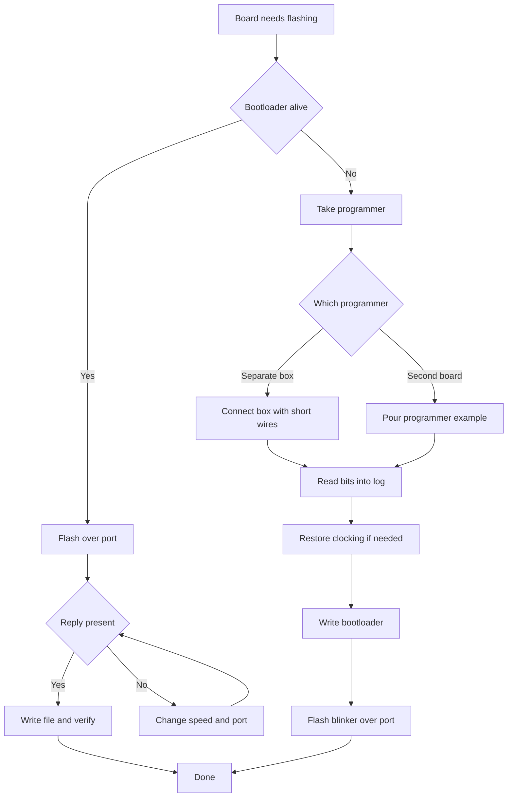

# Bootloader and avrdude - AVR Flashing

![[assets/img/arduino-bootloader-scheme.png|600]]
*Fig. Flashing flow: bootloader, reset, utility, programmer, config bits.*

> [!tip] Purpose of this note
> Explains how a board flashes with no external programmer, what auto-reset does, how to read and write memory with the console utility, and how not to brick a board with config bits.

## 1. Purpose

This note explains two paths for writing a program into the chip: the normal one through the bootloader over the port, and the service one through separate lines with a programmer. After reading, the reader understands why the board restarts itself before flashing, can read and write memory and config bits with the console utility, makes a backup before changes, and revives a board with a wiped bootloader.

Normal flashing from the previous note on [[EN/09-Firmware/01-IDE-CLI.en|environment and CLI]] uses this very reset-and-bootloader mechanism inside. For practice you need [[EN/01-Hardware/01-AVR-Uno.en|classic AVR]] or a board from [[EN/01-Hardware/02-Nano-Mega.en|compact and legs]], and the flashing-path choice complements [[EN/00-Start/05-Environment-Choice.en|environment choice]].

## 2. How Auto-Reset and the Bootloader Work

The bootloader is a small program at the end of memory that first takes control after reset. It listens to the port for a short time, and if firmware comes from the computer, it accepts it and writes it into main memory. If no firmware comes, it hands control to the main program. So the board performs a short reset with a signal from the port converter before every flash.

| Stage | What happens | How long it lasts |
| --- | --- | --- |
| Port open | Converter pulls the reset line | A fraction of a second |
| Pause | Chip restarts | Tens of milliseconds |
| Bootloader window | Listens to the port, waits for commands | About a second |
| Write | Accepts blocks and writes them to memory | Seconds, depends on size |
| Start | Jump to the main program | Right after the write |
| Run | Main program spins | Until the next flash |

```text
Часова схема прошивки словами:
   компʼютер відкриває порт
     -> лінія скидання смикається
       -> кристал перезапускається
         -> завантажувач слухає порт
           -> йдуть блоки прошивки
             -> запис у памʼять
               -> старт основної програми
   Якщо порт відкрив монітор без прошивки:
     плата просто перезапуститься і стартує стару програму.
```

Signs of a live bootloader: the LED on pin thirteen blinks several times after reset, the port appears at once, and flashing starts with no sync issues. If silence follows reset and flashing fails with a reply issue, the bootloader is likely wiped, or the wrong port and speed are picked.

## 3. Console Memory-Write Utility

The graphical flash button calls the console utility inside with ready-made parameters. A direct call gives more control: memory read into a file, separate area writes, config-bit checks, and programmer work. The base set is config, programmer, port, speed, chip, and memory operations.

| Operation | Purpose | When needed |
| --- | --- | --- |
| flash read | Dump firmware into a file | Backup before experiments |
| flash write | Pour a file into the chip | Flashing without the editor |
| flash verify | Compare file and chip | After a power issue during the write |
| eeprom read | Dump settings | Move settings to another board |
| eeprom write | Pour settings | Restore after erase |
| bit read | View config | Before any bit change |
| bit write | Change clocking, protection | Only with a backup |

```bash
  # Перевірка доступності утиліти
avrdude -v

  # Читання прошивки у файл для резерву
avrdude -c arduino -p atmega328p -P /dev/ttyUSB0 -b 115200 -U flash:r:backup.hex:i

  # Запис прошивки з перевіркою
avrdude -c arduino -p atmega328p -P /dev/ttyUSB0 -b 115200 -U flash:w:firmware.hex:i

  # Читання енергонезалежної памʼяті у файл
avrdude -c arduino -p atmega328p -P /dev/ttyUSB0 -b 115200 -U eeprom:r:eeprom_backup.hex:i

  # Запис енергонезалежної памʼяті
avrdude -c arduino -p atmega328p -P /dev/ttyUSB0 -b 115200 -U eeprom:w:settings.hex:i
```

```text
Розбір параметрів словами:
   -c arduino ........ тип програматора завантажувач на платі
   -p atmega328p ..... модель кристала класичної плати
   -P порт ........... порт до якого підключена плата
   -b швидкість ...... швидкість обміну із завантажувачем
   -U область ........ дія читання запис перевірка
   Формат i наприкінці означає текстовий файл у шістнадцятковому вигляді.
```

For the classic board take the arduino programmer, your own port from the port list, speed one hundred fifteen thousand two hundred for the new bootloader, and fifty seven thousand six hundred for the old Nano variant. If no reply comes, change the speed first, not the board.

## 4. Config Bits: Meaning and Backup

Config bits are three bytes that set clocking, the clock source, the startup delay, the bootloader area size, and erase protection. They are written separately from firmware and act at once, so one wrong digit can stop the chip. The golden rule: first read and record all three bytes in a note, then change one bit at a time and check the start at once.

| Byte | What it covers | Typical values for the classic |
| --- | --- | --- |
| Low | Clock divider, clock source, start time | Crystal, delayed start, no divider |
| High | Bootloader area size, reset permit, memory protection | Two-thousand-byte bootloader, reset permitted |
| Extended | Power-supervisor threshold | Threshold for the board supply |
| Protection | See the next section | Factory open for development |

```bash
  # Читання всіх бітів перед будь-якими змінами
avrdude -c arduino -p atmega328p -P /dev/ttyUSB0 -b 115200 -U lfuse:r:-:h -U hfuse:r:-:h -U efuse:r:-:h

  # Те саме через програматор коли завантажувача нема
avrdude -c usbasp -p atmega328p -U lfuse:r:-:h -U hfuse:r:-:h -U efuse:r:-:h
```

```text
Журнал резервної копії словами:
   Дата плата порт:
     молодший байт ........ записати прочитане
     старший байт .......... записати прочитане
     розширений байт ....... записати прочитане
     файл прошивки ......... backup.hex поруч
     файл налаштувань ...... eeprom_backup.hex поруч
   Тільки після цього міняти біти.
```

Dangerous actions: disabling the reset line, picking an external clock that the board lacks, and forbidding serial programming. Each leaves the chip mute to normal tools, and then a programmer with an external clock signal or parallel programming is needed.

## 5. Read- and Write-Protection Bits

Protection bits close memory against outside reads and writes. During development leave them open so a backup can be dumped and the board reflashed. Close them only in a serial product when the code must not reach strangers hands. Key point: a closed board is unreadable but also undebuggable, so closing is the last step before shipment.

| State | Outside read | Outside write | When to take |
| --- | --- | --- | --- |
| Open | Permitted | Permitted | Development, experiments, learning |
| Partial | Limited | Partial | Test batches |
| Closed | Forbidden | Forbidden | Series after final check |

```bash
  # Перевірка стану захисту читанням
avrdude -c usbasp -p atmega328p -U lock:r:-:h

  # Відкриття для розробки повне стирання знімає захист
avrdude -c usbasp -p atmega328p -e

  # Закриття тільки для серії після фінальної перевірки
avrdude -c usbasp -p atmega328p -U lock:w:0x0C:m
```

```text
Порядок для серії словами:
   1. Прошити фінальний файл і перевірити роботу.
   2. Злити контрольний файл для архіву.
   3. Закрити захист останньою командою.
   4. Перевірити що читання заборонене.
   5. Покласти ключі захисту в сейф проекту.
```

A beginner mistake is closing the board during learning and then wondering why the backup does not read. A full erase fixes it, but the firmware and settings erase together with the protection, so archive first.

## 6. Programmer Over Separate Lines

A standalone programmer talks to the chip directly over reset, data, and clock lines and needs no bootloader. It is used to pour the bootloader into a bare chip, read bits, change clocking, and revive a brick. Two affordable options: cheap USBasp and a second board as programmer.

| Option | Pros | Cons |
| --- | --- | --- |
| USBasp | Cheap, fast, separate box | Driver needed on some systems |
| Second board | Nothing to buy, works out of the box | Takes a whole board, slower |
| Bootloader | Nothing extra, cable only | Dead when the bootloader is wiped |

```text
Зʼєднання програматора словами:
   Програматор ......... Кристал на платі
     живлення 5V ....... живлення плати
     земля ............. земля плати
     скидання .......... лінія скидання
     дані вхід ......... лінія даних вхід
     дані вихід ........ лінія даних вихід
     синхронізація ..... лінія синхронізації
   Довжина проводів коротка живлення спільне.
```

```bash
  # Перевірка звʼязку через USBasp
avrdude -c usbasp -p atmega328p -v

  # Заливка завантажувача через USBasp
avrdude -c usbasp -p atmega328p -U flash:w:optiboot_atmega328.hex:i -U lfuse:w:0xFF:m -U hfuse:w:0xDE:m -U efuse:w:0xFD:m -U lock:w:0x0F:m

  # Та сама дія через другу плату в ролі програматора
avrdude -c stk500v1 -p atmega328p -P /dev/ttyUSB0 -b 19200 -U flash:w:optiboot_atmega328.hex:i
```

```cpp
// Перевірка що кристал живий після програматора
// Простий маячок без бібліотек і порту

const int LED_PIN = 13;  // Вивід вбудованого світлодіода

void setup() {
  pinMode(LED_PIN, OUTPUT);  // Вивід як вихід
}

void loop() {
  digitalWrite(LED_PIN, HIGH);  // Спалах
  delay(300);                   // Коротка пауза
  digitalWrite(LED_PIN, LOW);   // Пауза між спалахами
  delay(700);                   // Довга пауза ритм видно оком
}
```

Working with a second board as programmer goes like this: pour the programmer example into it from the examples menu, connect the lines per the wiring above, pick it as programmer in the menu, and press burn bootloader. Then remove the jumpers and flash the board with a normal cable.

## 7. Reviving a Brick With No Bootloader

A brick is a board that never answers over the port, never blinks after reset, and never flashes the normal way. The most frequent causes: a wiped bootloader, wrong clocking bits, and a disabled reset line. The revive plan is always one: switch to a programmer, read what reads, restore clocking, pour the bootloader, and check with a blinker.

| Symptom | Likely cause | First action |
| --- | --- | --- |
| No port at all | Power cable, driver | Other cable, driver, port list |
| Port exists, no reply | Wiped bootloader | Programmer and bootloader write |
| Sync issue | Wrong speed, wrong chip | Both speeds in turn, model check |
| Silence after bit change | Wrong clocking | External clock signal through programmer |
| Reset dead | Disabled reset line | Parallel programming or chip swap |

```bash
  # Крок перший читання через програматор
avrdude -c usbasp -p atmega328p -v

  # Крок другий повернення заводських бітів класики
avrdude -c usbasp -p atmega328p -U lfuse:w:0xFF:m -U hfuse:w:0xDE:m -U efuse:w:0xFD:m

  # Крок третій запис завантажувача і зняття захисту розробки
avrdude -c usbasp -p atmega328p -U flash:w:optiboot_atmega328.hex:i -U lock:w:0x0F:m
```

```text
План відновлення словами:
   1. Перевірити кабель живлення світлодіод живлення.
   2. Підключити програматор короткими проводами.
   3. Прочитати сигнатуру кристала командою перевірки.
   4. Прочитати і записати біти в журнал.
   5. Повернути тактування і записати завантажувач.
   6. Відʼєднати програматор прошити маячок по порту.
```

If the chip does not read even through a programmer, check power, ground, programmer frequency, and wire health. Lowering the programmer frequency often helps when the chip runs on slow internal clocking. The extreme case: feed an external clock signal into the clock input and repeat the read.

## 8. Mermaid: Flashing-Path Choice



## Common Issues

| # | Issue | Why it is bad | Correct way |
| --- | --- | --- | --- |
| 1 | Bit writes with no backup | Nowhere to return, board silent | First read three bytes and memory files into the log |
| 2 | External clocking with no crystal | Chip stops at once | Keep crystal clocking while the crystal sits on the board |
| 3 | Disabling the reset line | Programmer never connects again | Never touch this bit with no parallel programmer |
| 4 | Wrong bootloader speed | Sync issue though the board is alive | Try both speeds of old and new bootloader |
| 5 | Long wires to the programmer | Exchange breaks, read issues | Short wires, common ground, lowered frequency |
| 6 | Closing protection during learning | Backup does not read | Leave open until the final series |
| 7 | Monitor open during flashing | Port busy, write never starts | Close the monitor before every write |

## Official Sources

- [Arduino Bootloader documentation](https://docs.arduino.cc/hacking/software/Bootloader/) - bootloader work, reset, writes into the board.
- [Arduino as programmer](https://docs.arduino.cc/built-in-examples/arduino-isp/ArduinoISP/) - second board as programmer, bootloader writes.
- [Arduino as ISP (Arduino)](https://docs.arduino.cc/built-in-examples/arduino-isp/ArduinoISP) - bootloader file downloads, examples, and help.

## See Also

- [[Home.en]]
- [[EN/00-Start/05-Environment-Choice.en|environment choice]]
- [[EN/01-Hardware/01-AVR-Uno.en|classic AVR]]
- [[EN/01-Hardware/02-Nano-Mega.en|compact and legs]]
- [[EN/09-Firmware/01-IDE-CLI.en|environment and CLI]]
