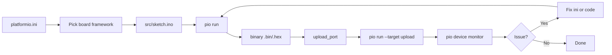

# PlatformIO - Arduino Build and Flash

![[assets/img/platformio-flow-scheme.png|600]]
*Fig. Build flow through PlatformIO: ini to core to compiler to firmware.*

> [!tip] Purpose of this note
> Explains creating a PlatformIO project for an Arduino board, picking the atmelavr core, writing platformio.ini and a sketch, checking the build, and flashing through the CLI.

## 1. Purpose

This note describes working with PlatformIO to build Arduino sketches through a settings file and the console. After reading, the reader creates a project folder, writes an ini with the atmelavr platform, adds a sketch, builds with the pio run command, and flashes with pio run --target upload. It suits automation and repeatable builds.

PlatformIO is picked when library versioning, a strict board description, and an automatic server-side check cycle are needed. The editor may stay anything: VS Code with the extension or the CLI in a terminal. All actions reduce to three steps: ini to src/sketch.ino to command.

Links to other notes: environment choice in [[EN/00-Start/05-Environment-Choice.en|environment choice]]; flashing through avrdude in [[EN/09-Firmware/02-Bootloader-AVRDUDE.en|bootloader and avrdude]]; the classic board in [[EN/01-Hardware/01-AVR-Uno.en|Uno classic]].

## 2. What PlatformIO Gives

PlatformIO keeps the project in a folder with a platformio.ini file at the root and a src folder with code. This separates settings from code and lets another computer repeat the build with no manual board picking in the editor. Libraries install with explicit versions and land in lib_deps.

A comparison with the classic IDE shows gains in version control and automation. The table below sums the difference briefly.

| Parameter | Arduino IDE | PlatformIO |
| --- | --- | --- |
| Board description | Graphical menu | ini board parameter |
| Libraries | Manual manager | lib_deps with version |
| Build | Button | pio run |
| Flash | Button | pio run --target upload |
| Monitor | Separate window | pio device monitor |
| Versioning | Not supported | ini file stores the state |

## 3. Project Structure

The project folder holds at least three items: platformio.ini with the platform and board description; a src folder with an .ino or .cpp file; a lib folder for local libraries. Flashing needs no extra files if the sketch stands alone.

```text
my_project/
  platformio.ini
  src/
    main.cpp
  lib/
    MyLib/
```

Code may use the .ino or .cpp extension. With .ino, PlatformIO adds prototypes automatically like the classic editor. With .cpp, functions must be declared before use. For simplicity this note takes .ino with an extended sketch.

## 4. Ini Settings

The platformio.ini file sets the atmelavr platform, the uno board, and an automatic or explicit port. It can also carry the monitor speed, libraries, and build options. A minimal file example sits below.

```ini
[env:uno]
platform = atmelavr
board = uno
framework = arduino
monitor_speed = 9600
lib_deps =
    blynk/Blynk @ 1.3.1
```

The framework = arduino parameter enables Arduino API compatibility. The monitor_speed parameter sets the serial monitor speed for pio device monitor. If the port changes, it may be skipped or set explicitly through upload_port.

## 5. Arduino Sketch

The sketch uses the standard setup and loop template with Serial output and LED control. The code suits both classic Arduino and PlatformIO unchanged when .ino is used. With .cpp, add #include <Arduino.h>.

```cpp
#include <Arduino.h>

const int ledPin = LED_BUILTIN;

void setup() {
    Serial.begin(9600);
    pinMode(ledPin, OUTPUT);
    Serial.println("PlatformIO start");
}

void loop() {
    digitalWrite(ledPin, HIGH);
    delay(500);
    digitalWrite(ledPin, LOW);
    delay(500);
    Serial.println("tick");
}
```

If the board has no built-in LED_BUILTIN, swap it for 13 or another pin. The port monitor appears after flashing if the cable carries data lines and the port is free.

## 6. CLI Commands

The main commands run from the project folder. The build checks the code and produces a binary. The upload passes the file into the port. The monitor opens the serial channel for reading.

```text
pio run              # зібрати
pio run --target upload  # прошити
pio device monitor   # монітор порту
pio pkg install --library "blynk/Blynk@1.3.1"  # бібліотека
```

When the ini changes or lib_deps grows, the build refreshes dependencies automatically. The pio run command with no target only checks compilation, which suits CI. If the port stays busy with the monitor, flashing never starts and prints an access issue.

## 7. Mermaid: Build Path



The path starts at the ini and runs through the build to the flash. On an issue the path returns to the source: ini for the board description, src for code, lib_deps for libraries.

## 8. Common Issues

| # | Issue | Why it is bad | Correct way |
| --- | --- | --- | --- |
| 1 | board mismatches the board | Compiler uses another memory size and pin map | Pick the exact model from the atmelavr list |
| 2 | framework skipped | Arduino API never links and functions stay missing | Add framework = arduino |
| 3 | lib_deps with no version | Another computer gets another library version | Pin @version in the ini |
| 4 | Port busy with the monitor | Flash cannot open the port for writing | Close the monitor before upload |
| 5 | src with no .ino or .cpp | PlatformIO finds no entry point | Place the file in the src folder |
| 6 | upload_port missing | Flash does not know where to send the file | Set the port or leave it automatic |
| 7 | Monitor speed mismatch | Garbage in the monitor instead of data | Set monitor_speed as in Serial.begin |

A compile issue usually points at the first red-text line in the pio run output. If the issue sits in a library, check lib_deps. If the board stays silent after flashing, check the data-lines cable.

## 9. Official Sources

- [PlatformIO quickstart](https://docs.platformio.org/en/latest/core/quickstart.html) - project creation and first build.
- [PlatformIO installation](https://docs.platformio.org/en/latest/installation.html) - CLI and extension installation.
- [Project configuration](https://docs.platformio.org/en/latest/projectconf/index.html) - ini parameters board framework lib_deps.
- [Library manager](https://docs.platformio.org/en/latest/librarymanager/index.html) - versioned library installation.
- [Platformio.org/docs](https://docs.platformio.org/en/latest/) - docs root with AVR sections.

## See Also

- [[EN/00-Start/05-Environment-Choice.en|environment choice]]
- [[EN/01-Hardware/01-AVR-Uno.en|Uno classic]]
- [[EN/01-Hardware/02-Nano-Mega.en|compact and legs]]
- [[EN/09-Firmware/02-Bootloader-AVRDUDE.en|bootloader and avrdude]]
- [[EN/09-Firmware/01-IDE-CLI.en|IDE and CLI sketch build]]
