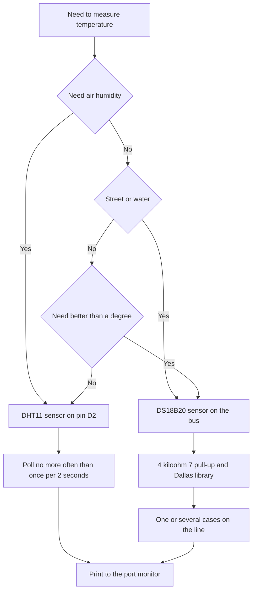

# DHT11 and DS18B20 on Arduino - Easy Temperature

![[assets/img/arduino-dht-ds-scheme.png|600]]
*Fig. Wiring of DHT11 and DS18B20 to Arduino with pull-up and power supply.*

> [!tip] Purpose of the note
> Close the basic temperature measurement questions: when the cheap DHT11 (plus minus 2 degrees - indicator only) is enough, when the exact DS18B20 is needed, how to wire the bus and not poll too often.

## 1. Purpose

A temperature sensor turns the heat of air or a case into a digital number.

The board reads such a number with one library call with no manual pulse decoding.

The cheap DHT11 measures room air temperature and humidity.

The sealed DS18B20 measures water, radiator or outdoor temperature.

Both sensors run from five volts and return ready-made degrees.

This note closes the full loop: sensor choice, libraries, wiring, pauses between polls and several sensors on one line.

Grasping these topics removes most questions about zeros and dashes in the port monitor.

The Uno board reads both sensors with plain digital pins and no extra modules.

See digital modes in [[EN/03-GPIO/01-Digital-Pins.en|digital pins]].

Time measurement basics between polls are in [[EN/07-Timers/01-Timers-millis.en|timers and time]].

## 2. Sensor comparison

| Parameter | DHT11 | DS18B20 |
| --- | --- | --- |
| What it measures | Air temperature and humidity | Temperature only |
| Temperature range | From 0 to 50 degrees | From minus 55 to plus 125 degrees |
| Temperature accuracy | Plus minus 2 degrees | Plus minus 0 degrees 5 |
| Measurement step | 1 degree | From 0 degrees 0625 at 12 bits |
| Poll interval | No more often than once per 2 seconds | Up to 750 milliseconds per conversion |
| Bus | Own single-wire protocol | OneWire bus with addresses |
| Several on one pin | No, one sensor per pin | Yes, dozens on one line |
| When to take | Room thermometer and humidity | Outdoors, water, radiator, exact task |

The table shows the main difference: DHT11 is simple and cheap, DS18B20 is exact and flexible.

For a room humidity indicator take DHT11 with no hesitation.

For an outdoor thermometer or heating control take DS18B20 in a sealed sleeve.

Both sensors have three pins: power supply, ground and data.

DHT11 modules on a board often have a built-in pull-up resistor.

Bare DS18B20 sensors demand an external 4 kiloohm 7 resistor.

Power supply goes to the five volts of the board, ground runs on a separate wire.

The signal line is pulled up to the power supply through a resistor.

## 3. DHT11: wiring and library

| Element | Value | Practical sense |
| --- | --- | --- |
| Library | DHT sensor library by Adafruit | Ready-made read functions with no manual timing |
| Dependency | Adafruit Unified Sensor | Installs automatically with the main one |
| Data pin | Any digital one, for example D2 | One sensor takes one pin |
| Power supply | 5 volts | Stable voltage gives stable readings |
| Read rate | Once per 2 seconds or rarer | The sensor needs time for a new conversion |
| Data format | Degrees Celsius and humidity percent | Ready-made dotted numbers at once |

The library installs through the library manager by the name DHT sensor library.

The helper unified sensor package installs with it.

The sensor object is created with the pin number and the DHT11 type.

In the setup block call the sensor start.

In the loop read humidity and temperature with separate calls.

Check every reading for an error flag.

A read error returns the special no-number value.

Such a value is checked with the number-check function.

With no check, zeros and dashes land in the monitor.

```text
Підключення модуля DHT11 до Uno:

   плата Uno                модуль DHT11
   ----------               -------------
   5V    -----------------  VCC
   GND   -----------------  GND
   D2    -----------------  DATA

   Модуль вже має підтяжку на платі.
   Голий датчик потребує резистор 10 кОм між VCC і DATA.
   Довжина дротів для DHT11 бажано до 5 метрів.
```

The schematic shows three wires with no extra parts for a ready-made module.

A bare blue case demands a resistor between power supply and data.

Long wires over five meters give checksum errors.

For distant points better take DS18B20 with a bus.

Sensor power supply comes from the board, not from a separate unit.

Common ground is mandatory for any option.

## 4. DHT11 sketch with a 2 second pause

| Code line | What it does | Why so |
| --- | --- | --- |
| DHT h include | Library headers | With no them the compiler misses the sensor type |
| DHT dht | Object on pin D2 | Stores the pin number and type |
| dht dot begin | Sensor start | Prepares the pin for exchange |
| dht dot readHumidity | Humidity read | Returns percent |
| dht dot readTemperature | Temperature read | Returns degrees |
| isnan | Error check | Cuts off broken packets |
| delay 2000 | Pause between reads | The sensor misses a faster pace |

The two second pause is a maker demand, not advice.

More frequent requests return stale data or an error.

Better count time with no loop blocking.

For simple examples a delay is allowed and visual.

For complex programs count with the board clock.

```cpp
#include <DHT.h>

#define DHT_PIN 2
#define DHT_TYPE DHT11

DHT dht(DHT_PIN, DHT_TYPE);

void setup() {
  Serial.begin(9600);
  dht.begin();
  Serial.println("DHT11 старт");
}

void loop() {
  delay(2000);
  float h = dht.readHumidity();
  float t = dht.readTemperature();
  if (isnan(h) || isnan(t)) {
    Serial.println("Помилка читання DHT11");
    return;
  }
  Serial.print("Вологість: ");
  Serial.print(h, 0);
  Serial.print(" %  Температура: ");
  Serial.print(t, 0);
  Serial.println(" C");
}
```

The sketch polls the sensor once per two seconds and prints two numbers.

The number check cuts off damaged packets.

Printing with zero digits shows the true DHT11 resolution.

Port speed 9600 is enough for two numbers per second.

The delay at the loop start sets an even poll pace.

Returning from the loop after an error skips trash printing.

Such a sketch is a start point for a room thermometer.

Data is easy to show on an indicator or send by radio.

DHT11 calibration is not planned: the factory sets the accuracy.

## 5. DS18B20 and the OneWire bus

| Element | Value | Practical sense |
| --- | --- | --- |
| Libraries | OneWire plus DallasTemperature | The first drives the bus, the second lays out degrees |
| Bus pin | Any digital one, for example D3 | The whole bus hangs on one pin |
| Pull-up | 4 kiloohm 7 between data and power supply | Holds the line high between pulses |
| Power supply | 5 volts plain | Better leave parasite power supply to newcomers out |
| Resolution | From 9 to 12 bits | More bits give a longer conversion |
| Address | 64 bits in every case | Tells sensors on the bus apart |

The OneWire bus runs on the leader and follower principle.

The board acts as leader and hands commands to all sensors.

Every sensor has a factory address of eight bytes.

The address sits in the case and never repeats.

The library can search addresses automatically.

The 4 kiloohm 7 pull-up is mandatory for any line length.

With no pull-up the line floats and exchange breaks.

The resistor sits physically close to the board.

```text
Підключення DS18B20 до Uno:

   5V ----+-------------------- VCC датчика
         |
        [R] 4 кОм 7
         |
   D3 ---+-------------------- DQ датчика
   GND ----------------------- GND датчика

   Резистор тримає лінію даних вгорі.
   Довжина шини може сягати десятків метрів.
   Кожен наступний датчик чіпляють паралельно.
```

The schematic shows the classic pull-up to the power supply.

All bus sensors join with same-name pins in parallel.

A twisted pair cuts noise on long lines.

Ground runs on a separate unbroken wire.

Power supply comes from the board or from a separate stable unit.

Parasite mode with no power supply wire demands a strong switch.

Newcomers better always pull three wires.

## 6. Several sensors and the DS18B20 sketch

| Task | Call | Explanation |
| --- | --- | --- |
| Bus start | sensors dot begin | Finds all sensors on the line |
| Count | sensors dot getDeviceCount | Shows how many cases answered |
| Measurement start | sensors dot requestTemperatures | Tells everybody to measure |
| Index read | sensors dot getTempCByIndex | Zero gives the first sensor |
| Address read | sensors dot getTempC | Exact call to the wanted case |
| Resolution | sensors dot setResolution | 9 bits fast, 12 bits exact |

The sensor index depends on the search order on the bus.

The order can change after rewiring.

Solid projects read sensors by addresses.

The address is learned with a separate scanner sketch.

The scanner prints eight bytes of every case.

Addresses go into program comments and serve as constants.

Street and radiator temperature never mix up that way.

```cpp
#include <OneWire.h>
#include <DallasTemperature.h>

#define ONE_WIRE_PIN 3

OneWire oneWire(ONE_WIRE_PIN);
DallasTemperature sensors(&oneWire);

void setup() {
  Serial.begin(9600);
  sensors.begin();
  Serial.print("Знайдено датчиків: ");
  Serial.println(sensors.getDeviceCount());
  sensors.setResolution(12);
}

void loop() {
  sensors.requestTemperatures();
  float t0 = sensors.getTempCByIndex(0);
  Serial.print("Датчик 0: ");
  Serial.print(t0, 2);
  Serial.println(" C");
  if (t0 < -100.0) {
    Serial.println("Датчик не відповідає, перевір дроти");
  }
  delay(1000);
}
```

The sketch seeks sensors at start and prints the count.

Resolution 12 bits gives a 0 degrees 0625 step.

The request command starts conversion in all cases.

Index reading fits one sensor.

Minus 127 means no link.

The very-low-value check catches a line break.

A one second delay keeps the monitor readable.

For two sensors add index one reading.

For reliability move to address reading.

See exact supply voltage measurement in [[EN/06-Analog/01-ADC.en|voltage measurement]].

## Mermaid: temperature sensor choice



The schematic reads top down: first the humidity question.

Humidity is closed only by DHT11 with a simple sketch.

Street and water demand the sealed DS18B20.

Better-than-a-degree accuracy also leads to DS18B20.

The pause for DHT11 is mandatory, the pull-up for DS18B20 is mandatory.

The end is the same: stable degrees in the monitor.

## Common issues

| # | Issue | Why bad | How correct |
| --- | --- | --- | --- |
| 1 | Polling DHT11 every 300 milliseconds | The sensor misses pace, returns an error | Pause at least 2000 milliseconds between reads |
| 2 | Missing 4 kiloohm 7 resistor on the DS18B20 bus | The line floats, the sensor never found | Resistor between data and power supply near the board |
| 3 | Ignoring the number check after reading | Broken packets print as zeros | Check the value with the check function and skip broken ones |
| 4 | Parasite DS18B20 power supply on a long line | Power supply sag breaks conversion | Pull three wires: power supply, ground, data |
| 5 | Reading several DS18B20 by index in a finished product | Search order changes, sensors mix up | Read addresses with a scanner and read by address |
| 6 | Long DHT11 wires over 10 meters | The address-free protocol feels noise | For distant points take DS18B20 on a twisted pair |

## Official sources

- [DHT11 sensor on docs.arduino.cc](https://docs.arduino.cc/learn/electronics/environment/) - wiring, library and temperature read example.
- [DallasTemperature library on arduino.cc](https://www.arduino.cc/reference/en/libraries/dallastemperature/) - bus functions, addresses and resolution.
- [DS18B20 datasheet by Analog Devices](https://www.analog.com/en/products/ds18b20.html) - range, accuracy, conversion time and bus commands.

## See also

- [[Home.en]]
- [[EN/10-Sensors/02-BME280.en|bus climate]]
- [[EN/10-Sensors/03-HC-SR04-PIR.en|distance and motion]]
- [[EN/10-Sensors/04-LM35-NTC.en|analog sensors]]
- [[EN/03-GPIO/01-Digital-Pins.en|digital pins]]
- [[EN/07-Timers/01-Timers-millis.en|timers and time]]
