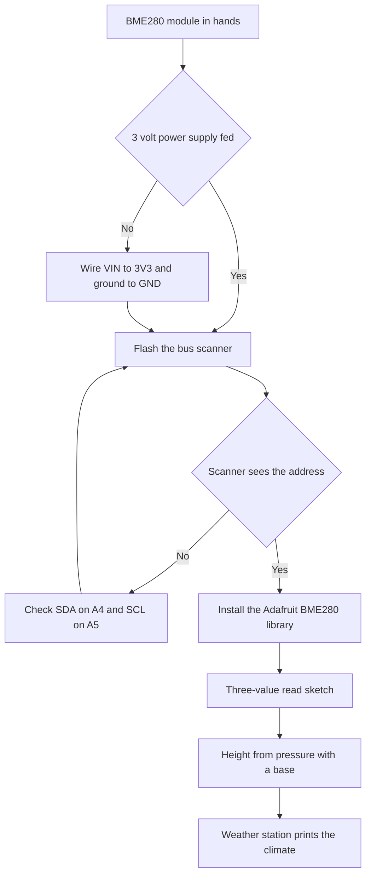

# BME280 on Arduino - Pressure and Humidity

![[assets/img/arduino-bme-scheme.png|600]]
*Fig. Wiring of BME280 to Arduino over the bus with 3 volt power supply.*

> [!tip] Purpose of the note
> Teach the climate module with no smoke: feed correct 3 volts, pick the address with a jumper, read pressure and humidity and convert height.

## 1. Purpose

The BME280 module measures three values at once: temperature, humidity and pressure.

Such a mix closes a home weather station with one crystal.

The sensor talks over a two-wire bus.

The board acts as leader, the module answers as follower.

Module power supply is 3 volts, not five.

Feeding five volts to the module bus is forbidden.

This note closes the full loop: power supply, addresses, library, reading and height from pressure.

Grasping these topics removes most questions about a missing module on the bus.

Two-wire bus basics are in [[EN/04-Interfaces/03-I2C-Wire.en|two-wire bus]].

Time counting between measurements is in [[EN/07-Timers/01-Timers-millis.en|timers and time]].

## 2. What the module can do

| Parameter | Range | Practical sense |
| --- | --- | --- |
| Temperature | From minus 40 to plus 85 degrees | Room and street with no problem |
| Humidity | From 0 to 100 percent | Bedroom and greenhouse control |
| Pressure | From 300 to 1100 hectopascals | Weather forecast and height |
| Pressure accuracy | About 1 hectopascal | Day weather change visible |
| Humidity accuracy | About 3 percent | Enough for home use |
| Interface | Two-wire bus | Two wires instead of a pile of analog inputs |
| Second interface | Four-wire serial bus | Spare option for a busy bus |

The table shows the versatility of one crystal.

Temperature is needed to compensate other measurements.

Humidity is needed for comfort and plants.

Pressure is needed for forecast and height.

All three values read in one packet.

The module is small with low consumption.

For battery nodes take sleep mode between measurements.

Factory accuracy is enough with no manual calibration.

Height is counted with a formula from sea-level pressure.

Sea-level pressure comes from the weather service.

## 3. 3 volt power supply with no compromise

| Module contact | Where to run | Explanation |
| --- | --- | --- |
| VIN or VCC | 3 volt board output | Logic and sensor power supply |
| GND | Board ground | Common point for the bus |
| SCL | Analog input A5 on Uno | Bus clock line |
| SDA | Analog input A4 on Uno | Bus data line |
| SDO | Ground or power supply through a jumper | Module address choice |
| CSB | To 3 volt power supply | Moves the module to bus mode |

The 3 volt power supply comes from a separate board output.

The Uno board has a 3 volt output next to the five volts.

Bus logic levels are 3 volts too.

Module inputs are not rated for five volts.

Direct bus wiring to five volts damages the crystal.

Modules with an on-board level shifter tolerate five volt power supply.

Cheap bare boards with no shifter demand only 3 volts.

Before buying read the marks near the power supply holes.

If it says 5V tolerant, five volt power supply is allowed.

If no such mark exists, feed only 3 volts.

```text
Підключення BME280 до Uno по шині:

   плата Uno             модуль BME280
   ---------             -------------
   3V3   --------------- VIN
   GND   --------------- GND
   A5    --------------- SCL
   A4    --------------- SDA
   SDO   --- до GND дає адресу 0x76
   SDO   --- до 3V3 дає адресу 0x77

   Підтяжки шини вже стоять на модулі.
   Довжина ліній бажано до 1 метра.
   Землю ведуть окремим проводом.
```

The schematic shows four main wires plus address choice.

Bus lines on Uno share analog inputs.

The classic board has no separate bus contacts.

Pull-ups to the power supply already sit on the module.

Extra resistors are not needed.

Long tails gather noise and break exchange.

For distant sensors take a shielded pair.

## 4. Address with the SDO jumper

| SDO state | Address | When so |
| --- | --- | --- |
| On ground | 0x76 | Factory option of most modules |
| On 3 volt power supply | 0x77 | Second module or another batch |
| Floating | Undefined | Exchange breaks, the module comes and goes |
| Two modules together | One on 0x76, second on 0x77 | Two climate nodes on one bus |

The module address depends on the level on the SDO pin.

The SDO pin sets the junior address bit.

Ground gives address 0x76, power supply gives 0x77.

Most shop modules have address 0x76.

Some batches have a jumper to 0x77.

Before start scan the bus with a scanner sketch.

The scanner prints all addresses that answered.

If the scanner stays silent, check power supply and wires.

If the scanner sees another address, put it into the program.

Two modules on one bus split to different addresses.

For that resolder the jumper on the second module.

With no soldering iron two same modules never split.

```text
Як дізнатись адресу модуля:

   1. Залий скетч сканер шини.
   2. Відкрий монітор порту на 9600.
   3. Подивись рядок зі знайденим пристроєм.
   4. Запиши адресу у константу програми.

   Приклад виводу сканера:

   Знайдено пристрій на 0x76
   Знайдено пристрій на 0x77
   Готово, знайдено 1 пристрій
```

The sequence shows the path from hardware to code.

The scanner ships with the bus library examples.

Scan speed is the standard 100 kilohertz.

After the find fix the address in the program.

Comment the address next to the sensor mount point.

Such a comment saves you half a year later.

## 5. Adafruit library and first measurement

| Element | Name | Practical sense |
| --- | --- | --- |
| Sensor library | Adafruit BME280 Library | Ready-made three-value read functions |
| Dependency | Adafruit Unified Sensor | Common sensor data format |
| Bus dependency | Built-in Wire library | Drives the two bus wires |
| Object | Adafruit_BME280 bme | Stores address and settings |
| Start | bme dot begin with address | Checks link and calibration |
| Reading | readTemperature readHumidity readPressure | Three ready-made numbers |

The library installs through the manager by the BME280 name.

The unified sensor package installs with it.

The bus starts with a begin call.

The object is created with no parameters, the address goes to the start.

Start returns a success flag.

A failed start means a wrong address or a break.

After a good start read three values.

The library returns pressure in pascals.

Hectopascals come from division by one hundred.

Humidity comes in percent, temperature in degrees.

```cpp
#include <Wire.h>
#include <Adafruit_Sensor.h>
#include <Adafruit_BME280.h>

#define BME_ADDR 0x76

Adafruit_BME280 bme;

void setup() {
  Serial.begin(9600);
  Wire.begin();
  if (!bme.begin(BME_ADDR)) {
    Serial.println("BME280 не знайдено, перевір адресу");
    while (1) {
      delay(100);
    }
  }
  Serial.println("BME280 готовий");
}

void loop() {
  float t = bme.readTemperature();
  float h = bme.readHumidity();
  float p = bme.readPressure() / 100.0;
  Serial.print("T=");
  Serial.print(t, 1);
  Serial.print(" H=");
  Serial.print(h, 0);
  Serial.print(" P=");
  Serial.print(p, 0);
  Serial.println(" гПа");
  delay(2000);
}
```

The sketch starts the bus and checks the module presence.

Looping after an error halts the program with a message.

Reading three values takes fractions of a second.

Printing shows degrees, percent and hectopascals.

A two second pause keeps the monitor calm.

More frequent measurements give no new climate data.

For memory logging add a card and a time stamp.

For a display add indicator output.

Stable power supply gives stable pressure.

## 6. Height from pressure

| Value | Formula | Explanation |
| --- | --- | --- |
| Local pressure | P in hectopascals | Number from the sensor |
| Sea-level pressure | P0 from the weather service | Base for conversion |
| Height | 44330 times the difference | Standard barometric formula |
| Height step | About 12 meters per hectopascal | Near sea level |
| Accuracy | Plus minus 1 meter relative | Absolute worse with weather |
| Weather drift | To dozens of meters per day | Pressure floats with fronts |

Height counts with the relative method.

Absolute height floats with the weather.

Relative height change is exact and stable.

For an altimeter fix the start pressure.

For a weather station show pressure, not height.

Sea-level pressure comes from the nearest airport.

With no base the height lies by dozens of meters.

The library has a ready-made conversion function.

The function takes pressure and base pressure.

The result comes in meters.

```cpp
#include <Wire.h>
#include <Adafruit_Sensor.h>
#include <Adafruit_BME280.h>

Adafruit_BME280 bme;

const float SEA_LEVEL = 1013.25;

void setup() {
  Serial.begin(9600);
  Wire.begin();
  bme.begin(0x76);
}

void loop() {
  float p = bme.readPressure() / 100.0;
  float alt = bme.readAltitude(SEA_LEVEL);
  Serial.print("Тиск: ");
  Serial.print(p, 1);
  Serial.print(" гПа  Висота: ");
  Serial.print(alt, 1);
  Serial.println(" м");
  delay(2000);
}
```

The sketch shows the pressure plus height pair.

The sea-level constant is tuned to your region.

Current pressure is checked on the weather service site.

For a hike fix the start point as zero.

Then watch height gain against the start.

Such a method never depends on weather.

A height step near a meter reads with confidence.

Pressure noise smooths with ten-measurement averaging.

See exact analog signal measurement in [[EN/06-Analog/01-ADC.en|voltage measurement]].

## Mermaid: BME280 start from zero



The schematic reads top down: first power supply.

The 3 volt power supply is the module survival condition.

The scanner proves the address before the main code.

Wire checking closes most failures.

The library removes manual compensation math.

The end gives three numbers and height.

## Common issues

| # | Issue | Why bad | How correct |
| --- | --- | --- | --- |
| 1 | Module power supply from 5 volts with no shifter | The crystal heats and dies, the bus jams | Feed 3 volts to VIN, check the board mark |
| 2 | Wrong address in the begin call | The module stays silent, start returns an error | Scanner first, then the address into the program |
| 3 | Floating SDO pin with no jumper | The address jumps, exchange unstable | Solder SDO to ground or to power supply |
| 4 | Bus over 2 meters with no shield | Noise breaks packets, data broken | Short wires, twisted pair, 100 kilohertz speed |
| 5 | Polling ten times per second | Self-heating skews temperature | 2 second pause, for battery sleep between measurements |
| 6 | Absolute height with no sea-level base | Weather shifts readings by dozens of meters | Take base pressure from the weather service or measure against the start |

## Official sources

- [BME280 module on docs.arduino.cc](https://docs.arduino.cc/learn/electronics/environment/) - power supply, bus and weather station example.
- [Adafruit BME280 library on arduino.cc](https://www.arduino.cc/reference/en/libraries/adafruit-bme280-library/) - read functions, addresses and height.
- [BME280 datasheet by Bosch](https://www.bosch-sensortec.com/products/environmental-sensors/humidity-sensors-bme280/) - ranges, accuracy and measurement modes.

## See also

- [[Home.en]]
- [[EN/10-Sensors/01-DHT-DS18B20.en|wire temperature]]
- [[EN/10-Sensors/03-HC-SR04-PIR.en|distance and motion]]
- [[EN/10-Sensors/04-LM35-NTC.en|analog sensors]]
- [[EN/04-Interfaces/03-I2C-Wire.en|two-wire bus]]
- [[EN/06-Analog/01-ADC.en|voltage measurement]]
