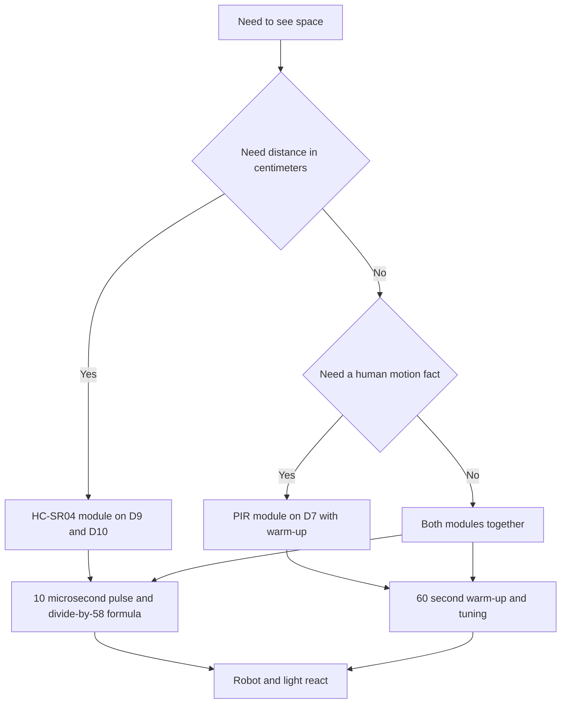

# HC-SR04 and PIR - Distance and Motion

![[assets/img/arduino-hcsr-pir-scheme.png|600]]
*Fig. Wiring of HC-SR04 and PIR to Arduino with power supply and signals.*

> [!tip] Purpose of the note
> Teach seeing with no eyes: measure distance with ultrasound, catch body-heat motion, bypass the blind zone and never fear false triggers.

## 1. Purpose

The HC-SR04 ranger measures distance to an obstacle with sound.

The PIR sensor notices warm human motion in a room.

The first sensor gives a number in centimeters.

The second sensor gives a motion yes or motion no event.

Together they close a robot, doors, alarm and smart light.

This note closes the full loop: start pulse, echo measurement, centimeter formula, PIR warm-up and sensitivity tuning.

Grasping these topics removes most questions about zero and jumping readings.

Digital pin modes are in [[EN/03-GPIO/01-Digital-Pins.en|digital pins]].

Exact microsecond counting is in [[EN/07-Timers/01-Timers-millis.en|timers and time]].

## 2. Sensor comparison

| Parameter | HC-SR04 | PIR |
| --- | --- | --- |
| What it gives | Distance in centimeters | Human motion fact |
| Principle | Ultrasound echo at 40 kilohertz | Body heat radiation |
| Range | From 2 to 400 centimeters | To 7 meters in a fan |
| View angle | About 15 degrees | To 110 degrees with a lens |
| Output | Pulse with echo length | High level while moving |
| Power supply | 5 volts | 5 volts |
| Blind zone | First 2 centimeters | First minute after power on |
| When to take | Robot, parking, water level | Light, alarm, doors |

The table shows different tasks for two eyes.

The ranger measures space geometry.

The heat sensor watches people.

The ranger runs in a poll loop.

The heat sensor raises its output on motion by itself.

Both feed from the five volts of the board.

Consumption is small, no separate unit needed.

Ground is common for all modules.

Signal wires are short with no loops.

## 3. HC-SR04: start and echo

| Contact | Purpose | Wiring |
| --- | --- | --- |
| VCC | 5 volt power supply | To the 5V board output |
| GND | Ground | To board ground |
| Trig | Start input | To a digital output, for example D9 |
| Echo | Echo output | To a digital input, for example D10 through a divider for sensitive boards |

Start begins with a short pulse on the Trig input.

The pulse length is 10 microseconds.

The module sends eight ultrasonic bursts.

The echo returns from the obstacle back.

The Echo output stays high during sound flight.

The high level length tracks distance.

The board measures the length with a pulse measurement function.

The function waits for the edge and counts microseconds.

The conversion formula divides time by 58.

The number 58 gives centimeters for room-temperature air.

Sound speed floats a bit with temperature.

For home tasks no correction applies.

For exact tasks add a thermometer correction.

```text
Підключення HC-SR04 до Uno:

   плата Uno             модуль HC-SR04
   ---------             --------------
   5V    --------------- VCC
   GND   --------------- GND
   D9    --------------- Trig
   D10   --------------- Echo

   Датчик дивиться вперед без нахилу.
   Перешкода має стояти перпендикулярно.
   Мякі тканини і нахилені стіни глушать луну.
   Довжина дротів бажано до 2 метрів.
```

The schematic shows four wires with no extra parts.

The module sits level on a stand.

Up tilt gives ceiling reflection.

Down tilt gives floor reflection.

A smooth wall gives a confident echo.

A slant wall takes sound aside.

A fleecy surface eats the bursts.

For such surfaces shorten the distance.

## 4. Ranger sketch with formula

| Step | Code | Explanation |
| --- | --- | --- |
| Trig reset | Low level for 2 microseconds | Clean edge before start |
| Pulse | High level for 10 microseconds | Sound burst command |
| Measurement | pulseIn on Echo | Echo length in microseconds |
| Conversion | Time divided by 58 | Distance in centimeters |
| Pause | 100 milliseconds | Cross-echo guard |
| Filter | Median of three measurements | Cuts single outliers |

The pause between measurements removes echo overlap.

With no pause a new burst catches the old echo.

Frequent measurements give chaotic jumps.

A three-read median gives an even line.

A mean fits too but cuts outliers worse.

The blind zone to 2 centimeters gives zeros.

Zeros drop with a program check.

The module never sees distance over 400 centimeters.

Out of range gives a measurement timeout.

```cpp
const int TRIG_PIN = 9;
const int ECHO_PIN = 10;

void setup() {
  Serial.begin(9600);
  pinMode(TRIG_PIN, OUTPUT);
  pinMode(ECHO_PIN, INPUT);
  digitalWrite(TRIG_PIN, LOW);
}

long readDistance() {
  digitalWrite(TRIG_PIN, LOW);
  delayMicroseconds(2);
  digitalWrite(TRIG_PIN, HIGH);
  delayMicroseconds(10);
  digitalWrite(TRIG_PIN, LOW);
  long dur = pulseIn(ECHO_PIN, HIGH, 30000);
  if (dur == 0) {
    return -1;
  }
  return dur / 58;
}

void loop() {
  long d = readDistance();
  if (d < 0) {
    Serial.println("Нема луни");
  } else {
    Serial.print("Дистанція: ");
    Serial.print(d);
    Serial.println(" см");
  }
  delay(100);
}
```

The sketch shapes the 10 microsecond pulse per spec.

The measurement function waits for echo to 30 milliseconds.

Zero time means timeout and no obstacle.

Division by 58 gives centimeters.

Minus one marks a missing echo.

Printing shows a number or an empty-space message.

A one hundred millisecond pause splits bursts.

Such a pace gives ten measurements per second.

For a robot this pace is enough.

For a water level take a slower pace and a filter.

## 5. Blind zone and surfaces

| Situation | Symptom | What to do |
| --- | --- | --- |
| Obstacle closer than 2 centimeters | Zero or jumps | Move the sensor back or take another method |
| Thin chair leg | The sensor never sees | Add a screen or a second sensor at an angle |
| Slant wall | Low misses | Level the sensor square |
| Curtain and clothes | Weak echo | Shorten distance, remove fabric |
| Two sensors side by side | Cross echoes | Poll in turn with a pause |
| Power supply sags | Chaotic zeros | Separate power supply wire, 100 microfarad capacitor |

The blind zone comes from receiver switch time.

The receiver still rests deaf for the first flight centimeters.

So the minimum distance reads 2 centimeters.

Zeros drop in code as untrusted.

Small objects give a weak echo.

Narrow legs hide between bursts.

For such targets put a wide marker.

The sound fall angle must stay near square.

A slant beam reflects away from the receiver.

Fabric eats high frequencies.

Smooth plastic and walls give the best echo.

```text
Поле зору HC-SR04 згори:

        датчик
          ^
         /|\
        / | \
       /  |  \   кут близько 15 градусів
      /   |   \
     /  зона луни \
    /_____________\

   Ціль по центру видно найкраще.
   Ціль збоку видно гірше.
   Дві цілі дають ближчу з них.
```

The schematic shows the narrow sensitivity cone.

The cone widens with distance.

At the far end width reaches a meter.

Near objects land inside the cone.

So the sensor sees the nearest surface.

For a corridor these are side walls.

For a robot this hints a turn.

Measure a narrow passage slowly.

## 6. PIR: warm-up and tuning

| Element | Value | Practical sense |
| --- | --- | --- |
| Power supply | 5 volts | Stable voltage with no ripple |
| OUT output | High level on motion | Read with a digital input |
| Warm-up | About 60 seconds | The sensor settles after power on |
| Fresnel lens | White cap | Shapes sensitivity zones |
| Sensitivity knob | Range to 7 meters | Turn with a screwdriver |
| Time knob | Pulse length | From seconds to minutes |
| Angle | To 110 degrees | Wide fan for a room |

The heat sensor sees the difference of body heat and background.

The lens splits space into alternating sensitive zones.

Motion between zones gives a signal.

A still person melts into the background.

So the sensor catches motion, not presence.

After power on the sensor gives chaos for a minute.

Firmware learns to ignore the first minute.

The sensitivity knob sets range.

The time knob sets the high level length.

Time stays small for tests.

For light set minutes.

```text
Підключення PIR до Uno:

   плата Uno             модуль PIR HC-SR501
   ---------             -------------------
   5V    --------------- VCC
   GND   --------------- GND
   D7    --------------- OUT

   Лінза дивиться у кімнату.
   Модуль кріплять нерухомо.
   протяг і батарея дають хибні спрацьовування.
   Тварини у полі зору теж будять сенсор.
```

The schematic shows three wires and correct orientation.

The module sits in a room corner under the ceiling.

Warm air swing from a radiator wakes the sensor.

A window draft also gives false motion.

Animals leave the zone or sensitivity drops.

Case vibration gives a microphone effect.

Mounting stays rigid.

## 7. PIR sketch with warm-up

| Step | Code | Explanation |
| --- | --- | --- |
| OUT pin as input | pinMode to INPUT | Listens to the sensor level |
| 60 second warm-up | Loop with printing | Ignores start chaos |
| Reading | digitalRead | High level means motion |
| Edge | Compare with past | Reaction to motion start |
| Delay | Small pause | Kills decision bounce |
| Action | LED or relay | Visual result |

Warm-up runs in the setup block.

During warm-up print dots to the monitor.

After warm-up move to the main loop.

The motion edge fixes with state compare.

Edge reaction gives one event.

Level reaction gives a repeat stream.

For alarm take the edge.

For light take the level with a timer.

The on-board LED shows state with no parts.

```cpp
const int PIR_PIN = 7;
const int LED_PIN = 13;
int lastState = LOW;

void setup() {
  Serial.begin(9600);
  pinMode(PIR_PIN, INPUT);
  pinMode(LED_PIN, OUTPUT);
  Serial.println("Прогрів PIR 60 секунд");
  for (int i = 0; i < 60; i++) {
    delay(1000);
  }
  Serial.println("Готово, стежу за рухом");
}

void loop() {
  int s = digitalRead(PIR_PIN);
  digitalWrite(LED_PIN, s);
  if (s == HIGH && lastState == LOW) {
    Serial.println("Рух помічено");
  }
  if (s == LOW && lastState == HIGH) {
    Serial.println("Зона вільна");
  }
  lastState = s;
  delay(100);
}
```

The sketch waits a minute before work.

The warm-up loop splits to seconds for exactness.

After warm-up it reads the output one hundred times per second.

The LED repeats the sensor state.

Printing reacts only to state change.

Such a way never litters the monitor.

A one hundred millisecond delay smooths tremble.

For a room set sensitivity middle.

For a corridor set sensitivity maximum.

See supply voltage measurement in [[EN/06-Analog/01-ADC.en|voltage measurement]].

## Mermaid: what to fit for the task



The schematic reads top down: first the task question.

Distance leads to ultrasound with a formula.

Motion leads to the heat sensor with warm-up.

A mixed task takes both modules.

The start pulse and warm-up are mandatory.

The end gives reaction with no false alarms.

## Common issues

| # | Issue | Why bad | How correct |
| --- | --- | --- | --- |
| 1 | Trig pulse milliseconds long | The module fires several bursts, echo muddy | Exactly 10 microseconds through a microsecond delay |
| 2 | No pause between HC-SR04 measurements | A new burst catches the old echo | Pause at least 60 milliseconds, better 100 |
| 3 | Ignoring the 2 centimeter blind zone | Zeros read as a wall at point blank | Cut values under 2 as untrusted |
| 4 | PIR work with no minute warm-up | Start triggers wake the siren | 60 second wait loop after power on |
| 5 | PIR facing a radiator or a window | Heat flows give steady alarms | Rehang the module, remove draft, lower sensitivity |
| 6 | Echo straight to a sensitive 3 volt input | The 5 volt level damages the input | Divider of two resistors or a level shifter |

## Official sources

- [Ultrasonic sensor on docs.arduino.cc](https://docs.arduino.cc/built-in-examples/sensors/Ping/) - start pulse, echo measurement and distance formula.
- [PIR motion sensor on arduino.cc](https://www.arduino.cc/reference/en/libraries/pir-motion-sensor/) - wiring, warm-up and motion reading.
- [HC-SR04 datasheet by the maker](https://www.elecrow.com/download/HC-SR04.pdf) - range, blind zone, timings and view angle.

## See also

- [[Home.en]]
- [[EN/10-Sensors/01-DHT-DS18B20.en|wire temperature]]
- [[EN/10-Sensors/02-BME280.en|bus climate]]
- [[EN/10-Sensors/04-LM35-NTC.en|analog sensors]]
- [[EN/03-GPIO/01-Digital-Pins.en|digital pins]]
- [[EN/07-Timers/01-Timers-millis.en|timers and time]]
