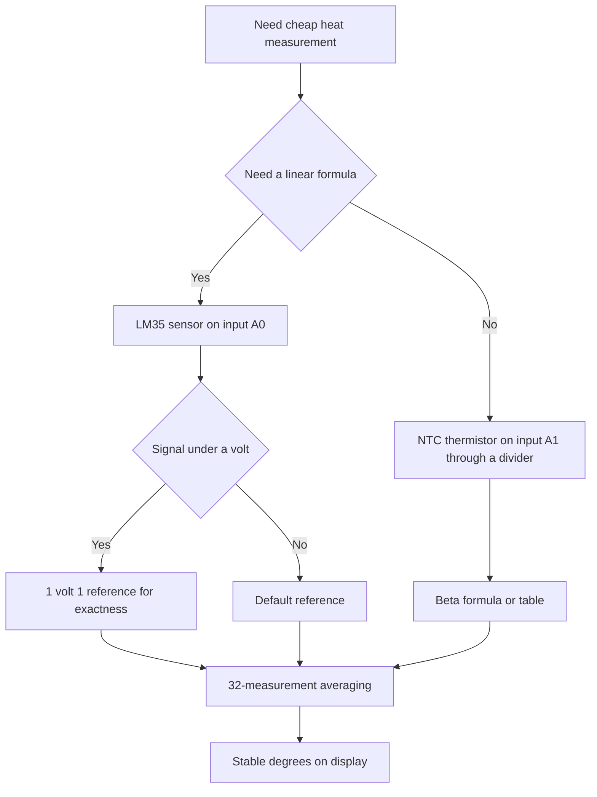

# LM35 and NTC - Analog Temperature

![[assets/img/arduino-lm35-ntc-scheme.png|600]]
*Fig. Wiring of LM35 and NTC to Arduino analog inputs with a divider.*

> [!tip] Purpose of the note
> Teach cheap heat measurement with no digits: read the linear LM35, count the NTC thermistor through a divider, boost exactness with a reference and smooth noise with averaging.

## 1. Purpose

An analog sensor outputs voltage that tracks temperature.

The board measures this voltage with a built-in converter.

The linear LM35 outputs ten millivolts per degree.

The NTC thermistor changes resistance nonlinearly with heat.

The first sensor is simple in formula.

The second sensor is cheap and sealed.

Both read with a plain analog input.

This note closes the full loop: formulas, divider, reference, averaging and two sketches.

Grasping these topics removes most questions about jumping readings.

Converter basics are in [[EN/06-Analog/01-ADC.en|voltage measurement]].

Digital options are in [[EN/10-Sensors/01-DHT-DS18B20.en|wire temperature]].

## 2. Sensor comparison

| Parameter | LM35 | NTC 10 kiloohm |
| --- | --- | --- |
| Output | Voltage at 10 millivolts per degree | Resistance falls with heat |
| Formula | Linear, times one hundred | Nonlinear, beta formula or table |
| Range | From 0 to 100 degrees | From minus 40 to plus 125 degrees |
| Accuracy with no calibration | About 1 degree | About 1 degree with correct beta |
| Wiring | Three pins straight to the board | Divider with a fixed resistor |
| Price | Middle | Lowest |
| Sealing | Plastic case | Beads and sleeves for water exist |
| When to take | Room, case, radiator | Street, water, radiator, cheap series |

The table shows the choice between simplicity and price.

The linear sensor fits quick experiments.

The thermistor fits series and wet spots.

Both demand a stable power supply.

Power supply swing hits readings directly.

So set the reference and averaging with care.

Long wires add noise.

Run analog ground separately.

Split digital bursts with a pause.

## 3. LM35: ten millivolts per degree

| LM35 contact | Where to run | Explanation |
| --- | --- | --- |
| VCC | 5 volts of the board | Crystal power supply |
| GND | Board ground | Common measurement point |
| OUT | Analog input, for example A0 | Signal at 10 millivolts per degree |

The formula is simple: voltage in volts times one hundred.

Room 25 degrees gives a quarter volt.

Zero degrees gives zero volts.

One hundred degrees gives one volt.

The 5 volt converter scale serves only a fifth of its range.

The measurement step is about half a degree.

For finer reading switch on the inner reference.

The 1 volt 1 reference gives a step near a tenth of a degree.

The sensor heats from its own current negligibly.

Self-heating never tops tenths of a degree.

Put the case into airflow.

Heat paste improves radiator contact.

```text
Підключення LM35 до Uno:

   плата Uno             датчик LM35
   ---------             -----------
   5V    --------------- VCC
   GND   --------------- GND
   A0    --------------- OUT

   Конденсатор 100 нФ між VCC і GND біля датчика.
   Дроти бажано короткі, до 1 метра.
   Аналогову землю ведуть окремо від силових.
```

The schematic shows three wires and a power supply filter.

The capacitor cuts power supply spikes.

With no capacitor readings tremble.

Long wires catch mains hum.

A twisted pair with ground cuts noise.

Isolate the metal sensor case from the radiator.

Direct contact with high voltage is forbidden.

Take power supply from the board, not from a pulse unit.

## 4. LM35 sketch with reference

| Line | What it does | Why so |
| --- | --- | --- |
| analogReference INTERNAL | 1 volt 1 reference | Fine step for small voltages |
| analogRead on A0 | Code from 0 to 1023 | Raw input reading |
| Code to voltage | Code divided by 1023 times 1 volt 1 | Volt recovery |
| Voltage to degrees | Volts times 100 | Ten millivolts per degree |
| 64-time averaging | Sum loop | Divides noise eight times |
| 200 millisecond pause | Calm monitor | Readable output |

The inner reference gives a stable scale top.

USB power supply walks, the reference holds.

So reference accuracy runs higher.

Skip first measurements after a reference change.

The reference node settles several milliseconds.

Averaging removes random noise.

Sixty-four measurements take six milliseconds.

For a thermometer the delay never shows.

Calibration shrinks to one multiplier.

Tune the multiplier against a room thermometer.

```cpp
const int LM35_PIN = A0;

void setup() {
  Serial.begin(9600);
  analogReference(INTERNAL);
  delay(10);
}

float readLM35() {
  long sum = 0;
  for (int i = 0; i < 64; i++) {
    sum += analogRead(LM35_PIN);
  }
  float raw = sum / 64.0;
  float voltage = raw * 1.1 / 1023.0;
  return voltage * 100.0;
}

void loop() {
  float t = readLM35();
  Serial.print("LM35: ");
  Serial.print(t, 1);
  Serial.println(" C");
  delay(500);
}
```

The sketch switches the 1 volt 1 reference on at start.

The pause lets the reference node settle.

The function gathers a pack of 64 codes.

The sum uses long type for margin.

Dotted division keeps the fraction.

Times one hundred gives degrees.

One-digit printing shows true accuracy.

A half-second pause keeps the monitor calm.

With no averaging the last digit trembles.

With averaging the line stays even.

Such a way fits a room and a radiator.

## 5. NTC: divider and beta formula

| Element | Value | Practical sense |
| --- | --- | --- |
| Rating | 10 kiloohm at 25 degrees | Most mass-series |
| Beta | About 3950 kelvins | Curve steepness |
| Pair resistor | 10 kiloohm one percent | Second divider arm |
| Circuit | Thermistor to power supply, resistor to ground | Middle to analog input |
| Range | Middle walks from zero to power supply | Useful signal for the whole travel |
| Table | Formula option | More exact for a responsible task |

The thermistor changes resistance exponentially.

A straight voltage formula never fits.

First recover resistance from voltage.

Then count temperature from resistance.

The beta formula ties resistance and temperature through a logarithm.

Temperature counts in kelvins.

Degrees come from minus 273 degrees 15.

Beta comes from the exact series datasheet.

Most often 3950 shows up.

Wrong beta shifts the range edges.

Exact tasks calibrate at two points.

A table gives better accuracy with no math.

```text
Подільник NTC на 10 кОм:

   5V ---- [NTC 10k] ----+---- [R 10k] ---- GND
                         |
                        вхід А1

   При 25 градусах середина дає 2 вольти 5.
   Нагрів знижує опір NTC, напруга падає.
   Охолодження підвищує опір, напруга росте.
   Резистор беруть точний, один відсоток.
   Паралельно резистору ставлять 100 нФ.
```

The schematic shows the classic half divider.

The middle goes to the analog input.

The capacitor smooths noise.

The 10 kiloohm ratings give small current.

Current near a quarter milliamp never heats the bead.

Thermistor self-heating is negligible.

Twist long lines as a pair.

Run divider ground to the board.

## 6. NTC sketch with beta and table

| Step | Formula | Explanation |
| --- | --- | --- |
| Code to voltage | raw divided by 1023 times 5 | Middle volt recovery |
| Voltage to resistance | R times volts divided by the difference | Divider conversion |
| Resistance to temperature | Log of ratio plus drift | Beta formula in kelvins |
| Kelvins to degrees | Minus 273 degrees 15 | Familiar scale |
| Averaging | 32-measurement pack | Clean line with no tremble |
| Table | Interpolation between neighbors | Spare exact method |

The beta formula demands a natural logarithm.

The logarithm counts with a built-in function.

Kelvin temperature turns to degrees.

A break check catches zero code.

A short check catches full scale.

Both edges mean a sensor fault.

The table method reads calibration points.

Points measure in ice and in boiling.

Linear interpolation runs between points.

The table beats universal beta in accuracy.

```cpp
#include <math.h>

const int NTC_PIN = A1;
const float R_FIXED = 10000.0;
const float R_NOM = 10000.0;
const float T_NOM = 25.0 + 273.15;
const float BETA = 3950.0;

float readNTC() {
  long sum = 0;
  for (int i = 0; i < 32; i++) {
    sum += analogRead(NTC_PIN);
  }
  float raw = sum / 32.0;
  if (raw < 1.0 || raw > 1022.0) {
    return -1000.0;
  }
  float v = raw * 5.0 / 1023.0;
  float r = R_FIXED * v / (5.0 - v);
  float k = 1.0 / (1.0 / T_NOM + log(r / R_NOM) / BETA);
  return k - 273.15;
}

void setup() {
  Serial.begin(9600);
}

void loop() {
  float t = readNTC();
  if (t < -900.0) {
    Serial.println("Обрив або замикання NTC");
  } else {
    Serial.print("NTC: ");
    Serial.print(t, 1);
    Serial.println(" C");
  }
  delay(500);
}
```

The sketch averages 32 measurements for cleanliness.

The edge check catches wire faults.

The divider formula recovers resistance.

The beta formula gives kelvins.

Minus the constant gives degrees.

Printing shows a number or a fault.

A half second pause unloads the monitor.

Constants sit on top for calibration.

Tune beta to your datasheet.

Measure the pair resistor rating with a multimeter.

## 7. Reference and averaging for exactness

| Trick | What it gives | When to take |
| --- | --- | --- |
| 1 volt 1 reference | 1 millivolt step instead of 5 | Small LM35 signals |
| Outer 3 volt 3 reference | Stable scale | Exact NTC dividers |
| 32-measurement averaging | Five times less noise | Any slow thermometer |
| Median of 5 reads | Cuts outliers | Noise from relays and motors |
| 100 nanofarad capacitor | Cuts spikes | Near every analog input |
| Separate ground | Clean zero | Long analog lines |

The default reference equals board power supply.

USB power supply walks with load.

Power supply walking shifts degrees directly.

The inner reference never depends on USB.

So move LM35 to the inner reference.

For NTC the divider power supply stability matters.

Feed the divider from the same rail as the reference.

Then swing shrinks.

Averaging divides random noise.

A median also cuts single spikes.

The mix gives an even line.

See bus climate in [[EN/10-Sensors/02-BME280.en|bus climate]].

See distance and motion in [[EN/10-Sensors/03-HC-SR04-PIR.en|distance and motion]].

## Mermaid: analog sensor choice



The schematic reads top down: first simplicity.

Linearity leads to LM35 with times one hundred.

Cheapness leads to NTC with a divider.

A small signal demands a small reference.

The beta formula closes nonlinearity.

Averaging closes noise.

## Common issues

| # | Issue | Why bad | How correct |
| --- | --- | --- | --- |
| 1 | LM35 on a 5 volt reference with no averaging | Half-degree step and digit tremble | 1 volt 1 reference plus a 64-measurement pack |
| 2 | NTC with no exact pair resistor | Unknown divider arm skews degrees | 10 kiloohm one percent resistor, rating in code |
| 3 | Wrong 3950 beta for a foreign series | Range edges lie by degrees | Take beta from your own bead datasheet |
| 4 | Long analog wires with no capacitor | Mains hum swings readings | 100 nanofarads near the input, twisted pair, separate ground |
| 5 | Divider power supply from a sagging rail | The formula counts from 5 volts, real lower | Measure real power supply or feed from a stable reference |
| 6 | Ignoring sensor break | A break reads as temperature | Check scale edges and print a fault |

## Official sources

- [Analog input on docs.arduino.cc](https://docs.arduino.cc/learn/microcontrollers/analog-input/) - scale, reference and measurement averaging.
- [LM35 sensor on arduino.cc](https://www.arduino.cc/reference/en/libraries/lm35/) - ten millivolts per degree formula and example.
- [LM35 datasheet by Texas Instruments](https://www.ti.com/product/LM35) - range, accuracy and connection schematic.

## See also

- [[Home.en]]
- [[EN/10-Sensors/01-DHT-DS18B20.en|wire temperature]]
- [[EN/10-Sensors/02-BME280.en|bus climate]]
- [[EN/10-Sensors/03-HC-SR04-PIR.en|distance and motion]]
- [[EN/06-Analog/01-ADC.en|voltage measurement]]
- [[EN/03-GPIO/01-Digital-Pins.en|digital pins]]
