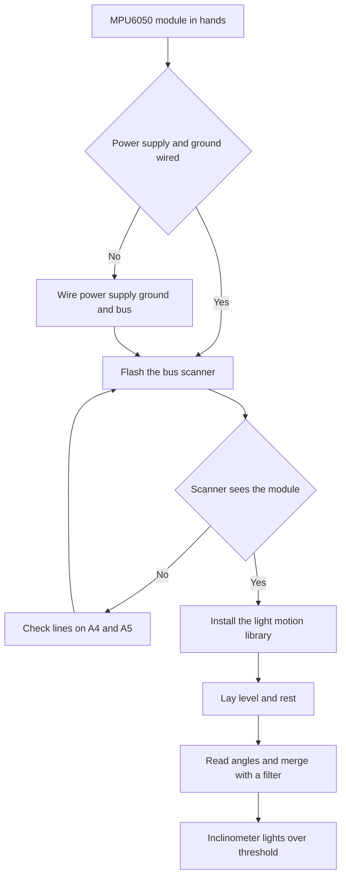

# MPU6050 on Arduino - Motion and Tilt

![[assets/img/arduino-mpu-scheme.png|600]]
*Fig. Wiring of MPU6050 to Arduino over the bus with power supply and data lines.*

> [!tip] Purpose of the note
> Teach seeing board motion and tilt: wire the module over two wires, remove rest offset, merge two sensor data into a stable angle and build a simple inclinometer.

## 1. Purpose

The MPU6050 module joins two sensors in one crystal.

The accelerometer measures acceleration on three axes with the gravity direction.

The gyroscope measures turn rate on the same three axes.

Together the pair gives the full board motion picture in space.

Such a node fits entry-level balancers and quadrocopters.

It fits gesture remotes and home-made camera stabilizers.

It fits tilt meters for solar panels and antenna masts.

The board reads the module over a two-wire bus.

Such bus basics are in [[EN/04-Interfaces/03-I2C-Wire.en|two-wire bus]].

New-data readiness can catch a board interrupt.

Such trick details are in [[EN/03-GPIO/03-Interrupts.en|board interrupts]].

This note closes the loop: power supply, address, library, rest, angles and a ready inclinometer.

## 2. What sits inside the module

| Block | What it does | Practical sense |
| --- | --- | --- |
| Accelerometer | Measures acceleration on X Y Z axes | At rest shows the gravity vector |
| Gyroscope | Measures turn rate on the same axes | Fast turn response with no lag |
| Temperature sensor | Measures crystal heat | Zero drift control on warm-up |
| Converter | Turns analog to digital at 16 bits | Fine tilt sensitivity step |
| Exchange bus | Two wires for commands and data | Common bus with other modules |
| Interrupt pin | New-measurement ready signal | Exact poll period with no misses |
| Address pin | Choice between two addresses | Two modules on one bus |

The module feeds from low logic voltage.

Most module boards have an on-board regulator.

Such a regulator allows module power supply from five volts.

Bus logic levels stay low in level.

The Uno board calmly reads low levels as logic one.

The crystal feels vibration and hits.

Mount the module on stands with no board warp.

Tighten screws evenly with no base bend.

Solder cracks give floating zeros and angle jumps.

For climate tasks better check [[EN/10-Sensors/02-BME280.en|bus climate]].

For gas alarm check [[EN/10-Sensors/06-MQ-Gas.en|gases and smoke]].

## 3. Power supply and bus wiring

| Module contact | Where to run | Explanation |
| --- | --- | --- |
| VCC | Five volts of the board | Through the on-board regulator to low voltage |
| GND | Board ground | Common point for power supply and bus |
| SCL | Analog input A5 on Uno | Bus clock line |
| SDA | Analog input A4 on Uno | Bus data line |
| AD0 | Ground or power supply | Junior module address bit |
| INT | Digital pin D2 if wanted | New-measurement ready signal |
| XDA and XCL | Leave free | For an outer magnetometer in complex circuits |

Power supply goes to VCC and ground.

Ground runs on a separate short wire.

Bus lines run near ground with no long loops.

Line length better stays under one meter.

Bus pull-ups already sit on the module board.

Extra resistors are not needed.

The address depends on the level on the AD0 pin.

Ground gives address 0x68, power supply gives address 0x69.

Most shop modules have address 0x68.

Before code scan the bus with a scanner sketch.

The scanner prints all addresses that answered the request.

```text
Підключення MPU6050 до Uno по шині:

   плата Uno              модуль MPU6050
   ---------              -------------
   5V    ---------------- VCC
   GND   ---------------- GND
   A5    ---------------- SCL
   A4    ---------------- SDA
   AD0   --- до GND дає адресу 0x68
   AD0   --- до живлення дає адресу 0x69
   D2    --- до INT для точних періодів

   Підтяжки шини вже стоять на модулі.
   Довжина ліній бажано до 1 метра.
   Модуль покласти горизонтально для нуля кутів.
```

The schematic shows four mandatory wires.

The fifth address wire sets the junior bit.

The sixth interrupt wire serves even periods.

With no interrupt poll with a code timer.

See exact supply voltage measurement in [[EN/06-Analog/01-ADC.en|voltage measurement]].

Lay the module level with the mark up.

Such position gives zero angles after calibration.

Flipped mounting shifts by one hundred eighty degrees.

Check axis directions against the module board print.

The Z axis at rest shows one gravity unit.

The X and Y axes at rest show zeros.

## 4. MPU6050_light library and first reading

| Element | Name | Practical sense |
| --- | --- | --- |
| Library | MPU6050_light | Light work with no complex dependencies |
| Bus dependency | Built-in Wire library | Drives the two exchange wires |
| Object | MPU6050 mpu with address | Stores address and zero offset |
| Start | mpu dot begin | Checks link and wakes the crystal |
| Calibration | mpu dot calcOffsets | Counts offsets in still state |
| Update | mpu dot update | Reads fresh data from the crystal |
| Angles | mpu dot getAngleX getAngleY | Ready-made angles with inner merge |
| Acceleration | mpu dot getAccX getAccY getAccZ | Raw acceleration for own formulas |

The library installs through the manager by the MPU6050_light name.

Nothing extra installs with it.

The bus starts with a begin call.

The object is created with the scanner address.

Start returns an exchange success flag.

A failed start means broken wires or a foreign address.

After start leave the module still for rest.

The rest function counts mean zero offsets.

With no rest angles float aside in minutes.

```cpp
#include <Wire.h>
#include <MPU6050_light.h>

MPU6050 mpu(Wire);

void setup() {
  Serial.begin(9600);
  Wire.begin();
  byte status = mpu.begin();
  Serial.print("Статус старту: ");
  Serial.println(status);
  Serial.println("Тримай плату нерухомо зараз");
  delay(1000);
  mpu.calcOffsets(true, true);
  Serial.println("Готово, можна рухати");
}

void loop() {
  mpu.update();
  Serial.print("Кут Ікс: ");
  Serial.print(mpu.getAngleX());
  Serial.print("  Кут Ігрек: ");
  Serial.print(mpu.getAngleY());
  Serial.print("  Кут Зет: ");
  Serial.println(mpu.getAngleZ());
  delay(100);
}
```

The sketch starts the bus and checks module presence.

The pause before rest lets hands remove vibration.

The rest function prints progress to the port monitor.

After rest read three angles in a loop.

A one hundred millisecond pause keeps the monitor calm.

Sharp moves show as angle jumps.

Smooth tilts show as smooth number change.

Stable power supply gives stable zeros.

## 5. Rest calibration

| Step | Action | Explanation |
| --- | --- | --- |
| Position | Lay the module level | Zero angles match a flat surface |
| Stillness | Never touch the table during rest | Steps and knocks spoil the mean |
| Length | Let the library finish the series | Hundreds of measurements kill noise |
| Repeat | Rest at every power on | Zero floats with temperature and power supply |
| Temperature | Warm the board minutes before an exact zero | The crystal drifts on warm-up |
| Saving | For simple tasks count every time | For exact tasks write down and reuse |
| Check | After rest angles sit near zero | Rest drift signals a shaking base |

Calibration removes factory zero spread.

Every crystal has its own accelerometer shift.

Every gyroscope has its own rate shift.

With no shift removal angles crawl even on a table.

The gyroscope crawls faster, the accelerometer noises stronger.

Rest counts the mean in still state.

The mean subtracts from every new measurement.

The procedure demands full stillness.

The module lies on a massive base.

Wires fix so they never pull the board.

Hands leave the table for the series time.

```text
Порядок спокою для стабільного нуля:

   1. Поклади модуль горизонтально на стіл.
   2. Зафіксуй дроти, щоб не тягнули плату.
   3. Увімкни живлення і зачекай хвилину прогріву.
   4. Виклич функцію спокою і не торкайся столу.
   5. Дочекайся повідомлення про готовність.
   6. Перевір нулі: кути стоять біля нуля.
   7. Похитай плату і глянь відгук кутів.

   Спокій повторюй при кожному вмиканні.
   Точний нуль роби після прогріву плати.
```

The sequence shows the path from table to zero.

Warm-up before rest cuts repeated drift.

A massive table kills micro vibration.

Hanging wires give slow zero swings.

After rest angles hold near zero at rest.

Slow zero walk at rest signals draft or heat.

Such walk heals with repeated rest.

## 6. Angles through a complementary filter

| Source | Pros | Cons |
| --- | --- | --- |
| Accelerometer | Absolute gravity direction with no drift | Noises on shake and never sees vertical turn |
| Gyroscope | Fast smooth turn response | Error integration piles and crawls |
| Complementary filter | Joins stability and speed | Needs a time constant per task |
| Alpha constant 0 point 96 | Trust in gyroscope on short moves | Slow pull to horizon |
| Alpha constant 0 point 98 | Even smoother angle for shake | Slower reaction to true tilt |
| 10 millisecond period | Even integration steps | Uneven period gives scale error |
| Ready interrupt | Even period with no tremble | Needs a free interrupt pin |

The accelerometer angle counts through arctangent.

The axis ratio gives tilt against the vertical.

Such an angle never floats but trembles on vibration.

The gyroscope angle counts with rate integration.

Rate times inter-measurement time.

Such an angle is smooth but crawls with zero shift.

The filter takes the fast gyroscope as base.

The slow accelerometer pulls the base to horizon.

The formula looks like a weighted sum of two estimates.

The factor sets trust in the gyroscope.

The period measures with stamp difference.

Uneven period breaks integration scale.

So hold the period steady with an interrupt or a timer.

```cpp
// Комплементарний фільтр для осі Ікс
// читання дають прискорення ax az і швидкість gx

float alpha = 0.96;
float dt = 0.01;
float angleX = 0.0;

void loopFilter(float ax, float ay, float az, float gx) {
  float accAngle = atan2(ay, az) * 57.2958;
  float gyroAngle = angleX + gx * dt;
  angleX = alpha * gyroAngle + (1.0 - alpha) * accAngle;
}
```

The fragment shows the heart of two-estimate merging.

The accelerometer angle gives drift-free support.

The gyroscope angle gives noise-free speed.

The weighted sum gives a stable fast result.

Tune the constant to the shake level.

Heavy shake demands less trust in the accelerometer.

A calm tilt meter allows more trust in the accelerometer.

The formula period must match the real period.

Measure the real period with microsecond stamps.

## 7. Full inclinometer

| Inclinometer element | Value | Practical sense |
| --- | --- | --- |
| Poll period | 10 milliseconds | One hundred measurements per second for a smooth angle |
| Accelerometer range | Plus minus 2 g | Finest step for tilt |
| Gyroscope range | 250 degrees per second | Finest rate step |
| Stillness threshold | Count small rates as zero | Guard against rest crawl |
| Averaging | Sliding mean over 5 measurements | Kills noise with no speed loss |
| Output | Port monitor and LED threshold | Tilt over threshold lights |
| Power supply | Separate stable node | Power supply ripple gives angle noise |

Ranges set minimum for exactness.

Large ranges serve hits and spins.

The inclinometer works with small angles and rates.

Minimum ranges give the finest step.

The stillness threshold cuts zero noise.

With no threshold the angle crawls from rest noise.

A large threshold loses slow tilts.

Averaging smooths accelerometer tremble.

Long averaging lags the angle.

Short averaging leaves noise.

```cpp
#include <Wire.h>
#include <MPU6050_light.h>

MPU6050 mpu(Wire);
const int LED_PIN = 13;
const float LIMIT = 15.0;

void setup() {
  Serial.begin(9600);
  pinMode(LED_PIN, OUTPUT);
  Wire.begin();
  mpu.begin();
  Serial.println("Не рухай плату зараз");
  delay(1000);
  mpu.calcOffsets(true, true);
  Serial.println("Інклінометр готовий");
}

void loop() {
  mpu.update();
  float ax = mpu.getAngleX();
  float ay = mpu.getAngleY();
  Serial.print("Нахил Ікс=");
  Serial.print(ax, 1);
  Serial.print("  Ігрек=");
  Serial.println(ay, 1);
  if (abs(ax) > LIMIT || abs(ay) > LIMIT) {
    digitalWrite(LED_PIN, HIGH);
  } else {
    digitalWrite(LED_PIN, LOW);
  }
  delay(100);
}
```

The sketch builds a full inclinometer with indication.

After rest read angles in a loop.

Over-threshold lights the board LED.

Hysteresis can add a second release threshold.

Set the threshold to the panel mount task.

For a level alarm take a small degree threshold.

For a coarse alarm take a large threshold.

Double the LED with sound through an active buzzer.

Feed the buzzer separately through a transistor switch.

## 8. DMP overview

| Question | Answer |
| --- | --- |
| What DMP is | Built-in motion processor in the crystal |
| What it counts | Quaternions and angles with no board help |
| Why good | Unloads the board and gives stable angles |
| Why complex | Closed firmware and complex libraries |
| When to take | Balancer and copter with a fast loop |
| When never to take | Simple tilt meter and learning from zero |
| Option | Light library plus own filter |

The built-in processor takes over merge math.

The board picks ready-made angles from the buffer.

Such a path loads the controller less.

Closed firmware complicates debugging.

DMP libraries run heavier and fussy about versions.

Newcomers better start with the light library.

The light library teaches the nature of both sensors.

After grasping the filter the DMP move turns conscious.

A learning inclinometer never needs DMP.

A fast balancer gains loop time margin from DMP.

The choice depends on control loop speed.

## Mermaid: MPU6050 start from zero



The schematic reads top down: first power supply.

Power supply and ground are the live-module condition.

The scanner proves the address before the main code.

Line checking closes most failures.

The light library removes manual bus math.

Rest removes zero offset.

The filter gives a stable drift-free angle.

The end gives an inclinometer with indication.

## Common issues

| # | Issue | Why bad | How correct |
| --- | --- | --- | --- |
| 1 | Module power supply with no common board ground | The bus sees trash, the module comes and goes | Run a separate short ground wire between boards |
| 2 | Skipped rest after power on | Zeros float, angles crawl aside in minutes | Hold still and call rest at every start |
| 3 | Reading with no steady period | Gyroscope integration lies, angle scale floats | 10 millisecond period with a timer or a ready interrupt |
| 4 | Maximum ranges for small tilts | Coarse step eats inclinometer exactness | Set small ranges for exact angles |
| 5 | Mount on a flex base with tight wires | Vibration and pull give a crawling zero | Rigid stands, tail fixing, even screw tightening |
| 6 | Trust in a raw accelerometer angle on shake | Shake noise swings readings by dozens of degrees | Merge data with a complementary filter and a tuned constant |

## Official sources

- [MPU6050 on docs.arduino.cc](https://docs.arduino.cc/learn/electronics/im/) - motion module wiring and tilt reading.
- [MPU6050_light library on arduino.cc](https://www.arduino.cc/reference/en/libraries/mpu6050_light/) - rest, update and angle reading.
- [MPU6050 datasheet by InvenSense](https://invensense.tdk.com/products/motion-tracking/6-axis/mpu-6050/) - ranges, addresses and sensor accuracy.

## See also

- [[Home.en]]
- [[EN/04-Interfaces/03-I2C-Wire.en|two-wire bus]]
- [[EN/03-GPIO/03-Interrupts.en|board interrupts]]
- [[EN/06-Analog/01-ADC.en|voltage measurement]]
- [[EN/10-Sensors/02-BME280.en|bus climate]]
- [[EN/10-Sensors/06-MQ-Gas.en|gases and smoke]]
