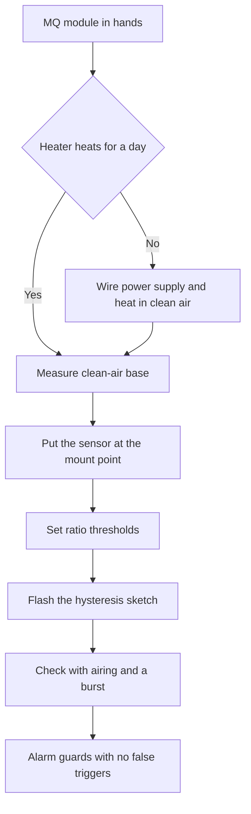

# MQ Sensors on Arduino - Smoke and Gases

![[assets/img/arduino-mq-scheme.png|600]]
*Fig. Wiring of an MQ sensor to Arduino with an analog input and a trigger threshold.*

> [!tip] Purpose of the note
> Teach honest alarm with no magic: warm the heater for a day, find clean-air resistance, work thresholds with hysteresis and never draw fake units from air.

## 1. Purpose

An MQ series sensor hears smoke and fuel gases in air.

The sensitive layer changes resistance on gas contact.

The board measures this resistance through a voltage divider.

Resistance change turns into an alarm signal.

Such a node fits a kitchen leak alarm.

It fits a boiler room near the boiler and the meter.

It fits a workshop with paints and solvents.

This is a danger indicator, not a lab analyzer.

Exact units demand a chamber and reference mixes.

A home board gives clean dirty levels and an alarm threshold.

This note closes the loop: heater, warm-up, clean-air resistance, thresholds and a siren with hysteresis.

See exact divider voltage measurement in [[EN/06-Analog/01-ADC.en|voltage measurement]].

Two-wire bus basics for the alarm display are in [[EN/04-Interfaces/03-I2C-Wire.en|two-wire bus]].

See climate measurements for compare in [[EN/10-Sensors/02-BME280.en|bus climate]].

See the motion and tilt node for case guard in [[EN/10-Sensors/05-MPU6050.en|motion and tilt]].

## 2. Which MQ exist

| Model | What it hears best | Where to put |
| --- | --- | --- |
| MQ2 | Liquified gas, propane, smoke, hydrogen | Kitchen, tank, boiler room |
| MQ4 | Methane and natural gas | Meter, boiler, stove |
| MQ5 | Natural gas and propane | Boiler room and country house |
| MQ7 | Carbon monoxide | Garage, boiler room with a stove |
| MQ9 | Carbon monoxide and fuel gases | Mixed alarms |
| MQ135 | Ammonia, hydrogen sulfide, benzene, smoke | Workshop, farm, ventilation |
| MQ136 | Hydrogen sulfide | Sewage and treatment nodes |

The table shows sensitive-layer specialization.

No universal sensor for all gases exists.

Every layer peaks at its own group.

Neighbor gases the layer also sees, but weaker.

So call the sensor a group indicator, not a selective device.

For a tank kitchen take MQ2.

For a natural-gas flat take MQ4 or MQ5.

For carbon monoxide take MQ7.

For air quality and smoke take MQ135.

Two different sensors side by side give a better picture.

An MQ2 plus MQ135 pair closes leak and smoke.

Sensor choice starts from the danger source.

The danger source dictates the sensor model.

Then tune thresholds to the room.

Foreign internet thresholds with no calibration lie.

## 3. Heater and current

| Element | Value | Practical sense |
| --- | --- | --- |
| Heater | Coil inside the sensor tube | Heats the layer to work temperature |
| Heater power supply | Five volts steady | A cold layer never hears gas |
| Heater current | About 150 milliamps | Heavy load for the board |
| Power | About 800 milliwatts | The sensor case warm to touch |
| Sensitive layer | Tin dioxide on ceramic | Resistance falls in gas presence |
| Load resistor | From 1 kiloohm to 47 kiloohms | Divider with the sensor resistance |
| Analog output | Divider middle to input A0 | Voltage grows with concentration |
| Digital output | Comparator with trim | Ready-made threshold with no code |

The heater demands stable five volts.

Power supply from a weak converter gives floating readings.

The Uno board pulls one heater from its own regulator.

Two heaters demand a separate power supply unit.

Join unit and board grounds at one point.

Long thin wires give voltage sag.

Sag cools the layer and shifts readings.

The sensor heats always during work.

Never seal a hot case shut.

The sensor needs air access through the mesh.

The mesh guards against dust and spray.

Dust on the mesh shifts sensitivity down.

Blow the case with clean air in turn.

```text
Підключення MQ модуля до Uno:

   плата Uno              модуль MQ
   ---------              ----------
   5V    ---------------- VCC
   GND   ---------------- GND
   A0    ---------------- A0 аналоговий вихід
   D7    ---------------- D0 цифровий поріг
   Потенціометр на модулі крутить поріг D0

   Нагрівач бере близько 150 міліампер.
   Два модулі живити від окремого блока 5V.
   Землі блока і плати зєднати разом.
   Дроти живлення короткі і товсті.
```

The schematic shows both module outputs at once.

The analog output gives a smooth growth curve.

The digital output gives a sharp comparator threshold.

Turn the comparator threshold with a screwdriver on the module.

The module LED doubles the threshold trigger.

For serious logic read the analog input with code.

Code gives hysteresis and delays with no false triggers.

A hysteresis-free comparator chatters on the edge.

So build responsible alarm with code.

## 4. Day warm-up and clean air

| Stage | Length | Explanation |
| --- | --- | --- |
| New sensor first warm-up | Day of steady heating | Burning factory dirt from the layer |
| Daily warm-up | Minutes after power on | Reaching layer work temperature |
| Airing | Clean air with no aerosols | Zero calibration support |
| Ban | Cigarette smoke and paint fumes near | Poison the layer and shift zero |
| Place | Window in airing mode | Cleanest home air |
| Control | Readings stand even | A floating zero signals draft or cold |
| Repeat | After move and repair | New background demands a new zero |

A new out-of-box sensor lies the first day.

The factory layer holds production leftovers.

The heater burns them over a day.

With no day readings float down for hours.

Put the sensor into clean air near a window.

Leave power supply on with no breaks.

Write down the analog input value hourly.

The curve first falls, then stays even.

An even stretch means calibration readiness.

A daily start also demands minutes of warm-up.

A cold layer shows overstated values.

The program must stay silent and heat first minutes.

Allow alarm only after warm-up.

Else every power on gives a false siren.

```text
Порядок першого запуску нового MQ:

   1. Винеси модуль у чисте повітря біля вікна.
   2. Підключи живлення 5V і землю.
   3. Лиши нагрівач увімкненим на добу.
   4. Раз на годину записуй число з входу А0.
   5. Дочекайся рівної ділянки без падіння.
   6. Зафіксуй опір чистого повітря як опору.
   7. Перенеси датчик на місце і вистав пороги.

   Живлення не вимикати протягом доби.
   Аерозолі і дим тримати подалі від сіточки.
```

The sequence shows the path from box to base.

A day of warm-up saves weeks of false alarms.

Number logs show the settle moment.

An even stretch hours long means readiness.

After readiness move to resistance measurement.

Moving to the mount point changes air background.

Kitchen and workshop background differs from a window.

So set thresholds already in place.

Keep the base as a factory reference point.

## 5. Ro in clean air

| Value | Formula | Explanation |
| --- | --- | --- |
| Raw number | ADC from 0 to 1023 | Board analog input count |
| Voltage | ADC divided by 1023 times 5 | Voltage on the divider middle |
| Sensor resistance | Rs equals power supply minus output difference | Layer resistance in current air |
| Base | Ro equals Rs in clean air | Reference point for all thresholds |
| Ratio | Rs divided by Ro | Unit-free dirt measure |
| Clean air | Ratio near one | The layer in balance with clean background |
| Dirt | Ratio falls under one | Gas lowers layer resistance |

Sensor resistance counts from the voltage divider.

The load resistor is known from marking.

Output voltage gives current through the divider.

Current gives sensor resistance by Ohm law.

Fix the base in clean air after a day.

The resistance ratio removes sample spread.

Every sensor has its own base spread.

Never carry absolute numbers from a foreign sensor.

Carry only the method and the ratio.

Ratio one means clean air.

Ratio half means heavy dirt.

Exact units demand a reference chamber.

With no chamber speak levels, not units.

```cpp
// Вимір опору сенсора і пошук опори
// читати на чистому повітрі після доби прогріву

const int MQ_PIN = A0;
const float VCC = 5.0;
const float RL = 10.0;

float readRs() {
  int adc = analogRead(MQ_PIN);
  if (adc <= 0) {
    adc = 1;
  }
  if (adc >= 1023) {
    adc = 1022;
  }
  float vout = adc * VCC / 1023.0;
  float rs = (VCC - vout) * RL / vout;
  return rs;
}

void setup() {
  Serial.begin(9600);
}

void loop() {
  float rs = readRs();
  Serial.print("Опір Rs у кілоомах: ");
  Serial.println(rs, 2);
  delay(1000);
}
```

The sketch prints layer resistance in kiloohms.

Edge-range guard removes division by zero.

In clean air log the mean over ten minutes.

The mean becomes the threshold base.

Store the base in a program constant.

Comment the base with date and place.

Such a comment saves on sensor swap.

A new sample demands a new base.

Never reuse a foreign sensor old base.

## 6. Thresholds not ppm

| Way | What it promises | Why it fails at home |
| --- | --- | --- |
| Datasheet table | Ratio to unit conversion | The curve fits a reference chamber, not a kitchen |
| Foreign factors | Ready-made internet numbers | Another sample, another resistor, another background |
| Log scale | Nice graph | Small noise gives a large unit error |
| With no temperature | One formula for all seasons | The layer floats with cold and humidity |
| Level thresholds | Alarm by ratio | Works stable with no chamber |
| Place calibration | Threshold for your own room | Counts kitchen or workshop background |
| Hysteresis | Two on and off thresholds | Removes siren chatter on the edge |

The datasheet curve plots for reference conditions.

A home kitchen never repeats the maker chamber.

Temperature and humidity shift the curve aside.

Layer aging shifts the curve down over months.

So units from such a curve give an exactness illusion.

The honest way works with dirt levels.

Clean level means a near-one ratio.

Watch level means a clear ratio fall.

Alarm level means a deep fall stable in time.

Tune thresholds with a test in place.

An aired room gives the top edge.

A light stove smell gives the middle edge.

A steady fall under the low edge gives alarm.

Prove alarm with a seconds-long hold.

A momentary aerosol burst must never fire the siren.

A steady overrun over half a minute fires the siren.

## 7. Full alarm with hysteresis

| Element | Value | Practical sense |
| --- | --- | --- |
| Input | Analog input A0 | Smooth dirt curve |
| Averaging | Mean of 20 measurements | Kills heater noise |
| Alarm threshold | Ratio 0 point 6 | Fires the siren on fall under |
| Release threshold | Ratio 0 point 75 | Drops the siren on airing |
| Switch-on hold | 30 seconds of steady overrun | Guard against short bursts |
| Start warm-up | 3 minutes of silence | A cold layer gives no alarm |
| Outputs | LED and active buzzer | Light plus sound for a kitchen |
| Buzzer power supply | Through a transistor switch | Siren current never sags power supply |

Hysteresis splits on and off thresholds.

The siren fires on the low threshold.

The siren drops only on the higher threshold.

Between thresholds state holds with no chatter.

With no hysteresis the siren crackles on the edge.

Averaging kills short bursts.

The hold demands overrun steadiness.

Start warm-up blocks a false start.

Feed the buzzer through a switch, not from a pin.

A board pin never pulls a loud siren current.

The LED doubles sound for a noisy room.

A reset button proves aired state.

```cpp
#include <EEPROM.h>

const int MQ_PIN = A0;
const int LED_PIN = 8;
const int BUZZ_PIN = 9;
const float RL = 10.0;
const float VCC = 5.0;
float Ro = 9.8;

const float ALARM_ON = 0.60;
const float ALARM_OFF = 0.75;
const unsigned long WARMUP_MS = 180000UL;
const unsigned long CONFIRM_MS = 30000UL;

bool alarm = false;
unsigned long overSince = 0;
unsigned long startMs = 0;

float readRs() {
  long sum = 0;
  for (int i = 0; i < 20; i++) {
    sum += analogRead(MQ_PIN);
    delay(10);
  }
  int adc = sum / 20;
  if (adc < 1) {
    adc = 1;
  }
  if (adc > 1022) {
    adc = 1022;
  }
  float vout = adc * VCC / 1023.0;
  return (VCC - vout) * RL / vout;
}

void setup() {
  Serial.begin(9600);
  pinMode(LED_PIN, OUTPUT);
  pinMode(BUZZ_PIN, OUTPUT);
  startMs = millis();
  Serial.println("Прогрів датчика, тривога заблокована");
}

void loop() {
  float rs = readRs();
  float ratio = rs / Ro;
  Serial.print("Відношення Rs до Ro: ");
  Serial.println(ratio, 3);

  if (millis() - startMs < WARMUP_MS) {
    digitalWrite(LED_PIN, LOW);
    digitalWrite(BUZZ_PIN, LOW);
    delay(1000);
    return;
  }

  if (!alarm) {
    if (ratio < ALARM_ON) {
      if (overSince == 0) {
        overSince = millis();
      }
      if (millis() - overSince > CONFIRM_MS) {
        alarm = true;
        Serial.println("Тривога: газ або дим");
      }
    } else {
      overSince = 0;
    }
  } else {
    if (ratio > ALARM_OFF) {
      alarm = false;
      overSince = 0;
      Serial.println("Повітря чисте, відбій");
    }
  }

  digitalWrite(LED_PIN, alarm ? HIGH : LOW);
  digitalWrite(BUZZ_PIN, alarm ? HIGH : LOW);
  delay(1000);
}
```

The sketch builds a full state-memory alarm.

Put your own base after a day in clean air.

Twenty-measurement averaging kills noise.

A three minute warm-up blocks a false start.

A thirty second prove cuts bursts.

Hysteresis holds the siren to airing.

The alarm state holds between loop turns.

The LED and buzzer work in sync.

For night mode add a prove button.

For an event log add a memory card.

Board interrupts for a button are in [[EN/03-GPIO/03-Interrupts.en|board interrupts]].

## Mermaid: MQ start from zero



The schematic reads top down: first heat.

A day of warm-up is the stable-layer condition.

The base fixes the clean-air reference point.

In-place mounting counts real background.

Ratio thresholds work with no chamber.

Hysteresis code removes siren chatter.

An airing check proves return.

The end gives guarding with no false alarms.

## Common issues

| # | Issue | Why bad | How correct |
| --- | --- | --- | --- |
| 1 | Work with no day warm-up of a new sensor | The layer floats, zero falls for hours, alarms false | Heat a day in clean air, then fix the base |
| 2 | Drawing units with a foreign formula | Another sample and background give times-fold error | Work ratio thresholds, not fake units |
| 3 | Heater power supply from a weak converter | Sag cools the layer, readings jump | Separate five volt unit, short thick wires, common ground |
| 4 | One threshold with no hysteresis | The siren chatters on the edge and annoys people | Two on and off thresholds plus a prove hold |
| 5 | Alarm right after power on | A cold layer gives a burst and a false siren | Block alarm for the warm-up minutes |
| 6 | Sealed case with no air access | Gas never reaches the layer, the sensor stays silent in danger | Mesh open, case with holes, in-turn dust blowing |

## Official sources

- [Gas sensors on docs.arduino.cc](https://docs.arduino.cc/learn/electronics/gas-sensor/) - heater, warm-up and analog output reading.
- [Arduino analog inputs on arduino.cc](https://www.arduino.cc/reference/en/language/functions/analog-io/analogread/) - bit depth, conversion time and averaging.
- [MQ2 on Renesas Wiki](https://www.renesas.com/en/document/dst/mq2-semiconductor-sensor-lpg-propane-hydrogen) - sensitivity, base and ratio curves.

## See also

- [[Home.en]]
- [[EN/06-Analog/01-ADC.en|voltage measurement]]
- [[EN/04-Interfaces/03-I2C-Wire.en|two-wire bus]]
- [[EN/03-GPIO/03-Interrupts.en|board interrupts]]
- [[EN/10-Sensors/02-BME280.en|bus climate]]
- [[EN/10-Sensors/05-MPU6050.en|motion and tilt]]
