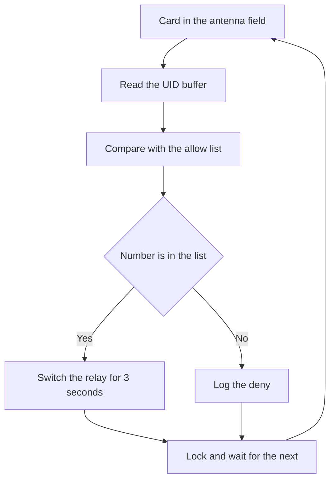

# RC522 on Arduino - Access Cards

![[assets/img/arduino-rfid2-scheme.png|600]]
*Fig. Wiring of RC522 to Arduino over the SPI bus with 3.3 V power supply.*

> [!tip] Purpose of the note
> Close contactless card questions: how never to burn the module with power supply, how to read UID and how to make a simple lock with a list check.

## 1. Purpose

The RC522 module reads contactless cards and fobs at 13.56 MHz.

The Arduino board polls the module over the bus and gets the card number.

Such a number is called UID and serves as an access key.

A door lock matches the number against an allow list and switches a relay.

Work-time tracking fixes who tapped a card and when.

A self-checkout till knows a client card by number.

Bus exchange basics are in [[EN/04-Interfaces/02-SPI.en|fast bus]].

Pin modes and signal levels are in [[EN/03-GPIO/01-Digital-Pins.en|digital pins]].

This note runs from power supply to a ready lock step by step.

First feed correct 3.3 V with no five.

Then join the bus and install the library.

Next read UID with a test sketch.

After that learn why UID is not a password.

In the end build a lock with an allow list of numbers.

The module works with MIFARE Classic cards and matching tags.

Read radius is centimeters above the antenna.

Metal objects near cut read range.

A plastic case above the antenna hardly affects range.

## 2. Power supply only 3.3 V

| Module lead | Where to run | Explanation |
| --- | --- | --- |
| VCC | 3.3 V of the board | Logic and radio power supply |
| GND | Board GND | Common ground mandatory |
| RST | D9 through a 3.3 V level | Module reset |
| IRQ | Leave unwired | Newcomers never need interrupts |
| MISO | Board MISO | Data from module to board |
| MOSI | MOSI through a divider | Data from board to module |
| SCK | Board SCK | Bus clock |
| SDA | D10 as chip select | Module select on the bus |

The RC522 module feeds only from 3.3 V.

Feeding 5 V to the power supply lead burns the regulator and chip.

Module logic inputs also rate for 3.3 V.

The Uno board outputs 5 V on outputs at high level.

Wiring board outputs straight to module inputs overloads inputs.

A safe path gives a two-resistor divider on every line from the board.

The line from module to board is safe with no divider.

The module outputs 3.3 V and the board reads such a level as high.

Draw at read moment reaches dozens of milliamps.

The 3.3 V board output holds such current with no problem.

Long thin power supply wires give sag and exchange break.

Short wires to ten centimeters give a stable link.

## 3. Wiring over SPI to Uno

| Bus signal | Uno pin | Nano pin | Note |
| --- | --- | --- | --- |
| SCK | D13 | D13 | Common bus clock |
| MOSI | D11 | D11 | Data from the board |
| MISO | D12 | D12 | Data to the board |
| SDA | D10 | D10 | Module select |
| RST | D9 | D9 | Reset |
| VCC | 3.3 V | 3.3 V | Never 5 V |
| GND | GND | GND | Common ground |

The SPI bus runs on a leader and follower plan.

The board acts as leader and sets the clock.

The module answers only when picked with the select signal.

Several bus devices share three data and clock lines.

Every device has a separate select line.

See common bus details in [[EN/04-Interfaces/02-SPI.en|fast bus]].

Direct pin tuning is in [[EN/03-GPIO/01-Digital-Pins.en|digital pins]].

```text
Підключення RC522 до Uno через подільники:

    плата Uno                 модуль RC522
    ---------                 ------------
    3,3 В ------------------  VCC
    GND --------------------  GND
    D13 --------------------  SCK
    D12 --------------------  MISO

    D11 ---[2к]---+----------  MOSI
                  |
                 [4к7]
                  |
                 GND

    D10 ---[2к]---+----------  SDA
                  |
                 [4к7]
                  |
                 GND

    D9 ----[2к]---+----------  RST
                  |
                 [4к7]
                  |
                 GND

    Подільник знижує 5 В до близько 3,3 В.
    Резистори ставлять близько до модуля.
    Довжина дротів бажано до 10 сантиметрів.
```

The schematic shows three dividers on lines from the board.

The MISO line runs direct with no divider.

Common ground joins both devices.

Checking starts with 3.3 V measurement on the power supply lead.

Next check levels on module inputs.

After that start the test sketch.

## 4. MFRC522 library

| Step | Action | Practical sense |
| --- | --- | --- |
| Search | MFRC522 in the library manager | Official community library |
| Install | Press install | Pulls examples and dependencies |
| Include | MFRC522 header | The compiler sees the module class |
| Object | Point select and reset pins | Ties logic to wires |
| Init | Begin call | Tunes the bus and antenna |
| Examples | DumpInfo and ReadNUID | Ready-made number read tests |

The library installs through the library manager by the MFRC522 name.

No separate board drivers need installing.

The module object is created with select and reset pin numbers.

In the setup block call the bus begin.

Then call the module begin.

After that the module switches the antenna on and waits for a card.

The number read example sits in the library example menu.

The info output example shows the chip version.

If the version never reads then wires or power supply fail.

Test port speed sets 9600 or 115200.

Both speeds show the number in the monitor alike.

## 5. UID reading with a test sketch

| Call | What it does | When to use |
| --- | --- | --- |
| Begin | Prepares the bus and antenna | Once in setup |
| New card | Checks the antenna field | Every loop pass |
| Series read | Reads UID to a buffer | After a card shows |
| Port print | Shows number bytes | For the allow list |
| Card halt | Releases the tag | After handling |

The UID number holds four or seven bytes.

Four-byte numbers belong to classic access cards.

Seven-byte numbers belong to new extended-code tags.

The library packs bytes to a buffer and counts length.

Hex printing gives a short key.

Spaces between bytes keep the key readable.

```cpp
#include <SPI.h>
#include <MFRC522.h>

#define SS_PIN 10
#define RST_PIN 9

MFRC522 rfid(SS_PIN, RST_PIN);

void setup() {
  Serial.begin(9600);
  SPI.begin();
  rfid.PCD_Init();
  Serial.println("Прикладіть картку до антени");
}

void loop() {
  if (!rfid.PICC_IsNewCardPresent()) {
    return;
  }
  if (!rfid.PICC_ReadCardSerial()) {
    return;
  }
  Serial.print("UID:");
  for (byte i = 0; i < rfid.uid.size; i++) {
    if (rfid.uid.uidByte[i] < 0x10) {
      Serial.print(" 0");
    } else {
      Serial.print(" ");
    }
    Serial.print(rfid.uid.uidByte[i], HEX);
  }
  Serial.println();
  rfid.PICC_HaltA();
  rfid.PCD_StopCrypto1();
  delay(500);
}
```

The sketch waits for a new card in the antenna field.

The new-card check never blocks the loop.

The series read fills the number buffer.

The loop prints every byte in hex form.

A leading zero keeps output even in width.

Card halt allows reading the next tag.

A half second pause removes repeats of one tap.

Monitor numbers go to the lock allow list.

## 6. Why UID is not a password

| Fact | Explanation | Result |
| --- | --- | --- |
| Open number | The card gives UID with no check | Any reader can read it |
| Minute clone | Writable fobs copy the number | A double opens the lock |
| Radio catch | Exchange listens from afar | The number leaks unseen |
| With no cipher | Check only compares | No replay guard exists |
| Result | UID fits accounting | Doors need ciphered sectors |

The card gives the number with no password to every reader.

A shop writable fob takes any number.

A copy takes a minute with no key knowledge.

So a UID lock holds only casual passers-by.

For a home and a club such a level often suffices.

Money and serious doors need sector checks.

Ciphered sectors read only with access keys known.

Counters and signatures in sectors never clone simply.

Start with UID to learn the mechanics.

Then move to keys and sector ciphering.

An event log helps spot suspect passes.

## 7. Lock sketch with an allow list

| Element | Value | Explanation |
| --- | --- | --- |
| Relay | Pin D8 through a transistor | Switches the lock for seconds |
| LED | Built-in pin D13 | Blinks on allow |
| Allow list | Array of allowed numbers | Matches every tap |
| Deny | Short beep or print | Reaction to a foreign number |
| Pause | Open for 3 seconds | Time to push the door |

Switch a relay through a transistor, not directly.

A board pin never holds relay coil current.

A separate diode kills coil voltage kick.

The LED shows allow with no port monitor.

Keep the allow list in the program as strings.

Compare char by char with no case care.

```cpp
#include <SPI.h>
#include <MFRC522.h>

#define SS_PIN 10
#define RST_PIN 9
#define RELAY_PIN 8

MFRC522 rfid(SS_PIN, RST_PIN);

const char* ALLOWED[] = {
  "A1 B2 C3 D4",
  "01 23 45 67"
};
const int ALLOWED_COUNT = 2;

String readUidString() {
  String s = "";
  for (byte i = 0; i < rfid.uid.size; i++) {
    if (rfid.uid.uidByte[i] < 0x10) {
      s += " 0";
    } else {
      s += " ";
    }
    s += String(rfid.uid.uidByte[i], HEX);
  }
  s.toUpperCase();
  s.trim();
  return s;
}

bool isAllowed(const String& uid) {
  for (int i = 0; i < ALLOWED_COUNT; i++) {
    if (uid == String(ALLOWED[i])) {
      return true;
    }
  }
  return false;
}

void setup() {
  Serial.begin(9600);
  pinMode(RELAY_PIN, OUTPUT);
  digitalWrite(RELAY_PIN, LOW);
  SPI.begin();
  rfid.PCD_Init();
  Serial.println("Замок готовий");
}

void loop() {
  if (!rfid.PICC_IsNewCardPresent()) {
    return;
  }
  if (!rfid.PICC_ReadCardSerial()) {
    return;
  }
  String uid = readUidString();
  Serial.print("Картка: ");
  Serial.println(uid);
  if (isAllowed(uid)) {
    Serial.println("Дозволено");
    digitalWrite(RELAY_PIN, HIGH);
    delay(3000);
    digitalWrite(RELAY_PIN, LOW);
  } else {
    Serial.println("Заборонено");
    delay(1000);
  }
  rfid.PICC_HaltA();
  rfid.PCD_StopCrypto1();
}
```

The read function packs the number to a string.

Upper case removes letter difference.

Space trim makes compare exact.

The check function walks the allow list.

A match switches the relay for three seconds.

A foreign number gives a pause and a log line.

Card halt prepares the module for the next tag.

Feed the relay from a separate unit, not from the board.

## Mermaid: access lock logic



The schematic reads top down with no branches back.

First the module reads the number to a buffer.

Then the program matches the number with the list.

A match switches the relay for three seconds.

A foreign number logs a deny.

The end returns the lock to waiting.

The log helps spot card guessing.

## Common issues

| # | Issue | Why bad | How correct |
| --- | --- | --- | --- |
| 1 | Module power supply from 5 V | The chip heats and fails | Only 3.3 V to the power supply lead |
| 2 | Straight 5 V to MOSI and SDA | Inputs overloaded with high level | Divider or level shifter |
| 3 | No common ground | The bus floats and the version never reads | Join board and module GND |
| 4 | Trust in UID as a password | A fob clone opens the door | For guard read ciphered sectors |
| 5 | Long bus wires over 30 centimeters | Clock distorts and exchange breaks | Short wires to 10 centimeters |
| 6 | Relay straight from a pin | The pin burns from coil current | Transistor plus separate relay power supply |

## Official sources

- [MFRC522 library on arduino.cc](https://www.arduino.cc/reference/en/libraries/mfrc522/) - install, number read examples and module functions.
- [RC522 guide on docs.arduino.cc](https://docs.arduino.cc/learn/electronics/mfrc522-rfid-reader/) - bus wiring, 3.3 V power supply and test sketch.
- [MFRC522 datasheet by NXP](https://www.nxp.com/docs/en/data-sheet/MFRC522.pdf) - registers, commands, antenna and electric limits.

## See also

- [[Home.en]]
- [[EN/04-Interfaces/02-SPI.en|fast bus]]
- [[EN/03-GPIO/01-Digital-Pins.en|digital pins]]
- [[EN/10-Sensors/05-MPU6050.en|motion and tilt]]
- [[10-Sensors/08-Encoder|rotation steps]]
- [[12-Comm-Modules/02-RC522-RFID|RC522 radio side]] - antenna power supply and SPI practice
