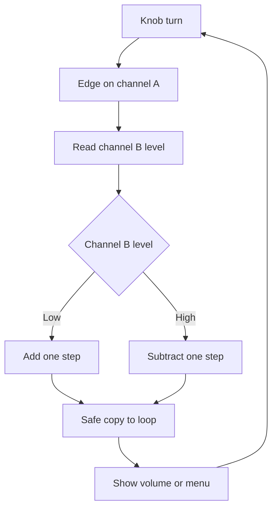

# Encoder on Arduino - Steps and Direction

![[assets/img/arduino-enc-scheme.png|600]]
*Fig. Wiring of an encoder to Arduino with pull-up and interrupts.*

> [!tip] Purpose of the note
> Close control knob questions: how to count steps with no loss, how to detect direction and how to make volume or a menu with no bounce.

## 1. Purpose

An incremental encoder turns knob rotation into pulses.

The board counts pulses and understands where the knob turns.

A volume knob adds or subtracts a level at every step.

A screen menu scrolls items up or down.

A stepper drive reports by how many steps the shaft moved.

A robot counts wheel path by pulse count.

An encoder never remembers the absolute angle after power supply loss.

After power-on the count always starts from zero.

For an absolute angle take other sensors or limit switches.

This note runs from channels to a ready menu knob.

First break down channels A and B.

Then wire the knob with pull-up.

Next hang an interrupt on the edge.

After that make the counter interrupt-safe.

Then detect direction from channel phase.

In the end remove bounce and write the sketch.

Digital input basics are in [[EN/03-GPIO/01-Digital-Pins.en|digital pins]].

Board interrupt mechanics are in [[EN/03-GPIO/03-Interrupts.en|board interrupts]].

See a motion and tilt example in [[EN/10-Sensors/05-MPU6050.en|motion and tilt]].

## 2. Channels A and B

| Signal | What it gives | Practical sense |
| --- | --- | --- |
| Channel A | Square pulses | Main step count |
| Channel B | Same pulses with a shift | Direction detection |
| Button | Separate press contact | Entry to the menu |
| Ground | Common minus | Reference for all signals |
| Power supply | 5 V for pull-up | Feeds the contacts |

An encoder has two contacts that close with a quarter-period shift.

Such a shift is called quadrature and it gives direction.

Clockwise rotation gives channel A lead.

Counter-clockwise rotation gives channel B lead.

One knob click gives several edges on both channels.

Pulse count per turn is written in the knob specs.

Typical knobs give twenty clicks per full turn.

Cheap knobs give one pulse of play per detent.

Costly optical disks give hundreds of pulses per turn.

The knob button works as a plain tactile button.

A press shorts the contact to ground.

## 3. Wiring to Uno

| Encoder lead | Board pin | Pin mode |
| --- | --- | --- |
| CLK or A | D2 | Input with pull-up |
| DT or B | D3 | Input with pull-up |
| SW or button | D4 | Input with pull-up |
| VCC or plus | 5 V | Pull-up power supply |
| GND | GND | Common ground |

Pins D2 and D3 of the board can raise interrupts.

That is why channels hang on these two pins.

The button hangs on any free digital pin.

The internal pull-up holds the line high with no resistors.

External 10 kilohm resistors give a cleaner edge.

100 nanofarad capacitors cut short spikes.

```text
Підключення ручки енкодера до Uno:

    плата Uno                енкодер KY-040
    ---------                --------------
    5V    -----------------  VCC
    GND   -----------------  GND
    D2    -----------------  CLK (канал А)
    D3    -----------------  DT  (канал В)
    D4    -----------------  SW  (кнопка)

    Внутрішня підтяжка INPUT_PULLUP увімкнена.
    Зовнішні 10 кОм між VCC і кожним каналом за бажанням.
    Конденсатор 100 нФ між каналом і землею зрізає голки.
    Довжина дротів бажано до 20 сантиметрів.
```

The schematic shows three signal wires plus power supply.

Channels run to interrupt pins.

The button runs to a plain digital pin.

Common ground joins the knob and the board.

Long wires pick up noise from motors.

A twisted pair cuts pickup on channels.

## 4. Edge interrupt

| Term | Meaning | Explanation |
| --- | --- | --- |
| Edge | Zero to one move | Step moment |
| Fall | One to zero move | Also a step moment |
| Change | Any move | Doubled precision |
| Handler | Short function | Counter only |
| Flag | State change | Loop draws the result |

Polling channels in the loop misses fast steps.

Hands turn the knob faster than a loop with a screen keeps up.

An interrupt stops the loop exactly at the edge moment.

The handler adds or subtracts one and exits.

The loop only shows the new value on the screen.

An edge on channel A gives one call per click.

Change mode gives two calls and doubled resolution.

Both-channel mode gives four times more counts.

Newcomers have enough with one interrupt on channel A.

Call details are in [[EN/03-GPIO/03-Interrupts.en|board interrupts]].

Pin setup is in [[EN/03-GPIO/01-Digital-Pins.en|digital pins]].

The handler must stay short with no port print.

Port print inside the handler slows the system.

Delays inside the handler break the next steps.

## 5. Volatile counter

| Rule | Why so | What else happens |
| --- | --- | --- |
| Volatile variable | No register cache | Loop sees a fresh value |
| Long type | Room for thousands of steps | Integer never overflows fast |
| Copy with a ban | Atomic read | No torn number |
| No print in handler | Fast exit | No lost steps |
| No delays | Instant count | No hangs |

The compiler likes to hold a variable in a register for speed.

An interrupt changes memory outside compiler notice.

The volatile word forces a memory read every time.

The step counter is declared as a changeable long integer.

The long integer range lasts for years of turning.

A four-byte read on an eight-bit board is not atomic.

An interrupt in the middle of a read gives half an old number.

A short interrupt ban around the copy saves the day.

The copy goes to the screen and only the handler touches the original.

A new-value flag removes screen flicker.

## 6. Direction from channel phase

| Case | B level at the A edge moment | Result |
| --- | --- | --- |
| Turn forward | Channel B low | Add one |
| Turn back | Channel B high | Subtract one |
| Knob still | No edges | Change nothing |
| Ringing | Short spikes | Time filter |
| Play | Shake on the detent | Hysteresis in the menu |

Direction sets the mutual position of channels.

At the channel A edge moment look at the channel B level.

A low level means rotation one way.

A high level means rotation the other way.

The table above holds for a typical module.

Some batches have reverse phase.

The check is simple: turn forward and look at the sign.

If the sign is flipped then swap plus for minus.

A menu with hysteresis never jerks on item borders.

Volume changes by one step per click.

Fast turning adds acceleration by several units.

## 7. Contact bounce

| Method | How it works | When to take |
| --- | --- | --- |
| Capacitor | Smooths the edge | Cheap knob with spikes |
| 2 millisecond pause | Ignores repeats | Simple menu sketch |
| State table | Counts only full steps | Precise tuning knob |
| Button polling | Program timer | Knob button |
| Shielding | Short wires | Noise from motors |

Mechanical contacts ring at close.

One click gives a pack of short pulses.

A counter with no filter counts extra steps.

A capacitor between channel and ground eats spikes.

A two millisecond pause cuts repeats.

A state table counts only a full move.

The knob button gets a separate timer clean.

Button polling every 20 milliseconds removes bounce.

Wires away from power circuits cut pickup.

## 8. Volume knob and menu sketch

| Line | Purpose | Note |
| --- | --- | --- |
| Counter | Holds position | Changeable for the interrupt |
| Handler | Adds or subtracts | Edge calls it |
| Copy | Safe read | Ban for the copy time |
| Volume | From zero to a hundred | Edge limits |
| Menu | Item index | Scroll in a circle |

The volume range is limited by zero and a hundred.

Going past edges is cut with conditions.

The menu scrolls in a circle through a division rest.

A button press picks an item.

A long press moves back.

```cpp
volatile long encoderPos = 0;
volatile unsigned long lastTick = 0;

const int PIN_A = 2;
const int PIN_B = 3;
const int PIN_BTN = 4;

int volume = 50;
int lastShown = -1;

void onStep() {
  unsigned long now = micros();
  if (now - lastTick < 2000) {
    return;
  }
  lastTick = now;
  int b = digitalRead(PIN_B);
  if (b == LOW) {
    encoderPos++;
  } else {
    encoderPos--;
  }
}

void setup() {
  Serial.begin(9600);
  pinMode(PIN_A, INPUT_PULLUP);
  pinMode(PIN_B, INPUT_PULLUP);
  pinMode(PIN_BTN, INPUT_PULLUP);
  attachInterrupt(digitalPinToInterrupt(PIN_A), onStep, RISING);
  Serial.println("Ручка готова: крути для гучності");
}

void loop() {
  long copy;
  noInterrupts();
  copy = encoderPos;
  interrupts();
  int v = 50 + (int)copy;
  if (v < 0) {
    v = 0;
  }
  if (v > 100) {
    v = 100;
  }
  if (v != lastShown) {
    lastShown = v;
    volume = v;
    Serial.print("Гучність: ");
    Serial.println(volume);
  }
  int btn = digitalRead(PIN_BTN);
  if (btn == LOW) {
    Serial.println("Кнопка натиснута");
    delay(200);
  }
  delay(10);
}
```

The handler reads the channel B level at the edge moment.

A two thousand microsecond filter cuts bounce.

The counter grows forward and falls back.

The loop makes a safe copy with a ban.

The copy value shifts from the start volume.

Edges are cut by zero and a hundred.

A new value prints only on change.

The button reads with a plain level plus a pause.

A two hundred millisecond pause removes button bounce.

## Mermaid: path from step to menu



The schematic reads top down in a circle.

A turn gives an edge on channel A.

The handler reads the channel B level.

A low level adds a step.

A high level subtracts a step.

The copy moves the value to the loop.

The loop draws volume or a menu item.

## Common issues

| # | Issue | Why bad | How correct |
| --- | --- | --- | --- |
| 1 | Channel polling with no interrupts | Fast steps get lost | Interrupt on the channel A edge |
| 2 | Counter with no volatile | Loop sees an old value | Declare the variable as volatile |
| 3 | Port print inside the handler | Slows down and loses steps | Only plus or minus in the handler |
| 4 | Long number read with no ban | Torn value mid-write | Copy with a short ban |
| 5 | Ignored bounce of a cheap knob | One click gives three steps | 2 millisecond pause or a capacitor |
| 6 | Button with no pull-up | Input floats and false fires | Pull-up mode and a 20 millisecond filter |

## Official sources

- [Interrupts on docs.arduino.cc](https://docs.arduino.cc/learn/programming/interrupts/) - interrupt pins, edges and handler rules.
- [Rotary encoder work on docs.arduino.cc](https://docs.arduino.cc/learn/electronics/rotary-encoder/) - channels A and B, direction and a knob example.
- [attachInterrupt notes on arduino.cc](https://www.arduino.cc/reference/en/language/functions/external-interrupts/attachinterrupt/) - edge modes, limits and safe practice.

## See also

- [[Home.en]]
- [[EN/03-GPIO/03-Interrupts.en|board interrupts]]
- [[EN/03-GPIO/01-Digital-Pins.en|digital pins]]
- [[EN/10-Sensors/05-MPU6050.en|motion and tilt]]
- [[EN/10-Sensors/07-RFID-RC522.en|contactless cards]]
