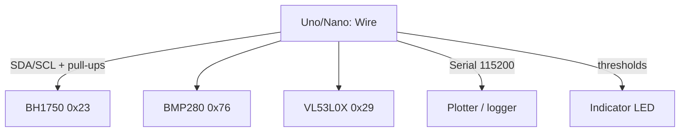

# Arduino Measures Light, Pressure and Range - BH1750, BMP280, VL53L0X

![[assets/img/ard-svitlo-tisk-tof-scheme.png|600]]
*Fig. Three I2C sensors on one bus: BH1750 - lux, BMP280 - hectopascals, VL53L0X - millimeters.*

> [!tip] What this note is
> The most popular trio after DHT: light level for a greenhouse, pressure for an altimeter, ToF for a robot vacuum. All three are I2C, all three use 3.3 V logic (watch out on a 5 V Uno!). Base: [[EN/10-Sensors/02-BME280.en|BME280 sensor]], [[EN/04-Interfaces/03-I2C-Wire.en|I2C Wire bus]].

## 1. Goal

Close three measurements with one sketch:

- light level 1-65535 lx - BH1750 (ROHM);
- pressure 300-1100 hPa plus temperature - BMP280 (Bosch);
- range 30-2000 mm - VL53L0X (ST);
- all on one bus: addresses never clash (0x23, 0x76, 0x29).

| Sensor | Address | Range | Measure time |
| --- | --- | --- | --- |
| BH1750 | 0x23 (ADDR LOW) | 1-65535 lx | 120 ms |
| BMP280 | 0x76 (SDO LOW) | 300-1100 hPa | ~10 ms |
| VL53L0X | 0x29 | 30-2000 mm | 30-200 ms |

## 2. Architecture



Pull-ups 4.7 kilohm to 3.3 V (not to 5 V!). GY-302/GY-BMP280/VL53L0X modules already carry a regulator and a level shifter - feed them from 5 V, SDA/SCL are tolerant.

## 3. BH1750: lux with no math

- command 0x10 - H-Resolution, 1 lx, 120 ms;
- result / 1.2 = lux (divide at once in float);
- modes: 0x10 (1 lx), 0x11 (0.5 lx), 0x13 (4 lx, 16 ms);
- power-down 0x00 between measures for battery use;
- ADDR to GND - 0x23, to VCC - 0x5C (two sensors on the bus).

## 4. BMP280: pressure and altitude

- oversampling x4 pressure + x1 temperature - noise/speed trade-off;
- compensation - mandatory: read calibration factors 0x88-0xA1;
- altitude: `44330 x (1 - (P/P0)^0.1903)`, refresh P0 from a weather service;
- forced mode - measured and slept, for battery use only it;
- x4 IIR filter smooths door slams.

## 5. Working code

```cpp
#include <Wire.h>

float bh_read_lux() {
  Wire.beginTransmission(0x23);
  Wire.write(0x10);
  Wire.endTransmission();
  delay(130);
  Wire.requestFrom(0x23, 2);
  if (Wire.available() < 2) return -1;
  uint16_t v = Wire.read() << 8 | Wire.read();
  return v / 1.2;
}

float bmp_read_hpa() {
  uint32_t adc_P = bmp_read24(0xF7);
  int32_t t_fine = bmp_comp_temp(bmp_read24(0xFA));
  int64_t var1 = ((int64_t)t_fine) - 128000;
  int64_t var2 = var1 * var1 * dig_P6;
  var2 += var1 * dig_P5 * 131072;
  var2 += (int64_t)dig_P4 * 34359738368;
  var1 = (var1 * var1 * dig_P3 / 256) + (var1 * dig_P2 * 4096);
  var1 = (140928000000LL + var1) / 1;
  if (var1 == 0) return -1;
  int64_t p = 1048576 - adc_P;
  p = (p - var2 / 4096) * 6250 / var1;
  return p / 256.0 / 100.0;
}

uint16_t vl_read_mm() {
  Wire.beginTransmission(0x29);
  Wire.write(0x00); Wire.write(0x01);
  Wire.endTransmission();
  delay(40);
  Wire.beginTransmission(0x29);
  Wire.write(0x14);
  Wire.endTransmission(false);
  Wire.requestFrom(0x29, 2);
  return Wire.read() << 8 | Wire.read();
}

void setup() {
  Serial.begin(115200);
  Wire.begin();
  Wire.setClock(100000);
}

void loop() {
  Serial.print(bh_read_lux());
  Serial.print(" lx, ");
  Serial.print(bmp_read_hpa());
  Serial.print(" hPa, ");
  Serial.print(vl_read_mm());
  Serial.println(" mm");
  delay(1000);
}
```

Read the `dig_Px` factors from 0x88 once in `setup`. VL53L0X here runs in simplified single-shot - for production take the Pololu VL53L0X library.

## 6. Calibration

| Sensor | How to check | Norm |
| --- | --- | --- |
| BH1750 | phone lux meter app nearby | ±20 % |
| BMP280 | airport QNH or a second barometer | ±1 hPa |
| VL53L0X | ruler at 100/500/1000 mm | ±3 % up to 1 m |

## 7. Power supply and levels

- GY modules - 5 V feed (they carry their own LDO), logic through a level shifter;
- bare chips - 3.3 V only, Uno gives 3.3 V up to 150 mA - enough;
- bus length up to 30 cm at 100 kHz with no problems;
- [[EN/02-Power-Supply/01-VIN-Power-Supply.en|VIN power supply]] - never hang sensors on shaky 5 V from a USB hub.

## 8. Common issues

| Symptom | Cause | Fix |
| --- | --- | --- |
| BH1750 gives 54612 in the dark | read with no measure command | send 0x10 and wait 130 ms |
| BMP280 - zeros | dig factors never read | read 0x88-0xA1 in setup |
| VL53L0X hangs | XSHUT pulled to ground | pull XSHUT up to VCC |
| Scanner sees only 1 address | SDO/ADDR jumpers same on two equal modules | split the jumpers, there is no second equal one |
| Pressure jumps at doors | no IIR filter | oversampling x4 plus median of 5 |
| Works on Nano, not on Uno | pull-ups to 5 V instead of 3.3 V | move pull-ups to 3.3 V |

## 9. Neighbor notes

- [[EN/10-Sensors/02-BME280.en|BME280 sensor]] - humidity plus pressure.
- [[EN/04-Interfaces/03-I2C-Wire.en|I2C Wire bus]] - scanner, speeds, pull-ups.
- [[EN/10-Sensors/03-HC-SR04-PIR.en|ultrasound and motion]] - cheap ToF alternative.
- [[EN/06-Analog/01-ADC.en|analog inputs]] - when no I2C sensor exists.
- [[16-Projects/01-Meteostantsiya|weather station]] - where to fit the trio.

## Official sources

- [BH1750FVI-TR (DigiKey, ROHM)](https://www.digikey.com/en/products/detail/rohm-semiconductor/BH1750FVI-TR/2041441) - modes, commands, addresses.
- [BMP280 (Adafruit)](https://www.adafruit.com/product/2651) - module, SDO addressing.
- [VL53L0X (Adafruit)](https://www.adafruit.com/product/3317) - ToF module, XSHUT.
- [VL53L0X (ST)](https://www.st.com/en/sensors-actuators/vl53l0x.html) - datasheet, ranging timing.
