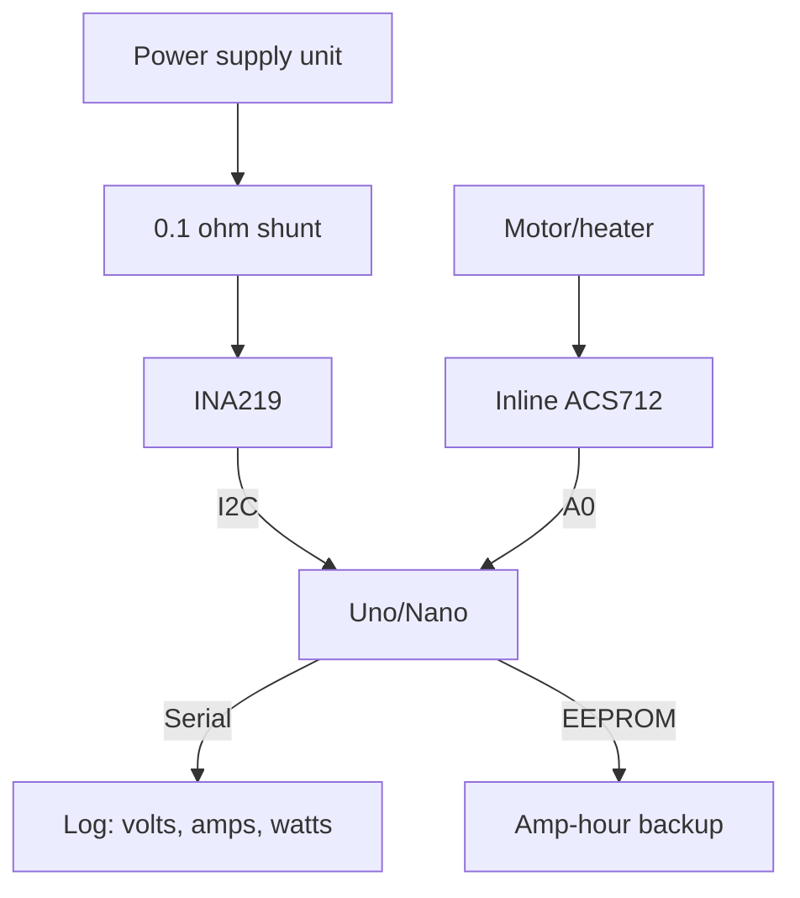

# Arduino Measures Current - INA219 over I2C and ACS712 Inline

![[assets/img/ard-strum-ina219-scheme.png|600]]
*Fig. INA219 on a shunt measures milliamps over I2C, inline ACS712 - amps with isolation.*

> [!tip] What this note is
> Two ways to learn "how much it eats": INA219 - precise metering of solar nodes and batteries, ACS712 - rough control of motors and heaters. Base: [[EN/10-Sensors/04-LM35-NTC.en|analog sensors]], [[EN/06-Analog/01-ADC.en|analog inputs]], [[EN/04-Interfaces/03-I2C-Wire.en|I2C Wire bus]].

## 1. Goal

Measure current and power with a sketch and no lab:

- INA219: voltage, current and power in one chip, 12 bit;
- ACS712: 5/20/30 A with Hall galvanic isolation;
- zero and scale calibration with handy tools;
- amp-hour counter with EEPROM backup.

| Sensor | Range | Precision | Interface |
| --- | --- | --- | --- |
| INA219 | 0-26V, 0.1 ohm shunt | 1 %, 12 bit | I2C 0x40-0x4F |
| ACS712-05 | ±5 A | ~1.5 % | analog, 185 mV/A |
| ACS712-20 | ±20 A | ~1.5 % | analog, 100 mV/A |
| ACS712-30 | ±30 A | ~1.5 % | analog, 66 mV/A |

## 2. Architecture



INA219 measures high-side: shunt in the power supply plus, ground common. ACS712 - in series with the load, direction never matters (the sign shows).

## 3. INA219 in detail

- registers: Shunt 0x01, Bus 0x02, Power 0x03, Current 0x04, Calibration 0x05;
- calibration: `Cal = 0.04096 / (Current_LSB x Rshunt)`, for 0.1 ohm and 3.2 A - 4096;
- PGA /8, /4, /2, /1 - for the shunt drop (320/160/80/40 mV);
- x128 averaging inside the chip - noise vanishes with no code;
- address by A0/A1 jumpers: 0x40 by default, up to 16 units on the bus.

## 4. ACS712 in detail

- zero - VCC/2 (2.5 V at 5 V), sensitivity per version;
- 80 kHz band, we need DC - averaging of 64 with edge drop;
- 5 V module, 0-5 V output: 2:1 divider to A0 for a 5 V Uno (5 V reference - fine);
- for 3.3 V boards (Due, Nano 33) - feed the module with 5 V, output through a divider;
- zero calibration with the load off.

## 5. Working code

```cpp
#include <Wire.h>
#include <EEPROM.h>

#define INA_ADDR 0x40
float acs_zero = 2500.0;
float ah_acc = 0;
unsigned long ah_last = 0;

void ina_calibrate() {
  Wire.beginTransmission(INA_ADDR);
  Wire.write(0x05);
  Wire.write(0x10); Wire.write(0x00);
  Wire.endTransmission();
}

float ina_amps() {
  Wire.beginTransmission(INA_ADDR);
  Wire.write(0x04);
  Wire.endTransmission(false);
  Wire.requestFrom(INA_ADDR, 2);
  int16_t raw = Wire.read() << 8 | Wire.read();
  return raw * 0.001;
}

float acs_amps() {
  long sum = 0;
  int mn = 1024, mx = 0;
  for (int i = 0; i < 64; i++) {
    int v = analogRead(A0);
    sum += v;
    if (v < mn) mn = v;
    if (v > mx) mx = v;
  }
  float mv = (sum - mn - mx) / 62.0 * 5000.0 / 1023.0;
  return (mv - acs_zero) / 66.0;
}

void setup() {
  Serial.begin(115200);
  Wire.begin();
  EEPROM.get(0, ah_acc);
  ina_calibrate();
  long z = 0;
  for (int i = 0; i < 64; i++) z += analogRead(A0);
  acs_zero = z / 64.0 * 5000.0 / 1023.0;
  ah_last = millis();
}

void loop() {
  float a1 = ina_amps();
  float a2 = acs_amps();
  float dt_h = (millis() - ah_last) / 3600000.0;
  ah_last = millis();
  ah_acc += a1 * dt_h;
  static unsigned long last_save = 0;
  if (millis() - last_save > 3600000) {
    EEPROM.put(0, ah_acc);
    last_save = millis();
  }
  Serial.print(a1, 3);
  Serial.print(" A INA, ");
  Serial.print(a2, 2);
  Serial.println(" A ACS");
  delay(1000);
}
```

Factor 66.0 - 30 A version; 5 A - 185.0, 20 A - 100.0. `ina_amps` returns amps at 1 mA Current_LSB.

## 6. Handy calibration

| Step | Action | Pass bar |
| --- | --- | --- |
| 1 | ACS zero with no load | store `acs_zero` |
| 2 | 60W lamp as a ~0.27 A reference | scale matches ±5 % |
| 3 | INA219 vs multimeter on the shunt | ±1 % |
| 4 | Sign check | battery discharge - minus |

## 7. Safety

- ACS712 - up to 30 A, module tracks rated, never exceed;
- 220 V mains - only through a ready PZEM with clamps, no shunts in phase;
- fuse in the battery plus ahead of the shunt;
- [[EN/02-Power-Supply/01-VIN-Power-Supply.en|VIN power supply]] - sensor current never over 400 mA from the 5 V pin.

## 8. Common issues

| Symptom | Cause | Fix |
| --- | --- | --- |
| INA219 gives zeros | no calibration register | write 0x05 in setup |
| ACS shows 0.5 A with no load | zero never taken | calibrate with the loop off |
| Jumps ±0.2 A | noise plus USB-fed 5 V reference floats | averaging, PSU feed |
| Wrong INA address | A0/A1 jumpers | I2C scanner, address 0x40-0x4F |
| Negative current on charge | normal, sign is direct | flip the sign in output |
| EEPROM wears out | write every second | write once an hour |

## 9. Neighbor notes

- [[EN/10-Sensors/04-LM35-NTC.en|analog sensors]] - ADC work.
- [[EN/06-Analog/01-ADC.en|analog inputs]] - reference voltage, bit depth.
- [[EN/04-Interfaces/03-I2C-Wire.en|I2C Wire bus]] - addresses, scanner.
- [[EN/08-Memory/01-Memory-EEPROM.en|EEPROM memory]] - counter backup.
- [[16-Projects/04-Loger-SD|SD logger]] - where to write watts.

## Official sources

- [INA219 (Texas Instruments)](https://www.ti.com/product/INA219) - registers, calibration, PGA.
- [ACS712 Current Sensor Carrier (Pololu)](https://www.pololu.com/product/2198) - versions, sensitivity.
- [Language Reference (Arduino docs)](https://docs.arduino.cc/language-reference/) - analogRead, EEPROM, Wire.
