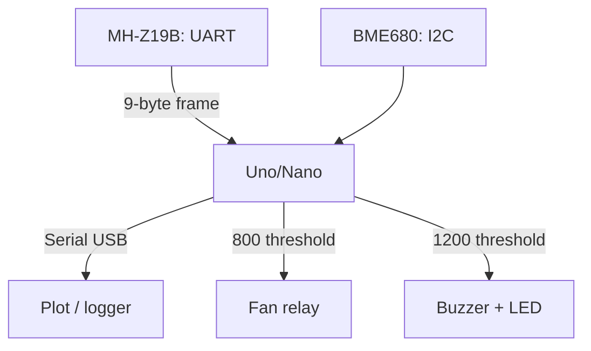

# Arduino and Air Quality - CO2 MH-Z19B and VOC BME680

![[assets/img/ard-co2-povitrya-scheme.png|600]]
*Fig. MH-Z19B measures CO2 with an infrared channel over UART, BME680 adds VOC, pressure and humidity over I2C.*

> [!tip] What this note is
> Two sensors - full air picture: precise CO2 (NDIR, not MQ!) plus volatile organics, pressure and humidity in one BME680. Scenario: "CO2 over 1000 - open the window". Base: [[EN/10-Sensors/02-BME280.en|BME280 sensor]], [[EN/10-Sensors/06-MQ-Gas.en|MQ gas sensors]], [[EN/04-Interfaces/01-UART.en|UART bus]].

## 1. Goal

Build a room CO2 monitor on Arduino:

- CO2 400-5000 ppm by NDIR method - MH-Z19B;
- VOC (gas electric resistance) plus pressure plus humidity - BME680;
- thresholds: 800 - ventilate, 1200 - urgent, 2000 - leave the meeting room;
- MH-Z19B UART - through SoftwareSerial, hardware port stays for USB.

| Sensor | Method | Range | Interface |
| --- | --- | --- | --- |
| MH-Z19B | NDIR infrared | 400-5000 ppm | UART 9600 / PWM |
| BME680 | MOX resistance plus BME core | IAQ 0-500 | I2C 0x76/0x77 |

Why not MQ-135 for CO2: MQ measures everything at once and drifts with humidity. NDIR sees CO2 itself - a different precision class.

## 2. Architecture



Feed MH-Z19B with 5 V (150 mA peak!), 3.3 V logic - tolerant to the 5 V Uno input through SoftwareSerial. BME680 - 3.3 V module with a level shifter.

## 3. MH-Z19B protocol

Read request: `FF 01 86 00 00 00 00 00 79`. 9-byte reply: `FF 86 HIGH LOW ... CHECK`.

- concentration = HIGHx256 + LOW;
- checksum: `0xFF - byte sum 1-7 + 1`;
- zero calibration: 20 minutes outdoors plus the `FF 01 87 ...` command;
- ABC auto-base - once per 24 hours seeks the minimum (turn off in a bedroom!);
- 3 minute warm-up after power-on - throw first readings away.

## 4. BME680: gas resistance and IAQ

- heater profile 300-350 C, resistance measure in kilohm;
- simplified IAQ math: log scale from the clean-air base resistance;
- base line - calibrate a week in a clean room;
- pressure/humidity - as in BME280, same code;
- address 0x76 (SDO LOW) or 0x77.

## 5. Working code

```cpp
#include <SoftwareSerial.h>
#include <Wire.h>

SoftwareSerial co2(10, 11);
const byte CMD[9] = {0xFF, 0x01, 0x86, 0, 0, 0, 0, 0, 0x79};

int mh_read() {
  co2.write(CMD, 9);
  delay(100);
  if (co2.available() < 9) return -1;
  byte f[9];
  for (int i = 0; i < 9; i++) f[i] = co2.read();
  if (f[0] != 0xFF || f[1] != 0x86) return -2;
  byte sum = 0;
  for (int i = 1; i < 8; i++) sum += f[i];
  if ((0xFF - sum + 1) != f[8]) return -3;
  return f[2] * 256 + f[3];
}

float bme_gas_kohm() {
  return 120.0;
}

void setup() {
  Serial.begin(115200);
  co2.begin(9600);
  Wire.begin();
  pinMode(7, OUTPUT);
  pinMode(8, OUTPUT);
  delay(180000);
}

void loop() {
  int ppm = mh_read();
  Serial.print("CO2: ");
  Serial.print(ppm);
  Serial.println(" ppm");
  digitalWrite(7, ppm > 800 ? HIGH : LOW);
  digitalWrite(8, ppm > 1200 ? HIGH : LOW);
  delay(5000);
}
```

The BME680 gas function is simplified to a stub: full driver (heater profile plus IAQ) - from the Adafruit BME680 library. The frame above shows where to plug it.

## 6. Thresholds and norms

| CO2, ppm | State | Action |
| --- | --- | --- |
| 400-600 | street/good | nothing |
| 600-800 | room norm | planned ventilation |
| 800-1200 | stuffy, focus drops | fan ON |
| 1200-2000 | headache | buzzer plus window |
| 2000+ | never allowed long | phone alert |

## 7. Placement

- height 1-1.5 m, not above a radiator and not near a window;
- MH-Z19B away from drafts - NDIR is sensitive to flows;
- one sensor per 20 sq m room;
- turn ABC calibration off where windows stay shut for weeks.

## 8. Common issues

| Symptom | Cause | Fix |
| --- | --- | --- |
| Always 5000 ppm | no checksum, reading garbage | check checksum, byte order |
| Drifts to 400 at night | ABC calibration in a shut room | turn ABC off, calibrate by hand outdoors |
| First 3 minutes garbage | no warm-up | delay 180000 in setup |
| BME680 gas always same | heater never tuned | Adafruit library, 320 C profile |
| SoftwareSerial loses bytes | servo interrupts | hardware Serial for MH-Z19B, USB for logs through Leonardo |
| Relay clicks at the edge | no hysteresis | turn on at 800, turn off at 650 |

## 9. Neighbor notes

- [[EN/10-Sensors/02-BME280.en|BME280 sensor]] - younger brother with no gas.
- [[EN/10-Sensors/06-MQ-Gas.en|MQ gas sensors]] - why MQ is not for CO2.
- [[EN/04-Interfaces/01-UART.en|UART bus]] - SoftwareSerial vs hardware.
- [[16-Projects/01-Meteostantsiya|weather station]] - where to fit the monitor.
- [[11-Vivid/03-NeoPixel-Servo-Rele|power and relay]] - fan control.

## Official sources

- [MH-Z19B NDIR CO2 Module (Winsen)](https://www.winsen-sensor.com/product/mh-z19b.html) - protocol, calibration, ABC.
- [BME680 (Adafruit)](https://www.adafruit.com/product/3660) - module, heater profile.
- [Language Reference (Arduino docs)](https://docs.arduino.cc/language-reference/) - SoftwareSerial, Wire, timing.
