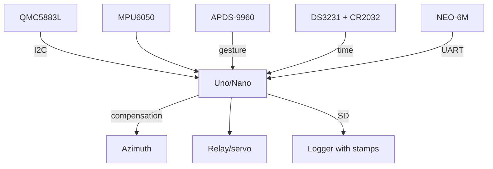

# Arduino and Rare Sensors - QMC5883L Compass, APDS-9960 Gestures, DS3231 Clock

![[assets/img/ard-mag-gesture-rtc-scheme.png|600]]
*Fig. Rare trio on one bus: QMC5883L - cardinal points, APDS-9960 - gestures, DS3231 - time with a battery.*

> [!tip] What this note is
> Sensors people search for one by one: compass for a robot, gestures for a touch-free button, precise time for a logger. Plus a link with MPU6050 and GPS into a full navigation kit. Base: [[EN/10-Sensors/05-MPU6050.en|gyroscope and accelerometer]], [[12-Comm-Modules/04-GPS-NEO|GPS module]], [[EN/10-Sensors/08-Encoder.en|encoders]].

## 1. Goal

Give Arduino three rare measurements with ready libraries:

- azimuth 0-360 deg - QMC5883L (plus tilt compensation from MPU6050);
- gestures and color - APDS-9960 (SparkFun/Adafruit libraries);
- time ±2 ppm - DS3231 with CR2032 (years with no reset);
- together - robot with a course, panel with no buttons, logger with time stamps.

| Sensor | Address | Library |
| --- | --- | --- |
| QMC5883L | 0x0D | QMC5883LCompass (mprograms) |
| APDS-9960 | 0x39 | SparkFun_APDS9960 / Adafruit_APDS9960 |
| DS3231 | 0x68 | RTClib (Adafruit) |
| MPU6050 (have) | 0x68/0x69 | MPU6050 (ElectronicCats) |

0x68 clash: MPU6050 and DS3231 on one bus - split with the MPU AD0 chip pin (LOW=0x68, HIGH=0x69). Check with a scanner before soldering.

## 2. Architecture



With no tilt compensation the compass lies up to 30 deg: take roll from the accelerometer and turn the vector. Gestures - clean hands in the workshop.

## 3. QMC5883L: digital compass

- range ±8 Gauss, up to 200 Hz;
- hard-iron calibration: 30 s figure-eight, offsets (max+min)/2;
- azimuth: `atan2(-Y, X)` plus magnetic declination (Kyiv ~+7 deg);
- hold away from motors - or a 10 cm mast;
- the library already returns microtesla, raw codes never needed.

## 4. APDS-9960: gestures and color

- 4 direction photodiodes plus RGB plus proximity plus ALS;
- gestures: up/down/left/right/near/far;
- sensitivity for 5-20 cm range, glass - IR-clear only;
- proximity wakes the display on hand approach;
- RGB - hobby conveyor part sorting by color.

## 5. Working code

```cpp
#include <Wire.h>
#include <QMC5883LCompass.h>
#include <SparkFun_APDS9960.h>
#include <RTClib.h>

QMC5883LCompass compass;
SparkFun_APDS9960 apds;
RTC_DS3231 rtc;
char days[7][4] = {"SUN", "MON", "TUE", "WED", "THU", "FRI", "SAT"};

void setup() {
  Serial.begin(115200);
  Wire.begin();
  compass.init();
  compass.setCalibration(-320, 280, -150, 350, -200, 300);
  apds.init();
  apds.enableGestureSensor(true);
  rtc.begin();
  if (rtc.lostPower()) {
    rtc.adjust(DateTime(F(__DATE__), F(__TIME__)));
  }
}

float heading_deg() {
  compass.read();
  int x = compass.getX();
  int y = compass.getY();
  float h = atan2(-y, x) * 57.2958 + 7.0;
  if (h < 0) h += 360.0;
  if (h >= 360.0) h -= 360.0;
  return h;
}

void loop() {
  Serial.print("HDG ");
  Serial.print(heading_deg(), 0);
  if (apds.isGestureAvailable()) {
    switch (apds.readGesture()) {
      case DIR_UP: Serial.print(" UP"); break;
      case DIR_DOWN: Serial.print(" DOWN"); break;
      case DIR_LEFT: Serial.print(" LEFT"); break;
      case DIR_RIGHT: Serial.print(" RIGHT"); break;
    }
  }
  DateTime t = rtc.now();
  Serial.print(" ");
  Serial.print(t.hour());
  Serial.print(":");
  Serial.print(t.minute());
  Serial.print(":");
  Serial.println(t.second());
  delay(500);
}
```

Take the calibration six from your own figure-eight (calibration sample sketch in the library examples). Time is set from the computer at first flash, then - the battery.

## 6. Link with GPS and MPU

- MPU6050 - roll/pitch for compass compensation;
- NEO-6M - coordinates plus speed plus PPS second;
- GPS course in motion checks the magnetic course;
- logger: DS3231 time plus coordinates plus course - full track;
- [[16-Projects/03-Treker|tracker]] - where to fit the kit.

## 7. Compass calibration

| Step | Action | Pass bar |
| --- | --- | --- |
| 1 | 30 s figure-eight, min/max per axis | spread over 200 units |
| 2 | Offsets to `setCalibration` | center at zero |
| 3 | 4 cardinal points | error up to 5 deg |
| 4 | +7 deg declination in code | check with a phone |
| 5 | Check near a motor | move to a mast on shift |

## 8. Common issues

| Symptom | Cause | Fix |
| --- | --- | --- |
| QMC never found | clones at 0x1A instead of 0x0D | scanner, library fork for the address |
| Azimuth floats on tilt | no compensation | add roll from MPU6050 |
| APDS phantom gestures | IR flood | shade, lower sensitivity |
| DS3231 resets | no CR2032 | insert the battery, check 3 V |
| 0x68 clash | MPU plus DS3231 together | MPU chip AD0 to HIGH (0x69) |
| Time lags by minutes | Chinese clone with no TCXO | replace the module, check with GPS PPS |

## 9. Neighbor notes

- [[EN/10-Sensors/05-MPU6050.en|gyroscope and accelerometer]] - second half of the compass.
- [[12-Comm-Modules/04-GPS-NEO|GPS module]] - coordinates and PPS.
- [[EN/10-Sensors/08-Encoder.en|encoders]] - robot wheel course.
- [[EN/08-Memory/01-Memory-EEPROM.en|EEPROM memory]] - compass calibration.
- [[16-Projects/03-Treker|tracker]] - ready project.

## Official sources

- [Triple-axis Magnetometer QMC5883L (SparkFun)](https://www.sparkfun.com/products/17470) - registers, modes.
- [APDS-9960 Breakout (Adafruit)](https://www.adafruit.com/product/3595) - gestures, RGB, proximity.
- [DS3231 Precision RTC (Adafruit)](https://www.adafruit.com/product/3013) - precision, battery.
- [NEO-6 series (u-blox)](https://www.u-blox.com/en/product/neo-6-series) - GPS for the link, PPS.
