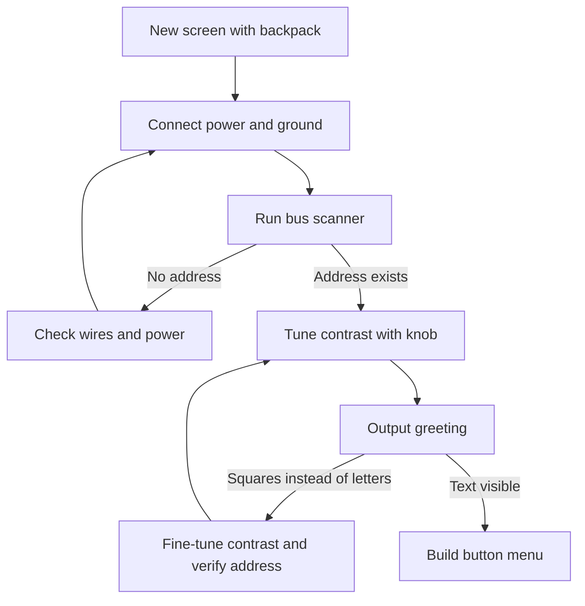

# LCD1602 - Characters over I2C

![[assets/img/arduino-lcd1602-scheme.png|600]]
*Fig. LCD1602 screen through I2C adapter: two lines instead of six, module address, contrast knob, backlight.*

> [!tip] Purpose of this note
> Connect a character screen in minutes: find the address with a scanner, set contrast, output text and build a simple button menu.

## 1. Purpose

A character screen shows two lines of sixteen characters: digits, Latin letters, simple symbols.

Without an I2C adapter such a screen takes six digital outputs of the board; with an I2C adapter only two bus lines are needed.

The I2C adapter on the PCF8574 chip converts serial packets into parallel signals for the screen controller.

This note covers practice: power, module address, library, contrast, backlight, custom characters, Cyrillic, button menus.

The basics of the two-wire bus, addresses and scanner are covered in the note [[EN/04-Interfaces/03-I2C-Wire.en|Two-wire bus]].

The graphical successor to character screens is described in the note [[EN/11-Vivid/02-OLED-SSD1306.en|Graphical display]].

## 2. Screen characteristics

| Parameter | Value | Explanation |
| --- | --- | --- |
| Format | Two lines of sixteen characters | Classic, has a bigger brother at twenty by four |
| Controller | HD44780 or compatible | Standard commands, plenty of examples |
| Logic power | Five volts | From the board or a stable block |
| Backlight current | About twenty milliamps | Bright, warms moderately |
| Control without I2C adapter | Six outputs | Four data bits plus two service lines |
| Control with I2C adapter | Two bus lines | Data and clock, the rest is handled by the expander |
| Viewing angles | Narrow, depends on contrast | Enough for instrument panels |

The screen reads well without glasses: large characters, contrast adjusted manually.

For outdoors take a module without backlight or with low current, because sunlight eats the image.

The screen ribbon from the box is short; long wires catch noise and break packets.

Before mounting in a case check the image on a table: a squeezed ribbon causes lines.

## 3. I2C adapter PCF8574

| I2C adapter element | What it does | Practice |
| --- | --- | --- |
| PCF8574 chip | Output expander through bus | Eight bits are enough for one screen |
| SDA and SCL pins | Bus data and clock | To the matching board lines |
| VCC and GND pins | Power and ground | Five volts, common ground |
| Address jumpers | Lower address bits | See address table below |
| Knob | Contrast reference voltage | Small screwdriver, slow turns |
| Backlight jumper | LED screen power | Remove jumper, backlight goes out |

The I2C adapter saves board pins: six outputs merge into two bus wires.

The adapter board sits straight on the screen header; exactly sixteen pins must be soldered evenly.

Check solder under a loupe: cold contact causes flicker or garbage in characters.

One adapter holds one screen; two screens require different addresses via jumpers.

```text
Backpack on the screen, top view:

  [contrast knob]  [jumpers A0 A1 A2]
  +--------------------------------------+
  | PCF8574            SDA SCL VCC GND   |
  +--------------------------------------+
  ||||||||||||||||  sixteen legs to the screen

  Mounting rule:
  backpack exactly on the header,
  no tilt and no cold joints.
```

## 4. Module address

| Jumpers | Address | When it happens |
| --- | --- | --- |
| All open | Zero x two seven | Most common store variant |
| All closed | Zero x three ef | Second most popular variant |
| Mixed combination | Between them by lower bits | Rare, for a pair of screens nearby |
| Unknown | None can be guessed | Run a bus scanner |

The address is not guessed, it is measured: a bus scanner shows the response in seconds.

Take the scanner from the bus note: it scans all addresses and prints those that answered.

A common mess: the sketch keeps the address from the example, but the module has a different one.

Another mess: two modules with the same address respond together and corrupt the exchange.

After changing jumpers remove power for a second so the chip re-reads the bits.

## 5. LiquidCrystal_I2C library

| Call | What it does | Typical example |
| --- | --- | --- |
| Constructor with address | Binds the object to the module | Address from scanner, sixteen by two |
| init call | Configures the screen controller | Once at start |
| backlight call | Turns on backlight | After startup |
| noBacklight call | Turns off backlight | Night mode |
| setCursor call | Sets character position | Column and row from zero |
| print call | Prints text or number | String in quotes, variable without quotes |
| clear call | Clears screen and sets cursor home | Before a new frame |
| home call | Returns cursor home | Without clearing memory |

Install the library through the environment library manager by the name LiquidCrystal_I2C.

There are several libraries with the same name by different authors; take the one that has examples with init and backlight.

Start the bus to the screen: first Wire begin, then screen init.

Printing a number is direct: print accepts integers and floats without manual conversion.

Updating once per half second is enough for the eye; remapping more often is unnecessary.

## 6. Contrast and backlight

| Symptom | Cause | Action |
| --- | --- | --- |
| Screen lit, no characters | Contrast turned to the edge | Turn slowly until characters appear |
| Dark squares in first row | Screen not started, contrast high | Check address and startup, then turn carefully |
| Faint characters at angle | Low reference voltage | Add slightly with the knob |
| Backlight blinds at night | Full brightness | Turn off with call or resistor in circuit |
| Image drifts with heat | Board heats nearby | Move the knob out and give ventilation |

The knob accepts only a small screwdriver: a large one strips the slot in one move.

Set contrast at working temperature: a cold and hot screen ask for different values.

Backlight for a night clock is turned off programmatically, not by pulling the jumper.

Frequent on/off of backlight causes flicker; for breathing take a different screen.

## 7. Greeting sketch

```cpp
#include <Wire.h>
#include <LiquidCrystal_I2C.h>

LiquidCrystal_I2C lcd(0x27, 16, 2);

void setup() {
  Wire.begin();
  lcd.init();
  lcd.backlight();
  lcd.setCursor(0, 0);
  lcd.print("Privit, svite!");
  lcd.setCursor(0, 1);
  lcd.print("LCD ready");
}

void loop() {
  delay(500);
}
```

Change the address in the constructor to your own: zero x two seven or zero x three ef.

Rows are numbered from zero: top is zero, bottom is one, columns from zero to fifteen.

A string longer than sixteen characters is cut off; the tail is not wrapped automatically.

The delay in the main loop does not draw anything; the screen holds the frame on its own.

For a counter draw the output of the variable in the second row once per second.

## 8. Custom characters and Cyrillic

| Topic | Limit | Practice |
| --- | --- | --- |
| Custom glyphs | Eight cells with numbers from zero | Battery, arrows, degree icons |
| Character table | Latin from the box | Cyrillic only in specific batches |
| Reliable text | Transliteration | Chas, Svitlo, Motor read by everyone |
| Own letter | Picture five by eight dots | Create with call, output with code |
| Glyph memory | Volatile | Recreate after restart |

Draw the glyph byte on paper in a five-by-eight grid, then encode with bit rows.

The top byte row matches the top dot row, the lower bit matches the right column.

Custom glyphs are created in setup after screen startup, and used by number.

```text
Own degree glyph, five-by-eight grid:

  .###.   row 0: 0 1 1 1 0
  #...#   row 1: 1 0 0 0 1
  #...#   row 2: 1 0 0 0 1
  .###.   row 3: 0 1 1 1 0
  .....   row 4: 0 0 0 0 0
  .....   row 5: 0 0 0 0 0
  .....   row 6: 0 0 0 0 0
  .....   row 7: 0 0 0 0 0

  The createChar call takes a cell number and a byte array.
```

Cyrillic for serial production is checked on a specific batch of screens.

For a single copy it is faster to draw needed letters as custom glyphs.

## 9. Button menu sketch

```text
Menu buttons, connection without bounce:

  pin 2 ----[UP button]---- ground
  pin 3 ----[DOWN button]--- ground
  pin 4 ----[OK button]----- ground

  INPUT_PULLUP mode:
  unpressed gives one,
  pressed gives zero.
```

```cpp
#include <Wire.h>
#include <LiquidCrystal_I2C.h>

LiquidCrystal_I2C lcd(0x27, 16, 2);

const int BTN_UP = 2;
const int BTN_DOWN = 3;
const int BTN_OK = 4;

const char *items[] = {"Chas", "Svitlo", "Motor", "Skin"};
const int N = 4;
int pos = 0;

void drawMenu() {
  lcd.clear();
  lcd.setCursor(0, 0);
  lcd.print("> ");
  lcd.print(items[pos]);
  lcd.setCursor(0, 1);
  lcd.print("  ");
  lcd.print(items[(pos + 1) % N]);
}

bool pressed(int pin) {
  if (digitalRead(pin) == LOW) {
    delay(30);
    return digitalRead(pin) == LOW;
  }
  return false;
}

void setup() {
  Wire.begin();
  lcd.init();
  lcd.backlight();
  pinMode(BTN_UP, INPUT_PULLUP);
  pinMode(BTN_DOWN, INPUT_PULLUP);
  pinMode(BTN_OK, INPUT_PULLUP);
  drawMenu();
}

void loop() {
  if (pressed(BTN_UP)) {
    pos = (pos + N - 1) % N;
    drawMenu();
    delay(200);
  }
  if (pressed(BTN_DOWN)) {
    pos = (pos + 1) % N;
    drawMenu();
    delay(200);
  }
  if (pressed(BTN_OK)) {
    lcd.clear();
    lcd.setCursor(0, 0);
    lcd.print("OK: ");
    lcd.print(items[pos]);
    delay(800);
    drawMenu();
  }
}
```

The menu shows the current item with an arrow and the next one without it.

The delay after a press suppresses contact bounce and duplicate triggers.

Long items are shortened to sixteen characters together with the arrow and spaces.

## 10. Board connection

```text
Screen links with backpack and board:

  Board              Screen backpack
  -----              ----------------
  SDA -------------> SDA
  SCL -------------> SCL
  5V --------------> VCC
  GND -------------> GND

  Stable image conditions:
  wires short, up to thirty centimeters,
  ground common and thick,
  power without sag.
```

Power is taken from the board only for one screen; two screens ask for a separate block.

Signal wires are not run next to power wires: noise hits packets.

Check before menu: greeting visible, contrast holds, buttons click.

## 11. Mermaid: screen startup



The diagram reads top to bottom: first power, then address, then contrast.

Without an address from the scanner it makes no sense to fix the sketch.

Squares in the first row almost always mean contrast or address.

## Common issues

| # | Issue | Why bad | How to fix |
| --- | --- | --- | --- |
| 1 | Address from example instead of own | Module silent, screen dark | Run scanner and enter found address |
| 2 | Contrast not touched from box | Characters not visible or only squares | Turn gently until clear characters |
| 3 | print call before init | Controller not started, garbage on screen | First Wire begin and init, then print |
| 4 | Long bus wires across the table | Packets break, characters drift | Shorten to thirty centimeters |
| 5 | Cyrillic directly in print | No such characters in generator, garbage output | Transliteration or custom glyphs |
| 6 | Two screens with same address | Answer together, exchange breaks | Separate addresses with jumpers |

## Official sources

- [LCD displays on docs.arduino.cc](https://docs.arduino.cc/learn/electronics/lcd-displays) - character screen connection, contrast, sketch examples.
- [LiquidCrystal library on docs.arduino.cc](https://docs.arduino.cc/libraries/liquidcrystal/) - print calls, cursor, custom characters.
- [Language reference on arduino.cc](https://www.arduino.cc/reference/en/) - basic functions, string and number handling.

## See also

- [[Home.en]]
- [[EN/04-Interfaces/03-I2C-Wire.en|Two-wire bus]]
- [[EN/11-Vivid/02-OLED-SSD1306.en|Graphical display]]
- [[EN/11-Vivid/03-NeoPixel-Servo-Relay.en|Strips and power]]
