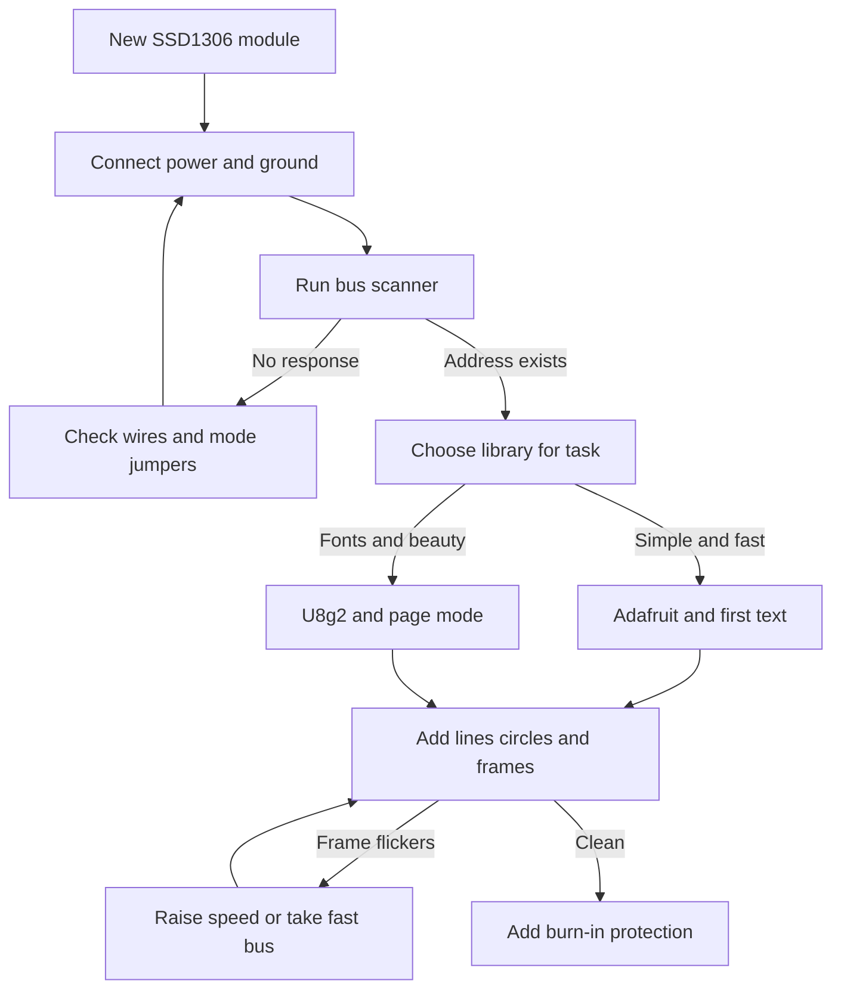

# OLED SSD1306 - Graphics on Arduino

![[assets/img/arduino-oled-scheme.png|600]]
*Fig. SSD1306 screen: self-lit pixels, memory buffer, bus choice, text and shapes.*

> [!tip] Purpose of this note
> Draw on a small screen like on a large one: connect the bus, choose a library, output text and shapes and do not burn the matrix with static content.

## 1. Purpose

A graphical screen draws with dots: text in any size, lines, circles, frames, simple icons.

Each dot lights itself, so black is really black and there is no backlight at all.

The price of this freedom: the frame is first assembled in the board memory, then sent to the matrix.

This note covers practice: matrix sizes, power, libraries, buffer, buses, drawing, Cyrillic, burn-in.

Two-wire bus addresses and scanner are covered in the note [[EN/04-Interfaces/03-I2C-Wire.en|Two-wire bus]].

The fast four-wire bus for large frames is described in the note [[EN/04-Interfaces/02-SPI.en|Fast bus]].

The character predecessor of graphics is described in the note [[EN/11-Vivid/01-LCD1602.en|Character screen]].

## 2. Matrix characteristics

| Parameter | Small variant | Large variant |
| --- | --- | --- |
| Size in dots | One hundred twenty-eight by thirty-two | One hundred twenty-eight by sixty-four |
| Diagonal | About half an inch | About one inch |
| Controller | SSD1306 | SSD1306 |
| Colors | White or blue on black | White, blue, yellow-blue |
| Logic power | Three and three volts, often tolerates five | Five volts through module stabilizer |
| Contrast | Programmatic, brightness command | Same programmatic |
| Viewing angles | Wide, image not inverted | Same wide |

A one hundred twenty-eight by sixty-four matrix needs exactly one kilobyte of buffer.

A one hundred twenty-eight by thirty-two matrix needs half that, half a kilobyte.

A small board with two kilobytes of memory gives the screen half and lives on.

Yellow-blue modules have fixed color zones: top yellow, bottom blue.

## 3. Library choice

| Library | Strengths | When to choose |
| --- | --- | --- |
| Adafruit SSD1306 plus GFX | Simple calls, many examples | First screen, quick start |
| U8g2 full buffer | Fonts for any taste, Cyrillic | Beautiful text and small sizes |
| U8g2 page mode | Frame without large buffer | Low memory, slow refresh |

Both libraries are installed through the environment library manager by name.

The Adafruit library pulls GFX: drawing primitives live there.

The U8g2 library knows hundreds of fonts; Cyrillic ones exist too, names include Cyrillic marks.

For the first experiment take Adafruit: fewer settings, image from the first try.

For a clock with a nice font take U8g2 and page mode.

```text
Library choice by three questions:

  Need quick and simple ......... Adafruit SSD1306
  Need nice fonts .............. U8g2 full buffer
  Memory tight ................. U8g2 page mode

  Rule: first launch on Adafruit,
  beauty and fonts later on U8g2.
```

## 4. Memory buffer

| Matrix | Bytes per frame | Share of small board memory |
| --- | --- | --- |
| One hundred twenty-eight by sixty-four | One thousand twenty-four | Half of two kilobytes |
| One hundred twenty-eight by thirty-two | Five hundred twelve | Quarter of memory |
| Text mode without buffer | Tens of bytes | U8g2 page mode |

The formula is simple: width times height divided by eight, because a dot is a bit.

The frame is drawn in the buffer by calls, then sent to the matrix with one display call.

A missed display call leaves the matrix dark despite correct drawing code.

Large font arrays also eat memory; they are kept in flash, not in RAM.

A sign of memory starvation: the board restarts exactly after adding the screen.

## 5. I2C bus vs SPI

| Topic | I2C variant | SPI variant |
| --- | --- | --- |
| Wires | Two: data and clock | Four plus power: speed at the cost of pins |
| Address | Zero x three c or zero x three d | No address, chip select |
| Speed | Four hundred kilohertz typical | Megahertz, smoother animation |
| Board pins | Saves, shared bus | Eats pins, flies |
| Jumpers | Address choice on module | Mode choice by jumper or solder |

For text and slow devices the two-wire bus is enough with margin.

For animation and graphs take the fast bus: the frame arrives several times faster.

Modules often support both buses; the mode is chosen by jumpers on the back.

After soldering jumpers the module does not respond on the old bus; this is normal.

Module power does not depend on the bus: five volts remain five volts.

## 6. Drawing: text and shapes

| Call | What it draws | Tip |
| --- | --- | --- |
| setTextSize | Text size by multiplier | Two for header, one for lines |
| setCursor | Text position | Count with size in mind |
| print and println | Line or number | Format beforehand |
| drawPixel | One dot | For charts and noise |
| drawLine | Segment | Chart axes and arrows |
| drawRect and fillRect | Frame and fill | Panels and progress |
| drawCircle and fillCircle | Circle and disk | Indicators and dials |
| display | Frame to matrix | Always at end of drawing |
| clearDisplay | Clear buffer | At start of each frame |

Text is placed in a grid: size one gives twenty-one characters per line on a wide matrix.

Size two gives about ten characters, but reads across the room.

Shapes outside the matrix are silently clipped; no error will occur.

Filling a large area with white accelerates burn-in; black is better kept.

## 7. Burn-in and brightness

| Topic | Meaning | Practice |
| --- | --- | --- |
| Burn-in | Static burns the phosphor | Moving image, turn off in idle |
| Brightness | Program command | Middle for room, max for display case |
| Screensaver | Off after one minute of rest | Mandatory for boards |
| Inversion | White on black vs black on white | Dark background lives longer |
| Heat | Brightness plus heat ages faster | Do not place near heating |

A clock with static digits is shifted by a dot once per hour or turned off at night.

Progress instead of a static bar is drawn with numbers: fewer white dots burn.

Full brightness is set only for display; at home half is enough.

A measurement screen is woken by a button, not kept on around the clock.

## 8. Text and shapes sketch

```cpp
#include <Wire.h>
#include <Adafruit_GFX.h>
#include <Adafruit_SSD1306.h>

#define W 128
#define H 64

Adafruit_SSD1306 oled(W, H, &Wire, -1);

void setup() {
  Wire.begin();
  Wire.setClock(400000);
  oled.begin(SSD1306_SWITCHCAPVCC, 0x3C);
  oled.clearDisplay();
  oled.setTextSize(2);
  oled.setTextColor(SSD1306_WHITE);
  oled.setCursor(0, 0);
  oled.println("Privit!");
  oled.setTextSize(1);
  oled.setCursor(0, 24);
  oled.println("Temp: 23 C");
  oled.drawRect(0, 40, 100, 12, SSD1306_WHITE);
  oled.fillRect(2, 42, 64, 8, SSD1306_WHITE);
  oled.drawCircle(114, 46, 10, SSD1306_WHITE);
  oled.display();
}

void loop() {
  delay(500);
}
```

Take the address from the scanner: zero x three c is more common, zero x three d rarer.

Four hundred kilohertz is set after bus startup for a lively frame.

Minus one in the constructor means no reset pin on the module.

The rectangle draws the battery frame, fill shows level, circle lights as indicator.

Cyrillic in this example is given by transliteration: the generator is Latin.

## 9. Board connection

```text
Module connections by two-wire bus:

  Board                SSD1306 module
  -----                --------------
  SDA ----------------> SDA
  SCL ----------------> SCL
  5V -----------------> VCC
  GND ----------------> GND

  Module connections by fast bus:

  Board                SSD1306 module
  -----                --------------
  MOSI ---------------> MOSI (data)
  SCK ----------------> SCK (clock)
  D9 -----------------> DC (data or command)
  D10 ----------------> CS (chip select)
  D8 -----------------> RES (reset)
  5V -----------------> VCC
  GND ----------------> GND

  Clean image conditions:
  short wires, common ground,
  power first, then code.
```

Fast bus pins depend on the board; verify numbers against the board schematic.

The reset line is absent on cheap modules; then minus one is used in code.

After changing bus by jumpers the old sketch stops working; change the constructor.

## 10. Mermaid: graphics startup



The diagram reads top to bottom: power, address, library, shapes, protection.

Without an address from the scanner library choice gives nothing.

Burn-in protection is added immediately, not after the first shadows.

## Common issues

| # | Issue | Why bad | How to fix |
| --- | --- | --- | --- |
| 1 | No frame display call | Buffer full, matrix dark | End drawing with display call |
| 2 | Address from example instead of own | Startup fails silently | Run scanner and enter your address |
| 3 | Full buffer on small board | Not enough memory, board hangs | U8g2 page mode or smaller matrix |
| 4 | Static at full brightness around the clock | Matrix burns out in months | Off in idle, dark background |
| 5 | Long wires in fast mode | Frame breaks, garbage on screen | Shorten wires or lower speed |
| 6 | Power with sag | Screen flickers and resets | Separate stable block with common ground |

## Official sources

- [Wire bus on docs.arduino.cc](https://docs.arduino.cc/language-reference/en/functions/communication/wire/) - bus startup, speed, address scanner for module.
- [Learning section on docs.arduino.cc](https://docs.arduino.cc/learn/) - electronics articles, power, module connection.
- [Language reference on arduino.cc](https://www.arduino.cc/reference/en/) - basic functions, data types, text handling.

## See also

- [[Home.en]]
- [[EN/04-Interfaces/03-I2C-Wire.en|Two-wire bus]]
- [[EN/04-Interfaces/02-SPI.en|Fast bus]]
- [[EN/11-Vivid/01-LCD1602.en|Character screen]]
- [[EN/11-Vivid/03-NeoPixel-Servo-Relay.en|Strips and power]]
