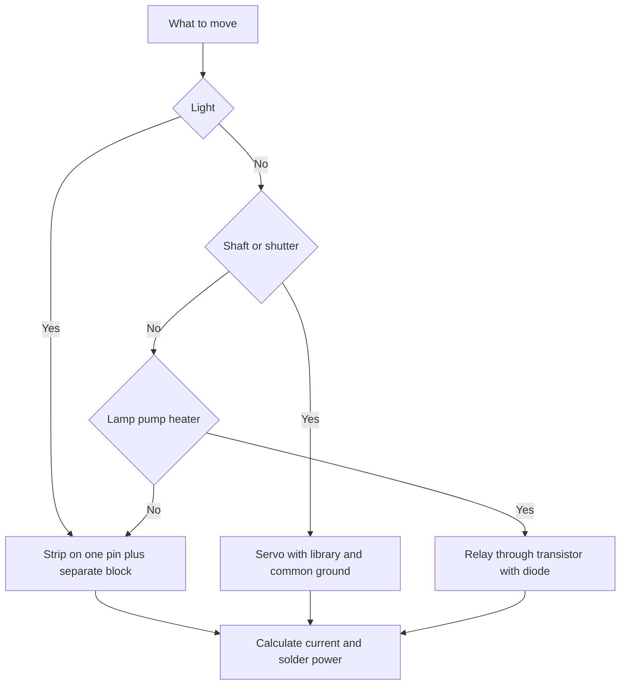

# NeoPixel, Servo and Relay - Power

![[assets/img/arduino-neo-servo-scheme.png|600]]
*Fig. Power in three forms: addressable strip on one pin, servo with separate power, relay through transistor.*

> [!tip] Purpose of this note
> Move light, shaft and load without smoke: feed the strip separately, turn the servo with a library and click the relay through a transistor with a diode.

## 1. Purpose

An addressable strip gives a rainbow on one pin: each diode has its own color and brightness.

A servo sets the shaft to a given angle: doors, model steering, feeder shutter.

A relay turns on a large load with a small signal: lamp, pump, heater.

All three nodes share one rule: the board signal is not enough, power is taken from separate supply.

This note covers practice: strip timing, currents and ground, servo library, transistor and relay diode, sketches.

About modulation and board timers read in the note [[EN/03-GPIO/02-PWM-analogWrite.en|Pulse-width modulation]].

About the character screen for control panels read in the note [[EN/11-Vivid/01-LCD1602.en|Character screen]].

About the graphical screen for control panels read in the note [[EN/11-Vivid/02-OLED-SSD1306.en|Graphical display]].

## 2. NeoPixel strip on one pin

| Parameter | Value | Explanation |
| --- | --- | --- |
| Diode | WS2812 or compatible | Controller inside each diode |
| Data line | One board pin | Chain passes further by itself |
| Stream speed | Eight hundred kilohertz | Strict bit time windows |
| Color order | Green red blue | Library builds itself |
| Brightness | Eight bits per color | Zero is dark, max is blinding |
| Chain length | Tens of diodes from board | Hundreds ask for separate power controller |

The protocol depends on exact pauses: long pulse is one, short is zero.

Interrupts during sending break the frame: the library turns them off during transmission.

The first diode in the chain is the most vulnerable: hot power connection burns it.

Data is fed through a resistor of about three hundred ohms: it damps reflection in the wire.

```text
Strip chain and byte order:

  board --[R 300 Ohm]--> DIN [diode 0] --> DOUT --> DIN [diode 1] --> ...

  Frame for two diodes:
  diode 0: green red blue
  diode 1: green red blue

  Rule: send the frame, show with call,
  without show the strip keeps the old one.
```

## 3. Separate strip power

| Diode count | Current at maximum | Source |
| --- | --- | --- |
| One diode white | About sixty milliamps | Board pulls |
| Eight diodes white | About half an amp | Separate five volt block |
| Thirty diodes white | About two amps | Block with one-third reserve |
| Sixty diodes white | About four amps | Thick wires and soldering both sides |

The board does not feed the strip: the board regulator is weak, traces are thin, sag will occur.

Grounds must be connected: without common ground data has no reference.

Power is given before code change: a hot data wire on a live strip hits the input.

A long strip is powered from both ends: strip copper is thin, the tail turns pink from sag.

A capacitor near one thousand microfarads at the strip input smooths current spikes.

Brightness is limited in code: half brightness cuts current in half without losing beauty.

## 4. Strip sketch

```cpp
#include <Adafruit_NeoPixel.h>

#define PIN 6
#define NUM 8

Adafruit_NeoPixel strip(NUM, PIN, NEO_GRB + NEO_KHZ800);

void setup() {
  strip.begin();
  strip.setBrightness(64);
  strip.show();
}

void loop() {
  for (int i = 0; i < NUM; i++) {
    strip.clear();
    strip.setPixelColor(i, strip.Color(255, 0, 0));
    strip.show();
    delay(150);
  }
}
```

Brightness sixty-four out of two hundred fifty-five saves eyes and the power block.

A running dot checks the diode order and chain integrity in seconds.

Color is built from three numbers: red green blue from zero to maximum.

Clearing the buffer before a new frame removes tails from the previous one.

For a rainbow rotate the hue in a color circle instead of manual iteration.

## 5. Servo through library

| Signal parameter | Value | Meaning |
| --- | --- | --- |
| Repeat period | Twenty milliseconds | Hobby servo standard |
| Minimum pulse | One millisecond | Shaft at far left |
| Middle pulse | One and a half milliseconds | Shaft at center |
| Maximum pulse | Two milliseconds | Shaft at far right |
| Angle | Zero to one hundred eighty degrees | Library calculates itself |
| Motor power | Separate block five to six volts | Board does not give this current |

The Servo library hides timer internals: the user sets only the turn angle.

The signal wire carries only control; motor power takes from its own block.

After attach command part of modulation outputs on this timer turns off.

Do not drive the shaft to stops with jerks: start from middle, small steps, visible pauses.

Plastic gears break under shock load; install the lever without tilt.

## 6. Servo sketch

```cpp
#include <Servo.h>

Servo drive;

void setup() {
  drive.attach(9);
  drive.write(90);
  delay(1000);
}

void loop() {
  drive.write(0);
  delay(1000);
  drive.write(90);
  delay(1000);
  drive.write(180);
  delay(1000);
}
```

The signal wire sits on pin nine; motor power from a separate block.

Common ground of board and block is mandatory; without it the shaft jerks chaotically.

A one-second pause lets the shaft reach the stop before the next command.

Smooth movement is done with a loop of one-degree steps and twenty-millisecond pauses.

```text
Servo connections with separate power:

  Board                Servo              Power block
  -----                -----              -------------
  D9 -----------------> signal
  GND ----------------> ground <---------- block minus
                       plus ------------> block plus 5-6 V

  Rule: motor plus never comes from the board,
  grounds are always common.
```

## 7. Relay through transistor and diode

| Element | Rating and type | Purpose |
| --- | --- | --- |
| Relay | Five volts, coil | Clicks contacts of power circuit |
| Transistor | NPN, with current margin | Coil asks for more than pin can give |
| Base resistor | About one kilohm | Limits current from pin |
| Diode | Parallel to coil, against power | Damps self-induction spike |
| Coil power | Separate block or strong line | Startup current sags the board |
| Contacts | Double current reserve | Inrush current is larger than operating |

The board pin does not pull the coil: coil current is several times the output limit.

Without a diode the coil spike hits the transistor and resets the board.

The diode is placed stripe to plus: during work it is closed, during spike it is open.

Relay modules with optocoupler already have transistor and diode on board.

Power contacts and low-voltage part are kept far apart.

```text
Relay key on transistor:

  pin D7 --[R 1 kOhm]--> NPN base
  emitter -------------> ground
  collector -----------> coil ---> plus 5 V
  diode parallel to coil stripe to plus

  Logic: one on pin opens transistor,
  coil pulls armature, contacts click.
```

## 8. Relay sketch

```cpp
const int RELAY_PIN = 7;

void setup() {
  pinMode(RELAY_PIN, OUTPUT);
  digitalWrite(RELAY_PIN, LOW);
}

void loop() {
  digitalWrite(RELAY_PIN, HIGH);
  delay(2000);
  digitalWrite(RELAY_PIN, LOW);
  delay(2000);
}
```

Starting level low: relay must not click at power-on.

Clicking once per two seconds is heard and seen: check without instruments.

Inverse modules turn on with zero: check level by module LED.

Load is turned on through contacts with proper current and voltage reserve.

A fuse in the power circuit is always placed: contacts weld, wires do not.

## 9. Mermaid: what power is needed



The diagram reads left to right: node choice, then power and ground.

Current is calculated before first turn-on, not after smoke smell.

Common ground is required for all three nodes without exception.

## Common issues

| # | Issue | Why bad | How to fix |
| --- | --- | --- | --- |
| 1 | Strip powered from board | Sag, restarts, hot regulator | Separate five volt block with common ground |
| 2 | No common ground | Data without reference, garbage in colors | Connect board and block grounds with thick wire |
| 3 | Servo powered from board | Startup current sags supply | Separate five to six volt block |
| 4 | Relay directly from pin | Coil current burns output | Key on transistor plus base resistor |
| 5 | No diode on coil | Self-induction spike hits the circuit | Diode parallel to coil stripe to plus |
| 6 | Full brightness on long strip | Amps melt thin copper | Limit brightness and solder both sides |

## Official sources

- [Servo library on docs.arduino.cc](https://docs.arduino.cc/libraries/servo/) - servo connection, angles, power, sketch examples.
- [Learning section on docs.arduino.cc](https://docs.arduino.cc/learn/) - electronics articles, power, load control.
- [Language reference on arduino.cc](https://www.arduino.cc/reference/en/) - digital outputs, delays, basic sketch functions.

## See also

- [[Home.en]]
- [[EN/03-GPIO/02-PWM-analogWrite.en|Pulse-width modulation]]
- [[EN/11-Vivid/01-LCD1602.en|Character screen]]
- [[EN/11-Vivid/02-OLED-SSD1306.en|Graphical display]]
