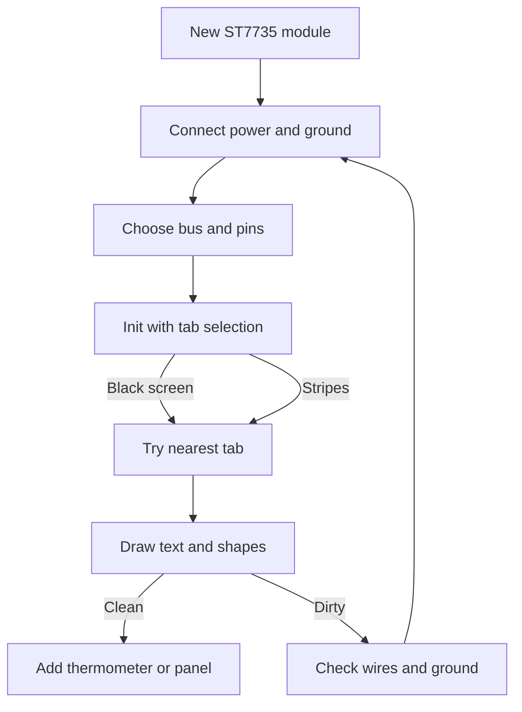

# TFT ST7735 - Color over SPI

![[assets/img/arduino-tft-scheme.png|600]]
*Fig. ST7735 color module: fast bus, separate command and reset lines, bright backlight, thermometer on screen.*

> [!tip] Purpose of this note
> Build a small color instrument in one evening: connect the module on the fast bus, choose a tab for your size, draw text and shapes without stripes.

## 1. Purpose

A small color screen turns the board into an instrument: digits visible from afar, a graph read instantly, menu controlled by buttons.

The ST7735 controller manages a matrix of thousands of dots, each dot has its own color from a palette of sixty-five thousand shades.

The price of color is simple: the frame flies over the fast bus, because the slow bus is too lazy for such a number of dots.

This note covers practice: glass sizes and tabs, libraries, DC and RST lines, initialization, text and shapes, speed and stripes, thermometer.

Basics of the fast bus, clock and chip selection are described in the note [[EN/04-Interfaces/02-SPI.en|Fast bus]].

The monochrome predecessor with memory buffer is described in the note [[EN/11-Vivid/02-OLED-SSD1306.en|Graphical display]].

Logic power and current reserve for backlight are described in the note [[EN/02-Power-Supply/01-VIN-Power-Supply.en|Power from VIN]].

## 2. Modules and glass sizes

| Variant | Dots on glass | Diagonal | Where it lives |
| --- | --- | --- | --- |
| Small square | One hundred twenty-eight by one hundred twenty-eight | About three quarters inch | Keychains, clocks, sensors |
| Middle rectangle | One hundred twenty-eight by one hundred sixty | About one inch | Remotes, thermometers, toys |
| Narrow long | Eighty by one hundred sixty | Less than inch | Bracelets, mini panels |
| Large | One hundred sixty by one hundred twenty-eight | About one and a half inches | Instrument panels |

The same size glass is made by different factories, so the image shift varies by a few dots.

This is exactly why the library has tabs: ready settings for shift under a specific glass batch.

Wrong tab gives a picture with a stripe on the side or shifted colors at the edge.

The rule is simple: do not like the image edge, try a neighboring tab and look again.

Backlight on all modules is LED; current takes from the module power line.

## 3. Adafruit ST7735 and GFX libraries

| Library | What it gives | When to install |
| --- | --- | --- |
| Adafruit GFX | Text, lines, circles, frames, fill | Always, this is drawing base |
| Adafruit ST7735 | Glass driver, init, tabs | Always, without it glass stays silent |
| Adafruit BusIO | Bus exchange at low level | Pulls itself as dependency |
| Samples from package | Graphics and tab tests | First launch and tab selection |

Install through the library manager by name; GFX and BusIO are pulled automatically.

The driver takes the tab number in constructor; try one to five for first tests.

Wrong init gives black screen, white screen or stripes; change tab and restart.

## 4. Lines DC and RST

| Line | Purpose | Note |
| --- | --- | --- |
| DC (Data/Command) | Tells the controller if bytes are command or data | Must switch correctly |
| RST (Reset) | Resets the controller to initial state | Often connected to board reset or separate pin |
| CS (Chip Select) | Selects this module on shared bus | One pin per module |
| MOSI and SCK | Data and clock of SPI | Standard four-wire bus |

The module often has pin names printed directly; compare with board legend.

Without RST some modules work with a delay after start; add delay if needed.

## 5. Initialization and tab selection

```cpp
#include <Adafruit_GFX.h>
#include <Adafruit_ST7735.h>
#include <SPI.h>

#define TFT_CS   10
#define TFT_DC   8
#define TFT_RST  9

Adafruit_ST7735 tft = Adafruit_ST7735(TFT_CS, TFT_DC, TFT_RST);

void setup() {
  tft.initR(INITR_BLACKTAB);
  tft.setRotation(0);
  tft.fillScreen(ST7735_BLACK);
}
```

INITR_BLACKTAB suits black-background modules; try INITR_REDTAB or INITR_GREENTAB.

Rotation is set after init; zero is portrait, one is clockwise, etc.

## 6. Text and shapes

| Call | What it draws | Tip |
| --- | --- | --- |
| setTextSize | Size multiplier | Two for header |
| setCursor | Position | Count with size |
| setTextColor | Text color | Use high-contrast pairs |
| print | Line or number | Format beforehand |
| drawLine | Segment | Axes and arrows |
| drawRect and fillRect | Frame and fill | Panels and progress |
| drawCircle and fillCircle | Circle and disk | Indicators |
| fillScreen | Full fill | Before new frame |
| display | Not needed for ST7735; draw goes straight | Direct write to glass |

Text grid: size one gives about twenty characters per line on middle module.

Size two gives about ten, readable across the room.

Shapes outside glass are silently clipped.

## 7. Speed and stripes

| Topic | Sense | Practice |
| --- | --- | --- |
| Speed | SPI at eight megahertz is enough | Higher can cause noise |
| Stripe | Wrong tab or wiring | Try next tab, check connections |
| Brightness | Controlled by hardware or not at all | Often fixed maximum |
| Temperature | Glass warms slightly | Keep away from heat sources |
| Contrast | Not adjustable; color is direct | Choose background wisely |

Stripes are the most common problem: a wrong tab shifts the image by several dots.

Always keep the glass tab number in sketch comments.

## 8. Thermometer sketch

```cpp
#include <Adafruit_GFX.h>
#include <Adafruit_ST7735.h>
#include <SPI.h>

#define TFT_CS   10
#define TFT_DC   8
#define TFT_RST  9

Adafruit_ST7735 tft = Adafruit_ST7735(TFT_CS, TFT_DC, TFT_RST);

void setup() {
  tft.initR(INITR_BLACKTAB);
  tft.setRotation(1);
  tft.fillScreen(ST7735_BLACK);
  tft.setTextColor(ST7735_WHITE);
  tft.setTextSize(2);
  tft.setCursor(10, 10);
  tft.println("Temp");
  tft.setTextSize(3);
  tft.setCursor(10, 40);
  tft.println("23 C");
}

void loop() {}
```

The sketch is static; for dynamics update values in loop.

Keep strings short; long text overflows silently.

## 9. Board connection

```text
Module connections by fast bus:

  Board                ST7735 module
  -----                --------------
  5V -----------------> VCC
  GND ----------------> GND
  MOSI ---------------> MOSI (data)
  SCK ----------------> SCK (clock)
  D8 -----------------> DC (data/command)
  D10 ----------------> CS (chip select)
  D9 -----------------> RST (reset)

  Stable image conditions:
  short wires, common ground,
  correct tab, power first.
```

The module draws significant current through backlight; use a separate stable five-volt block if the board regulator is weak.

## 10. Mermaid: startup flow



The diagram reads top to bottom: power, bus, init, tab, drawing, check.

Without tab selection the module may stay dark or with stripes.

## Common issues

| # | Issue | Why bad | How to fix |
| --- | --- | --- | --- |
| 1 | No tab or wrong tab | Black screen, stripes, shifted colors | Try INITR_BLACKTAB, REDTAB, GREENTAB |
| 2 | DC and RST swapped | Nothing on screen | Check pin names against module label |
| 3 | Power from weak regulator | Screen flickers, resets | Separate five-volt block |
| 4 | Long SPI wires | Noise and stripes | Shorten to ten centimeters |
| 5 | No rotation set | Image sideways | Set rotation after init |

## Official sources

- [ST7735 reference on docs.arduino.cc](https://docs.arduino.cc/libraries/adafruit_st7735/) - init, tabs, examples.
- [Learning section on docs.arduino.cc](https://docs.arduino.cc/learn/) - SPI bus, module connection.
- [Language reference on arduino.cc](https://www.arduino.cc/reference/en/) - basic functions, text handling.

## See also

- [[Home.en]]
- [[EN/04-Interfaces/02-SPI.en|Fast bus]]
- [[EN/11-Vivid/02-OLED-SSD1306.en|Graphical display]]
- [[EN/02-Power-Supply/01-VIN-Power-Supply.en|Power from VIN]]
