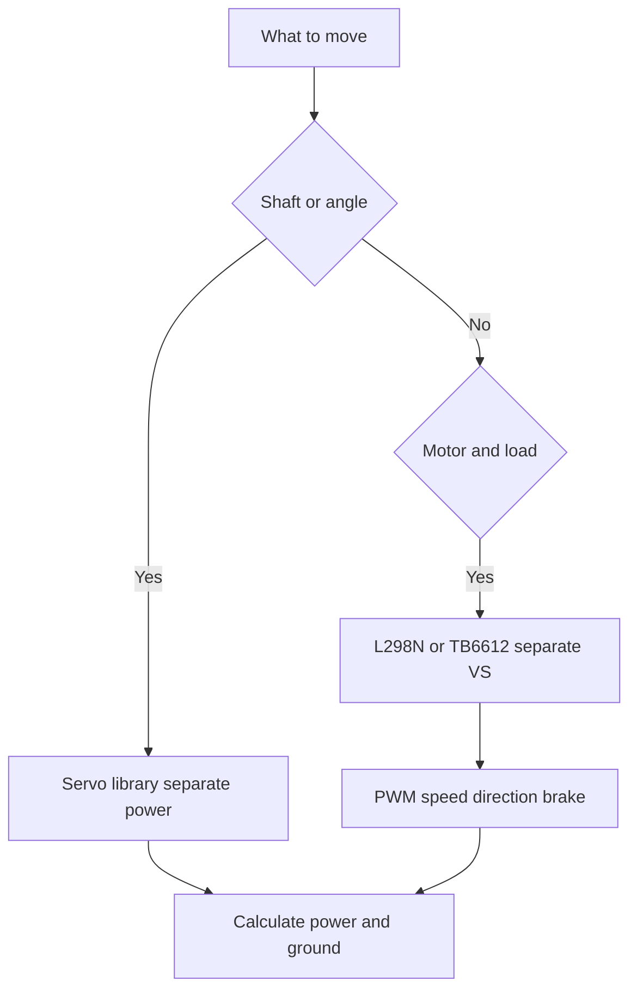

# Servo and Motors - L298N and Power

![[assets/img/arduino-motor-scheme.png|600]]
*Fig. Power in motion on the table: small servo with separate power, power bridge for two motors, direction and speed under control.*

> [!warning] L298N - outdated bridge (dropout 2-4 V, heats): for new builds take TB6612/DRV8833; L298 below only as legacy.
> [!tip] Purpose of this note
> Move shaft and wheels without smoke: set servo to given angle, turn motors through bridge, feed power separately and brake properly.

## 1. Purpose

A servo sets the shaft to a given angle: model steering, feeder shutter, manipulator arm.

A collector motor simply turns: car wheels, fan, pump, doser auger.

The board provides only control signal; power for motion is taken from separate supply.

This note covers practice: servo library and angles, separate power, L298N bridge and its pins, speed by modulation, direction and brake, diodes, two sketches.

Basics of modulation for speed are described in the note [[EN/03-GPIO/02-PWM-analogWrite.en|Pulse-width modulation]].

## 2. Servo library and angles

| Angle | Pulse | Shaft position |
| --- | --- | --- |
| Zero | One millisecond | Far left |
| Ninety | One and a half milliseconds | Center |
| One hundred eighty | Two milliseconds | Far right |

The library calculates pulse from angle; do not set pulse manually.

Power for motor is separate five to six volts; board does not provide this current.

Common ground between board and block is mandatory.

## 3. L298N bridge

| Pin | Function | Note |
| --- | --- | --- |
| IN1, IN2 | Motor A direction | Pair for one motor |
| IN3, IN4 | Motor B direction | Pair for second motor |
| ENA, ENB | Speed by PWM | Must be PWM pin |
| VCC | Logic power five volts | From board or module |
| VS | Motor power seven to twelve volts | Separate block |
| GND | Ground | Common for logic and motor |

Dropout is two to four volts; the bridge loses voltage as heat.

For new builds take TB6612 or DRV8833: lower dropout, better efficiency.

## 4. Direction and brake

| State | IN1 | IN2 | Effect |
| --- | --- | --- | --- |
| Forward | High | Low | Motor turns one way |
| Backward | Low | High | Motor turns other way |
| Brake | High | High | Short circuit brake |
| Coast | Low | Low | Free run |

Brake is faster than coast; use for quick stops.

## 5. Sketch servo

```cpp
#include <Servo.h>
Servo s;
void setup() { s.attach(9); s.write(90); }
void loop() {}
```

## 6. Sketch motor with bridge

```cpp
const int ENA = 5;
const int IN1 = 6;
const int IN2 = 7;
void setup() { pinMode(ENA, OUTPUT); pinMode(IN1, OUTPUT); pinMode(IN2, OUTPUT); }
void loop() {
  analogWrite(ENA, 200);
  digitalWrite(IN1, HIGH); digitalWrite(IN2, LOW);
  delay(1000);
  digitalWrite(IN1, LOW); digitalWrite(IN2, LOW);
  delay(500);
}
```

PWM on ENA sets speed; direction by IN pair.

## 7. Diodes and protection

Each motor needs a diode across the coil, stripe to plus, for back-EMF protection.

The bridge already has internal diodes; external ones are extra safety.

## 8. Board connection

```text
Bridge to board:

  Board                Bridge
  -----                ------
  D5 -----------------> ENA (PWM)
  D6 -----------------> IN1
  D7 -----------------> IN2
  5V -----------------> VCC
  GND ----------------> GND
  9V -----------------> VS (motor)
```

Keep motor power separate; board regulator cannot handle motor current.

## 9. Mermaid: motion choice



The diagram reads top to bottom: choice, then power.

## Common issues

| # | Issue | Why bad | How to fix |
| --- | --- | --- | --- |
| 1 | Motor from board pin | Burned output | Separate block VS |
| 2 | No diode across coil | Spike kills transistor | Add external diode |
| 3 | Wrong EN pin | No speed control | Use PWM-capable pin |
| 4 | Brake never used | Slow stops | Use high-high for quick stop |

## Official sources

- [Servo library on docs.arduino.cc](https://docs.arduino.cc/libraries/servo/)
- [L298N module guides](https://www.arduino.cc/en/Reference/L298N)
- [Language reference](https://www.arduino.cc/reference/en/)

## See also

- [[Home.en]]
- [[EN/03-GPIO/02-PWM-analogWrite.en|Pulse-width modulation]]
- [[EN/11-Vivid/03-NeoPixel-Servo-Relay.en|Strips and power]]
