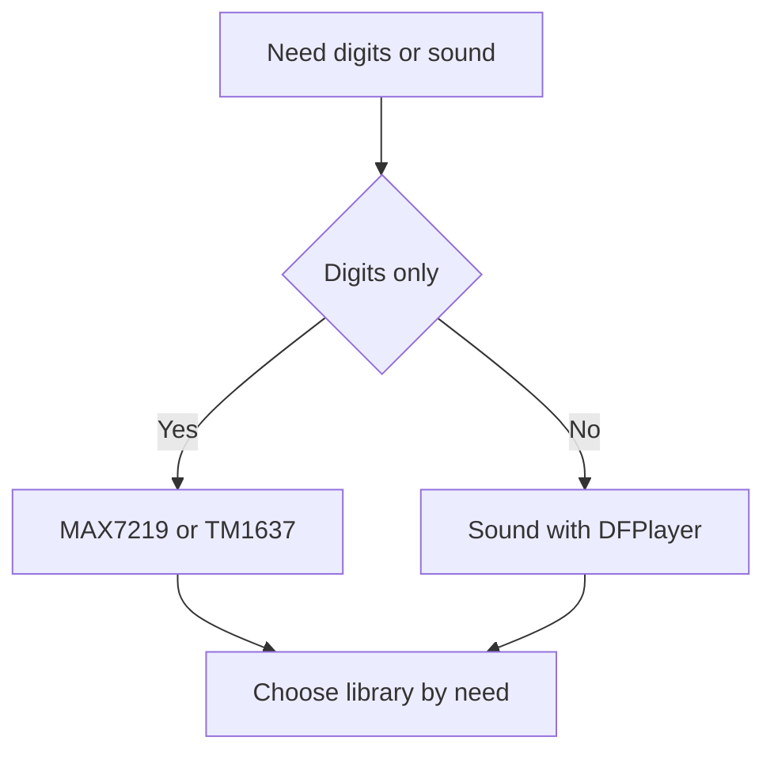

# Arduino and Simple Indication - MAX7219, TM1637 and Sound DFPlayer

![[assets/img/ard-indikatsiya-audio-scheme.png|600]]
*Fig. MAX7219 runs matrices over SPI, TM1637 - cheap digits over two wires, DFPlayer sounds events.*

> [!tip] What this note is about
> When LCD1602 is too small and TFT is too much: scoreboard, clock, counter plus voice cues. All - ready libraries, zero math. Base: [[EN/11-Vivid/01-LCD1602.en|Character screen]], [[EN/04-Interfaces/02-SPI.en|Fast bus]], [[EN/03-GPIO/02-PWM-analogWrite.en|Pulse-width modulation]].

## 1. Goal

Close indication and sound with three modules:

- MAX7219: 8 seven-segment or 8x8 matrix, cascade;
- TM1637: 4 digits with colon, clock for pennies;
- DFPlayer Mini: MP3 from microSD over UART, event voices;
- libraries: LedControl/MD_MAX72XX, TM1637Display, DFRobotDFPlayerMini.

## 2. MAX7219 cascade

| Parameter | Value | Note |
| --- | --- | --- |
| Module | 8 digits or 8x8 matrix | Cascade connects more |
| Interface | SPI | Data and clock |
| Library | LedControl | Simple calls |
| Brightness | Programmatic | 0 to 15 |

Cascade connects by chip select; each module gets its own load.

## 3. TM1637

| Parameter | Value | Note |
| --- | --- | --- |
| Module | 4 digits | Cheap, two wires |
| Interface | I2C-like | Data and clock |
| Library | TM1637Display | Clock with colon |

Two wires from board; common ground required.

## 4. DFPlayer Mini

| Parameter | Value | Note |
| --- | --- | --- |
| Module | MP3 from microSD | UART interface |
| Library | DFRobotDFPlayerMini | Play by number |
| Power | Separate 5 V | High current on sound |

MicroSD holds files as 0001.mp3 etc.

## 5. Sketch MAX7219

```cpp
#include <LedControl.h>
LedControl lc = LedControl(12, 11, 10, 1);
void setup() { lc.shutdown(0, false); lc.setIntensity(0, 8); lc.clearDisplay(0); lc.setDigit(0,0,5,false); }
void loop() {}
```

## 6. Sketch TM1637

```cpp
#include <TM1637Display.h>
TM1637Display display(2, 3);
void setup() { display.setBrightness(7); display.showNumberDec(1234); }
void loop() {}
```

## 7. Sketch DFPlayer

```cpp
#include <SoftwareSerial.h>
#include <DFRobotDFPlayerMini.h>
SoftwareSerial mySerial(10, 11);
DFRobotDFPlayerMini myDFPlayer;
void setup() { mySerial.begin(9600); myDFPlayer.begin(mySerial); myDFPlayer.play(1); }
void loop() {}
```

## 8. Board connection

```text
MAX7219: MOSI-SCK-CS from SPI bus
TM1637: SDA-SCL to two pins
DFPlayer: TX-RX to UART pins; 5V-GND separate
```

## 9. Mermaid: selection



## Common issues

| # | Issue | Why bad | How to fix |
| --- | --- | --- | --- |
| 1 | MAX7219 without library | Nothing shows | Use LedControl init |
| 2 | TM1637 wrong pins | No clock | Check data and clock |
| 3 | DFPlayer no SD | No sound | Format SD and name files 0001.mp3 |

## Official sources

- [LedControl library](https://github.com/wayoda/LedControl)
- [TM1637 library](https://github.com/avishorp/TM1637)
- [DFPlayer library](https://github.com/DFRobot/DFRobotDFPlayerMini)

## See also

- [[Home.en]]
- [[EN/11-Vivid/01-LCD1602.en|Character screen]]
- [[EN/04-Interfaces/02-SPI.en|Fast bus]]
