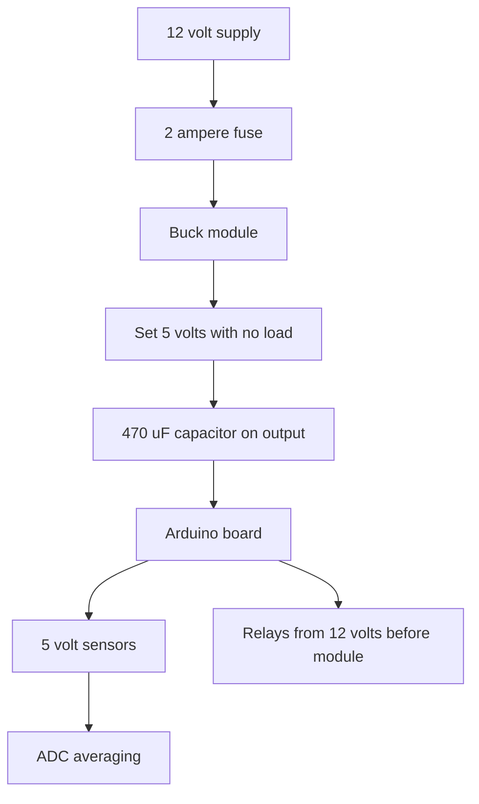

# DC-DC Converters - Node Power Supply

![[assets/img/arduino-buck-scheme.png|600]]
*Fig. Pulse module steps twelve volts down to five for the Arduino board and sensors.*

> [!tip] Purpose of this note
> Shows how to power a node from twelve volts with no iron-like linear regulator heat and no ADC noise.

## 1. Purpose

A node at a summer house or in a greenhouse often runs from a 12 volt supply. LED strips, pumps, locks, all ask for twelve. But the Arduino board wants five. Feeding twelve straight into the board jack is possible, yet the built-in regulator heats like an iron and sooner or later hits protection.

A pulse step-down buck converter solves the task neatly. It chops 12 volts into 5 volts with efficiency above eighty percent. It heats little, holds ampere currents, and a trimmer sets the needed voltage. An LM2596 module costs little and covers most tasks.

The second bonus is stability. Long wires from the supply sag, and a converter near the node levels them. Sensors get clean five volts, the ADC stays put, relays stop chattering.

## 2. Why Not a Linear Regulator

| Parameter | Linear 7805 | Pulse buck |
| --- | --- | --- |
| Efficiency 12 V to 5 V | About 42 percent | Above 80 percent |
| Heat at 0.5 A current | About 3.5 W into heat | Below 1 W into heat |
| Heatsink | Needed from 0.3 A | Unneeded to 1 A |
| Current | To 1 A with heatsink | To 2 or 3 A per version |
| Noise | Almost none | Present, fixed with a filter |

A linear regulator burns excess voltage into heat. A 7 volt drop at half an ampere is 3.5 watts. A package with no heatsink cannot shed that. So a node with a screen and relays on a linear part keeps tripping thermal protection.

A pulse module works with a switch and a choke. The transistor stays either open or closed, so heat stays low. The drawback is high-frequency noise. Distance from analog chains and capacitors remove it.

## 3. LM2596 Module With a Trimmer

| Element | Purpose | Practice |
| --- | --- | --- |
| LM2596 chip | Drives the switch | Fixed rate near 150 kHz |
| Choke | Stores energy | Never cover with a magnet |
| Trimmer | Voltage setting | Turn unhurried, watch the meter |
| LED | Work indication | Dies on output short |
| Input and output terminals | Wire connection | Never swap plus and minus |

Setup is simple. Connect the 12 volt input, leave the output free, put the meter on the output terminals. Turn the trimmer until the meter shows 5.0 volts. Only then connect the Arduino board. Order matters, because from the factory the module may output 12 or 20 volts.

The trimmer turns many rounds. One turn changes little, so turn calmly and count. After setting, drop lacquer on the screw so vibration never shifts it.

```text
Налаштування LM2596 покроково:
   1. Вхід 12В на клеми IN плюс до плюса мінус до мінуса
   2. Вихід OUT вільний, тестер на OUT у режимі 20В
   3. Крутилка за годинником піднімає, проти знижує
   4. Виставити 5.0В, зачекати хвилину, перевірити знову
   5. Вимкнути вхід, підключити плату, ввімкнути назад
```

## 4. Node Power-Supply Wiring

| Chain | Wire | Protection |
| --- | --- | --- |
| 12 V supply to module | Copper 0.75 sq | 2 A fuse on plus |
| Module to Uno board | Short 0.5 sq | 470 uF capacitor on output |
| 5 V sensors | From board or module | 100 nF capacitor near each |
| Analog sensors | Separate ground wire | Star ground to module |
| Relays and motors | Straight from 12 V | Diode on relay coil |

The input fuse saves from fire on a short. The diode on the relay coil kills the spike at switch-off. With no diode, the spike hits the switch and the whole node supply.

```text
ASCII схема вузла на 12 вольт:
   Блок 12В --запобіжник--> IN+ LM2596 --OUT+ 5В--> VIN плати або 5В пін
   Блок GND  -------------- IN- LM2596 --OUT- GND-> GND плати зіркою
   Реле 12В береться ДО модуля, керування через транзистор
   Датчики 5В біля плати, конденсатори 100 нФ біля кожного
```

Five volts feed either the board 5V pin or the USB jack through a cable stub. The board power jack takes them no more, because it expects seven volts and up. Confusion here burns the board.

## 5. Efficiency and Heat in Practice

At 0.2 ampere current the module stays barely warm. At 1 ampere it runs warm, but a finger holds. At 2 amperes it wants airflow or a heatsink on the chip. A node with Arduino, a screen, and a pair of sensors usually draws 0.15 or 0.3 ampere, so no issues arise.

Current is measured with a meter in the plus break. Measure in three states: node sleep, work with no relays, work with relays. Pick the supply with a one-and-a-half margin over the largest number.

## 6. Noise and a Clean ADC

A pulse module leaves a saw on the output at hundreds of kilohertz. Digital circuits ignore it, but an analog input sees it. Three steps fix it: module away from analog wires, a 470 uF capacitor on the output, averaging of ten readings in code.

| Trick | What it gives |
| --- | --- |
| 10 cm away from ADC wires | Less pickup |
| 470 uF plus 100 nF capacitor on output | Smooth voltage |
| Averaging of 10 readings | Noise divided by three |
| Separate analog ground | No shared sags |
| Measure with relays off | Quiet window for ADC |

For exact readings, feed the temperature sensor through an RC filter: a 100 ohm resistor plus a 10 uF capacitor near the sensor. The filter cuts the module high rates and never bothers slow temperature.

## 7. Supply-Control Sketch

```cpp
const int PIN_VIN = A0;
const int PIN_LED = 13;
float vin = 0;

void setup() {
  Serial.begin(9600);
  pinMode(PIN_LED, OUTPUT);
}

void loop() {
  long sum = 0;
  for (int i = 0; i < 10; i++) {
    sum += analogRead(PIN_VIN);
    delay(5);
  }
  float avg = sum / 10.0;
  vin = avg * (5.0 / 1023.0) * 3.0;
  Serial.print(F("VIN="));
  Serial.println(vin);
  if (vin < 11.0) {
    digitalWrite(PIN_LED, HIGH);
  } else {
    digitalWrite(PIN_LED, LOW);
  }
  delay(1000);
}
```

A divider of 20k and 10k resistors scales 12 volts to the ADC input level. The factor of three in the formula comes from there. Averaging ten readings removes module noise. The LED flags a supply sag below eleven.

## 8. Module Choice for the Task

| Task | Module | Comment |
| --- | --- | --- |
| Node with Arduino and sensors | LM2596 2 A | Cheap and enough |
| Node with screen and relays | LM2596 3 A or XL4015 | Current margin |
| Battery node | MP1584 mini | Less idle draw |
| Two rails 5 and 3.3 V | Two modules or one plus LDO | Analog side through LDO for quiet |

Mini MP1584 modules suit battery nodes because they draw less at idle. For a mains stationary node it makes no difference; take a big LM2596 with terminals and a heatsink.

## Mermaid: Node Power Supply



The wiring reads top to bottom. Fuse first, voltage set before board connection, relays fed before the module separately. Analog readings are averaged.

## Common Issues

| # | Issue | Why it is bad | Correct way |
| --- | --- | --- | --- |
| 1 | Board on an untuned module | Output may hold 20 volts | Meter first, board second |
| 2 | Relays from the 5 volt output | Sags and board restarts | Relays from 12 volts before the module |
| 3 | Long thin 12 volt wires | Voltage drop and hum | Copper 0.75 sq and module near the node |
| 4 | Module tight against ADC wires | Noise in readings | 10 cm away plus capacitors |
| 5 | No fuse | A short melts wires | 2 A fuse on supply plus |
| 6 | Five volts into the board power jack | Board never starts right | Five volts into the 5V pin or USB |

## Official Sources

- [LM2596 datasheet (Texas Instruments)](https://www.ti.com/product/LM2596) - currents, efficiency, typical buck converter wiring.
- [Arduino power guide](https://docs.arduino.cc/learn/electronics/power-pins/) - board power pins and current limits.

## See Also

- [[Home.en]]
- [[EN/13-Power-Modules/02-Level-Shift-TP4056.en|levels and charge]]
- [[EN/02-Power-Supply/01-VIN-Power-Supply.en|VIN power supply]]
- [[EN/02-Power-Supply/02-Battery-Power.en|standalone power]]
- [[EN/01-Hardware/01-AVR-Uno.en|classic AVR]]
