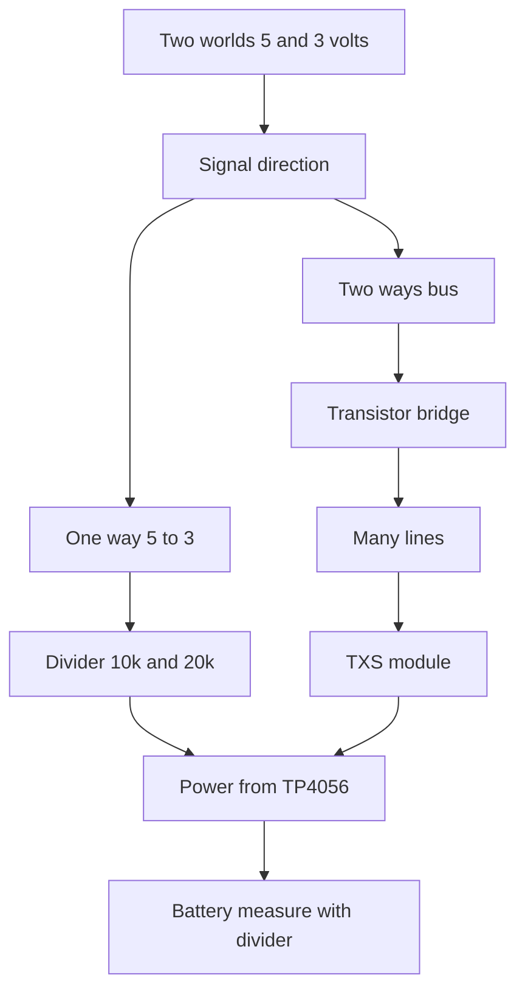

# Levels and Charge - 3.3V and Li-Ion

![[assets/img/arduino-level-scheme.png|600]]
*Fig. Level matching between five and three volts, plus lithium battery charge with a module.*

> [!tip] Purpose of this note
> Teaches joining five volts with three volts with no smoke, and charging lithium with no fireworks.

## 1. Purpose

The Uno board speaks levels of zero and five volts. Modern sensors and radio modules speak zero and 3.3 volts. A direct join of a five-volt output into a three-volt input overloads the input, heats the protection, and kills the chip over time. So level matching sits between the worlds.

The second half of the note is lithium power. A field node has no outlet, so it lives on an 18650 battery. The battery needs proper charging and must never reach deep discharge. For that, take a cheap TP4056 charge module with DW01 protection.

After the note you can do three things: step five volts down to three with a divider for slow lines, pass the I2C bus through a transistor bridge, measure the battery with a divider, and never burn an input.

## 2. Why Levels Must Never Mix

| Pair | What happens | Verdict |
| --- | --- | --- |
| 5V output into 3.3V input | Current through input protection | Never do this |
| 3.3V output into 5V Uno input | Often reads as one | Works, but on the edge |
| Two outputs face to face | Short through switches | Never do this, ever |
| 5V supply onto module 3.3V pin | Overheat and death | Never do this |

The Uno board input sees one from about three volts, so a 3.3 volt module reply reads fine. But a module input suffers from five board volts. That direction is what needs weakening.

```text
Напрямки узгодження:
   Уно TX 5В ----ослабити----> RX модуля 3.3В
   Модуль TX 3.3В ----прямо----> Уно RX 5В читається як одиниця
   Шина I2C SDA SCL ----міст---- в обидва боки
   Живлення не плутати: 5В і 3.3В окремі шини
```

## 3. Divider for Slow Inputs

| Parameter | Value | Comment |
| --- | --- | --- |
| 5 V input | 10k resistor to module input | First divider arm |
| Output to module | 20k resistor to ground | Gives about 3.3 V |
| Speed | To 115200 baud | Enough for UART and control |
| Draw | About 0.17 mA | Never drains the battery |
| Exactness | Plus minus five percent | Enough for an input |

The formula is simple. The voltage on the lower resistor equals the input times the lower over the sum. Ten and twenty kiloohms give two thirds of five, about 3.3 volts. Take five-percent resistors; that is enough.

The divider suits slow lines: buttons, control, software UART, select signals. For a fast megahertz SPI bus the divider rounds edges; take an active converter there.

## 4. Bridge for the I2C Bus

| Element | Purpose |
| --- | --- |
| Two MOSFET transistors | One per SDA and SCL |
| Pull-ups to 5 V on Arduino side | 4.7k per line |
| Pull-ups to 3.3 V on sensor side | 4.7k per line |
| Common ground | Bridge dead without it |
| Ready modules | Four or eight channels at once |

The I2C bus runs both ways, so a divider fails there. Take a transistor bridge. The classic wiring with two N-channel transistors passes zero both ways, while each side pulls one up to its own voltage. A ready module labeled level converter does the same out of the box.

Connect with care. The HV side goes to five volts and the Uno board, the LV side to three volts and the sensor. Feed power to both sides always, because pull-ups never work with no power. Join the grounds.

## 5. TXS Modules and Ready Fixes

| Module | Channels | Speed | When to take |
| --- | --- | --- | --- |
| Resistor divider | One direction | Slow | Single UART wire |
| MOSFET bridge | Two or four | To 400 kHz I2C | I2C sensors |
| TXS0108 | Eight | To SPI rates | Many lines together |
| TXB0108 | Eight | Fast | Push only, no pull-ups |

TXS modules suit many lines. Eight channels cover a display and a card together. But they hate long wires and extra pull-ups. If the bus never starts, drop extra pull-ups and shorten wires.

For one node with a BME280 sensor, a two-channel MOSFET bridge is enough. Cheap, stable, clear. Take TXS for complex shields with many peripherals.

## 6. TP4056 and Lithium Charge

| Parameter | Value | Comment |
| --- | --- | --- |
| Charge input | 5 V from USB | A phone charger suits |
| Charge current | To 1 A | Set with a resistor |
| Charge end | 4.2 V | LED changes color |
| DW01 protection | Against overdischarge and shorts | Version with two chips on board |
| Battery | 18650 with no own protection | Protection already on module |

The TP4056 module is a small board with a USB jack and battery terminals. A red LED means charging, a blue one means charge done. The protected board holds two chips: a small DW01 watches voltage, a big switch cuts the load on trouble.

Charge only under watch and on a non-burning stand. Never charge a damaged swollen battery at all. Halve the charge current for old cells.

```text
ASCII схема батарейного вузла:
   USB 5В --> IN+ TP4056 --BAT+--> плюс 18650
   USB GND -> IN- TP4056 --BAT---> мінус 18650
   OUT+ OUT- модуля --> вузол через buck або LDO
   Дільник батареї 100к і 27к --> вхід А0 для контролю
   Конденсатор 100 нФ біля входу А0 проти шуму
```

A module version with no OUT output feeds the node straight from the battery. The OUT version cuts the node off on discharge. For a standalone sensor take the OUT and protection version.

## 7. Battery Measure With a Divider

A 4.2 volt battery must never poke the ADC input directly: with a five-volt reference no issue arises, but with a 3.3 volt reference the input overloads. So add a 100k and 27k divider. It scales the battery about 4.7 times down. Divider current runs in microamps; the battery never feels it.

| Battery voltage | State | Action |
| --- | --- | --- |
| 4.2 V | Full | Keep working |
| 3.9 V | Normal | Keep working |
| 3.6 V | Soon sleep | Poll less |
| 3.3 V | Edge | Sleep until charge |
| 3.0 V | Overdischarge | Protection cuts the node off |

Take the five-volt ADC reference by default. Then the formula multiplies the reading by the divider factor. Averaging ten readings removes noise. Measure once a minute, not every cycle.

## 8. Battery-Measure Sketch

```cpp
const int PIN_BAT = A0;
const float KDIV = 4.70;
const float VREF = 5.0;

float readBat() {
  long sum = 0;
  for (int i = 0; i < 10; i++) {
    sum += analogRead(PIN_BAT);
    delay(5);
  }
  float avg = sum / 10.0;
  float vadc = avg * (VREF / 1023.0);
  return vadc * KDIV;
}

void setup() {
  Serial.begin(9600);
}

void loop() {
  float v = readBat();
  Serial.print(F("BAT="));
  Serial.println(v);
  if (v < 3.30) {
    Serial.println(F("LOW BATTERY SLEEP"));
  }
  delay(5000);
}
```

Tune the divider factor with a meter. Measure the real battery with a meter and fit KDIV in code so the screen shows the same. After calibration the issue stays below a tenth of a volt.

## 9. Lithium Safety in Short

Batteries hate three things: overcharge above 4.25 volts, discharge below 3.0 volts, and short circuits. A protected module covers all three, but wire tangles stay forbidden anyway. Join with solder or a spring holder, never with a tape twist.

Store cells in plastic boxes. Keys and coins in a pocket with a bare cell mean a short and a burn. Never leave charging unwatched overnight.

## Mermaid: Matching Choice



The wiring reads top to bottom. One direction is closed by a divider, a two-way bus by a bridge, many lines by TXS. Battery power and control stay common to all branches.

## Common Issues

| # | Issue | Why it is bad | Correct way |
| --- | --- | --- | --- |
| 1 | Five volts straight into a 3.3V input | Input degrades and dies | Divider or converter on every 5-to-3 line |
| 2 | Divider on the I2C bus | Bus runs both ways and falls | Transistor bridge for SDA and SCL |
| 3 | No common ground | Bridges and ports see garbage | One common ground for all modules |
| 4 | Lithium charge unwatched | Fire on a faulty cell | Watch plus a non-burning stand |
| 5 | TP4056 version with no protection | Overdischarge kills the cell | Board with DW01 and OUT output |
| 6 | Battery measure with no divider on 3.3V reference | ADC input overload | 100k and 27k divider plus calibration |

## Official Sources

- [TP4056 datasheet (Top Power)](https://dlnmh9ip6v2uc.cloudfront.net/datasheets/Prototyping/TP4056.pdf) - charge current, 4.2 V voltage, indication.
- [Arduino analogRead reference](https://docs.arduino.cc/learn/electronics/adc/) - ADC inputs, reference, and resolution.

## See Also

- [[Home.en]]
- [[EN/13-Power-Modules/01-Buck-Converter.en|pulse power supply]]
- [[EN/02-Power-Supply/02-Battery-Power.en|standalone power]]
- [[EN/02-Power-Supply/01-VIN-Power-Supply.en|VIN power supply]]
- [[EN/01-Hardware/01-AVR-Uno.en|classic AVR]]
- [[12-Comm-Modules/01-NRF24|radio module]]
