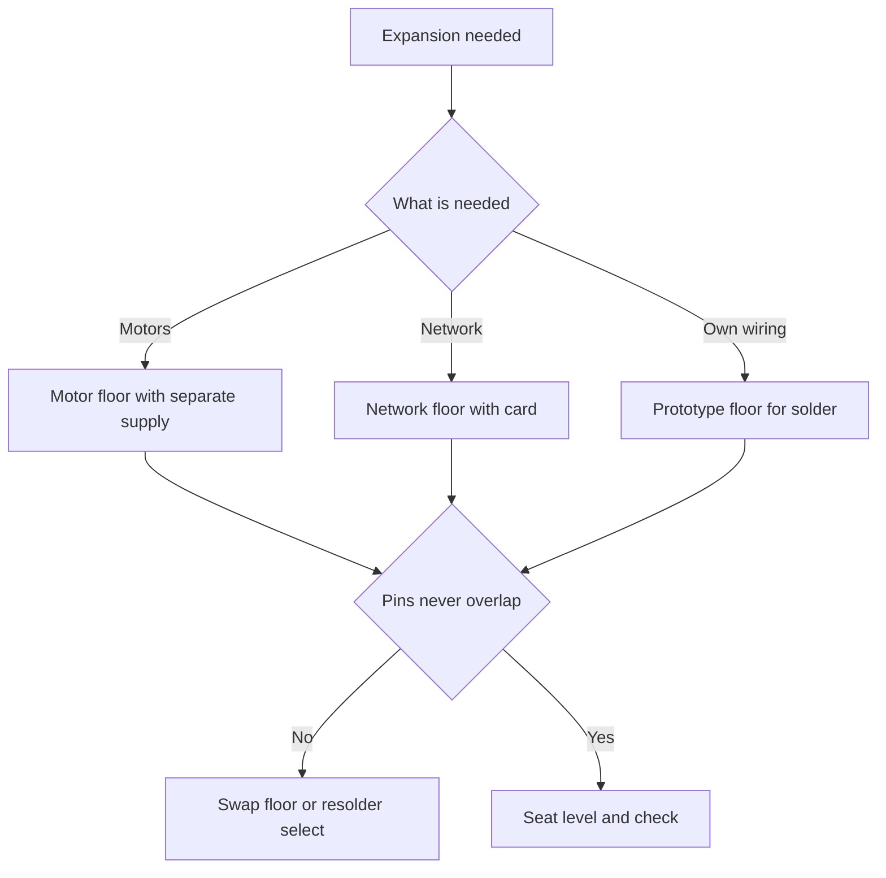

# Arduino Shields - Expansion Floors

![[assets/img/arduino-shield-scheme.png|600]]
*Fig. Expansion board on top of the main one, pass-through headers, separate motor power, and prototype field.*

> [!tip] Purpose of this note
> Explains expansion floors: how they sit on top, why pins conflict, how to power motors separately, and when to take a prototype or a network floor.

## 1. Purpose

A shield is a ready board that sits on top of the main one and at once gives motors, a network, or a solder field.

Instead of a dozen jumpers you get one floor with jacks, a driver, and labels.

Floors can stack several high through long pins.

Each floor takes some pins for itself; the rest pass through upward.

This note shows seating mechanics, the conflict map, motor power, the prototype field, the network floor, and examples.

The base board is described in [[EN/01-Hardware/01-AVR-Uno.en|classic AVR]].

A ready-board overview sits in [[EN/00-Start/04-Dev-Boards.en|board overview]].

## 2. How a Floor Sits on Top

| Element | What it does | Detail |
| --- | --- | --- |
| Pins below | Enter the main board sockets | Long, pass through their own board |
| Sockets above | Accept the next floor | Copy of the main layout |
| Keys and gaps | Block reverse seating | Match labels near edges |
| Mechanics | Friction of sockets holds | For the road take screw posts |
| Part height | Electrolytics and jacks block | Dry-fit with no force before seating |

Seating runs level with no skew: place the floor, press corners in turn.

Remove by rocking along the long side; pulling wires is forbidden.

If the floor never seats, look for bent pins instead of pressing harder.

After seating, check that no pin missed its socket.

```text
Посадка поверху:

   Верхній поверх .... гнізда вгору
   Середній поверх ... штирі вниз
   Основна плата ..... гнізда приймають

   Порядок:
   приміряти без тиску,
   натиснути кути по черзі,
   перевірити кожен ряд.

   Зняття:
   хитати уздовж,
   не тягнути за дроти.
```

## 3. Pass-Through Pins and What Travels Up

| Group | Travels up | Comment |
| --- | --- | --- |
| Power | Five volts, three volts, ground, input | Common to the whole stack |
| Analog | Six inputs | May split between floors with care |
| Free digital | Those the floor never touches | Open to the next floor |
| Floor-owned | Never touch above | Driver or network sits there |
| Reset | Common line | Button resets the whole stack |
| Reference voltage | For converters | Rare, but passes |

The rule is simple: a free pin travels up, an owned one stays with its owner.

Before buying a second floor, write out the owned pins of both and hunt the overlap.

If no overlap exists, the floors stay friends; if one exists, swap or resolder one.

Read the floor docs before ordering, not after the parcel arrives.

## 4. Pin Conflicts

| Floor | Takes | Quarrels with |
| --- | --- | --- |
| Two-channel motor | Four digital plus PWM | Network over PWM and select |
| Network | Fast bus plus ten and four | Memory card over select |
| Screen | Fast bus plus data and reset | Any peer wanting the same bus with no transactions |
| Relay | One digital per relay | Motor over digital |
| Prototype | Takes nothing | Friends with all, if nothing shorts |

The sorest point is the fast bus: screen, network, and memory card want it at once.

The bus shares if each device holds its own select and its own transaction.

Shared-use details sit in [[EN/04-Interfaces/02-SPI.en|fast bus]].

The second point is motor PWM: timers stay common, two floors pull one timer.

```text
Перевірка дружби поверхів:

   1. Виписати зайняті піни першого.
   2. Виписати зайняті піни другого.
   3. Знайти спільні номери.
   4. Спільна шина плюс різні вибори = можна.
   5. Спільний шим або переривання = міняти.

   Приклад:
   мотор 3 11 12 13 плюс мережа 10 11 12 13
   шина спільна, вибори різні = живуть.
```

## 5. Motor Floor With Separate Power

| Question | Answer | Why so |
| --- | --- | --- |
| Logic power | From the main board | Brains apart, force apart |
| Motor power | Separate supply on a screw block | Motor current tears logic |
| Power jumper | Remove on separate supply | Else two supplies meet |
| Ground | Common between supplies | With no common ground control drifts |
| Current | Amperes at start peak | Cells sag, take a supply |
| Cooling | Heatsink on driver heats | With no airflow never push long |

A motor at start pulls times the work current; the board never gives that.

So force comes from a separate supply, and the board only opens driver switches.

Remove the supply jumper, else the power supply quarrels with the port.

Join grounds with a thick wire; a thin breadboard jumper melts.

External board power is described in [[EN/02-Power-Supply/01-VIN-Power-Supply.en|VIN power supply]].

## 6. Prototype Floor

| Option | How to do | Why |
| --- | --- | --- |
| Hole field | Solder own parts | Sensor or buttons nearby |
| Button and LED | Solder at once | Check with no breadboard |
| Screw block | Bring power out | Sounder than jumpers |
| Chip seat | Socket for package | Analog front or switches |
| Labels | Sign with a marker | Clear in a month |

A prototype floor is a bare board with the same headers but no driver.

Build own wiring on it: dividers, buttons, relay transistors, sensor jacks.

Cut tracks and join with wire; run power with wide jumpers.

After tuning, the floor stays in the product, and the breadboard frees for the next test.

```text
План прототипу:

   Кнопка ...... цифрова два плюс земля
   Світлодіод .. цифрова сім через резистор
   Датчик ...... аналог нуль плюс живлення
   Реле ........ транзистор плюс діод

   Правило:
   спочатку макетка,
   потім пайка на поверсі.
```

## 7. Network Floor

| Question | Answer | Detail |
| --- | --- | --- |
| Fast bus | Taken by network | Shares through transactions only |
| Memory card | Often built in with own select | Files for pages |
| Power | Appetite mild, board supply enough | No separate supply needed |
| Jack | Plain twisted pair | Tens of meters long |
| Library | Network plus file | Server examples inside |

A network floor turns the board into a small server: it shows sensor readings in a browser.

Format the memory card to a plain file system and keep names short.

Never lay network wires next to motors; pickup kills packets.

For the first test, raise the server example and open the address in a browser.

## 8. Example With a Motor Floor

A two-channel floor drives a cart wheel pair forward, back, and turns.

```cpp
const int PIN_PWM_A = 3;
const int PIN_DIR_A = 12;
const int PIN_PWM_B = 11;
const int PIN_DIR_B = 13;

void motorA(int speed) {
  if (speed >= 0) {
    digitalWrite(PIN_DIR_A, HIGH);
    analogWrite(PIN_PWM_A, speed);
  } else {
    digitalWrite(PIN_DIR_A, LOW);
    analogWrite(PIN_PWM_A, -speed);
  }
}

void motorB(int speed) {
  if (speed >= 0) {
    digitalWrite(PIN_DIR_B, HIGH);
    analogWrite(PIN_PWM_B, speed);
  } else {
    digitalWrite(PIN_DIR_B, LOW);
    analogWrite(PIN_PWM_B, -speed);
  }
}

void setup() {
  pinMode(PIN_PWM_A, OUTPUT);
  pinMode(PIN_DIR_A, OUTPUT);
  pinMode(PIN_PWM_B, OUTPUT);
  pinMode(PIN_DIR_B, OUTPUT);
}

void loop() {
  motorA(180);
  motorB(180);
  delay(1500);
  motorA(0);
  motorB(0);
  delay(500);
  motorA(-150);
  motorB(150);
  delay(800);
}
```

Speed takes a number from zero to two hundred fifty five; a separate pin sets direction.

Motor power stays separate, the jumper removed, grounds joined.

Before the ride, lift the wheels in the air and check directions.

If the cart drives sideways, swap one motor polarity in code.

## 9. Example With a Prototype Floor

A pull-up button and an LED through a resistor with no breadboard.

```cpp
const int PIN_BTN = 2;
const int PIN_LED = 7;

void setup() {
  pinMode(PIN_BTN, INPUT_PULLUP);
  pinMode(PIN_LED, OUTPUT);
}

void loop() {
  int b = digitalRead(PIN_BTN);
  if (b == LOW) {
    digitalWrite(PIN_LED, HIGH);
  } else {
    digitalWrite(PIN_LED, LOW);
  }
  delay(20);
}
```

The button runs between the pin and ground; the pull-up sits inside the chip.

A twenty-millisecond delay removes contact bounce.

Fit the LED through a resistor; with no resistor the chip overheats.

Solder this example first on a bare floor for training.

## 10. Mermaid: Floor Choice



The wiring reads top to bottom: the task picks the floor, the pin map picks friendship.

Motors always take a separate supply, the network a short twisted pair.

Take a prototype when no ready floor suits the task.

Check seating before power-on.

## Common Issues

| # | Issue | Why it is bad | Correct way |
| --- | --- | --- | --- |
| 1 | Two floors on one pin set | Both pull one line | Write out owned pins before buying |
| 2 | Motors from the board with no supply | Sags and restarts | Separate supply, jumper off, grounds joined |
| 3 | Skewed seat past the socket | Pin bends and shorts a neighbor | Seat level, check every row |
| 4 | Shared bus with no transactions | Devices wreck modes | Every exchange in its own transaction |
| 5 | Relay with no transistor and diode | Coil spike hits the output | Transistor plus diode across the coil |
| 6 | Long force lines near the bus | Pickup kills exchange | Force apart, signals short |

## Official Sources

- [Shield overview at docs.arduino.cc](https://docs.arduino.cc/hardware/shields/) - seating mechanics, compatibility, floor examples.
- [Motor shield at arduino.cc](https://www.arduino.cc/en/Main/ArduinoMotorShieldR3) - driver channels, power, pin table.

## See Also

- [[Home.en]]
- [[EN/00-Start/04-Dev-Boards.en|board overview]]
- [[EN/01-Hardware/01-AVR-Uno.en|classic AVR]]
- [[EN/04-Interfaces/02-SPI.en|fast bus]]
- [[EN/02-Power-Supply/01-VIN-Power-Supply.en|VIN power supply]]
- [[EN/14-Devboards/02-Clones-CH340.en|cheap copies]]
