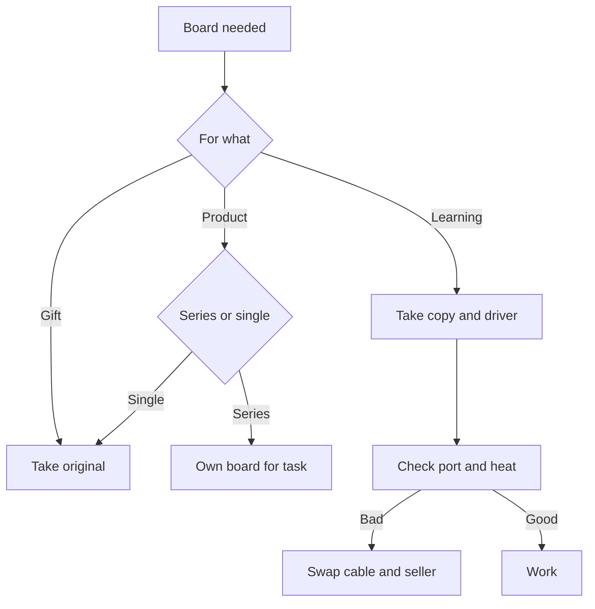

# Arduino Clones - Price and Risk

![[assets/img/arduino-klon-scheme.png|600]]
*Fig. Cheap board copy, port converter, power regulator, and pre-buy check.*

> [!tip] Purpose of this note
> Explains price and risk difference: which driver to install, how to check a copy before buying, and when a copy suits versus when to take the original.

## 1. Purpose

A copy repeats the classic board wiring but saves on the port converter, regulator, and jacks.

The price runs times lower, so clubs, classes, and home tests take copies.

Quality drifts batch to batch: one works for years, another heats out of the box.

The main headache is the converter driver; install it separately, else the port never sees the board.

This note gives a difference map, driver installation, a pre-buy check, and an honest use edge.

The base classic is described in [[EN/01-Hardware/01-AVR-Uno.en|classic AVR]].

A ready-board overview sits in [[EN/00-Start/04-Dev-Boards.en|board overview]].

## 2. How a Copy Differs

| Node | Original | Copy | Result |
| --- | --- | --- | --- |
| Port converter | Branded chip with system driver | Cheap CH340 with separate driver | With no driver the port stays mute |
| Regulator | Current and heat margin | Weak package heats | Hungry sensors never pull through |
| Port jack | Tough, holds hundreds of plugs | Wobbles, thin contacts | Hold the cable still |
| Print and silkscreen | Sharp labels and mask | Labels drift, thin mask | Match pins with more care |
| Bootloader | Flashed and checked | Sometimes old or crooked | Reflash through the utility |
| Price | Times higher | Cheap | Copies for learning |

A copy suits learning: mistakes cost nothing, smoke never hurts the wallet.

Take the original for a gift, an exhibit, or a years-long product.

For a class take a dozen copies and one original as a reference.

Bootloader and flash utility are described in [[EN/09-Firmware/02-Bootloader-AVRDUDE.en|bootloader and avrdude]].

```text
Вибір за задачею:

   Навчання і гурток ..... копія
   Домашні досліди ....... копія
   Подарунок ............. оригінал
   Виріб на роки ......... оригінал
   Клас на десять місць .. копії плюс еталон

   Правило:
   ризик розмазати
   по кількості.
```

## 3. CH340 Converter and Driver

| Question | Answer | Detail |
| --- | --- | --- |
| What it is | Cheap bridge between port and serial line | Sits near the jack |
| Why the port misses | No driver in the system | Install separately from the maker site |
| Where to take | Chip maker site | Never install from random builds |
| Check | After install the port appears in the list | Name holds CH340 |
| Speed | Holds standard speeds | High ones rarely, but enough for flashing |
| Reset | Automatic through a capacitor | Sometimes press the button by hand |

Install the driver before the first board plug, else the system shows an unknown device.

After install reboot the computer and view the port list.

Take a data cable, not a charge-only one, else the port never appears.

If the port dies when the cable is touched, blame the copy jack or a thin cable.

```text
Порядок запуску копії:

   1. Встановити драйвер CH340.
   2. Перезавантажити компютер.
   3. Взяти кабель з даними.
   4. Підключити плату.
   5. Знайти новий порт у списку.
   6. Залити приклад миготіння.

   Нема порту:
   інший кабель,
   інше гніздо,
   перевстановити драйвер.
```

## 4. Weak Regulator

| Question | Answer | Practice |
| --- | --- | --- |
| Package | Small with no heatsink | Heats fast |
| Current | Small margin | Feed a screen board separately |
| Input voltage | Lower edge better | Nine volts edge, twelve risk |
| Motors and relays | Never from the board | Separate supply, common grounds |
| Finger check | Warm fine, hot bad | Hot means drop the power |
| Long work | Add airflow or lower the input | Or feed past the regulator |

The regulator heats more with higher input voltage and more hung sensors.

The practical copy edge is a board plus a sensor pair; the rest through a separate supply.

Outside power through the input is described in [[EN/02-Power-Supply/01-VIN-Power-Supply.en|VIN power supply]].

A backlit screen, a boosted radio, and a servo always feed separately.

## 5. Cable With No Data

| Sign | Sense | Action |
| --- | --- | --- |
| Power on, no port | Charge-only cable | Take a data cable |
| Port comes and goes | Cracked wire or jack | Swap the cable |
| Port on, flash tears | Thin wires, sag | Short thick cable |
| Fine on desk, faults on product | Long cable across the room | Short cable plus separate power |
| Noise near a motor | Pickup on the line | Split the cables |

Charge cables look the same outside but hold no data lines inside.

The check is simple: plug a phone with the same cable; if the computer sees no data, the cable is charge-only.

Keep a separate checked short cable for flashing and never lend it for the road.

Hold the copy jack still during flashing; a touch breaks contact.

## 6. Pre-Buy Check

| Step | What to view | Good | Bad |
| --- | --- | --- | --- |
| Board photo | Labels and mask | Sharp, level rows | Drift, stains, skew rows |
| Converter chip | Marking | Reads CH340 | Erased or empty |
| Regulator | Package | Level, no solder blobs | Skew, solder balls |
| Headers | Pin rows | Level, same height | Skew, mixed height |
| Jack | Metal frame | Sits level | Wobbles, gap |
| Reviews | Driver mentions | State which driver worked | Silence or port complaints |

Ask the seller for the bootloader version and whether the board flashes out of the box.

For the first buy take one board, run it a week, then add the batch.

Take a class batch from one seller, so drivers and pin maps match.

Keep the receipt and messages, because a copy return means letters with photos.

```text
Огляд посилки:

   Коробка ........... плата у пакеті
   Візуально ......... рівні ряди, чиста маска
   Нюхом ............. без гару
   Пальцем ........... нічого не хитається
   Порт .............. став і зявився
   Миготіння ......... заливається з першого разу

   Далі:
   ганяти добу,
   гріти стабілізатор,
   смикати кабель.
```

## 7. When a Copy Is Fine and When Original

| Task | What to take | Why |
| --- | --- | --- |
| Club and first steps | Copy | No pain to burn, same experience |
| Home sensors | Copy | Works for years in a case |
| Gift for a friend | Original | Box, support, impression |
| School contest | Original for show plus spare copies | Show with no surprises |
| Custom product | Original or own board | Warranty responsibility |
| Long unwatched work | Original with checked power | Fewer night calls |

A copy teaches the same: code, pins, buses, and power carry one to one.

Only details differ: driver, heat, jack mechanics.

Count an adult product honestly: fight time with a copy costs more than the price gap.

For a series build an own task board instead of buying a dozen copies.

## 8. Port and Blinker Check Example

The first sketch proves the driver installed, the cable carries data, and the bootloader lives.

```cpp
const int PIN_LED = 13;

void setup() {
  pinMode(PIN_LED, OUTPUT);
  Serial.begin(9600);
  Serial.println("clone check");
}

void loop() {
  digitalWrite(PIN_LED, HIGH);
  Serial.println("on");
  delay(500);
  digitalWrite(PIN_LED, LOW);
  Serial.println("off");
  delay(500);
}
```

The LED on thirteen blinks, lines pour into the port.

If lines exist but no blink, view the LED, not the driver.

If a blink exists but no lines, match the port monitor speed.

If nothing exists, swap cable and socket, then reinstall the driver.

## 9. Power Test Example

The second sketch heats the regulator honestly: it switches a load and watches restarts.

```cpp
const int PIN_LED = 13;
const int PIN_LOAD = 7;

void setup() {
  pinMode(PIN_LED, OUTPUT);
  pinMode(PIN_LOAD, OUTPUT);
  digitalWrite(PIN_LOAD, LOW);
  Serial.begin(9600);
  Serial.println("power test");
}

void loop() {
  digitalWrite(PIN_LOAD, HIGH);
  digitalWrite(PIN_LED, HIGH);
  Serial.println("load on");
  delay(2000);
  digitalWrite(PIN_LOAD, LOW);
  digitalWrite(PIN_LED, LOW);
  Serial.println("load off");
  delay(2000);
}
```

An LED through a resistor or a relay through a transistor serves as load.

Feed the board from an outside supply through the input and watch regulator heat.

If the board restarts under load, the power is weak.

Keep such a copy for light tasks with no hungry sensors.

## 10. Mermaid: Buy or Not



The wiring reads top to bottom: the task picks the board class, the check picks trust.

Never place an unchecked copy into a product.

Never place an original with no power check either.

Build an own board when more than ten copies are needed.

## Common Issues

| # | Issue | Why it is bad | Correct way |
| --- | --- | --- | --- |
| 1 | Driver never installed | Port never sees the board | Install the driver from the maker site |
| 2 | Charge-only cable | Power on, no data | Data cable, check with a phone |
| 3 | Twelve volts into a copy input | Regulator boils | Nine volts edge, seven better |
| 4 | Motors from the board | Sags and restarts | Separate supply, common ground |
| 5 | Old bootloader | Flash tears at the end | Pick the old version in the menu or reflash |
| 6 | Whole batch at once | Fault times ten | One for a trial, then the batch |

## Official Sources

- [Drivers and boards at docs.arduino.cc](https://docs.arduino.cc/software/ide/) - environment install, port pick, first flash.
- [Board comparison at arduino.cc](https://www.arduino.cc/en/hardware) - original boards, power, jack maps.

## See Also

- [[Home.en]]
- [[EN/00-Start/04-Dev-Boards.en|board overview]]
- [[EN/01-Hardware/01-AVR-Uno.en|classic AVR]]
- [[EN/09-Firmware/02-Bootloader-AVRDUDE.en|bootloader and avrdude]]
- [[EN/14-Devboards/01-Shields.en|expansion floors]]
- [[12-Comm-Modules/01-NRF24|radio module]]
