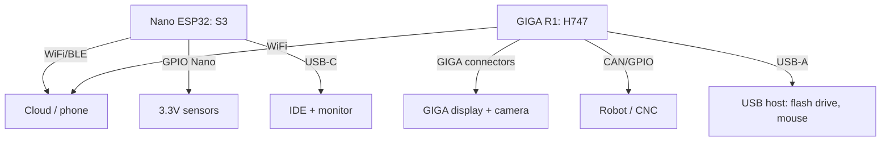

# Arduino 32-Bit Flagships - Nano ESP32 and GIGA R1 WiFi

![[assets/img/ard-nano-giga-scheme.png|600]]
*Fig. Nano ESP32 is a pocket WiFi/BLE node, GIGA R1 is an industrial monster on STM32H7 with lots of peripherals.*

> [!tip] What this note is
> When Uno runs small and a bare ESP32 chip feels awkward: official 32-bit Arduino boards with IDE, cloud, and shield support. Base: [[EN/01-Hardware/01-AVR-Uno.en|AVR Uno platform]], [[EN/01-Hardware/03-Due-Zero-ARM.en|Due and Zero]], [[EN/01-Hardware/05-Nano33-BLE-ARM.en|Nano 33 BLE]].

## 1. Goal

Pick the right flagship for the task:

- Nano ESP32: WiFi/BLE projects in a Nano form factor;
- GIGA R1 WiFi: robot, CNC, HMI, machine vision (camera + display);
- both run Arduino IDE 2 and Arduino Cloud out of the box;
- 5V shield compatibility goes through board logic.

| Board | Core | Memory | Radio | Form factor |
| --- | --- | --- | --- | --- |
| Nano ESP32 | ESP32-S3, 240 MHz | 16 MB flash, 512 KB SRAM | WiFi + BLE 5 | Nano (30 pins) |
| GIGA R1 WiFi | STM32H747 (M7+M4) | 16 MB flash, 1 MB RAM | WiFi + BT (Murata) | Mega (GIGA form) |

## 2. Architecture



Nano ESP32 runs 3.3V logic (5V sensors only through a level converter!). GIGA runs 3.3V with 5V-tolerant digital inputs, but the ADC takes 3.3V only.

## 3. Nano ESP32 in Detail

- ESP32-S3 with USB-OTG: firmware and CDC monitor over one USB-C;
- Arduino ESP32 core plus Arduino patches (LED_BUILTIN is RGB!);
- MicroPython as a second core on wish;
- BLE and WiFi at once, memory suffices;
- deep-sleep at microamps, wake on touch or timer;
- price of an original Nano, features of an ESP32-S3.

## 4. GIGA R1 WiFi in Detail

- two cores: M7 480 MHz (compute) plus M4 240 MHz (peripherals);
- jacks for the official 800x480 display and an OV767x camera;
- USB-A host, Ethernet (outside PHY through a jack?), CAN-FD;
- DAC, 16-bit ADC, motor timers, an STM32 legacy;
- Arduino Cloud and Edge Impulse, TinyML on M7;
- price of 5 Chinese Unos, take for a real task.

## 5. Working Code

```cpp
#if defined(ARDUINO_NANO_ESP32)
#include <WiFi.h>
#include <PubSubClient.h>
WiFiClient net;
PubSubClient mqtt(net);
#endif

#ifdef GIGA_R1_M7
#include <WiFi.h>
#endif

void setup() {
  Serial.begin(115200);
  pinMode(LED_BUILTIN, OUTPUT);
  WiFi.begin("ssid", "pass");
  while (WiFi.status() != WL_CONNECTED) {
    delay(500);
  }
#if defined(ARDUINO_NANO_ESP32)
  mqtt.setServer("broker.local", 1883);
  mqtt.connect("nano-node");
#endif
}

void loop() {
  digitalWrite(LED_BUILTIN, HIGH);
  delay(500);
  digitalWrite(LED_BUILTIN, LOW);
  delay(500);
#if defined(ARDUINO_NANO_ESP32)
  mqtt.loop();
  mqtt.publish("nano/uptime", String(millis()).c_str());
#endif
}
```

The core sets the `ARDUINO_NANO_ESP32` and `GIGA_R1_M7` macros automatically, so one sketch covers both boards with `#ifdef`.

## 6. Board Choice

| Task | Board |
| --- | --- |
| Home IoT node, battery | Nano ESP32 |
| Robot with camera and display | GIGA R1 + display |
| BLE sensor for a phone | Nano ESP32 (or Nano 33 BLE) |
| CNC or 3D-printer electronics | GIGA R1 (timers, CAN) |
| Learning from zero, 5V modules | Uno R3, not flagships |

## 6.1 Flagship Power: Currents

| Mode | Nano ESP32 | GIGA R1 |
| --- | --- | --- |
| Sleep (deep-sleep) | ~10 uA | ~100 uA (M4 glows) |
| Active with no radio | ~50 mA | ~200 mA |
| WiFi TX peak | ~400 mA | ~350 mA |
| GIGA display + camera | - | +400 mA |

Feed both boards 5V (USB-C / VIN): built-in bucks give 3.3V. Smooth WiFi peaks with a 470 uF capacitor near VIN if the PSU runs weak.

## 7. Pitfalls

- Nano ESP32: RGB LED instead of a plain one, `digitalWrite` gives an unawaited color;
- GIGA: first firmware write runs long (16 MB), never fear;
- both run 3.3V, old 5V shields only through matching;
- BLE on Nano ESP32 plus WiFi at once, watch the heap;
- Arduino Cloud wants board registration, the free plan stays limited.

## 8. Common Issues

| Symptom | Cause | Fix |
| --- | --- | --- |
| Nano ESP32 never flashes | wrong port (two exist: DFU and CDC) | pick the port after a double reset |
| WiFi connects for a minute | old ESP32 core | update the esp32 core in Boards Manager |
| GIGA misses the camera | ribbon wrong side | blue stripe to the jack, latch it |
| 5V sensor silent | 3.3V logic | level converter, separate sensor power |
| Cloud rejects the board | wrong sketch (a Cloud template is needed) | create a Thing, pour the generated code |
| RGB glows wrong | common anode, inversion | `digitalWrite(LOW)` turns the color on |

## See Also

- [[EN/01-Hardware/01-AVR-Uno.en|AVR Uno platform]] - where to start.
- [[EN/01-Hardware/03-Due-Zero-ARM.en|Due and Zero]] - first 32-bit boards.
- [[EN/01-Hardware/05-Nano33-BLE-ARM.en|Nano 33 BLE]] - BLE predecessor.
- [[EN/09-Firmware/01-IDE-CLI.en|IDE and CLI environment]] - cores and board managers.
- [[15-Protocols/03-HTTP-Web|HTTP and web client]] - way to the cloud.

## Official Sources

- [Nano ESP32 (Arduino docs)](https://docs.arduino.cc/hardware/nano-esp32/) - pins, S3, MicroPython.
- [GIGA R1 WiFi (Arduino docs)](https://docs.arduino.cc/hardware/giga-r1-wifi/) - H747, display, camera.
- [Getting Started (Arduino docs)](https://docs.arduino.cc/learn/) - Cloud, IDE 2, cores.
