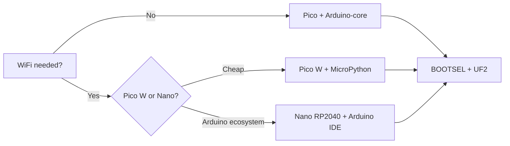

# RP2040 on Arduino Rails - Pico, Nano RP2040, 3V3 and PIO

![[assets/img/ard-rp2040-voltages-scheme.png|600]]
*Fig. RP2040 means 3V3 logic and PIO machines: BOOTSEL at start, exact protocols with no CPU.*

> [!tip] Purpose of this note
> Seats RP2040 on familiar Arduino rails: when to take Pico or Nano RP2040 instead of AVR,
> how not to kill a pin with five volts, and what to do with PIO machines.

## 1. Boards: Pico, Pico W, Nano RP2040 Connect

| Board | Chip | Memory | Radio | Form factor |
| --- | --- | --- | --- | --- |
| Pico | RP2040 2xM0+ 133 MHz | 264 KB SRAM, 2 MB flash | None | DIP-40, micro-USB |
| Pico W | RP2040 + CYW43439 | 264 KB SRAM, 2 MB flash | WiFi 4 (BT through C SDK only) | DIP-40 |
| Pico 2 / 2 W | RP2350 2xM33 150 MHz | 520 KB SRAM, 4 MB flash | W: WiFi (BT through C SDK only) | DIP-40 |
| Nano RP2040 Connect | RP2040 + NINA-W102 | 264 KB SRAM, 16 MB flash | WiFi + BLE, IMU, microphone | Nano DIP-30 |

## 2. Main Rule: 3V3 Logic

- RP2040 pins **never tolerate 5V**: 5V on an input kills the pin forever;
- 5V sensors (HC-SR04, old encoders) only through a level converter or a divider;
- 5V board supply over USB is accepted, but logic stays 3V3 everywhere;
- ADC: 12 bits, 3V3 reference (not 5V as on Uno), so recalc formulas change.

## 3. BOOTSEL and Flashing

- Hold BOOTSEL while applying power: the board appears as an RPI-RP2 USB drive;
- Arduino IDE: RP2040 boards (through Boards Manager, Arduino-Mbed or Earlephilhower core);
- drag the `.uf2` onto the drive, firmware with no buttons and no programmers;
- MicroPython: `.uf2` from micropython.org, then Thonny plus REPL.

## Mermaid: Flashing Choice



## 4. Arduino-Core Versus MicroPython

| Criterion | Arduino-core (Mbed/Earlephilhower) | MicroPython |
| --- | --- | --- |
| Start | Sketch, `setup/loop` | REPL, `main.py` |
| Arduino libraries | Yes (Wire, SPI, Servo) | Partly (machine, network) |
| WiFi | WiFiNINA (Nano) / CYW43 (Pico W) | `network.WLAN` |
| Exact time | PIO + IRQ | PIO through `rp2` |
| Debug | Serial + logic analyzer | REPL + print |

## 5. PIO Machines in Short

- 2 PIO blocks x 4 machines: exact protocols (WS2812, DHT, I2S) with no CPU part;
- a machine runs a program to 32 instructions at rates to 133 MHz;
- from Arduino: `PicoPIO` library (Earlephilhower core) or hand PIO assembler;
- example: WS2812 at 800 kHz takes one machine, CPU stays free for logic.

```cpp
// PIO-blink вбудованим LED через Arduino-core (Earlephilhower)
#include <hardware/pio.h>
void setup() {
  pinMode(LED_BUILTIN, OUTPUT);
}
void loop() {
  digitalWrite(LED_BUILTIN, HIGH);
  delay(500);
  digitalWrite(LED_BUILTIN, LOW);
  delay(500);
}
```

## 6. WiFi on Nano RP2040 and Pico W

- Nano RP2040: NINA-W102 module (ESP32 inside), WiFiNINA library, BLE too;
- Pico W: CYW43439, WiFi 4 through `CYW43`; BT only through C SDK/BTstack, none in MicroPython;
- board antenna: never cover with metal, else -10 dB and drops;
- WiFi power: 300+ mA peaks, USB 500 mA suffices, but with margin.

## 7. Common Issues

| Symptom | Cause | Fix |
| --- | --- | --- |
| Pin silent after 5V | Input killed with overvoltage | Board swap only; then through a level converter |
| No RPI-RP2 visible | BOOTSEL never held at start | Hold the button until power is applied |
| UF2 never flashes | Charge-only cable with no data | Data cable; another port with no hub |
| WiFi never connects | 5 GHz net or metal-covered antenna | 2.4 GHz only; move metal off the antenna |
| ADC lies by 20% | Formula for a 5V reference | 3V3 reference: `volt = raw * 3.3 / 4095` |
| MicroPython hangs on BT | BT on CYW43439 unsupported | BT through C SDK only; WiFi only in MP |

## 8. RP2040 Board Power in the Field

- Pico over USB: 5V 500 mA suffices with margin; VSYS 1.8-5.5V for battery nodes;
- Nano RP2040: VIN 5-21V through MP2322, but it heats at 12V+, so take 5V for long lines;
- Pico W with WiFi: 100 mA mean, 300 mA peaks, thin USB cables sag;
- RP2040 deep-sleep: ~1 mA with flash in sleep, bare microcontroller at tens of microamps;
- Li-Ion battery straight to VSYS: 3.0-4.2V fits 1.8-5.5V, but with no overdischarge guard, so add DW01.

## 9. Fast RP2040 Cheat Sheet

- BOOTSEL at start, RPI-RP2 drive, drag UF2, done;
- 3V3 everywhere: ADC reference 3.3V, I2C pull-up to 3V3, UART levels 3V3;
- Arduino-core for sketches, MicroPython for fast REPL experiments;
- PIO for WS2812/DHT/I2S: one machine instead of CPU bit-bang;
- WiFi at 2.4 GHz only; never cover the antenna with metal or a hand.

## 10. Pico W Versus Nano RP2040 Connect

| Criterion | Pico W | Nano RP2040 Connect |
| --- | --- | --- |
| Price | Lowest | Higher (IMU + microphone) |
| WiFi | CYW43439, WiFi only | NINA-W102, WiFi + BLE |
| Board sensors | None | IMU, microphone |
| Arduino IDE | Through Mbed/Earlephilhower core | Out of the box |
| Flash | 2 MB | 16 MB |

## 11. RP2040 Debug With No Pain

- Serial over USB-CDC: `Serial.begin(115200)` works right after flashing;
- printf debug in REPL (MicroPython) beats sketch reflashing for speed;
- a logic analyzer on PIO pins shows jitter better than an oscilloscope;
- `picotool` reads flash and reboots into BOOTSEL with no button.

## See Also

- [[EN/01-Hardware/01-AVR-Uno.en|Uno classic]] - when AVR suffices;
- [[EN/01-Hardware/04-Uno-R4.en|R4 flagship]] - 32-bit alternative;
- [[EN/14-Devboards/02-Clones-CH340.en|Clones]] - how not to buy a fake;
- [[EN/03-GPIO/01-Digital-Pins.en|Digital]] - AVR pins versus 3V3;
- [[EN/09-Firmware/03-PlatformIO.en|PlatformIO]] - PIO projects for RP2040.

## Official Sources

- [Nano RP2040 Connect (Arduino docs)](https://docs.arduino.cc/hardware/nano-rp2040-connect/) - pins, NINA, IMU, microphone.
- [RP2040 Datasheet (Raspberry Pi)](https://datasheets.raspberrypi.com/rp2040/rp2040-datasheet.pdf) - PIO, ADC, USB, BOOTSEL.
- [Microcontrollers docs (Raspberry Pi)](https://www.raspberrypi.com/documentation/microcontrollers/) - Pico SDK and MicroPython.
- [PlatformIO docs (PlatformIO)](https://docs.platformio.org/en/latest/) - RP2040 boards, upload, monitor.
