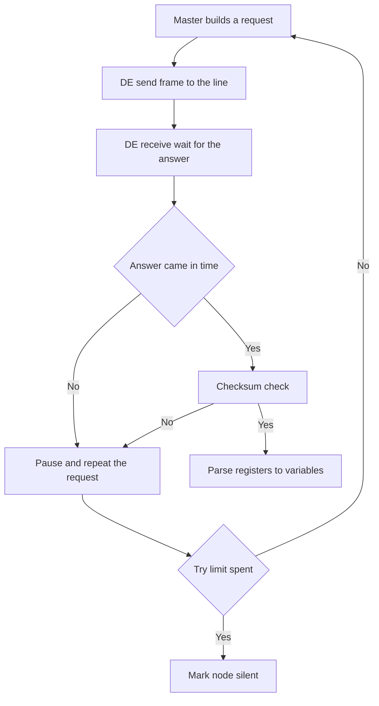

# Modbus on Arduino - Registers and CRC

![[assets/img/arduino-modbus-scheme.png|600]]
*Fig. Modbus: master polls slaves over a twisted pair, the DE pin flips the driver direction.*

> [!tip] Purpose of the note
> Give the working minimum of the industrial protocol: how a frame is built, how the checksum is counted, how to flip the twisted-pair driver and how to lay data over registers.

## 1. Purpose

Modbus RTU - the most common industrial protocol for polling sensors, meters and controllers over a two-wire line. Arduino acts as a master that polls slaves, or as a slave that gives its registers to an outer controller. The physical level here is a differential pair with a receiver-transmitter driver, the logic level - frames with an address, a function code, data and a checksum.

## 2. RTU frame: fields and byte order

Every frame starts with a slave address and ends with a checksum. No pauses between frame bytes are allowed, and between frames a silence several symbols long is held.

| Field | Length | Purpose |
| --- | --- | --- |
| Address | 1 byte | Slave number from one to the top of the range |
| Function | 1 byte | Read or write operation code |
| Data | variable | Start register, register count or values |
| CRC | 2 bytes | Checksum, low byte goes first |

```text
Структура запиту читання регістрів:
  +--------+--------+----------+----------+--------+--------+
  | Адреса | Функ.  | Старт Hi | Старт Lo | Кіл. Hi| Кіл. Lo|
  +--------+--------+----------+----------+--------+--------+
  | 0x01   | 0x03   | 0x00     | 0x00     | 0x00   | 0x02   |
  +--------+--------+----------+----------+--------+--------+
  +----------+----------+
  | CRC Lo   | CRC Hi   |
  +----------+----------+
  Відповідь повертає кількість байтів даних і самі значення.
```

## 3. Function codes needed daily

| Code | Name by sense | What it does |
| --- | --- | --- |
| 1 | Read discrete inputs | Returns binary input states of the slave |
| 2 | Read event discrete inputs | Returns alarm and signal input states |
| 3 | Read holding registers | Main operation for reading measures and setpoints |
| 4 | Read input registers | Read of measures for view only |
| 5 | Write one binary output | Turns one channel on or off |
| 6 | Write one register | Writes one slave setpoint |
| 15 | Write a group of binary outputs | Turns a channel group on with one frame |
| 16 | Write a group of registers | Writes a setpoint block with one frame |

## 4. Physics: twisted pair and DE pin

The twisted-pair driver runs half-duplex: either send or receive. The transmit-enable contact flips the direction. With no termination resistors at the ends of a long line, frames break from signal reflections.

| Module contact | Where to wire | Explanation |
| --- | --- | --- |
| RO | Serial port receive of the board | Data receive line from slaves |
| DI | Serial port transmit of the board | Request send line to the bus |
| DE | Direction control digital pin | High level means transmit |
| RE | Same control pin through inversion | Often joined with DE by a jumper |
| A | Bus line A to all nodes | First wire of the twisted pair |
| B | Bus line B to all nodes | Second wire of the twisted pair |

```text
Підключення драйвера до плати:
  Плата Nano            Модуль драйвера          Шина
  +----------+          +-------------+        ============
  | D2       |--------->| DE + RE     |
  | TX       |--------->| DI          |        A o----XXXX----o A
  | RX       |<---------| RO          |        B o----XXXX----o B
  | GND      |----------| GND         |        GND спільна для всіх
  +----------+          +-------------+
  Резистори узгодження ставляться тільки на кінцях лінії.
```

## 5. Slave register map

A register map - an agreement on which address holds every measure. Master and slave must share one map, else temperature reads as humidity.

| Address | Access type | Cell content |
| --- | --- | --- |
| 0 | Read | Air temperature in tenths of a degree |
| 1 | Read | Relative humidity in tenths of a percent |
| 2 | Read | Binary input states bit by bit |
| 10 | Read and write | Temperature setpoint for the regulator |
| 11 | Read and write | Regulator hysteresis in tenths of a degree |
| 20 | Read and write | Device work mode by number |
| 100 | Read | Slave firmware version code |

## 6. ModbusMaster library: master in a minute

| Library call | Call purpose |
| --- | --- |
| begin address port | Bind the object to a slave address |
| readHoldingRegisters start count | Read a holding register block |
| readInputRegisters start count | Read an input register block |
| writeSingleRegister address value | Write one setpoint |
| writeMultipleRegisters start count | Write a setpoint block |
| getResponseBuffer index | Take a read value from the buffer |
| clearResponseBuffer | Clear the buffer ahead of a new request |

```cpp
#include <ModbusMaster.h>

const uint8_t PIN_DE = 2;
ModbusMaster node;

void preTransmission() {
  digitalWrite(PIN_DE, HIGH);
  delayMicroseconds(50);
}

void postTransmission() {
  delayMicroseconds(50);
  digitalWrite(PIN_DE, LOW);
}

void setup() {
  pinMode(PIN_DE, OUTPUT);
  digitalWrite(PIN_DE, LOW);
  Serial.begin(9600);
  node.begin(1, Serial);
  node.preTransmission(preTransmission);
  node.postTransmission(postTransmission);
}

void loop() {
  uint8_t result = node.readHoldingRegisters(0, 2);
  if (result == node.ku8MBSuccess) {
    int temp = node.getResponseBuffer(0);
    int hum = node.getResponseBuffer(1);
    Serial.print(temp);
    Serial.print(' ');
    Serial.println(hum);
  } else {
    Serial.println(F("Slave silent"));
  }
  delay(1000);
}
```

## 7. Arduino slave: give our registers away

A slave listens to the line, checks the address and the checksum, runs the function and answers. Below a simplified slave frame with address one and a seven-cell table.

```cpp
#include <ModbusRTUSlave.h>

const uint8_t PIN_DE = 2;
const uint8_t SLAVE_ID = 1;
uint16_t regs[7];

ModbusRTUSlave slave(Serial, PIN_DE);

void setup() {
  regs[0] = 235;
  regs[1] = 610;
  regs[2] = 0;
  Serial.begin(9600);
  slave.configureHoldingRegisters(regs, 7);
  slave.begin(SLAVE_ID, 9600);
}

void loop() {
  regs[0] = 235;
  regs[1] = 610;
  slave.poll();
}
```

## 8. Mermaid: bus poll loop



## 9. Tuning and line control

| Symptom | Likely cause | How to check |
| --- | --- | --- |
| Silence in answer | Swapped bus lines | Swap the wires on one end |
| Garbage instead of data | Different node speeds | Match the baud of all bus devices |
| Answers every other time | No pauses between frames | Add a delay between requests |
| Sum error | Reflections on a long line | Put termination on the ends |
| Whole bus hangs | Two slaves with one address | Poll nodes one by one |

## Common issues

| # | Issue | Why bad | How correct |
| --- | --- | --- | --- |
| 1 | DE pin never flipped at all | Driver mutes its own receive and the answer is lost | Flip direction ahead of and after every frame |
| 2 | Sum low and high bytes swapped | Slave drops every frame as broken | Send the sum low byte first |
| 3 | Same address on two slaves | Both answer at once and spoil the frame | Give every node its own number |
| 4 | Board and slave speeds differ | Garbage comes instead of bytes | Set one baud on the whole bus |
| 5 | No common ground between nodes | Potential floats and frames tear | Join grounds of all nodes with a third wire |
| 6 | Polling back to back with no pauses | Slave never keeps up with a request | Hold a pause of several symbols between frames |

## Official sources

- [Modbus specs on the organization site](https://www.modbus.org/specs.php) - frame, function and checksum notes.
- [ModbusMaster library for Arduino](https://github.com/4-20ma/ModbusMaster) - master source code and call examples.
- [Arduino language reference](https://www.arduino.cc/reference/en/) - serial port and time function notes.

## See also

- [[Home.en]]
- [[EN/04-Interfaces/01-UART.en|serial port]]
- [[EN/15-Protocols/02-MQTT-ESP.en|cloud through ESP]]
- [[16-Projects/02-Rozumniy-dim|home automation]]
