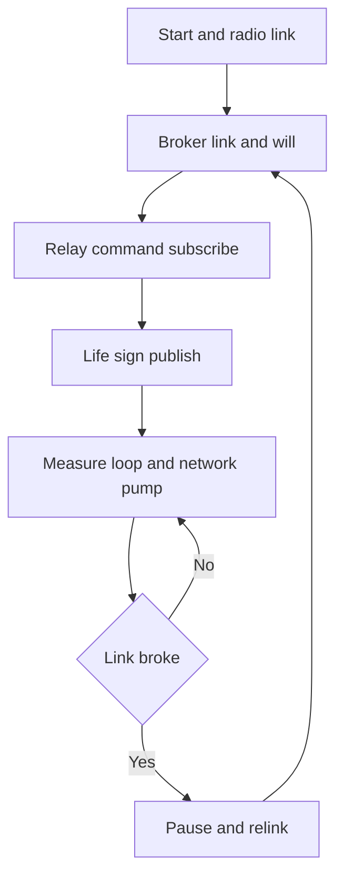

# MQTT through ESP - Arduino in the Cloud

![[assets/img/arduino-mqtt-esp-scheme.png|600]]
*Fig. Cloud: the board measures, the module sends, the broker hands telemetry to subscribers.*

> [!tip] Purpose of the note
> Show two working network paths: fast through the modem command set and flexible through own gateway firmware, plus the protocol minimum for stable telemetry.

## 1. Purpose

A classic board has no network, and a radio module closes this gap. The board plus module pair works so: the board gathers sensor measures, the module holds the broker link and pumps messages. The message exchange protocol is light, so even a weak controller pulls it through a serial port.

## 2. Two paths: AT modem or gateway firmware

| Approach | How it works | When to take |
| --- | --- | --- |
| Factory command set | Board sends text commands, module holds the network itself | Fast start and simple send tasks |
| Own gateway firmware | Module runs network logic and talks to the board in a simple format | Complex logic, queues, resends |
| Module as the main controller | Whole program lives in the module, board only extends pins | Few sensors and module pins enough |
| Two controllers in parallel | Each does its own, frame exchange over the port | Reliability matters more than simplicity |

```text
Варіант з набором команд модему:
  Плата                      Модуль                    Хмара
  +----------+               +------------+          +--------+
  | Сенсори  |--запит------->| AT-прошивка|--мережа->| Брокер |
  | Логіка   |<--відповідь---| Радіо      |<-мережа--| Дашборд|
  +----------+  послідовний  +------------+   WiFi   +--------+
  Плата керує, модуль лише виконує команди мережі.
```

## 3. Protocol vocabulary: work minimum

| Term | Content in plain words |
| --- | --- |
| Broker | Middle server that takes and hands messages |
| Topic | Channel name by which messages sort |
| Publish | Send of a value to a named channel |
| Subscribe | Request to get all that comes to a channel |
| Client | Any device linked to the middle |
| Session | Stored subscribe state between links |
| Retained message | Last value a new subscriber gets at once |

## 4. Topics: device address tree

A topic tree builds as a hierarchy from common to concrete. A hash mask subscribes a whole branch, a plus mask subscribes one level.

| Topic | Purpose |
| --- | --- |
| dim/kitchen/temp | Kitchen temperature for plots |
| dim/kitchen/hum | Kitchen humidity for plots |
| dim/kitchen/relay/set | Kitchen relay turn-on command |
| dim/kitchen/relay/state | Proven kitchen relay state |
| dim/kitchen/status | Kitchen node life sign |
| dim/balcony/temp | Balcony temperature for compare |

```text
Дерево топіків одного дому:
  dim
   +-- kitchen
   |     +-- temp
   |     +-- hum
   |     +-- relay
   |     |     +-- set
   |     |     +-- state
   |     +-- status
   +-- balcony
         +-- temp
         +-- status
  Підписка на dim гілку забирає все дерево дому.
```

## 5. QoS: three delivery levels

| Level | Delivery promise | Promise price |
| --- | --- | --- |
| Zero | No confirm, may get lost | Least traffic and delay |
| First | Arrives at least once, doubles possible | Repeat handling needed |
| Second | Arrives exactly once | Four service packs per message |

Zero level is enough for sensor telemetry: values run often, one lost reading changes nothing. Relay commands take the first level, and command doubles are made safe by repeat runs.

## 6. LWT: will for a loss case

A will - a message the broker publishes itself when a client silently drops from the network. On link the node declares a status topic and a break text, and at once publishes a life sign.

| Step | Node action |
| --- | --- |
| 1 | On link declare the status topic and the break text |
| 2 | At once publish a life sign with retain |
| 3 | Send a pulse on a schedule or trust protocol ping |
| 4 | Ahead of a planned stop send a sleep sign |
| 5 | Dashboard grays nodes with the break text |

## 7. PubSubClient: program frame

| Client call | Call purpose |
| --- | --- |
| setServer address port | Point to the middle address |
| setCallback function | Set the incoming command handler |
| connect identifier | Link with a will declare |
| publish topic text | Send a value to a channel |
| subscribe topic | Subscribe to commands |
| loop | Pump the network and hold ping |
| connected | Check whether the link lives |

## 8. Telemetry sketch: sensor to cloud

Full module example: reads temperature and humidity, publishes to two topics, listens to a relay command, holds a life status.

```cpp
#include <ESP8266WiFi.h>
#include <PubSubClient.h>

const char* WIFI_NAME = "HomeNet";
const char* WIFI_PASS = "secret123";
const char* BROKER = "192.168.1.50";

WiFiClient net;
PubSubClient client(net);

void onCommand(char* topic, byte* payload, unsigned int len) {
  String cmd;
  for (unsigned int i = 0; i < len; i++) {
    cmd += (char)payload[i];
  }
  if (cmd == "ON") {
    digitalWrite(LED_BUILTIN, LOW);
    client.publish("dim/kitchen/relay/state", "ON");
  } else {
    digitalWrite(LED_BUILTIN, HIGH);
    client.publish("dim/kitchen/relay/state", "OFF");
  }
}

void reconnect() {
  while (!client.connected()) {
    String id = "kitchen-" + String(ESP.getChipId());
    if (client.connect(id.c_str(), "dim/kitchen/status", 0, true, "offline")) {
      client.publish("dim/kitchen/status", "online", true);
      client.subscribe("dim/kitchen/relay/set");
    } else {
      delay(3000);
    }
  }
}

void setup() {
  pinMode(LED_BUILTIN, OUTPUT);
  WiFi.begin(WIFI_NAME, WIFI_PASS);
  while (WiFi.status() != WL_CONNECTED) {
    delay(500);
  }
  client.setServer(BROKER, 1883);
  client.setCallback(onCommand);
}

void loop() {
  if (!client.connected()) {
    reconnect();
  }
  client.loop();
  static unsigned long last = 0;
  if (millis() - last > 10000) {
    last = millis();
    client.publish("dim/kitchen/temp", "23.5");
    client.publish("dim/kitchen/hum", "61.0");
  }
}
```

## 9. Mermaid: node life on the network



## 10. Module power supply: separate regulator

| Demand | Cause |
| --- | --- |
| Separate regulator with a current room | Send peaks sag weak lines |
| Capacitor near power supply pins | Smooths short consumption kicks |
| Common board and module ground | With no it port levels float |
| Port level below five-volt | Module input dislikes high voltage |

## Common issues

| # | Issue | Why bad | How correct |
| --- | --- | --- | --- |
| 1 | Network call with no pump in the loop | Ping never goes and broker tears the link | Turn the pump every loop pass |
| 2 | Will never set on link | Nobody spots the node break in time | Always declare a status topic and a break text |
| 3 | Relay commands at zero level | A command may get lost on the way | Send commands with delivery confirm |
| 4 | Module fed from a weak board line | Send reboots the module | Separate regulator with a current room |
| 5 | Subscribe with no repeat after relink | Session reset and commands never come | After every link subscribe anew |
| 6 | Topic strings built with slips | Publish flies to nowhere | Hold topics as constants in one place |

## Official sources

- [MQTT Specification (OASIS)](https://mqtt.org/mqtt-specification/) - publish and subscribe model notes.
- [PubSubClient for controllers](https://github.com/knolleary/pubsubclient) - source code, examples and library limits.
- [Radio module page from the maker](https://www.espressif.com/en/products/socs/esp8266) - power supply and mode specs.

## See also

- [[Home.en]]
- [[EN/04-Interfaces/01-UART.en|serial port]]
- [[EN/15-Protocols/01-Modbus.en|industrial protocol]]
- [[16-Projects/01-Meteostantsiya|weather node]]
