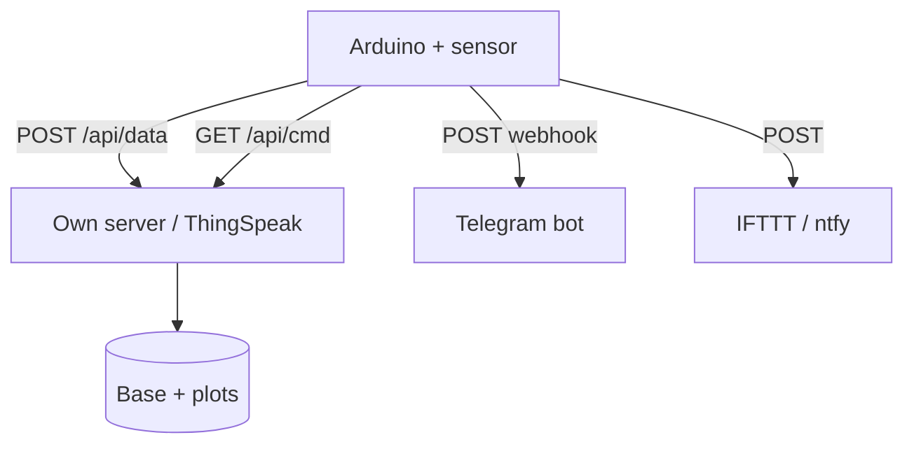

# Arduino Online - HTTP Client, REST and Webhooks

![[assets/img/ard-http-web-scheme.png|600]]
*Fig. Arduino as an HTTP client: GET takes commands, POST gives telemetry, a webhook knocks to the world.*

> [!tip] What this note is
> MQTT is not the only cloud path: plain HTTP is enough for telemetry once a minute and server commands. Runs on ESP8266, Ethernet shield and Nano ESP32. Base: [[EN/15-Protocols/01-Modbus.en|Modbus protocol]], [[EN/15-Protocols/02-MQTT-ESP.en|MQTT on ESP]], [[12-Comm-Modules/03-ESP8266-WiFi|WiFi through ESP8266]].

## 1. Goal

Teach Arduino to talk to the web:

- GET - take a command/setting from the server;
- POST with JSON - give telemetry away;
- webhooks - knock to Telegram/IFTTT with no own server;
- HTTPS - where memory allows (ESP8266/ESP32, not Uno plus shield).

| Transport | Library | HTTPS | Memory |
| --- | --- | --- | --- |
| ESP8266 (AT or core) | ArduinoHttpClient / ESP8266HTTPClient | yes, with fingerprint | enough |
| Ethernet W5100/W5500 | Ethernet plus hand HTTP | no | enough |
| Uno plus ESP-01 (AT) | hand AT+CIPSEND | no | least |

## 2. Architecture



Period: telemetry once per 60 s, commands - once per 60 s with the same GET. Deep-sleep between loops for battery use.

## 3. Hand GET and POST

Least HTTP/1.0 with no libraries - runs everywhere with a TCP client:

```text
GET /api/cmd?node=1 HTTP/1.0
Host: example.com

POST /api/data HTTP/1.0
Host: example.com
Content-Type: application/json
Content-Length: 24

{"t":23.5,"h":61}
```

Rules: `Host` mandatory, after headers - an empty line, count `Content-Length` exact. Read the answer till link close (HTTP/1.0 closes itself).

## 4. JSON with no libraries

- send: `snprintf` with a format, numbers - with no quotes;
- answer parse: seek keys with `strstr`, values - `atoi/atof`;
- full ArduinoJson - when answers run complex (arrays, nesting);
- Uno memory: StaticJsonDocument no more than 512 bytes;
- escape: in own strings allow no quotes at all.

## 5. Working code

```cpp
#include <SPI.h>
#include <Ethernet.h>

byte mac[] = {0xDE, 0xAD, 0xBE, 0xEF, 0xFE, 0xED};
EthernetClient client;
char server[] = "example.com";

void post_telemetry(float t, float h) {
  char body[48];
  snprintf(body, sizeof(body), "{\"t\":%.1f,\"h\":%.0f}", t, h);
  if (!client.connect(server, 80)) return;
  client.println("POST /api/data HTTP/1.0");
  client.println("Host: example.com");
  client.println("Content-Type: application/json");
  client.print("Content-Length: ");
  client.println(strlen(body));
  client.println();
  client.println(body);
  unsigned long t0 = millis();
  while (!client.available() && millis() - t0 < 3000) {}
  while (client.available()) Serial.write(client.read());
  client.stop();
}

int get_command() {
  if (!client.connect(server, 80)) return -1;
  client.println("GET /api/cmd?node=1 HTTP/1.0");
  client.println("Host: example.com");
  client.println();
  String resp = "";
  unsigned long t0 = millis();
  while (millis() - t0 < 3000) {
    while (client.available()) resp += (char)client.read();
    if (resp.indexOf("CMD:") >= 0) break;
  }
  client.stop();
  int i = resp.indexOf("CMD:");
  if (i < 0) return -1;
  return resp.substring(i + 4).toInt();
}

void setup() {
  Serial.begin(115200);
  Ethernet.begin(mac);
  delay(1000);
}

void loop() {
  post_telemetry(23.5, 61);
  int cmd = get_command();
  digitalWrite(5, cmd == 1 ? HIGH : LOW);
  delay(60000);
}
```

Timeouts everywhere: a hung `connect` with no timeout hangs the node for good. For ESP8266 the same code through `ESP8266HTTPClient` - half the length.

## 6. Webhooks: world with no server

- ntfy: POST to `https://ntfy.sh/my-topic` - and a push on the phone;
- Telegram Bot API: `sendMessage` with a GET request plus a token;
- IFTTT Webhooks: key in the URL, three values in JSON;
- ThingSpeak: `api_key` field plus `field1`, plots from the box;
- free plan limits - read ahead of the project, not after.

## 7. HTTPS and safety

- Uno plus W5100: no HTTPS in principle - own network or a gateway only;
- ESP8266: certificate SHA1 fingerprint (`setFingerprint`), refresh on rotation;
- ESP32: full CA-bundle, NTP time for date check;
- tokens - never in code on GitHub: separate `secrets.h` outside the repo;
- HTTP Basic Auth - least for an own server.

## 8. Common issues

| Symptom | Cause | Fix |
| --- | --- | --- |
| Server cuts the link | no `Host` or bent `Content-Length` | match headers with the example above |
| Answer cut | read to timeout instead of close | HTTP/1.0 plus read while `connected()` |
| Runs once, then quiet | client never closed | `client.stop()` after every request |
| 400 Bad Request | JSON with quotes inside | numbers with no quotes, strings with no special marks |
| Memory leaks on Uno | String concat in the loop | fixed-size char buffers |
| HTTPS on W5100 | shield never does TLS | HTTP only or an ESP8266 gateway |

## 9. Neighbor notes

- [[EN/15-Protocols/02-MQTT-ESP.en|MQTT on ESP]] - alternative for frequent data.
- [[12-Comm-Modules/05-BT-Ethernet|BT and Ethernet]] - transport level.
- [[12-Comm-Modules/03-ESP8266-WiFi|WiFi through ESP8266]] - wireless transport.
- [[16-Projects/01-Meteostantsiya|weather station]] - first cloud client.
- [[EN/09-Firmware/01-IDE-CLI.en|IDE and CLI setup]] - libraries and managers.

## Official sources

- [ArduinoHttpClient (arduino-libraries, GitHub)](https://github.com/arduino-libraries/ArduinoHttpClient) - GET/POST/PUT, examples.
- [Getting Started (Arduino docs)](https://docs.arduino.cc/learn/) - network libraries, Cloud.
- [MQTT Specification (OASIS)](https://mqtt.org/mqtt-specification/) - when HTTP runs short, move to MQTT.
