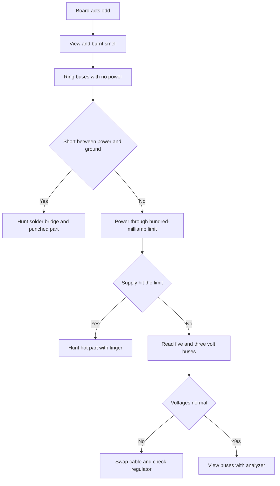

# Workshop Instruments - Multimeter and Oscilloscope

![[assets/img/arduino-tools-scheme.png|600]]
*Fig. Workplace: multimeter, USB tester, logic analyzer, and current-limited power supply.*

> [!tip] Purpose of this note
> Shows the minimal instrument set for debugging Arduino boards: what each instrument measures, in which order to take them, and which numbers count as normal.

## 1. Purpose

Most Arduino faults are power, wires, and logic levels, not complex code.
A multimeter closes nine of ten questions: bus voltage, wire health, no shorts.
A USB tester shows real board current and catches supply sags from a weak cable.
A logic analyzer makes exchange buses visible: every byte, every ack bit, every pause between sends.
An oscilloscope is needed rarer, but only it shows the signal shape: edge ringing, noise, short supply dips.
A current-limited power supply saves the board when the mistake is already made: current hits the limit instead of smoke.
This note sets the action order: simple meter readings first, then current, then buses, and complex gear only last.

## 2. Multimeter: Three Main Modes

| Mode | What it shows | Where to put probes | Normal for Arduino |
| --- | --- | --- | --- |
| DC voltage | Power bus level | Black to ground, red to the point | Five volts plus minus five hundredths |
| DC current | Board draw | Into the supply break, in series | Tens of milliamps with no load |
| Continuity | Wire health and no shorts | Between two points, with no power | Beep on a good wire, silence between buses |
| Resistance | Resistor value and breaks | Across the part, with no power | Near the package marking |
| Diode test | Junction drop | Straight on a diode or LED | About two volts on an LED |

Main rule: measure voltage in parallel, current in series, continuity only with no power.
The probe jack for current stays separate: after a current reading move the red probe back to the voltage jack.
Else the next voltage reading shorts through the low current-shunt resistance.
Start the range high: twenty volts first, then two volts for exactness.
Autorange suits but runs slower; manual suits fast checks better.

## 3. Voltage: What and Where to Measure

| Point | Awaited number | What a drift means |
| --- | --- | --- |
| Five-volt bus from USB | From 4.75 to 5.25 | Lower means a weak cable or overload |
| 3.3 regulator output | From 3.2 to 3.4 | Lower means overheat or too many users |
| Reset pin at rest | Near five volts | Zero means the board stays in reset |
| Logic one on output | Above 4.2 on five-volt power | Lower means the pin overloads or broke |
| Sensor analog input | Midscale at middle light | Scale edge means a break or short on the sensor |
| Power jack under load | Never below seven volts | Lower means a weak supply for Vin |

```text
Порядок обходу плати мультиметром:
   1. Чорний щуп на землю плати, там він і лишається.
   2. Червоним торкнися шини 5V, запиши цифру.
   3. Червоним торкнися шини 3V3, запиши цифру.
   4. Пройдися по гребінках живлення з обох боків.
   5. Перевір напругу на ніжках живлення мікроконтролера.
   6. Тільки потім міряй сигнали: скидання, кварц, шини.
```

## 4. Current: How Not to Burn the Meter and the Board

| Scenario | Typical current | Verdict |
| --- | --- | --- |
| Bare Uno board at rest | About 45 milliamps | Normal, the USB bridge draws too |
| Nano board at rest | About 20 milliamps | Normal, no USB converter |
| LED through a resistor | About 10 milliamps | Normal, the resistor suits |
| Zero milliamps, silent board | Zero | Supply break or a blown fuse |
| Current above half an ampere | Trouble | Short on the board, drop the power |
| Current drifts with no cause | Unstable | Bad breadboard contact or a cracked wire |

Measure current in a break: unplug the power wire and close the break through the multimeter.
Red probe into the current jack, pick the limit with margin: ten amperes for the first try.
The meter fuse inside burns silently: if current always reads zero, check the fuse.
Never measure current across a bus: the meter shorts and burns a track.
For long watch a USB tester suits better: it shows current live with no circuit break.

## 5. USB Tester: Eyes on the Power Cable

| Reading | Normal | Alarm sign |
| --- | --- | --- |
| Voltage under load | Above 4.75 | Falls to 4.5 on a thin or long cable |
| Rest current | Tens of milliamps | Jumps by hundreds on a short or reboot loop |
| Current with modules | Sum of module datasheets | Above the sum on a faulty module or extra bus |
| Session capacity | Grows evenly | Never grows on a powered board on no contact |

Plug a USB tester between the charger and the board: it breaks nothing and wants no probes.
The tester find of finds is bad cables: thin cores sag, the board reboots, the sketch seemingly hangs.
The check is simple: the same setup on two cables, compare the loaded voltage numbers.
A tester with a fast-charge trigger stays unneeded for Arduino: a base voltammeter suffices.
But a graph screen helps: current kicks show at motor start or radio-module send.

## 6. Logic Analyzer: Buses in the Palm

| Bus | What to view | Health sign |
| --- | --- | --- |
| UART | Start, eight bits, stop, speed | Bytes level, no garbage, steady pauses |
| I2C | Address, ack bit, stop | Every byte acked, exactly that address |
| SPI | Clock edge, slave select | Data steady on the active edge |
| PWM | Period and duty | Level period, duty matches code |
| Interrupts | Pulse rate and length | No causeless bursts and gaps |

The cheapest eight-channel 24 megahertz analyzer closes all Arduino buses.
The free PulseView program with protocol decoders shows bytes right over the traces.
Join analyzer ground to board ground with a short wire: long ground gives ringing and false edges.
Set the trip level for five-volt logic in the middle: about two and a half volts.
Start captures on a slow sweep: exchange fact first, then every byte detail.

```text
Мінімальна сесія з аналізатором для шини I2C:
   1. Канал 0 на SDA, канал 1 на SCL, земля на GND плати.
   2. Частота захоплення 1 МГц, обсяг два мільйони відліків.
   3. Запуск скетчу, зупинка захоплення після першої посилки.
   4. Декодер I2C: перевір адресу і біт підтвердження.
   5. Нема підтвердження — адреса не та або ведений без живлення.
```

## 7. Current-Limited Power Supply

| Knob | How to set | Why |
| --- | --- | --- |
| Voltage | Five volts for logic, seven for the jack | Exact number with no cable sag |
| Current limit | 100 milliamps for first power-on | A mistake costs a limit trip, not smoke |
| Limit-trip sign | LED and voltage fall | Signal: short on the board, drop the power |

First power-on of an unknown board always goes through a limit: five volts, a hundred-milliamp limit.
If the supply hits the limit at once on a cold board, hunt the short with continuity; never add power.
If the limit trips and one part heats, a finger found the swap candidate.
Raise the limit step by step: hundred, two hundred, five hundred, each step with a heat watch.
A lab supply never drops continuity: hunt shorts with no power, the supply only guards power-on.

## 8. What to Measure First: Five-Minute Order

| Step | Action | Tool |
| --- | --- | --- |
| 1 | View the board: solder smears, cracks, smell | Eyes and nose |
| 2 | Ring supply buses together with no power | Multimeter |
| 3 | Apply power through a hundred-milliamp limit | Power supply |
| 4 | Read five volts and three point three volts | Multimeter |
| 5 | Read rest current and match the normal | USB tester |
| 6 | Check reset and clock signals | Analyzer or oscilloscope |
| 7 | View exchange buses and decode sends | Logic analyzer |

## 9. Supply Check With a Sketch

```cpp
// Швидка перевірка внутрішнього джерела опори 1.1 В.
// Якщо показує далеко від норми — шукай проблему в живленні,
// а не в коді датчика.
void setup() {
  Serial.begin(9600);
}

void loop() {
  int raw = analogRead(A0);
  float volts = raw * 5.0 / 1023.0;
  Serial.print("A0 = ");
  Serial.print(volts, 2);
  Serial.println(" V");
  delay(500);
}
```

This sketch never calibrates a sensor: it answers whether the reference voltage lives.
Feed a known divider voltage into the input and match readings with the multimeter.
A drift above a tenth of a volt means checking the divider ground and the five-volt bus.
Floating low digits on an unconnected input are normal: the input catches air pickup.
An input pull-down to ground through ten kiloohms removes float and gives an honest zero.

## 10. Mermaid: First-Reading Tree



## Common Issues

| # | Issue | Why it is bad | Correct way |
| --- | --- | --- | --- |
| 1 | Current read with probes across the bus | Meter shorts, track or fuse burns | Current into a circuit break only, in series |
| 2 | Red probe left in the current jack | Next voltage reading shorts the bus | After current move the probe to the voltage jack at once |
| 3 | Continuity under power | Meter lies, may break down | Power off, capacitors drained, then ring |
| 4 | Long analyzer ground across half a breadboard | Ringing and false edges on capture | Short ground wire right near the signal |
| 5 | Unknown board power with no current limit | First mistake becomes the board last | First power-on through a hundred-milliamp limit |
| 6 | Trust in a box cable with no check | Sags give phantom reboots | Match two cables with a USB tester under load |

## Official Sources

- [Arduino documentation - measure and power basics](https://docs.arduino.cc/learn/electronics/power/) - voltages, currents, board power choice.
- [Sigrok PulseView - free analyzer program](https://sigrok.org/wiki/PulseView) - captures, bus decoders, supported instruments.
- [Arduino UNO R3 - wiring and power traits](https://docs.arduino.cc/hardware/uno-rev3/) - board buses, current limits, check points.

## See Also

- [[Home.en]]
- [[EN/01-Hardware/01-AVR-Uno.en|classic AVR]]
- [[EN/02-Power-Supply/01-VIN-Power-Supply.en|VIN power supply]]
- [[EN/17-Lab/02-Breadboard-PCB.en|breadboard and board]]
- [[EN/99-Additions/01-Troubleshooting-FAQ.en|question answers]]
