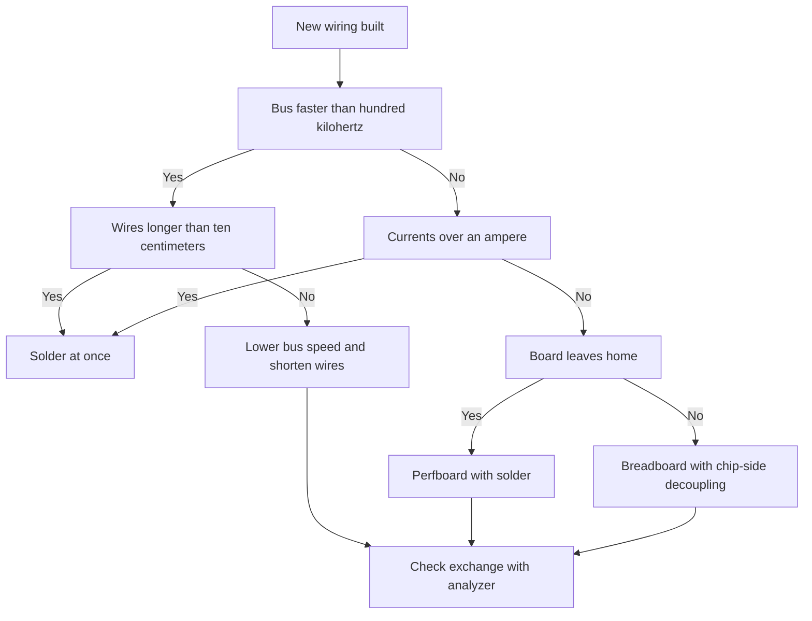

# Breadboard and Board - From Wires to Solder

![[assets/img/arduino-maketka-scheme.png|600]]
*Fig. Breadboard: power rails, middle break, decoupling near the chip, and the move to solder.*

> [!tip] Purpose of this note
> Teaches building trusty breadboard circuits and moving to solder in time: how power rails run, where decoupling sits, and when wires turn into bus foes.

## 1. Purpose

A breadboard is a wiring draft: built in minutes, wires moved, an idea checked with no soldering iron.
But every breadboard contact is resistance, capacitance, and a noise antenna: more wires move the wiring further from ideal.
The note shows how to squeeze the breadboard most: rail order, decoupling near every chip, short bus wires.
Then the edge: fast buses, big currents, and vibration want solder; the breadboard never holds here.
The final is the first printed board: minimal routing rules that any fab accepts.
Walk the path from the first LED to a board with an own silkscreen sign.

## 2. Breadboard Anatomy

| Element | How built | What it gives |
| --- | --- | --- |
| Side power rails | Long solid contacts along the edge | Carry plus and ground down the length |
| Mid-rail break | Gap splits the rail in halves | Top and bottom need jumper links |
| Center groove | Ditch splits the field in halves | Chip sits across, pins on both sides |
| Five-hole groups | Five holes of one node across | One signal to five connect points |
| Row numbers | Digits and letters along the field | Wiring recorded on paper by coordinates |

```text
Макетка на 830 точок, вигляд зверху (спрощено):
   + ----+---- ----+---- +      сині і червоні смуги живлення
   - ----+---- ----+---- -      розрив посередині кожної смуги
         1..30 | 31..63          ліва і права половини поля
      a b c d e | f g h i j      п'ятірки отворів, жолоб посередині
```

The mid-rail break is trap number one: the top half built, the bottom with no power.
Rule: right after placing the board throw two jumpers across the break, plus to plus, ground to ground.
Run power rails from one side: plus left in red, ground right in black, never swap colors.
Take short thick power wires: a long thin wire sags under load.
Seat every chip across the groove: package in the middle, pins left and right in own five-groups.

## 3. Decoupling: Small Capacitors of Big Worth

| Part | Value | Where to place |
| --- | --- | --- |
| Ceramics per chip | Hundred nanofarads | Between power and ground, tight to pins |
| Bulk on bus input | Ten microfarads electrolytic | On power rails near the board input |
| Bulk on motors and relays | Hundred and more microfarads | Straight on user terminals |
| Extra ceramics on radio | One microfarad plus hundred nanofarads | As a pair on module power pins |

A chip draws current in jerks: on edges it wants energy faster than long wires give.
A ceramic capacitor tight to the pins is a local energy store for every edge.
With no decoupling the symptoms mystify: resets at send start, ADC noise, hung buses.
The input electrolytic holds slow sags: a motor started, voltage sank, the electrolytic backed it.
Electrolytic polarity is critical: minus stripe to ground, plus to the bus; swap them for a loud lesson.
Better skip tantalum capacitors on a breadboard: they never forgive overvoltage.

```text
Розв'язка цифрового вузла на макетці:
   Шина 5V ----+----[100n]----+ до VCC мікросхеми (коротко!)
               |              |
   Шина GND ---+--------------+ до GND мікросхеми (коротко!)
   На вході смуг: електроліт 10 мкФ між 5V і GND
   Дроти розв'язки коротші за ніготь, інакше толку мало
```

## 4. Breadboard Edges for Buses

| Bus | Speed | Breadboard verdict |
| --- | --- | --- |
| Buttons and LEDs | Hertz | Always works, even through half a meter of wires |
| UART 9600 | Kilohertz | Works surely, common ground a must |
| I2C 100 kilohertz | Hundred kilohertz | Works with short wires to ten centimeters |
| I2C 400 kilohertz | Four hundred kilohertz | Untrusty: contact capacitance cuts edges |
| SPI 8 megahertz | Megahertz | Dead: ringing, crosstalk, faults |
| Analog millivolts | Steady | Noisy: wires catch fifty-hertz mains |

Length rule: signal wires shorter than ten centimeters, ground ones shorter still.
Set I2C pull-ups on a breadboard below calc: four point seven kiloohms instead of ten.
A screen and long SPI tails lead straight to artifacts: lower the speed or solder.
Run analog signals apart from digital: a ground-twisted pair removes half the noise.
A crystal resonator and its capacitors never live on a breadboard: extra capacitance kills oscillation.
If a circuit works only while a finger holds it, that is no magic: body capacitance stands in for missing ground.

## 5. When to Solder: Move Signals

| Symptom | What happens | Fix |
| --- | --- | --- |
| Wiring works every other time | Contacts oxidized or loosened | Move to a new breadboard or solder |
| A wire touch fixes all | Microbreak or cold joint | Swap the wire, then solder the node |
| Board rides to an exhibit | Road vibration takes the breadboard apart | Soldered board or at least locking sockets |
| Currents above an ampere | Contacts heat and drift | Terminal blocks and solder, breadboard banned |
| Outside humidity | Oxidation in weeks | Solder plus lacquer for guard |

Solder starts with a perfboard with holes: the same breadboard logic, but soldered joints.
Point-to-point wires use insulated hookup wire, stripped ends never longer than five millimeters.
Run force chains with separate thick wires, signals thin, ground as a star to one point.
After solder wash flux with alcohol: sticky flux gathers dust and leaks on analog.
Always photo the first soldered node both sides: that is docs and an insurance policy.

## 6. First Printed Board: Rule Minimum

| Rule | Number | Why so |
| --- | --- | --- |
| Signal track width | Quarter millimeter and up | Thinner ones tear and peel |
| Power width | Millimeter per ampere of current | A narrow track heats and drops voltage |
| Track gap | Quarter millimeter minimum | Less risks a fab short |
| Lead holes | Lead diameter plus three tenths | Margin for solder and drill drift |
| Board edge and mounts | Three millimeters edge to copper | Holes and mill never tear tracks |
| Silkscreen | Mark plus, ground, and first pin | In a year nobody recalls what sits where |

```text
Шарова структура першої плати початківця:
   Верх:  компоненти, шовкографія, доріжки сигналів
   Низ:   суцільна земля (полігон), трохи доріжок живлення
   Правило: земля суцільна, рвати її доріжками заборонено
   Розв'язка 100 нФ біля кожної мікросхеми лишається!
```

Order the board with solder mask and silkscreen: the price gap is tiny, assembly times easier.
The first run takes five pieces minimum: one for mistakes, one for work, the rest for stock.
Check the board before stuffing: power-to-short continuity, visual watch under a lens.
Stuff low to high: resistors, ceramics, chips, electrolytics, terminal blocks.
First power-on goes through a supply with a hundred-milliamp limit, as the instrument note orders.

## 7. Test Sketch for a New Build

```cpp
// Обхід усіх цифрових виводів по черзі.
// Дозволяє перевірити пайку і відсутність замикань між сусідами.
void setup() {
  Serial.begin(9600);
  for (int pin = 2; pin <= 13; pin++) {
    pinMode(pin, OUTPUT);
    digitalWrite(pin, LOW);
  }
  Serial.println("Pin walk ready. Send any char to step.");
}

void loop() {
  static int current = 2;
  if (Serial.available()) {
    Serial.read();
    digitalWrite(current, LOW);
    current = (current >= 13) ? 2 : current + 1;
    digitalWrite(current, HIGH);
    Serial.print("HIGH on D");
    Serial.println(current);
  }
}
```

Step pins and watch a probe LED: a wrong turn means hunting a solder bridge.
If two neighbor pins always share one state, a bridge sits between them; take iron and braid.
Start the run with no load: connect relays and motors after a clean pass of all pins.
Keep the run log on paper: pin number, state, remark. That is the board passport.

## 8. Mermaid: Breadboard or Solder



## Common Issues

| # | Issue | Why it is bad | Correct way |
| --- | --- | --- | --- |
| 1 | Jumpers across the mid-rail break forgotten | Half the wiring with no power, mystic symptoms | Throw plus and ground across the break at once |
| 2 | No ceramics near the chip | Resets and ADC noise on every edge | Hundred nanofarads tight to power pins |
| 3 | Half-meter signal wires | Capacitance and antennas kill fast buses | Shorter than ten centimeters, ground shorter still |
| 4 | Electrolytic with swapped polarity | Heat, bang, electrolyte on the ceiling | Minus stripe to ground, check twice |
| 5 | Ampere currents through breadboard contacts | Contacts heat, melt, fall | Terminal blocks and solder for force chains |
| 6 | Ground as a loop across the board | Sags and crosstalk between nodes | Star ground to one point near the input |

## Official Sources

- [Arduino documentation - wiring and breadboard basics](https://docs.arduino.cc/built-in-examples/basics/) - base wiring-build examples for starters.
- [Arduino UNO R3 - board wiring as a model](https://docs.arduino.cc/hardware/uno-rev3/) - decoupling, regulator, power routing.
- [ATmega328P datasheet - power and decoupling section](https://ww1.microchip.com/downloads/en/DeviceDoc/Atmel-7810-Automotive-Microcontrollers-ATmega328P_Datasheet.pdf) - capacitor needs near pins.

## See Also

- [[Home.en]]
- [[EN/17-Lab/01-Instruments.en|measure instruments]]
- [[EN/02-Power-Supply/01-VIN-Power-Supply.en|VIN power supply]]
- [[EN/99-Additions/01-Troubleshooting-FAQ.en|question answers]]
- [[EN/99-Additions/02-Cheklisti-Datasheet.en|lists and datasheets]]
