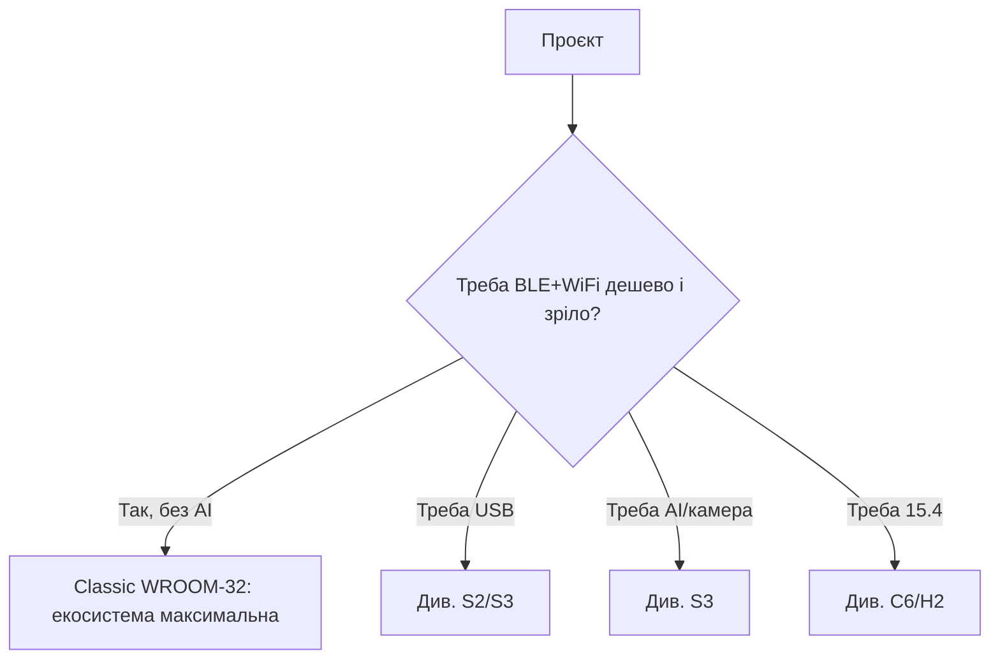

# ESP32 Classic (ESP32-D0WD-V3) - база

![[assets/img/esp32-classic-pinout.png|600]]

> [!warning] Логіка строго 3.3V!
> Усі GPIO ESP32 Classic працюють на рівні **3.3V**. Піни **не є 5V-tolerant**. Подача 5V на GPIO або на пін 3V3 знищує кристал.

## Призначення

ESP32 Classic (ESP32-D0WD-V3) - база - Пін-аут WROOM-32 (DevKit 30 пінів); WROOM vs WROVER (PSRAM); Таблиця з'єднань ESP32|Модуль. ESP32 Datasheet (PDF, Espressif) - електрика, strapping, ADC. ESP32 Classic має 1024 біти eFuse (4 блоки по 256 біт: BLK0 системний, BLK1/BLK2 під ключі, BLK3 варіативний).

## Характеристики

| Параметр | Значення |
| --- | --- |
| CPU | Xtensa LX6 dual-core, до 240 МГц |
| SRAM | 520 KB |
| WiFi | WiFi 4 (802.11 b/g/n), 2.4 ГГц |
| Bluetooth | BT 4.2 BR/EDR + BLE |
| ADC | 2× SAR ADC 12 біт (ADC1 + ADC2) |
| DAC | 2× 8 біт |
| Живлення | 2.3-3.6V, номінал **3.3V** |
| Струм WiFi TX | пік до 500 мА |

> [!info] ADC2 і WiFi не працюють одночасно
> Коли увімкнено WiFi, драйвер займає ADC2. Для аналогових вимірювань під час WiFi використовуй тільки канали [[03-GPIO/01-GPIO-oglyad|ADC1]] (GPIO32-39). Див. також [[00-Start/03-Porivnyannya-chipiv]].

## Пін-аут WROOM-32 (DevKit 30 пінів)

| № | Пін | Призначення | Примітка 3.3V |
| --- | --- | --- | --- |
| 1 | EN | Reset, активний high | Підтяжка до 3.3V через 10 кОм |
| 2 | VP (GPIO36) | ADC1_CH0, вхід | Тільки вхід, 0-3.3V |
| 3 | VN (GPIO39) | ADC1_CH3, вхід | Тільки вхід, 0-3.3V |
| 4 | GPIO34 | ADC1_CH6, вхід | Тільки вхід, 0-3.3V |
| 5 | GPIO35 | ADC1_CH7, вхід | Тільки вхід, 0-3.3V |
| 6 | GPIO32 | ADC1_CH4, touch | 3.3V логіка |
| 7 | GPIO33 | ADC1_CH5, touch | 3.3V логіка |
| 8 | GPIO25 | DAC1, ADC2_CH8 | 3.3V логіка |
| 9 | GPIO26 | DAC2, ADC2_CH9 | 3.3V логіка |
| 10 | GPIO27 | ADC2_CH7, touch | 3.3V, конфлікт з WiFi |
| 11 | GPIO14 | ADC2_CH6, HSPI-CLK | 3.3V, конфлікт з WiFi |
| 12 | GPIO12 | ADC2_CH5, strapping | 3.3V, див. [[03-GPIO/02-Strapping-pini]] |
| 13 | GND | Земля | GND |
| 14 | GPIO13 | ADC2_CH4 | 3.3V, конфлікт з WiFi |
| 15 | GND | Земля | GND |
| 16 | GPIO23 | HSPI-MOSI | 3.3V логіка |
| 17 | GPIO22 | I2C SCL | 3.3V, pull-up до 3.3V |
| 18 | GPIO21 | I2C SDA | 3.3V, pull-up до 3.3V |
| 19 | GPIO19 | UART0 CTS / VSPI-MISO | 3.3V логіка |
| 20 | GPIO18 | VSPI-CLK | 3.3V логіка |
| 21 | GPIO5 | VSPI-SS, strapping | 3.3V, див. [[03-GPIO/02-Strapping-pini]] |
| 22 | TX2 (GPIO17) | UART2 TX | 3.3V рівень |
| 23 | RX2 (GPIO16) | UART2 RX | 3.3V рівень |
| 24 | GPIO4 | ADC2_CH0, touch | 3.3V, конфлікт з WiFi |
| 25 | GPIO0 | BOOT, strapping | 3.3V, див. [[03-GPIO/02-Strapping-pini]] |
| 26 | GPIO2 | Strapping, LED | Має бути floating / low на boot |
| 27 | GPIO15 | ADC2_CH3, strapping | 3.3V, див. [[03-GPIO/02-Strapping-pini]] |
| 28 | SD1 (GPIO8) | Flash SPI | Не використовувати, 3.3V flash |
| 29 | SD0 (GPIO7) | Flash SPI | Не використовувати, 3.3V flash |
| 30 | CLK (GPIO6) | Flash SPI | Не використовувати, 3.3V flash |

> [!tip] Вільні для проєктів
> Найбезпечніші: GPIO16, 17, 18, 19, 21, 22, 23, 25, 26, 32, 33. Уникай GPIO6-11 (flash на 3.3V).

## WROOM vs WROVER (PSRAM)

| Ознака | WROOM-32 | WROVER |
| --- | --- | --- |
| PSRAM | немає | 4-8 МБ SPI PSRAM |
| Розмір | 18×25.5×3.1 мм | 18×31.4×3.3 мм |
| Flash | 4 МБ | 4-16 МБ |
| Живлення | 3.3V | 3.3V |
| Застосування | IoT, сенсори | Камера, LVGL, аудіо |

Детально: [[05-Moduli-WROOM-WROVER-MINI]], [[01-Hardware/06-Flash-PSRAM]].

## Таблиця з'єднань ESP32|Модуль

| ESP32 | Модуль | Опис |
| --- | --- | --- |
| 3V3 | WROOM-32 3V3 | Живлення тільки **3.3V**, не 5V! |
| GND | WROOM-32 GND | Спільна земля з периферією |
| GPIO21 | Модуль I2C SDA | SDA через pull-up 4.7 кОм до 3.3V |
| GPIO22 | Модуль I2C SCL | SCL через pull-up 4.7 кОм до 3.3V |
| GPIO34 | Модуль сенсор | Аналоговий вхід 0-3.3V |

## Живлення 3.3V

Класика живиться від [[02-Zhivlennya/01-Lancjugi-zhivlennya|ланцюга 5V→3.3V LDO]]. Пік WiFi - 500 мА, тому LDO має тримати 600+ мА, конденсатори 100 nF + 10 uF біля модуля + 470 uF електроліт. Деталі: [[02-LDO-DC-DC]], [[03-Spozhivannya]].

## Офіційні джерела

- [ESP32 - сторінка продукту (Espressif)](https://www.espressif.com/en/products/socs/esp32) - фото, ресурси, Design Guidelines.
- [ESP32 Datasheet (PDF, Espressif)](https://www.espressif.com/sites/default/files/documentation/esp32_datasheet_en.pdf) - електрика, strapping, ADC.
- [ESP-IDF Programming Guide](https://docs.espressif.com/projects/esp-idf/en/latest/) - API всіх периферій.
- [ESP32 Pinout - туторіал з фото (RNT)](https://randomnerdtutorials.com/esp32-pinout-reference-gpios/) - таблиця GPIO, що можна/не можна.

## eFuse і захист (Classic)

> [!danger] eFuse - необоротні!
> Біти eFuse можна пропалити тільки з `0` → `1`. Назад шляху немає. Один невірний `burn_efuse` - і чип назавжди без JTAG, без UART-завантаження або з увімкненим шифруванням без ключа. Спочатку `summary`, потім `burn` з повним розумінням. Детально про ключі: [[08-Pamyat/04-Secure-Boot-Encrypt]].

ESP32 Classic має 1024 біти eFuse (4 блоки по 256 біт: BLK0 системний, BLK1/BLK2 під ключі, BLK3 варіативний).

### Ключові біти Classic

| Біт / поле | Блок | Що робить | Необоротність |
| --- | --- | --- | --- |
| `JTAG_DISABLE` | BLK0 | Вимикає JTAG назавжди | Так, безповоротно |
| `FLASH_CRYPT_CNT` (3 біти) | BLK0 | Непарна кількість одиниць = flash-шифрування УВІМКНЕНО | Тільки додавати біти, зняти не можна |
| `SECURE_BOOT_EN` | BLK0 | Перевірка підпису bootloader | Так |
| `ABS_DONE_0` / `ABS_DONE_1` | BLK0 | Secure Boot завершено (V1/V2) | Так |
| `DISABLE_DL_ENCRYPT` | BLK0 | Заборона шифрування в download-режимі | Так |
| `DISABLE_DL_DECRYPT` | BLK0 | Заборона розшифрування в download-режимі | Так |
| `DISABLE_DL_CACHE` | BLK0 | Заборона доступу до flash в download-режимі | Так |
| `UART_DOWNLOAD_DIS` | BLK0 | Повна заборона UART-завантаження | Так, обережно! |
| `FLASH_CRYPT_CONFIG` (4 біти) | BLK0 | Алгоритм шифрування (0xF = реліз) | Частково |
| `KEY_STATUS` / `BLOCK1/2` | BLK1/2 | Ключі flash-шифрування / secure boot | Запис один раз, читання блокується |

### Як дивитись і палити безпечно

```bash
# 1. Тільки читати — безпечно
espefuse.py --port /dev/ttyUSB0 summary

# 2. Перевірити конкретне поле
espefuse.py --port /dev/ttyUSB0 get FLASH_CRYPT_CNT
espefuse.py --port /dev/ttyUSB0 get SECURE_BOOT_EN
espefuse.py --port /dev/ttyUSB0 get JTAG_DISABLE

# 3. Пропалювання (приклад! двічі подумай)
espefuse.py --port /dev/ttyUSB0 burn_efuse JTAG_DISABLE
espefuse.py --port /dev/ttyUSB0 burn_efuse FLASH_CRYPT_CNT 0b001

# 4. Ключ flash-шифрування з файлу (32 байти, випадкові!)
python3 -c "import os; open('/tmp/opencode/key.bin','wb').write(os.urandom(32))"
espefuse.py --port /dev/ttyUSB0 burn_key flash_encryption /tmp/opencode/key.bin
```

> [!warning] Порядок для продакшну
>
> 1. Згенеруй ключі офлайн і збережи копії. 2. Проший bootloader + app. 3. Увімкни flash-encryption, перезавантаж, перевір. 4. Увімкни secure boot. 5. В останню чергу пали `JTAG_DISABLE` і `UART_DOWNLOAD_DIS`. Помилка порядку = цегла. Дебаг через JTAG: [[09-Proshivka/05-JTAG-Debug]].

```c
// ESP-IDF: перевірка чи увімкнене шифрування (діагностика)
#include "esp_flash_encrypt.h"
#include "esp_secure_boot.h"
void check_protect(void) {
    ESP_LOGI("prot", "flash_crypt=%d secure_boot=%d",
        esp_flash_encryption_enabled(),
        esp_secure_boot_enabled());
}
```

## Типові тактові / кварци (Classic)

| Джерело | Частота | Призначення | Примітка |
| --- | --- | --- | --- |
| XTAL | 40 МГц (допуск 26 / 40) | Опорний кварц | На WROOM-32 - 40 МГц, допуск ±10 ppm для WiFi |
| PLL | 320 / 480 МГц → ділиться | CPU 80 / 160 / 240 МГц | WiFi вимагає ≥80 МГц |
| APB | 80 МГц | SPI, I2C, UART, ADC | Ділиться від CPU |
| RTC_FAST | 8 МГц (внутрішній RC) | RTC-памʼять, ULP | Неточний ±5% |
| RTC_SLOW | 150 кГц внутр. / 32.768 кГц зовн. | Deep-sleep таймер | Зовнішній точніший |
| APLL | 16-128 МГц | I2S аудіо-точний клок | Тільки під аудіо |

Розрахунок дрейфу RTC для deep-sleep:

```text
Внутрішній 150 кГц: дрейф ±5% → за 1 год сну помилка ±3 хв.
Зовнішній 32.768 кГц (±20 ppm): за 1 год помилка ±0.07 с.
Висновок: для точних пробуджень став зовнішній 32.768 кГц.
```

```cpp
// Arduino: зміна частоти CPU (економія)
#include <Arduino.h>
void setup() {
  Serial.begin(115200);
  Serial.println(getCpuFrequencyMhz()); // 240 за замовч.
  setCpuFrequencyMhz(80);  // WiFi ще працює, струм -40%
  Serial.println(getCpuFrequencyMhz());
}
// ESP-IDF: точна настройка
// rtc_clk_cpu_freq_set(RTC_CPU_FREQ_80M);
```

> [!tip] Кварц і WiFi-звʼязок
> Дешевий кварц з відхиленням 40 ppm ріже дальність і дає обриви. Симптом - `wifi: recalibration` в логах. Лікується тільки заміною модуля. RF-деталі: [[08-Anteni-RF]].

## Режим завантаження (Classic)

| Режим | GPIO0 | GPIO2 | GPIO5 | GPIO12 | GPIO15 | EN | Лог ROM |
| --- | --- | --- | --- | --- | --- | --- | --- |
| SPI-boot (норма) | HIGH (3.3V) | LOW/floating | HIGH | LOW | HIGH | HIGH | `boot:0x13 (SPI_FAST_FLASH_BOOT)` |
| Download (UART0) | LOW (GND) | LOW/floating | HIGH | LOW | HIGH | фронт 0→1 | `waiting for download` |
| JTAG-debug | HIGH | - | HIGH | LOW | HIGH | HIGH | boot + `openocd` конектиться |
| SDIO-завантаження | HIGH | HIGH* | LOW* | LOW | LOW* | HIGH | Рідко, для слейв-режиму |

`*` - комбінації MTDI/MTDO (GPIO12/15) та GPIO5 для SDIO-слейва, див. [[03-GPIO/02-Strapping-pini]].

```bash
# Розшифровка логу завантаження:
# rst:0x1 (POWERON_RESET),boot:0x13 (SPI_FAST_FLASH_BOOT)
# 0x13 = GPIO0 HIGH, нормальний старт з flash. Еталон:
esptool.py --port /dev/ttyUSB0 flash_id   # має відповісти, якщо SPI-boot живий
esptool.py --port /dev/ttyUSB0 read_flash_status
```

| Лог ROM | Значення | Дія |
| --- | --- | --- |
| `boot:0x13` | Норма, старт з flash | Працюй далі |
| `waiting for download` | GPIO0 притягнуто до GND | Відпусти BOOT, натисни EN |
| `flash read err, 1000` | Не той розмір/режим flash | Перевір [[01-Hardware/06-Flash-PSRAM]] |
| `rst:0x10 (RTCWDT_RTC_RESET)` | Просадка 3.3V / слабкий LDO | Див. [[02-Zhivlennya/01-Lancjugi-zhivlennya]] |

### Mermaid: коли Classic, а коли ні



## Типові помилки

| # | Помилка | Чому погано | Як правильно |
| --- | --- | --- | --- |
| 1 | Ревізія v0/v1 замість V3 | Старі баги кремнію | Тільки D0WD-V3 |
| 2 | ADC2 + WiFi одночасно | ADC2 зайнятий WiFi-драйвером | Аналог - тільки ADC1 при WiFi |
| 3 | Живлення від 3.3V-піна DevKit | Просадка при TX → brownout | VIN 5V або окремий buck |
| 4 | GPIO6-11 під периферію | Там висить SPI-flash! | Піни 6-11 - табу |
| 5 | Очікування BLE5 | Classic - BLE 4.2 | BLE5 - тільки C3/C6/H2 |

## Див. також

- [[Home]]
- [[00-Start/03-Porivnyannya-chipiv]]
- [[03-GPIO/01-GPIO-oglyad]]
- [[03-GPIO/02-Strapping-pini]]
- [[02-Zhivlennya/01-Lancjugi-zhivlennya]]
- [[02-ESP32-S2]]
- [[03-ESP32-S3]]
- [[07-Boot-Strapping-Reset]]
