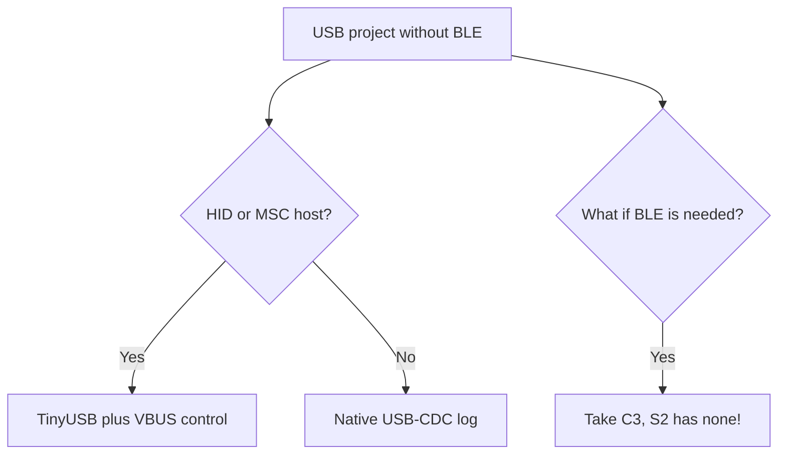

# ESP32-S2 - single-core with USB-OTG

![[assets/img/esp32-s2-pinout.png|600]]

> [!warning] 3.3V only!
> ESP32-S2 is a single-core Xtensa LX7, logic strictly **3.3V**. USB D+/D- have their own levels, but GPIO pins do not tolerate 5V. Core supply is **3.3V**.

## Purpose

ESP32-S2 single-core with USB-OTG: GPIO and USB features (26 pins); 13-bit ADC; ESP32 to module wiring table. ESP32-S2 is a single-core Xtensa LX7, logic strictly 3.3V. USB D+/D- have their own levels, but GPIO pins do not tolerate 5V. Core supply is 3.3V. ESP32-S2 product page (Espressif): photos, USB-OTG, touch.

## Specifications

| Parameter | Value |
| --- | --- |
| CPU | Xtensa LX7 single-core, 240 MHz |
| SRAM | 320 KB + 16 KB RTC |
| WiFi | WiFi 4 (802.11 b/g/n) |
| Bluetooth | none |
| USB | Native USB-OTG (Full-Speed) |
| ADC | 2x SAR ADC 13-bit |
| Power supply | 2.3-3.6V, nominal **3.3V** |

> [!info] No Bluetooth
> S2 has no BT/BLE. If you need BLE, see [[01-Hardware/01-ESP32-Classic.en]] or [[04-ESP32-C3-C6-H2.en]]. Comparison: [[00-Start/03-Porivnyannya-chipiv.en]].

## GPIO and USB features (26 pins)

| Pin | Function | Note |
| --- | --- | --- |
| GPIO19 | USB D- | Native USB, do not apply 5V |
| GPIO20 | USB D+ | Native USB, do not apply 5V |
| GPIO0 | BOOT + ADC1 | Strapping, see [[03-GPIO/02-Strapping-pini.en]] |
| GPIO26-32 | ADC / DAC / touch | Analog 0-3.3V, 13-bit |
| GPIO33-37 | SPI / I2S | 3.3V logic |
| GPIO45 | Strapping VDD_SPI | Critical for 3.3V flash |

> [!tip] TinyS2 / S2 Mini
> On S2 Mini boards USB is wired directly to GPIO19/20. For flashing, hold BOOT (GPIO0) low + RESET. Board supply is 5V USB, but the die is **3.3V** via LDO. See [[02-Zhivlennya/01-Lancjugi-zhivlennya.en]].

## 13-bit ADC

| Feature | Classic | S2 |
| --- | --- | --- |
| Resolution | 12-bit | 13-bit |
| Channels | ADC1 8 + ADC2 10 | ADC1 10 + ADC2 10 |
| Range | 0-3.3V (with attenuation) | 0-3.3V (with attenuation) |
| WiFi conflict | ADC2 busy | ADC2 busy the same way |

Calibration via esp_adc_cal. Analog supply details: [[02-LDO-DC-DC.en]], [[03-Spozhivannya.en]].

## ESP32 to module wiring table

| ESP32 | Module | Description |
| --- | --- | --- |
| 3V3 | S2-MINI 3V3 | **3.3V** LDO output, do not apply 5V |
| GND | S2-MINI GND | Shared ground |
| GPIO19 | Module USB D- | Direct USB connection |
| GPIO20 | Module USB D+ | Direct USB connection |
| GPIO0 | Module BOOT button | Button to GND for flashing |

## Official sources

- [ESP32-S2 product page (Espressif)](https://www.espressif.com/en/products/socs/esp32-s2) - photos, USB-OTG, touch.
- [Espressif technical documentation](https://www.espressif.com/en/support/download/documents) - S2 Datasheet + TRM.
- [ESP-IDF Programming Guide](https://docs.espressif.com/projects/esp-idf/en/latest/) - USB-OTG API, 13-bit ADC.

## eFuse and protection (S2)

> [!danger] S2 eFuse bits are irreversible!
> Writes go only from `0` to `1`. `UART_DOWNLOAD_DIS` or a wrong `KEY_PURPOSE` turns the board into a keychain. Always start with `espefuse.py summary`. Keep keys offline, copies in a safe. Key theory: [[08-Pamyat/04-Secure-Boot-Encrypt.en]].

S2 has an extended eFuse (USB-side protection included): system BLK0 + 6 key blocks with purpose.

### Main S2 bits

| Bit / field | Effect | Irreversible |
| --- | --- | --- |
| `JTAG_SEL_ENABLE` + `JTAG_DISABLE` | JTAG select enable / full JTAG disable | Yes |
| `FLASH_CRYPT_CNT` (7 bits) | Odd count of `1` = flash encryption ON | Only add bits |
| `SECURE_BOOT_EN` | Bootloader signature check (RSA/ECDSA) | Yes |
| `KEY_PURPOSE_0..5` | Purpose of each key block (XTS_AES_128 / SECURE_BOOT_V2 / HMAC_...) | One write per block! |
| `DISABLE_DL_ENCRYPT / DECRYPT / CACHE` | Closing of download-mode windows | Yes |
| `UART_DOWNLOAD_DIS` | No flashing via UART/USB-CDC | Yes - burn last! |
| `USB_EXCHG_PINS` / `USB_DPLL` | D+/D- swap and USB PHY tuning | Yes, verify on your board |
| `SECURE_BOOT_KEY_REVOKE0..2` | Secure boot key revocation | Yes |
| `BLOCK_KEY0..5_HOLE` | Protection against software key reads | Yes |

```bash
# Безпечна інспекція S2
espefuse.py --chip esp32s2 --port /dev/ttyUSB0 summary
espefuse.py --chip esp32s2 --port /dev/ttyUSB0 get FLASH_CRYPT_CNT
espefuse.py --chip esp32s2 --port /dev/ttyUSB0 get SECURE_BOOT_EN
espefuse.py --chip esp32s2 --port /dev/ttyUSB0 get KEY_PURPOSE_0

# Приклад продакшн-послідовності (думай двічі!)
espefuse.py --chip esp32s2 --port /dev/ttyUSB0 burn_key BLOCK_KEY0 key_xts.bin XTS_AES_128_KEY
espefuse.py --chip esp32s2 --port /dev/ttyUSB0 burn_efuse FLASH_CRYPT_CNT 0b001
# ... перевірка перезавантаження ...
espefuse.py --chip esp32s2 --port /dev/ttyUSB0 burn_efuse SECURE_BOOT_EN
```

> [!warning] KEY_PURPOSE trap
> If you write a key into `BLOCK_KEY0` but leave `KEY_PURPOSE_0` as `USER_KEY` instead of `XTS_AES_128_KEY`, encryption will not enable, yet the block is already spent. Draw the key plan on paper before the first burn.

```c
// ESP-IDF: самоперевірка захисту S2
#include "esp_flash_encrypt.h"
#include "esp_secure_boot.h"
#include "esp_efuse.h"
void s2_protect_check(void) {
    bool crypt = esp_flash_encryption_enabled();
    bool sb = esp_secure_boot_enabled();
    ESP_LOGI("s2", "crypt=%d sb=%d", crypt, sb);
    // Додатково: esp_efuse_read_field_bit(ESP_EFUSE_UART_DOWNLOAD_DIS, &v);
}
```

## Typical clocks / crystals (S2)

| Source | Frequency | Purpose | Note |
| --- | --- | --- | --- |
| XTAL | 40 MHz | Reference for the whole SoC | On Saola/Mini: 40 MHz |
| PLL | up to 480 MHz | CPU 80 / 160 / 240 MHz | Single LX7 |
| APB | 80 MHz | SPI, I2C, UART, 13-bit ADC | - |
| USB PHY | 60 MHz (from PLL) | Native USB-OTG Full-Speed 12 Mbit | PLL jitter affects USB! |
| RTC_FAST | 8 MHz RC | RTC fast domain | ±5% |
| RTC_SLOW | 150 kHz RC / 32.768 kHz XTAL | Deep-sleep, ULP | External one is accurate |
| FOSC | 17.5 MHz | Digital RC oscillator | For calibration |

USB stability estimate:

```text
USB Full-Speed вимагає точності 2500 ppm (±0.25%).
Кварц 40 МГц ±10 ppm = запас 250×. Внутрішній RC ±5% = 50000 ppm → USB НЕ запуститься.
Висновок: USB S2 працює тільки від кварцу, не від RC.
```

```cpp
// Arduino S2: економія без втрати USB
#include <Arduino.h>
void setup() {
  Serial.begin(115200);
  // USB-CDC вимагає ≥80 МГц, нижче не опускати при активному USB!
  setCpuFrequencyMhz(160); // компроміс: USB живе, струм менший за 240
  Serial.printf("CPU=%d MHz\n", getCpuFrequencyMhz());
}
```

## Boot mode (S2)

| Mode | GPIO0 | GPIO45 | GPIO46 | EN | ROM log |
| --- | --- | --- | --- | --- | --- |
| SPI-boot (normal) | HIGH (3.3V) | LOW (VDD_SPI 3.3V) | floating | HIGH | `boot:0x8 (SPI_FAST_FLASH_BOOT)` |
| Download USB-CDC | LOW (GND) | LOW | floating | 0 to 1 edge | `waiting for download`, `/dev/ttyACM0` appears |
| Download UART0 | LOW | LOW | floating | 0 to 1 edge | Same log, via bridge |
| JTAG via USB | HIGH | LOW | - | HIGH | Boot + OpenOCD via USB-JTAG |

> [!danger] GPIO45 is critical!
> `GPIO45=HIGH` switches flash to 1.8V, so a board with 3.3V flash bricks until the pull-up is removed. On S2 Mini check the VDD_SPI divider before first power-on. Full table: [[07-Boot-Strapping-Reset.en]], [[03-GPIO/02-Strapping-pini.en]].

```bash
# S2: перевірка живого ROM
espefuse.py --chip esp32s2 --port /dev/ttyACM0 summary
esptool.py --chip esp32s2 --port /dev/ttyACM0 flash_id
# Якщо ACM0 не зʼявляється — тримай BOOT (GPIO0→GND) + натисни EN
```

| S2 ROM log | Meaning | Action |
| --- | --- | --- |
| `boot:0x8` | Normal, boot from flash | Keep working |
| `waiting for download` | Waiting for firmware | Flash via `esptool.py write_flash` |
| Silence + current about 30 mA | GPIO45 HIGH or dead LDO | Check VDD_SPI and [[02-Zhivlennya/01-Lancjugi-zhivlennya.en]] |
| Cyclic `rst:0x3` | Bad flash / wrong size | See [[01-Hardware/06-Flash-PSRAM.en]] |

### Mermaid: S2 vs C3



## Common issues

| # | Issue | Why it is bad | Correct approach |
| --- | --- | --- | --- |
| 1 | Expecting BLE on S2 | S2 has no BLE physically | BLE on C3/C6/H2/Classic |
| 2 | USB host without VBUS power | Does not see the flash drive | VBUS supply + OTG cable |
| 3 | Two cores as on Classic | S2 is single-core! | Heavy tasks need S3 |
| 4 | ADC2 + WiFi | Same trap as on Classic | ADC1 with WiFi |

## See also

- [[Home.en]]
- [[00-Start/03-Porivnyannya-chipiv.en]]
- [[03-GPIO/01-GPIO-oglyad.en]]
- [[03-GPIO/02-Strapping-pini.en]]
- [[02-Zhivlennya/01-Lancjugi-zhivlennya.en]]
- [[01-Hardware/01-ESP32-Classic.en]]
- [[03-ESP32-S3.en]]
- [[07-Boot-Strapping-Reset.en]]
