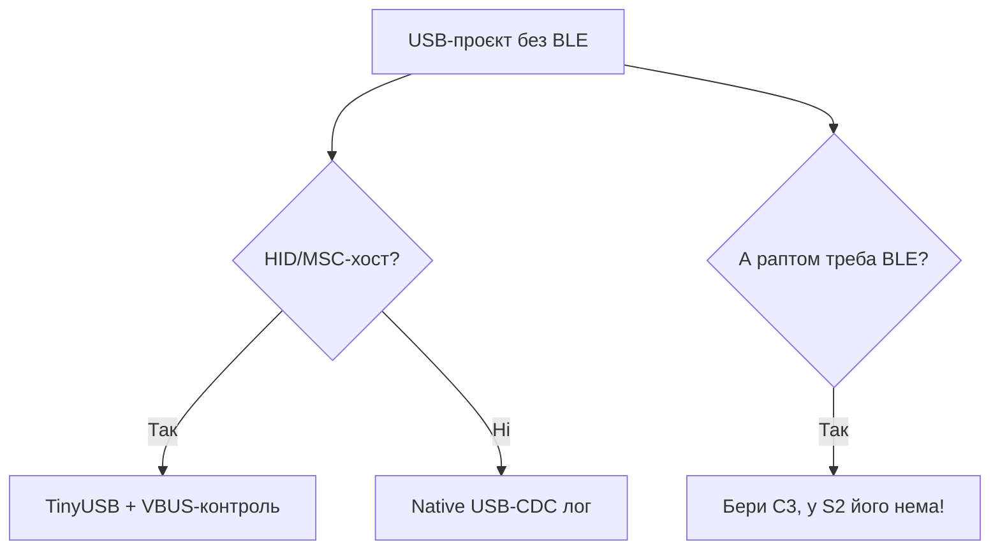

# ESP32-S2 - single-core з USB-OTG

EN version: `01-Hardware/02-ESP32-S2.en.md`

![[assets/img/esp32-s2-pinout.png|600]]

> [!warning] Тільки 3.3V!
> ESP32-S2 - одноядерний Xtensa LX7, логіка строго **3.3V**. USB D+/D- мають власні рівні, але GPIO не терплять 5V. Живлення ядра - **3.3V**.

## Призначення

ESP32-S2 - single-core з USB-OTG - GPIO та USB особливості (26 пінів); ADC 13 біт; Таблиця з'єднань ESP32|Модуль. ESP32-S2 - одноядерний Xtensa LX7, логіка строго 3.3V. USB D+/D- мають власні рівні, але GPIO не терплять 5V. Живлення ядра - 3.3V. ESP32-S2 - сторінка продукту (Espressif) - фото, USB-OTG, touch.

## Характеристики

| Параметр | Значення |
| --- | --- |
| CPU | Xtensa LX7 single-core, 240 МГц |
| SRAM | 320 KB + 16 KB RTC |
| WiFi | WiFi 4 (802.11 b/g/n) |
| Bluetooth | немає |
| USB | USB-OTG native (Full-Speed) |
| ADC | 2x SAR ADC 13 біт |
| Живлення | 2.3-3.6V, номінал **3.3V** |

> [!info] Без Bluetooth
> S2 не має BT/BLE. Якщо потрібен BLE - дивись [[01-Hardware/01-ESP32-Classic]] або [[04-ESP32-C3-C6-H2]]. Порівняння: [[00-Start/03-Porivnyannya-chipiv]].

## GPIO та USB особливості (26 пінів)

| Пін | Функція | Примітка |
| --- | --- | --- |
| GPIO19 | USB D- | Native USB, не давати 5V |
| GPIO20 | USB D+ | Native USB, не давати 5V |
| GPIO0 | BOOT + ADC1 | Strapping, див. [[03-GPIO/02-Strapping-pini]] |
| GPIO26-32 | ADC / DAC / touch | Аналог 0-3.3V, 13 біт |
| GPIO33-37 | SPI / I2S | Логіка 3.3V |
| GPIO45 | Strapping VDD_SPI | Критичний для 3.3V flash |

> [!tip] TinyS2 / S2 Mini
> На платах S2 Mini USB виведено безпосередньо на GPIO19/20. Для прошивки тримай BOOT (GPIO0) low + RESET. Живлення плати - 5V USB, але кристал - **3.3V** через LDO. Див. [[02-Zhivlennya/01-Lancjugi-zhivlennya]].

## ADC 13 біт

| Ознака | Classic | S2 |
| --- | --- | --- |
| Розрядність | 12 біт | 13 біт |
| Каналів | ADC1 8 + ADC2 10 | ADC1 10 + ADC2 10 |
| Діапазон | 0-3.3V (з атенюацією) | 0-3.3V (з атенюацією) |
| WiFi-конфлікт | ADC2 зайнятий | ADC2 зайнятий так само |

Калібрування через esp_adc_cal. Деталі живлення аналогової частини: [[02-LDO-DC-DC]], [[03-Spozhivannya]].

## Таблиця з'єднань ESP32|Модуль

| ESP32 | Модуль | Опис |
| --- | --- | --- |
| 3V3 | S2-MINI 3V3 | Вихід **3.3V** LDO, не подавати 5V |
| GND | S2-MINI GND | Спільна земля |
| GPIO19 | Модуль USB D- | Пряме з'єднання USB |
| GPIO20 | Модуль USB D+ | Пряме з'єднання USB |
| GPIO0 | Модуль BOOT-кнопка | Кнопка на GND для прошивки |

## Офіційні джерела

- [ESP32-S2 - сторінка продукту (Espressif)](https://www.espressif.com/en/products/socs/esp32-s2) - фото, USB-OTG, touch.
- [Техдокументація Espressif](https://www.espressif.com/en/support/download/documents) - S2 Datasheet + TRM.
- [ESP-IDF Programming Guide](https://docs.espressif.com/projects/esp-idf/en/latest/) - USB-OTG API, ADC 13 біт.

## eFuse і захист (S2)

> [!danger] eFuse S2 - необоротні!
> Запис тільки `0` → `1`. `UART_DOWNLOAD_DIS` або кривий `KEY_PURPOSE` перетворюють плату на брелок. Завжди починай з `espefuse.py summary`. Ключі - офлайн, копії - у сейф. Теорія ключів: [[08-Pamyat/04-Secure-Boot-Encrypt]].

S2 має розширений eFuse (захист USB-берега враховано): системний BLK0 + 6 блоків ключів з призначенням.

### Ключові біти S2

| Біт / поле | Що робить | Необоротність |
| --- | --- | --- |
| `JTAG_SEL_ENABLE` + `JTAG_DISABLE` | Дозвіл вибору JTAG / повне вимкнення JTAG | Так |
| `FLASH_CRYPT_CNT` (7 бітів) | Непарна кількість `1` = шифрування flash УВІМКНЕНО | Тільки допалювати |
| `SECURE_BOOT_EN` | Перевірка підпису bootloader (RSA/ECDSA) | Так |
| `KEY_PURPOSE_0..5` | Призначення кожного блоку ключів (XTS_AES_128 / SECURE_BOOT_V2 / HMAC_...) | Один запис на блок! |
| `DISABLE_DL_ENCRYPT / DECRYPT / CACHE` | Закриття вікон download-режиму | Так |
| `UART_DOWNLOAD_DIS` | Заборона прошивки по UART/USB-CDC | Так - палити останнім! |
| `USB_EXCHG_PINS` / `USB_DPLL` | Своп D+/D- і тюнінг USB PHY | Так, перевір на своїй платі |
| `SECURE_BOOT_KEY_REVOKE0..2` | Відкликання ключів secure boot | Так |
| `BLOCK_KEY0..5_HOLE` | Захист від читання ключів програмно | Так |

```bash
# Безпечна інспекція S2
espefuse.py --chip esp32s2 --port /dev/ttyUSB0 summary
espefuse.py --chip esp32s2 --port /dev/ttyUSB0 get FLASH_CRYPT_CNT
espefuse.py --chip esp32s2 --port /dev/ttyUSB0 get SECURE_BOOT_EN
espefuse.py --chip esp32s2 --port /dev/ttyUSB0 get KEY_PURPOSE_0

# Приклад продакшн-послідовності (думай двічі!)
espefuse.py --chip esp32s2 --port /dev/ttyUSB0 burn_key BLOCK_KEY0 key_xts.bin XTS_AES_128_KEY
espefuse.py --chip esp32s2 --port /dev/ttyUSB0 burn_efuse FLASH_CRYPT_CNT 0b001
# ... перевірка перезавантаження ...
espefuse.py --chip esp32s2 --port /dev/ttyUSB0 burn_efuse SECURE_BOOT_EN
```

> [!warning] Пастка KEY_PURPOSE
> Якщо в `BLOCK_KEY0` записати ключ, а `KEY_PURPOSE_0` лишити `USER_KEY` замість `XTS_AES_128_KEY` - шифрування не увімкнеться, але блок вже зайнято. План ключів малюй на папері до першого пропалу.

```c
// ESP-IDF: самоперевірка захисту S2
#include "esp_flash_encrypt.h"
#include "esp_secure_boot.h"
#include "esp_efuse.h"
void s2_protect_check(void) {
    bool crypt = esp_flash_encryption_enabled();
    bool sb = esp_secure_boot_enabled();
    ESP_LOGI("s2", "crypt=%d sb=%d", crypt, sb);
    // Додатково: esp_efuse_read_field_bit(ESP_EFUSE_UART_DOWNLOAD_DIS, &v);
}
```

## Типові тактові / кварци (S2)

| Джерело | Частота | Призначення | Примітка |
| --- | --- | --- | --- |
| XTAL | 40 МГц | Опора всього SoC | На Saola/Mini - 40 МГц |
| PLL | до 480 МГц | CPU 80 / 160 / 240 МГц | Single LX7 |
| APB | 80 МГц | SPI, I2C, UART, ADC 13 біт | - |
| USB PHY | 60 МГц (від PLL) | Native USB-OTG Full-Speed 12 Мбіт | Джитер PLL впливає на USB! |
| RTC_FAST | 8 МГц RC | RTC-швидкий домен | ±5% |
| RTC_SLOW | 150 кГц RC / 32.768 кГц XTAL | Deep-sleep, ULP | Зовнішній - точний |
| FOSC | 17.5 МГц | Цифровий RC-осцилятор | Для калібрування |

Розрахунок USB-стабільності:

```text
USB Full-Speed вимагає точності 2500 ppm (±0.25%).
Кварц 40 МГц ±10 ppm = запас 250×. Внутрішній RC ±5% = 50000 ppm → USB НЕ запуститься.
Висновок: USB S2 працює тільки від кварцу, не від RC.
```

```cpp
// Arduino S2: економія без втрати USB
#include <Arduino.h>
void setup() {
  Serial.begin(115200);
  // USB-CDC вимагає ≥80 МГц, нижче не опускати при активному USB!
  setCpuFrequencyMhz(160); // компроміс: USB живе, струм менший за 240
  Serial.printf("CPU=%d MHz\n", getCpuFrequencyMhz());
}
```

## Режим завантаження (S2)

| Режим | GPIO0 | GPIO45 | GPIO46 | EN | Лог ROM |
| --- | --- | --- | --- | --- | --- |
| SPI-boot (норма) | HIGH (3.3V) | LOW (VDD_SPI 3.3V) | floating | HIGH | `boot:0x8 (SPI_FAST_FLASH_BOOT)` |
| Download USB-CDC | LOW (GND) | LOW | floating | фронт 0→1 | `waiting for download`, зʼявляється `/dev/ttyACM0` |
| Download UART0 | LOW | LOW | floating | фронт 0→1 | Той же лог, через міст |
| JTAG через USB | HIGH | LOW | - | HIGH | Boot + OpenOCD через USB-JTAG |

> [!danger] GPIO45 - критичний!
> `GPIO45=HIGH` перемикає flash на 1.8V → плата з 3.3V-flash йде в цеглу до зняття pull-up. На S2 Mini перевір дільник VDD_SPI до першого вмикання. Повна таблиця: [[07-Boot-Strapping-Reset]], [[03-GPIO/02-Strapping-pini]].

```bash
# S2: перевірка живого ROM
espefuse.py --chip esp32s2 --port /dev/ttyACM0 summary
esptool.py --chip esp32s2 --port /dev/ttyACM0 flash_id
# Якщо ACM0 не зʼявляється — тримай BOOT (GPIO0→GND) + натисни EN
```

| Лог ROM S2 | Значення | Дія |
| --- | --- | --- |
| `boot:0x8` | Норма, старт з flash | Працюй |
| `waiting for download` | Очікування прошивки | Ший через `esptool.py write_flash` |
| Тиша + струм ~30 мА | GPIO45 HIGH або мертвий LDO | Перевір VDD_SPI і [[02-Zhivlennya/01-Lancjugi-zhivlennya]] |
| Циклічний `rst:0x3` | Погана flash / не той розмір | Див. [[01-Hardware/06-Flash-PSRAM]] |

### Mermaid: S2 vs C3



## Типові помилки

| # | Помилка | Чому погано | Як правильно |
| --- | --- | --- | --- |
| 1 | Чекати BLE на S2 | BLE в S2 НЕМАЄ фізично | BLE - C3/C6/H2/classic |
| 2 | USB-хост без VBUS-живлення | Не бачить флешку | Живлення VBUS + OTG-кабель |
| 3 | Два ядра як у classic | S2 - single-core! | Важкі задачі - S3 |
| 4 | ADC2 + WiFi | Та сама пастка, що в Classic | ADC1 при WiFi |

## Див. також

- [[Home]]
- [[00-Start/03-Porivnyannya-chipiv]]
- [[03-GPIO/01-GPIO-oglyad]]
- [[03-GPIO/02-Strapping-pini]]
- [[02-Zhivlennya/01-Lancjugi-zhivlennya]]
- [[01-Hardware/01-ESP32-Classic]]
- [[03-ESP32-S3]]
- [[07-Boot-Strapping-Reset]]
