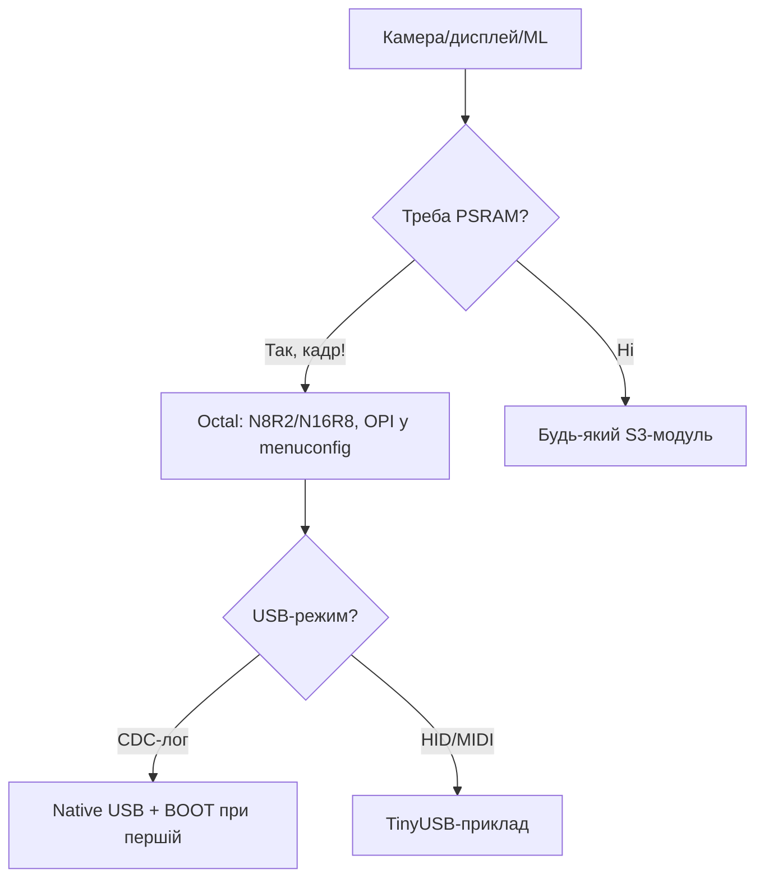

# ESP32-S3 - dual LX7 для AI та камер

![[assets/img/esp32-s3-pinout.png|600]]

> [!warning] Логіка 3.3V, камера теж 3.3V!
> S3 працює від **3.3V**. OV2640 живиться від 3.3V (ядро 1.8V через свій LDO на платі камери). Не подавай 5V на GPIO чи на шину SCCB.

## Призначення

ESP32-S3 - dual LX7 для AI та камер - GPIO (45) - ключові групи; Камера OV2640; Таблиця з'єднань ESP32|Модуль. Живлення камери - 3.3V з плати. Споживання з WiFi - до 300 мА, потрібен LDO за [[02-Zhivlennya/01-Lancjugi-zhivlennya]]. Техдокументація Espressif - S3 Datasheet + TRM (камера DVP, USB-JTAG).

## Характеристики

| Параметр | Значення |
| --- | --- |
| CPU | Xtensa LX7 dual-core, 240 МГц |
| AI | Векторні інструкції для нейромереж |
| SRAM | 512 KB + 16 KB RTC |
| PSRAM | Octal SPI, до 32 МБ |
| WiFi | WiFi 4 (802.11 b/g/n) |
| BT | BLE 5.0 + Mesh |
| USB | USB-OTG Full-Speed + USB-JTAG |
| GPIO | 45 програмованих |
| Живлення | 2.3-3.6V, номінал **3.3V** |

> [!info] USB-JTAG
> S3 прошивається і дебажиться через один USB-кабель без зовнішнього JTAG. Вивід JTAG через GPIO19/20 (USB). Див. [[07-Boot-Strapping-Reset]].

## GPIO (45) - ключові групи

| Група | Піни | Призначення |
| --- | --- | --- |
| USB | GPIO19, GPIO20 | USB D-/D+, JTAG |
| Strapping | GPIO0, 3, 45, 46 | Див. [[03-GPIO/02-Strapping-pini]] |
| Octal PSRAM | GPIO33-37 + SPICLK | Зайняті під PSRAM на N16R8 |
| Камера | GPIO4-12 | DVP інтерфейс OV2640 |
| ADC | GPIO1-10 | ADC1 12 біт, 0-3.3V |
| LED / RGB | GPIO38, 48 | Вбудований WS2812 на DevKit |

> [!tip] Octal SPI PSRAM
> На модулях N8R2/N16R8 Octal PSRAM дає близько 80 МБ/с. Піни PSRAM не можна використовувати як GPIO. Перевірка: [[01-Hardware/06-Flash-PSRAM]].

## Камера OV2640

| Сигнал камери | ESP32-S3 | Рівень |
| --- | --- | --- |
| XCLK | GPIO10 | 3.3V |
| SIOD/SIOC | GPIO40/39 | 3.3V, pull-up до 3.3V |
| VSYNC/HREF | GPIO38/47 | 3.3V |
| D0-D7 | GPIO11,9,8 | 3.3V |
| PWDN/RESET | GPIO32 | 3.3V |

Живлення камери - **3.3V** з плати. Споживання з WiFi - до 300 мА, потрібен LDO за [[02-Zhivlennya/01-Lancjugi-zhivlennya]].

## Таблиця з'єднань ESP32|Модуль

| ESP32 | Модуль | Опис |
| --- | --- | --- |
| 3V3 | S3-N16R8 3V3 | Живлення **3.3V**, струм до 500 мА |
| GND | S3-N16R8 GND | Земля камери + WiFi |
| GPIO40 | Модуль камери SIOD | SDA 3.3V |
| GPIO39 | Модуль камери SIOC | SCL 3.3V |
| GPIO10 | Модуль камери XCLK | Тактування 3.3V |

## Офіційні джерела

- [ESP32-S3 - сторінка продукту (Espressif)](https://www.espressif.com/en/products/socs/esp32-s3) - AI-інструкції, Octal PSRAM, фото.
- [Техдокументація Espressif](https://www.espressif.com/en/support/download/documents) - S3 Datasheet + TRM (камера DVP, USB-JTAG).
- [ESP32-CAM - туторіал з кодом (RNT)](https://randomnerdtutorials.com/esp32-cam-video-streaming-face-recognition-arduino-ide/) - OV2640, CameraWebServer.

## eFuse і захист (S3)

> [!danger] eFuse S3 - необоротні!
> Один біт - одне життя: `0` → `1` назавжди. Особливо небезпечні `UART_DOWNLOAD_DIS`, `JTAG_DISABLE`, `FLASH_CRYPT_CNT`. План ключів (який блок - яке призначення) фіксуй до першого пропалу. База: [[08-Pamyat/04-Secure-Boot-Encrypt]].

S3 має найбагатший eFuse у dual-LX7 лінійці: 6 ключових блоків з `KEY_PURPOSE`, відкликання ключів, XTS для Octal-flash.

### Ключові біти S3

| Біт / поле | Що робить | Необоротність |
| --- | --- | --- |
| `JTAG_DISABLE` | Вбиває зовнішній JTAG назавжди (USB-JTAG теж) | Так |
| `FLASH_CRYPT_CNT` (7 бітів) | Непарна кількість `1` = шифрування УВІМКНЕНО | Тільки допалювати |
| `SECURE_BOOT_EN` | Перевірка підпису (ECDSA/RSA) | Так |
| `KEY_PURPOSE_0..5` | `XTS_AES_128_KEY` / `SECURE_BOOT_V2` / `HMAC_DOWN_ALL` / `USER` | Один раз на блок! |
| `SECURE_BOOT_KEY_REVOKE0..2` | Відкликання скомпрометованих ключів SB | Так |
| `DISABLE_DL_ENCRYPT / DECRYPT / CACHE` | Герметизація download-режиму | Так |
| `UART_DOWNLOAD_DIS` | Заборона прошивки по UART/USB | Так - останнім! |
| `XTS_DPA_PSEUDO_LEVEL` | Захист від DPA-атак на XTS | Так |
| `BLOCK_USR_DATA` | Користувацькі біти (серійник, ревізія) | Пиши сміливо, це для тебе |

```bash
# Інспекція S3 (безпечно)
espefuse.py --chip esp32s3 --port /dev/ttyACM0 summary
espefuse.py --chip esp32s3 --port /dev/ttyACM0 get FLASH_CRYPT_CNT
espefuse.py --chip esp32s3 --port /dev/ttyACM0 get SECURE_BOOT_EN
espefuse.py --chip esp32s3 --port /dev/ttyACM0 get KEY_PURPOSE_0

# Продакшн-приклад (двічі подумай!)
python3 -c "import os; open('/tmp/opencode/s3_xts.bin','wb').write(os.urandom(32))"
espefuse.py --chip esp32s3 --port /dev/ttyACM0 burn_key BLOCK_KEY0 /tmp/opencode/s3_xts.bin XTS_AES_128_KEY
espefuse.py --chip esp32s3 --port /dev/ttyACM0 burn_efuse FLASH_CRYPT_CNT 0b001
```

> [!warning] Octal-PSRAM і ключі
> На N16R8 Octal-PSRAM не шифрується XTS (тільки flash). Не клади секрети в PSRAM у відкритому вигляді - після `JTAG_DISABLE` їх все одно видно через дамп прошивки без шифрування. Камера-кадри - ок, ключі - ні.

```c
// ESP-IDF S3: діагностика + користувацькі дані
#include "esp_efuse.h"
#include "esp_flash_encrypt.h"
void s3_prot(void) {
    ESP_LOGI("s3", "crypt=%d sb=%d",
        esp_flash_encryption_enabled(), esp_secure_boot_enabled());
    uint8_t serial[16] = {0};
    // esp_efuse_read_block(EFUSE_BLK3, serial, 0, 128); // свій серійник
}
```

## Типові тактові / кварци (S3)

| Джерело | Частота | Призначення | Примітка |
| --- | --- | --- | --- |
| XTAL | 40 МГц | Опора | На WROOM-1/2 - 40 МГц |
| PLL | до 480 МГц | CPU 80 / 160 / 240 МГц (dual LX7) | AI-інструкції люблять 240 |
| APB | 80 МГц | SPI, I2C, UART, ADC, LEDC | - |
| USB PHY | 60 МГц | USB-OTG FS + USB-JTAG | Один кабель на прошивку+дебаг |
| RTC_FAST | 8 МГц RC | RTC-домен | ±5% |
| RTC_SLOW | 150 кГц RC / 32.768 кГц XTAL | Deep-sleep, ULP-RISC-V | - |
| LCD / CAM | до 120 МГц (від PLL) | MIPI-less DVP-камера, LCD | Дільники в `esp_clk` |

Розрахунок живлення камери від частоти:

```text
OV2640 XCLK 20 МГц при CPU 240 МГц: джитер XCLK мінімальний.
CPU 80 МГц + XCLK 20 МГц: джитер більший → смуги на кадрі.
Правило: для камери тримай CPU 160–240 МГц, modem-sleep вимкни.
Струм при цьому 180–300 мА — LDO за [[02-Zhivlennya/01-Lancjugi-zhivlennya]] з запасом 600 мА+.
```

```cpp
// S3: максимум для AI-камери, мінімум для сенсора
#include <Arduino.h>
void cam_mode()  { setCpuFrequencyMhz(240); } // камера + AI
void sensor_mode(){ setCpuFrequencyMhz(80);  } // опитування I2C, WiFi ще живий
```

## Режим завантаження (S3)

| Режим | GPIO0 | GPIO3 | GPIO45 | GPIO46 | EN | Лог / порт |
| --- | --- | --- | --- | --- | --- | --- |
| SPI-boot | HIGH | floating | LOW | LOW/floating | HIGH | `boot:0x8`, старт з flash |
| Download USB-OTG | LOW | floating | LOW | LOW | фронт 0→1 | `/dev/ttyACM0` + `waiting for download` |
| Download UART0 | LOW | floating | LOW | LOW | фронт 0→1 | Той же лог через міст |
| USB-JTAG debug | HIGH | - | LOW | - | HIGH | Boot + OpenOCD по тому ж кабелю |

> [!tip] Один кабель - все
> S3 не потребує зовнішнього JTAG-пробника: USB-JTAG працює по GPIO19/20. Якщо `openocd` не бачить чип - перевір, що не спалив `JTAG_DISABLE`, і що GPIO19/20 не зайняті периферією. Дебаг: [[09-Proshivka/05-JTAG-Debug]], повна таблиця: [[07-Boot-Strapping-Reset]].

```bash
esptool.py --chip esp32s3 --port /dev/ttyACM0 flash_id
espefuse.py --chip esp32s3 --port /dev/ttyACM0 summary
# Нема ACM0? BOOT→GND, EN клік, відпусти BOOT після "waiting for download"
```

| Лог S3 | Значення | Дія |
| --- | --- | --- |
| `boot:0x8` | Норма | Працюй |
| `waiting for download` | ROM чекає прошивку | Ший `write_flash` |
| `flash read err` / `invalid header` | Не той `flash_mode` (QIO vs DIO) або розмір | Див. [[01-Hardware/06-Flash-PSRAM]] |
| `rst:0x7 (TG0WDT_SYS_RESET)` | Повисання на старті (PSRAM-піни як GPIO) | Звільни GPIO33-37 на N16R8 |

### Mermaid: S3 для камер/AI



## Типові помилки

| # | Помилка | Чому погано | Як правильно |
| --- | --- | --- | --- |
| 1 | Quad PSRAM як Octal | Не стартує / panic | OPI для Octal, QSPI для Quad |
| 2 | Камера без PSRAM | Кадр не влазить | Тільки модулі R2/R8/R16 |
| 3 | GPIO48 як звичайний пін | Strapping при boot | Вільний при старті, далі NeoPixel |
| 4 | Один native-порт на все | Ні шити, ні логувати | DevKitC: другий порт через міст |

## Див. також

- [[Home]]
- [[00-Start/03-Porivnyannya-chipiv]]
- [[03-GPIO/01-GPIO-oglyad]]
- [[03-GPIO/02-Strapping-pini]]
- [[02-Zhivlennya/01-Lancjugi-zhivlennya]]
- [[01-Hardware/01-ESP32-Classic]]
- [[01-Hardware/06-Flash-PSRAM]]
- [[08-Anteni-RF]]
