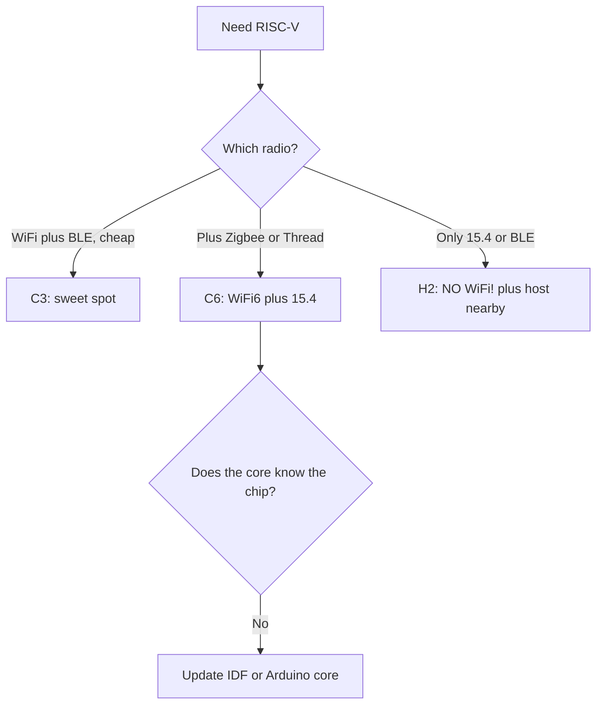

# ESP32-C3 / C6 / H2 - RISC-V lineup

![[assets/img/esp32-c3-supermini-pinout.png|600]]

![[assets/img/esp32-c6-h2-pinout.png|600]]

> [!warning] All RISC-V chips are strictly 3.3V!
> C3, C6 and H2 run on **3.3V**, GPIO pins are not 5V-tolerant. On SuperMini boards an LDO makes 3.3V from 5V USB.

## Purpose

ESP32-C3 / C6 / H2 RISC-V lineup: comparison; when to take C3 SuperMini; ESP32 to module wiring table. ESP32-C3 / C6 / H2 is the RISC-V lineup. C3, C6 and H2 run on 3.3V, GPIO pins are not 5V-tolerant. On SuperMini boards an LDO makes 3.3V from 5V USB.

## Comparison

| Parameter | C3 | C6 | H2 |
| --- | --- | --- | --- |
| CPU | RISC-V 160 MHz | RISC-V 160 MHz | RISC-V 96 MHz |
| WiFi | WiFi 4 | WiFi 6 | none |
| BLE | BLE 5.0 | BLE 5.3 | BLE 5.2 |
| 802.15.4 | none | Zigbee + Thread | Zigbee + Thread + Matter |
| USB | USB-JTAG | USB-JTAG | USB-JTAG |
| GPIO | 22 | 30 | 19 |
| Power supply | **3.3V** | **3.3V** | **3.3V** |

> [!info] H2 has no WiFi
> H2 is only 802.15.4 + BLE for Matter gateways. It needs a border router (for example C6 or S3). See [[00-Start/03-Porivnyannya-chipiv.en]].

## When to take C3 SuperMini

| Scenario | Choice | Why |
| --- | --- | --- |
| Battery BLE sensor | C3 SuperMini | Cheap, small, BLE 5 |
| WiFi6 + Matter | C6 | WiFi6 + Zigbee in one |
| Zigbee end device only | H2 | Lowest consumption |
| Camera / AI | Not C3, take S3 | C3 cannot drive a camera, see [[03-ESP32-S3.en]] |

> [!tip] C3 SuperMini trap
> On SuperMini clones the 5V pin is the USB 5V input, and the 3V3 pin is the **3.3V** LDO output. Do not apply 5V to the 3V3 pin! The PCB antenna is weaker - see [[08-Anteni-RF.en]]. Power: [[02-Zhivlennya/01-Lancjugi-zhivlennya.en]].

## ESP32 to module wiring table

| ESP32 | Module | Description |
| --- | --- | --- |
| 3V3 | C3-SuperMini 3V3 | **3.3V** output, max 300 mA |
| GND | C3-SuperMini GND | Shared ground |
| GPIO8 | Module WS2812 | Built-in LED, 3.3V logic |
| GPIO20/21 | Module UART | RX/TX at 3.3V level |
| GPIO4 | Module sensor | ADC 0-3.3V |

## Official sources

- [ESP32-C3 product page (Espressif)](https://www.espressif.com/en/products/socs/esp32-c3) - RISC-V, BLE 5, photos.
- [ESP32-C6 product page (Espressif)](https://www.espressif.com/en/products/socs/esp32-c6) - WiFi 6, 802.15.4, Matter.
- [ESP32-H2 product page (Espressif)](https://www.espressif.com/en/products/socs/esp32-h2) - BLE + Zigbee/Thread.
- [ESP32 BLE tutorial with code (RNT)](https://randomnerdtutorials.com/esp32-bluetooth-low-energy-ble-arduino-ide/) - GATT server/scanner.

## eFuse and protection (C3 / C6 / H2)

> [!danger] RISC-V eFuse bits are irreversible too!
> The rule is one for all: `0` to `1` forever. C3/C6/H2 have fewer blocks than S3, so a mistake in `KEY_PURPOSE` costs more - there may be no spare block. Read `summary` before, not after. Basics: [[08-Pamyat/04-Secure-Boot-Encrypt.en]].

### Main bits per chip

| Bit / field | C3 | C6 | H2 | Irreversible |
| --- | --- | --- | --- | --- |
| `JTAG_DISABLE` | + | + | + | Yes |
| `FLASH_CRYPT_CNT` | 7 bits, odd = ON | 7 bits | 7 bits | Only add bits |
| `SECURE_BOOT_EN` | + (ECDSA) | + | + | Yes |
| `KEY_PURPOSE_0..5` | 6 blocks | 6 blocks | 6 blocks | Once! |
| `UART_DOWNLOAD_DIS` | + | + | + | Yes, last |
| `DISABLE_DL_ENCRYPT/DECRYPT/CACHE` | + | + | + | Yes |
| `XTS_AES_128_KEY` purpose | + | + (for XTS) | + | Once |
| `SECURE_BOOT_KEY_REVOKE` | 3 pcs | 3 pcs | 3 pcs | Yes |
| Special | `USB_JTAG` with no swap | `LP_MEM` isolation | No WiFi, fewer vectors | - |

```bash
# C3 / C6 / H2 — інспекція (підстав свій чип)
espefuse.py --chip esp32c3 --port /dev/ttyUSB0 summary
espefuse.py --chip esp32c6 --port /dev/ttyACM0 summary
espefuse.py --chip esp32h2 --port /dev/ttyACM0 summary

# Безпечні get-запити
espefuse.py --chip esp32c3 --port /dev/ttyUSB0 get FLASH_CRYPT_CNT
espefuse.py --chip esp32c6 --port /dev/ttyACM0 get SECURE_BOOT_EN

# Пропалювання ключа (приклад C6, XTS)
python3 -c "import os; open('/tmp/opencode/c6_xts.bin','wb').write(os.urandom(32))"
espefuse.py --chip esp32c6 --port /dev/ttyACM0 burn_key BLOCK_KEY0 /tmp/opencode/c6_xts.bin XTS_AES_128_KEY
```

> [!warning] C3 SuperMini clones and protection
> On cheap clones the UART bridge is already broken: do not confuse "will not flash because of protection" with "will not flash because of a broken CH340". A protection sign: `summary` shows `UART_DOWNLOAD_DIS=1`. A clone sign: garbage in the console at 115200 with a healthy BOOT. Clone supply: [[02-Zhivlennya/01-Lancjugi-zhivlennya.en]].

```c
// ESP-IDF: єдина діагностика для C3/C6/H2
#include "esp_flash_encrypt.h"
#include "esp_secure_boot.h"
void riscv_prot(void) {
    ESP_LOGI("riscv", "crypt=%d sb=%d",
        esp_flash_encryption_enabled(), esp_secure_boot_enabled());
}
```

## Typical clocks / crystals (C3 / C6 / H2)

| Source | C3 | C6 | H2 | Purpose |
| --- | --- | --- | --- | --- |
| XTAL | 40 MHz | 40 MHz | 32 MHz | Reference |
| CPU max | 160 MHz (single) | 160 MHz + LP 20 MHz | 96 MHz + LP | RISC-V core |
| APB | 80 MHz | 80 MHz | 32-64 MHz | Buses |
| USB-JTAG | 48 MHz (from PLL) | 48 MHz | 48 MHz | Flash + debug via USB |
| RTC_SLOW | 150 kHz / 32.768 kHz | 150 kHz / 32.768 kHz + RV32 LP-core | 150 kHz / 32.768 kHz | Sleep, ULP |
| Radio PHY | 2.4 GHz BLE/WiFi4 | WiFi6 + BLE5.3 + 15.4 | BLE5.2 + 15.4 | Radio domain |
| Crystal tolerance | ±10 ppm | ±10 ppm (WiFi6 is stricter!) | ±20 ppm | Accuracy |

Estimate for WiFi6 (C6):

```text
WiFi6 (OFDMA) чутливіший до фазового шуму, ніж WiFi4.
Кварц ±10 ppm обовʼязковий; ±20 ppm дає retries і просадки MCS.
Перевірка: ping -c 100 → loss >5% при сильному RSSI = підозра на кварц/живлення.
Живлення RF: чисті 3.3V за [[02-Zhivlennya/01-Lancjugi-zhivlennya]], RF-розводка: [[08-Anteni-RF]].
```

```cpp
// C3/C6: економія на батареї
#include <Arduino.h>
void setup() {
  Serial.begin(115200);
  setCpuFrequencyMhz(80); // C3/C6: WiFi живий, струм -35%
  Serial.println(getCpuFrequencyMhz());
}
// H2 (802.15.4): CPU 96 МГц вистачає завжди, нижче — тільки light-sleep
```

## Boot mode (C3 / C6 / H2)

| Mode | C3: GPIO8/9 | C6: GPIO8/9 | H2: GPIO8/9 | EN | Log |
| --- | --- | --- | --- | --- | --- |
| SPI-boot | GPIO8 HIGH, GPIO9 HIGH | GPIO8 HIGH, GPIO9 HIGH | GPIO8 HIGH, GPIO9 HIGH | HIGH | `boot:0x8`, boot from flash |
| Download | GPIO9 LOW at reset | GPIO9 LOW at reset | GPIO9 LOW at reset | 0 to 1 edge | `waiting for download` |
| JTAG USB | GPIO8 HIGH, GPIO9 HIGH | same | same | HIGH | Boot + OpenOCD |
| Trap | GPIO8 LOW at boot = stuck | GPIO8 LOW = same | GPIO8 LOW = same | - | Do not hold the LED on GPIO8 to GND! |

> [!danger] GPIO8 trap of SuperMini
> On C3 SuperMini the built-in WS2812 hangs on GPIO8. An external pull of GPIO8 to GND (for example a button) breaks the boot. Wire the LED via a resistor, buttons to other pins. Full table: [[07-Boot-Strapping-Reset.en]], GPIO overview: [[03-GPIO/01-GPIO-oglyad.en]].

```bash
esptool.py --chip esp32c3 --port /dev/ttyUSB0 flash_id
esptool.py --chip esp32c6 --port /dev/ttyACM0 flash_id
# Мовчить? BOOT(GPIO9)→GND, EN клік, ший, відпусти BOOT
```

| C3/C6/H2 log | Meaning | Action |
| --- | --- | --- |
| `boot:0x8` | Normal | Keep working |
| `waiting for download` | ROM waits | Flash it |
| `invalid chip id` in esptool | Wrong `--chip` | Pass c3/c6/h2 correctly |
| `flash read err` | SiP flash vs external, wrong size | See [[01-Hardware/06-Flash-PSRAM.en]] |

### Mermaid: C3 vs C6 vs H2



## Common issues

| # | Issue | Why it is bad | Correct approach |
| --- | --- | --- | --- |
| 1 | H2 as a WiFi node | No WiFi physically | H2 is mesh/BLE + host |
| 2 | Old core + C6/H2 | Does not compile | IDF 5.1+ / fresh core |
| 3 | Thread router on battery | Router never sleeps | Router on mains, SED on battery |
| 4 | GPIO8/9 busy at boot | Stuck in download | Free the strapping pins |

## See also

- [[Home.en]]
- [[00-Start/03-Porivnyannya-chipiv.en]]
- [[03-GPIO/01-GPIO-oglyad.en]]
- [[03-GPIO/02-Strapping-pini.en]]
- [[02-Zhivlennya/01-Lancjugi-zhivlennya.en]]
- [[01-Hardware/01-ESP32-Classic.en]]
- [[05-Moduli-WROOM-WROVER-MINI.en]]
- [[01-Hardware/11-ESP32-C6-H2-Mesh.en | C6/H2 mesh in depth]]
